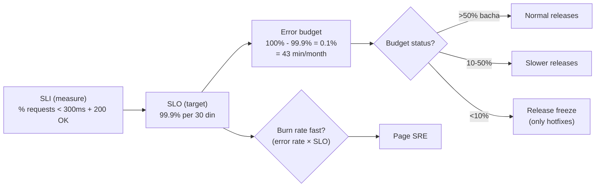

# Day 27: SRE Concepts & Reliability
📚 Topic 27: Reliability Engineering Deep Dive — SLOs, SLOs, Error Budgets & Incident Response
✅ Prerequisite-checklist: (review Day 26 DevSecOps if needed)

## Overview | Parichay

**SRE (Site Reliability Engineering)** software engineering ko operations mein apply karta hai. Yeh bathata hai ki system kitna reliable hai (SLOs), failures se kaise handle karein (incidents), aur routine kaam (toil) kaise kam karein.

Socho blood pressure ke doctor ki tarah: **SLI = BP ki reading** (asli measurement — "99.9% requests 200ms ke andar"), **SLO = target range** ("hamara star 99.9% par"), **error budget = kitna "chouk" afford kar sakte hain** (100% − SLO). Budget khatam hone par releases freeze — kyunki "try cheezon pe experiment" se zyada reliability important ho jati hai. Google ne banaya tha, aaj standard hai.

### SRE kaun hai aur kyun bana

**SRE (Site Reliability Engineering)** Google ne invent kiya kyunki unka tha: "operations ka kaam bhi engineers karein, but **software engineering ke methods** se — automation, code review, error budgets." SRE ka core tension fun hai: **features vs reliability** dono chahiye, aur bina number ke dono teams ladti rehti hain. SRE beech ka **shared language** deta hai — SLI/SLO numbers jo product bhi maan le aur engg bhi. Chhoti company me ye role DevOps/founder nibhata hai; badi me dedicated SRE team. Target: **reliability ek feature hai, naki side-effect.**

### SLI vs SLO vs SLA — measure, target, contract

| Term | Kya hai | Example | Kaun dekhta hai |
|---|---|---|---|
| **SLI** | measurement — asli number | "% requests < 200ms" (window me) | dashboard |
| **SLO** | target — internal commitment | "99.9% in 30 days" | engg + product |
| **SLA** | legal contract — customer se | "99.5%, warna credit" | business/legal |

Chain yaad rakho: **SLI → SLO → SLA**. SLO hamesha SLA se **strict** hona chahiye (internal 99.9, customer contract 99.5) warna SLA tootne se pehle hi andar fail. SLI chunna bhi art hai: wo measure jo **user ko** dukh de (latency, error), naki jo server ko easy lage (CPU — ye **proxy metric** hai, kaam ka sirf debug me).

SLI chunte waqt 3 sawaal: 1) kya ye **user ko** dukh de raha hai? 2) window kitni (rolling 30 din)? 3) calculation **reproducible** hai (dashboard me dikhti hai, yaad se nahi)?

### Error budget — releases ka asli gate

**Error budget = 100% - SLO.** 99.9% SLO ka matlab 0.1% failure afford hai — 30 din = 43,200 min, 0.1% = **~43 min**. Yahi number dono teams ko deta hai: dev team ko permission ("jitna budget hai, utne experiments karo") aur release pe control — **policy**, excuse nahi. Budget zyada bacha = aaram se ship karo; budget khatam = **release freeze** (sirf hotfix + reliability work). Ye solve karta hai: 100% uptime ka impossible dream, "reliability vs features" ki ladai, aur deploy fear (budget hi safety net hai). Math table:

| SLO | 30-din budget | Matlab |
|---|---|---|
| 99.9% | ~43 min | normal SaaS |
| 99.95% | ~21.6 min | serious SaaS |
| 99.99% | ~4.3 min | payments/banking |

### Burn rate — budget kitni tezi se jal raha hai

Static threshold alert ("CPU > 80%") ka problem: wo SLO se connected nahi hota. **Burn rate** = kitni tezi se error budget khatam ho raha hai (1x = budget poore month me khatam hoga, 14x = 2 din me). Alert lagao **burn rate pe**: agar 1h me 2% budget jal gaya (14.4x speed), to page karo — ye **fast detection** aur **fast budget check** dono deta hai. Formula: `error_rate_1h > (1 - SLO) * 14.4` — 99.9% SLO = 1h me 1.44% errors se page. Yahi hai **SLO-based alerting** — threshold nahi, budget.

Burn rate alerts hamesha do windows me rakho:

- **fast** (1h window, 14.4x) — turant page, jaldi detect
- **slow** (6h window, 6x) — confirm karta hai ki issue persist hai
- dono saath me = false positive kam, missed burn bhi kam

### Four golden signals — chaar numbers jo har dashboard pe

Google ke 4 signals (request-driven systems ke liye): 1) **Latency** — kitni der (p95/p99 dekho, average chhupata hai), 2) **Traffic** — kitna kaam (req/s), 3) **Errors** — kitna galat (error rate), 4) **Saturation** — kitna bhar gaya (queue depth, memory, CPU — limit ke kitne kare). Inhe hamesha dashboard pe rakho — inme se koi bhi bigadta hai to user impact pakka. Saturation sabse chup alert hai: queue badh rahi hai but abhi tak 200 aa rahe hain — kuch der me 502s shuru.

### Toil — chhupi hui team ki enemy

**Toil** = wo manual, repetitive, scripted-ho-sakta-tha kaam jo operations me kharch hota hai: manual restarts, ticket-driven server provisioning, har baar wahi runbook. SRE ka target: toil **< 50%** of time — kyunki toil badhta hai to banda naya kuch nahi seekhta, burnout aata hai, aur scale nahi hota (insaan x kaam line hai). Identification sawaal: "ye kaam 1000 baar karna pade to bhi chalega insaan ke bajaye?" Haan = toil = automate karo (script, self-healing, self-service). Toil ko weekly hours track bhi karo — wahi improvement ka proof hai.

### Incident management — jab fire lagti hai

Incident ka basic structure: **detect** (alert aaya) → **triage/severity** (SEV1 = sab down = page + exec comms, SEV4 = minor = next-day ticket) → **command** (ek **incident commander** — decisions karta hai, baaki log fix karte hain — role separation) → **timeline** (kya kab kiya, notes liye jao — postmortem ka fuel) → **communicate** (status page, stakeholders) → **resolve** → **postmortem**. Postmortem ka rule: **blame-free** — "kaun galat tha" nahi, "system ne galti kaise allow ki" (5 whys). Har incident se action items nikalte hain warna wahi fire dobara lagegi.

### Interview angle aur common traps

Traps: 1) **100% uptime** bolo to interviewer jaan jayega — hamesha "budget ke andar reliability" bolo, 2) uptime % ka asli minute math nahi pata (99.99 vs 99.9 = 10x gap — 43 vs 4.3 min), 3) alert CPU pe rakhte ho naki SLO pe, 4) postmortem me blame. Strong reply structure: "**hamne SLI (latency+availability) define ki, SLO 99.9% rakha, error budget se release policy banai, aur burn-rate alerts se page**" — ye 5 shabd me pura SRE loop hai. Reliability 100% nahi chahiye — **"jitni user ko chahiye, utni affordable"** — wahi SRE ki science hai.

## What You'll Learn | Aaj Ki Seekh

- [ ] SLI vs SLO vs SLA — measure, target, contract
- [ ] Error budget: 100% − SLO, kyun releases ispe control hote hain
- [ ] Burn rate — SLO par alerting (threshold nahi, budget ki speed)
- [ ] Four golden signals: latency, traffic, errors, saturation
- [ ] Toil: repetitive ops kaam, kyun <50% rakho, automation se
- [ ] Incident management basics: severity, command, timeline, postmortem
- [ ] 99.9% vs 99.99% — uptime ka asli maatha

## Diagram | Dekho Kaise Kaam Karta Hai



ASCII:
```
measure (SLI) → target (SLO) → budget (100%-SLO) → release policy
burn rate (kitni tezi se budget jalta hai) → alert/page
```

## Demo | Copy-Paste Karke Chalao

```bash
# 1. Error budget calculate karo
days=30
total=$((days*24*60))
echo "Total minutes/month: $total"                       # 43200
awk -v t="$total" 'BEGIN{printf "SLO 99.9  => %.1f min budget\n", t*0.001}'
awk -v t="$total" 'BEGIN{printf "SLO 99.95 => %.1f min budget\n", t*0.0005}'
awk -v t="$total" 'BEGIN{printf "SLO 99.99 => %.1f min budget\n", t*0.0001}'
# 99.9% → 43 min/month allowed downtime | 99.99% → 4.3 min — farak hai na!

# 2. Burn rate alert (PromQL) — 1h me 2% budget khaya = 14.4x speed = PAGE
# error rate 1 ghante ka aaya > (1-SLO)*14.4 = 0.001*14.4 = 0.0144 = 1.44%
# Rate → Alertmanager pe critical → PagerDuty (promql expression):

sum(rate(http_requests_total{status=~"5.."}[1h])) / sum(rate(http_requests_total[1h]))
```

```yaml
# slo-alerts.yml — Prometheus alert rule (burn rate based)
groups:
  - name: slo-alerts
    rules:
      - alert: SLOHighErrorRate_Burn
        expr: |
          sum(rate(http_requests_total{status=~"5.."}[1h]))
          / sum(rate(http_requests_total[1h])) > 0.0144
        for: 5m
        labels: { severity: page }
        annotations:
          summary: "Error rate budget tezi se jalta raha hai - SLO khatre mein"
```

```bash
# 3. Golden signals (Grafana panel queries) — apne app par:
# Latency:  histogram_quantile(0.95, sum(rate(http_request_duration_seconds_bucket[5m])) by (le))
# Traffic: sum(rate(http_requests_total[5m]))
# Errors:  sum(rate(http_requests_total{status=~"5.."}[5m]))
# Saturation: sum(rate(node_cpu_seconds_total[5m])) / count(node_cpu_seconds_total)

# 4. Incident timeline (postmortem points):
# detect → contain → communicate → resolve → postmortem (bina blame)
```

## Real-Life Example | Industry Me

**Production me:** Search service ka SLO = "99.9% requests 200ms se kam, 30 days rolling". Sales ko SLA (legal, penalty) hai — SLO usi contract ko prod ke andar enforce karta hai. Alert **burn rate** par hai: 1h me 2% budget jalne par page — threshold par nahi (hai 5xx slight sa bhi, budget jaldi khud khud toh hai). Incident: severity (SEV1 = sab down = page CCTV), incident commander ek, timeline live, postmortem 30 days ke andar. Toil tracker: har hafta how mani hours "manual restart kiya", >50% → automation project. Yehi interview story: "hamne release window ko error budget se replace kiya".

## Practice Exercise | Abhi Karein

1. Apni app ke liye 2 SLI likho (latency + availability + error)
2. SLO set karo aur error budget minutes calculate karo (30 din)
3. Burn rate alert (0.0144) Prometheus rule likhke apply karo
4. Grafana pe 4 golden signals panels banao (latency/traffic/errors/saturation)
5. Simulate incident: app log me error dalo → alert fire → severity assign → timeline likho
6. Toil list banao (5 tasks jo tum repeat karte ho) — kaunsa automate karoge?
7. 200 words ka postmortem likho (situation, cause, action, timeline) — bina blame ke

## Quick Notes | Yaad Rakho

```
- SLI = measure (matlab kya) | SLO = target (kitna) | SLA = contract (legal)
- Error budget = 100% − SLO → release policy ka gate
- 99.9% = ~43 min/month | 99.99% = ~4.3 min/month — uptime ka asli gap
- Burn rate alerting: budget kitni tezi se jalta hai → page (12-14x = critical)
- Golden signals: latency, traffic, errors, saturation — chaaron dekho
- Toil = repetitive, manual, no scaling value kaam — goal <50%, automate
- Incident: commander + timeline + comms + postmortem (blame-free)
- Severity: SEV1 (all down) → SEV4 (minor) - paisa + page level define karo
- Alerts ko SLO se derive karo, symptom-based nahi (koi bhi epsilon → silent)
- Reliability = user kayki expectation, 100% nahi — "good enough" wali science
```

**Agla:** Week 4 Review + Capstone — Terraform + monitoring + logging + security ek saath (Day 28).