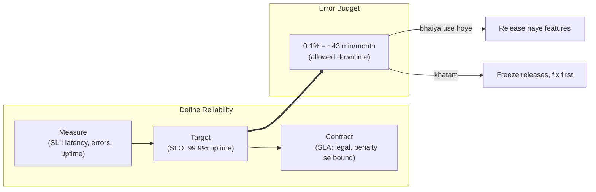
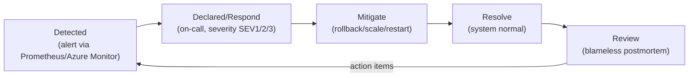

# Day 27: SRE Concepts & Reliability
📚 Topic 27: Reliability Engineering Deep Dive — SLOs, SLOs, Error Budgets & Incident Response
✅ Prerequisite-checklist: (review Day 26 DevSecOps if needed)

## Overview | Parichay

**SRE (Site Reliability Engineering)** software engineering ko operations mein apply karta hai. Yeh bathata hai ki system kitna reliable hai (SLOs), failures se kaise handle karein (incidents), aur routine kaam (toil) kaise kam karein.

---

## What You'll Learn | Aaj Ki Seekh

- [ ] SRE ka core idea: reliability + DevOps automation
- [ ] SLI (measure) vs SLO (target) vs SLA (contract) - teeno ka farak
- [ ] Error budget calculate karna aur kaise release decisions mein use hota hai
- [ ] Incident lifecycle: detect → respond → mitigate → postmortem
- [ ] Runbook likhna aur on-call ka concept
- [ ] Toil kya hai aur chaos engineering se system ko robust banana

---

## Diagram | Dekho Kaise Kaam Karta Hai



**Incident lifecycle:**



ASCII:
```
SLI = aapka actual measurement ("200ms p95")
SLO = target ("99.9% success")
SLA = contract ("refund if below X")
```

**Real images (official docs):**
- Google SRE book (free): https://sre.google/sre-book/table-of-contents/
- Google SRE workbook (SLOs/error budgets): https://sre.google/workbook/table-of-contents/
- Error Budgets at Google: https://sre.google/sre-book/service-level-objectives/

---

## Demo | Copy-Paste Karke Chalao

### 1. Error Budget calculator (bash script)
```bash
cat > error-budget.sh << 'EOF'
#!/bin/bash
echo "=== Error Budget Calculator ==="
read -p "SLO uptime % (e.g. 99.9): " slo
read -p "Period in days (30 for monthly): " days

slo_decimal=$(echo "$slo / 100" | bc -l)
allowed=$(echo "scale=5; 1 - $slo_decimal" | bc -l)
minutes=$(echo "scale=1; $allowed * $days * 24 * 60" | bc)

echo "-----------------------------------"
echo "SLO: $slo% uptime over $days days"
echo "Allowed downtime: ~$minutes minutes = ~$(echo "scale=2; $minutes/60" | bc) hours"
EOF
chmod +x error-budget.sh
./error-budget.sh
```

Example output:
```
SLO: 99.9% uptime over 30 days
Allowed downtime: ~43.2 minutes
```

### 2. Availability / SLI calculator
```bash
echo "scale=2; (99990/100000)*100" | bc   # successful/total * 100
```

### 3. Runbook likhna (markdown)
```bash
mkdir -p runbooks
cat > runbooks/high-error-rate.md << 'EOF'
# Runbook: High Error Rate

## Trigger
Error rate > 5% for 5 minutes (Prometheus alert `HighErrorRate`)

## Priority
P1

## Symptoms
- Grafana shows spike in 5xx
- Users reporting slowness/errors

## Steps
1. Check Prometheus: `sum by (service) (rate(http_requests_total{status=~"5.."}[5m]))`
2. Check recent deployments: `git log --oneline -10`
3. Check logs in Kibana: `level: ERROR`
4. Check DB connections / connections pool
5. Rollback if recent change deployed: `bash scripts/rollback.sh`
6. Verify recovery in Grafana

## Escalation
#oncall → #eng-leads → incident commander

## Postmortem
Link to blameless postmortem doc
EOF
cat runbooks/high-error-rate.md
```

---

## Real-Life Example | Zindagi Se

SRE ko samjho **apne building ke caretaker (caretaker) + doctor** ki tarah. **SLI** = caretaker har din note karta hai ki lift kitni baar kharaab hui, kaunsi floor par lights theek hain (measurement). **SLO** = tumne caretaker ko target diya - "lift mahine mein 99.9% times chalni chahiye". **SLA** = building owner ke saath contract - "lift zyada kharab hui to rent mein discount". **Error budget** = caretaker ko pata hai kitni baar lift band ho sakti hai phir bhi contract nahi todo. **Incident management** = jab lift kharab ho - turant repair (mitigate), log likho kyun hui (postmortem). **Runbook** = repairman ka manual jo har problem ke steps batata hai. **Toil** = caretaker roz khud lift achanak check karta hai - isko automate kar sakte hain (sensor + dashboard).

---

## Basic Concepts Detail Mein

### 1. SRE ka Core Idea

SRE ka motto: **"Automate yourself out of a job"** aur **"Measure everything"**.

- SRE = infrastructure reliable banata hai, via code/tooling
- Not Just uptime - but **balance** between new features and reliability
- Error budgets se "never too reliable" wali reality check

### 2. SLI, SLO, SLA - Yeh Teeno Kya Hain?

| Concept | Matlab | Example |
|---------|--------|---------|
| **SLI** | Service in actually kitna acha perform kar raha (measurement) | % successful requests, latency |
| **SLO** | Aapka target/lakin wo SLI par | 99.9% success |
| **SLA** | Legal agreement (customer ke saath) | 99.95% (penalty se bound) |

```
SLI = actual measurement ("200ms latency 95%")
SLO = target ("99.9% uptime")
SLA = contract ("we'll pay refund if below X")
```

**Good SLIs (RED/USE method):**
- **Rate:** Requests per second
- **Errors:** % of failed requests
- **Duration:** Latency (p50, p95, p99)
- Utilization: capacity use

### 3. Error Budget

**Error budget** = kitna time system down reh sakta hai before violating SLO.

```
SLO = 99.9% uptime
→ error budget = 0.1% = ~43 min/month downtime allowed
```

**Use:**
- Jab error budget bacha ho → release naye features (khatarnaak)
- Jab error budget khatam ho → feature releases freeze (innovation on hold)
- Safety valve - team ko freedom + guardrail dono

| 9s | Downtime/year |
|----|---------------|
| 99% | 3.65 days |
| 99.9% | 8.76 hours |
| 99.99% | 52 minutes |
| 99.999% | 5.26 minutes |

### 4. Incident Management

**Lifecycle:**
```
Detected → Declared/Respond → Mitigate → Resolve → Review (postmortem)
```

**Steps:**
1. **Detect:** Monitoring/alert (Prometheus/Azure Monitor)
2. **Respond:** On-call engineer, severity (SEV1/2/3)
3. **Mitigate:** Rollback, scale, restart - fix-fast-not-root-cause-first
4. **Resolve:** System back to normal
5. **Postmortem:** Root cause + action items (no blame culture)

**Severity:**
| SEV | Matlab |
|-----|--------|
| SEV1 | Outage - users affected, critical |
| SEV2 | Major degradation |
| SEV3 | Minor issue |

**Blameless postmortem:** "System failed", nahi "person failed" - fix process, blame nahi.

### 5. On-Call & Runbooks

- **On-call rotation:** One engineer carries pager for a week
- **Runbook:** Documented steps for known issues
- Response time targets (e.g. 15 min to acknowledge)

**Runbook structure:**
```
# Runbook: High Error Rate
## Trigger: Error rate > 5% for 5 min
## Priority: P1
## Steps:
1. Check Prometheus dashboard
2. Check recent deployments (git log)
3. Check logs (Kibana)
4. Check DB connections
5. Rollback if recent change
## Escalation: #oncall → #eng-leads
```

### 6. Toil

**Toil** = manual, repetitive, automatable operational work (no long-term value).

Examples: manual restarts, copy-paste deploys, ticket check karna
Goal: Reduce toil < 50% of time (SRE standard: <50% ops, >50% engineering)

**Toil reduction:** Script/automate/page-toil banao.

### 7. Chaos Engineering

Intentional failures introduce karke system robustness test karna.

- **Gremlin/Chaos Monkey:** random instance kill
- `chaos-mesh` (K8s), `tc` for network chaos
- Roll: fail-safe must handle gracefully

**Principles:**
- Steady-state define karo
- Controlled blast radius
- Small experiments, monitor
- Don't run on critical prod without plan

---

## Practice Exercise | Abhi Karein

**SRE Workshop:**

1. **Define SLIs** for web app:
   - Availability (success requests %)
   - Latency (p95 < 200ms)
   - Throughput (RPS)
   - Error rate (5xx %)

2. **Set SLOs:** 99.9% availability, 95% < 200ms, 500 RPS

3. **Calculate error budget:** 99.9% → ~43 min/month

4. **Write a runbook** for high error rate (steps + escalation)

5. **Chaos experiment:**
   - `tc` se network latency simulate
   - Random container kill + self-heal verify
   - Disk full simulation (fallo alerting)

---

## Quick Notes | Yaad Rakho

```
- SLI = measure, SLO = target, SLA = contract
- Error budget = SLO minus actual (release permission)
- Incidents: detect→respond→mitigate→postmortem (blameless)
- Runbook = documented playbook
- Toil = automate karne layak kaam (reduce it)
- Chaos = controlled failure testing
```

---

**Kal:** Week 4 review + infrastructure capstone.
