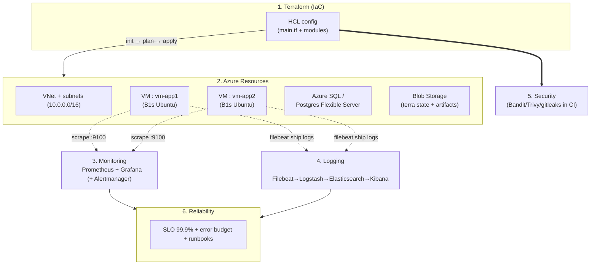

# Day 28: Week 4 Review & Challenge
📚 Topic 28: Cloud & Observability Mastery — Full Stack Review
✅ Prerequisite-checklist: (review Days 22-27 concepts if needed)

## Overview | Parichay

Is day ke andar kya hai:
- **[Topic]** Week 4 review - Terraform (Azure), Azure services, monitoring, logging, security, SRE
- **[Quiz]** 7 revision questions apni yaad check karne ke liye
- **[Lab]** Week 4 Capstone Challenge - pura Azure infrastructure stack (Terraform + monitoring + logging + security) ek sath

Week 4 - Terraform, Azure, monitoring, logging, security, SRE ka purra review. Aur complete karo **Week 4 Capstone Challenge** - pura infrastructure stack.

---

## What You'll Learn | Aaj Ki Seekh

- [ ] Week-4 ke saare topics ka quick revision (Terraform → Azure → observability → security → SRE)
- [ ] Poora infrastructure stack ek sath jodna: IaC + networking + monitoring + logging
- [ ] Revision quiz se apni yaad test karna
- [ ] Week-4 Capstone Challenge: Terraform + VNet/VMs/Azure SQL deploy karna
- [ ] Health check + verification flow complete karna

---

## Diagram | Dekho Kaise Kaam Karta Hai



ASCII:
```
Terraform (HCL) ──► Azure: VNet + 2 VMs + Azure SQL + Storage
                        │
              ┌─────────┴───────────┐
              ▼                     ▼
        Prometheus+Grafana     ELK logging
        (CPU/mem/disk)         (central logs)
              └─────────┬─────────┘
                        ▼
              Security scans + SLO/runbooks
```

**Real images (official docs):**
- Terraform Azure provider docs: https://registry.terraform.io/providers/hashicorp/azurerm/latest/docs
- Azure quickstarts overview: https://learn.microsoft.com/en-us/azure/quickstart-templates
- Prometheus + Grafana dashboards: https://prometheus.io/docs/visualization/grafana/

---

## Demo | Copy-Paste Karke Chalao

### Step 1: Login + Terraform apply (end-to-end)

```bash
az login
az account show
mkdir -p week4-capstone/terraform && cd week4-capstone/terraform
```

`main.tf` (VNet + VM + storage, minimal):
```hcl
provider "azurerm" {
  features {}
}

resource "azurerm_resource_group" "main" {
  name     = "rg-week4"
  location = "East US"
}

resource "azurerm_virtual_network" "main" {
  name                = "vnet-week4"
  address_space       = ["10.0.0.0/16"]
  location            = azurerm_resource_group.main.location
  resource_group_name = azurerm_resource_group.main.name
}

resource "azurerm_subnet" "public" {
  name                 = "snet-public"
  resource_group_name  = azurerm_resource_group.main.name
  virtual_network_name = azurerm_virtual_network.main.name
  address_prefixes     = ["10.0.1.0/24"]
}

resource "azurerm_network_interface" "main" {
  name                = "nic-app1"
  location            = azurerm_resource_group.main.location
  resource_group_name = azurerm_resource_group.main.name
  ip_configuration {
    name                          = "internal"
    subnet_id                     = azurerm_subnet.public.id
    private_ip_address_allocation = "Dynamic"
  }
}

resource "azurerm_linux_virtual_machine" "app1" {
  name                = "vm-app1"
  resource_group_name = azurerm_resource_group.main.name
  location            = azurerm_resource_group.main.location
  size                = "Standard_B1s"
  admin_username      = "azureuser"
  network_interface_ids = [azurerm_network_interface.main.id]
  os_disk {
    caching              = "ReadWrite"
    storage_account_type = "Standard_LRS"
  }
  source_image_reference {
    publisher = "Canonical"
    offer     = "0001-com-ubuntu-server-jammy"
    sku       = "22_04-lts-gen2"
    version   = "latest"
  }
  admin_ssh_key {
    username   = "azureuser"
    public_key = file("~/.ssh/id_rsa.pub")
  }
}

resource "azurerm_storage_account" "data" {
  name                     = "week4storage2027"
  resource_group_name      = azurerm_resource_group.main.name
  location                 = azurerm_resource_group.main.location
  account_tier             = "Standard"
  account_replication_type = "LRS"
}

output "vm_ip" {
  value = azurerm_linux_virtual_machine.app1.private_ip_address
}
```

Chalao:
```bash
terraform init
terraform validate
terraform plan
terraform apply -auto-approve
terraform show | grep -E "vm_ip|virtual_machine|storage_account_name"
```

### Step 2: Health check + verification

```bash
# Azure resources verify
az group show -n rg-week4 -o table
az vm list -g rg-week4 -o table
az storage account list -g rg-week4 -o table

# Monitoring stack deploy (prometheus)
docker compose -f ../monitoring/docker-compose.monitoring.yml up -d
curl -s localhost:9090/api/v1/query --data-urlencode 'query=up' | python3 -m json.tool

# Logging stack deploy (ELK)
docker compose -f ../logging/docker-compose.elk.yml up -d
curl -s localhost:9200 | python3 -m json.tool
```

### Step 3: Cleanup (cost bachao)

```bash
terraform destroy -auto-approve
az group delete -g rg-week4 --yes --no-wait
docker compose down
```

---

## Real-Life Example | Zindagi Se

Week-4 ka poora architecture samjho **ek naya Aangan/apartment building banane** jaisa. **Terraform (Day 22)** hai blueprint aur contractor jo saari plans se ghar banata hai. **Azure services (Day 23)** hai building ka basic dhaancha - VNet route, VMs = khaane, Azure SQL = record room. **Prometheus+Grafana (Day 24)** hai building ki CCTV system jo roz ka haal dikhata hai. **ELK (Day 25)** hai janitor ki diary jisme har event likha hai. **Security (Day 26)** hai building ke guards aur locks. **SRE (Day 27)** hai building ke supervisor jo ye ensure karta hai ki lift 99.9% chalegi (SLO), aur agar kuch ho jaye to repair karne ka plan (runbook) ready hai. Saath ye sab jodoge to tumhare paas ek **fully-managed, monitored, secure building (production infra)** hai - Day 28 ka Capstone!

---

## Week 4 Summary | Is Week Kya Seekha

| Day | Topic | Key Concepts |
|-----|-------|-------------|
| 22 | Terraform | HCL, azurerm provider, state, modules, plan/apply/destroy |
| 23 | Azure | VM, Blob Storage, Entra ID/RBAC, VNet, Azure SQL, Monitor, CLI |
| 24 | Monitoring | Prometheus, PromQL, Grafana, alerting |
| 25 | Logging | ELK, Filebeat, Logstash pipeline, Kibana |
| 26 | Security | SAST, DAST, Trivy, secret/dependency scan |
| 27 | SRE | SLI/SLO/SLA, error budget, runbooks, chaos |

---

## Revision Quiz | Apni Yaad Check Karo

**Q1:** Terraform vs Bicep?
**A:** Dono IaC (declarative); Terraform = multi-cloud (AWS/Azure/GCP), Bicep = sirf Azure-native

**Q2:** Error budget ki calculation?
**A:** SLO se allowed downtime - e.g. 99.9% = 0.1% = ~43 min/month

**Q3:** SLI vs SLO vs SLA?
**A:** SLI = measurement, SLO = target, SLA = legal contract

**Q4:** Prometheus metrics kaise scrapes karta hai?
**A:** `scrape_configs` se targets par periodic HTTP GET (pull model)

**Q5:** Observability ke 4 pillars?
**A:** Metrics, Logs, Traces, (new: Events/Continuous Profiling)

**Q6:** Shift-left security kya hai?
**A:** Security ko code ke saath hi same stage par lao (baad mein nahi)

**Q7:** SRE mein toil kya hai?
**A:** Manual repetitive automatable operational work - reduce karo

---

## Week 4 Capstone | DevOps Infrastructure

```
devops-infra/
├── terraform/
│   ├── main.tf, variables.tf, outputs.tf
│   ├── modules/{vnet, vm, azure-sql}
│   └── environments/{dev,staging,production}.tfvars
├── monitoring/
│   ├── prometheus.yml, alerting-rules.yml
│   ├── grafana/dashboards/
│   └── docker-compose.monitoring.yml
├── logging/
│   ├── filebeat.yml, logstash.conf
│   └── docker-compose.elk.yml
├── security/
│   ├── .github/workflows/security.yml
│   └── trivy-scan.sh
├── scripts/
│   ├── setup.sh, deploy.sh, rollback.sh, health-check.sh
└── README.md
```

**Requirements (self-check):**
- [ ] Terraform: VNet + 2 VMs + Azure SQL/Postgres + Storage Account
- [ ] Prometheus monitors saare VMs
- [ ] Grafana dashboard (CPU, mem, disk)
- [ ] ELK central logging
- [ ] CI security scans
- [ ] deploy/rollback scripts
- [ ] Health check + verify
- [ ] Architecture docs

---

## Self-Checklist | Week-4 Complete

- [ ] Terraform infra apply/destroy (Azure)
- [ ] Azure services banaye (VM, Storage, VNet)
- [ ] Prometheus+Grafana dashboard
- [ ] ELK logging set up
- [ ] Security scans running
- [ ] SLOs defined
- [ ] Capstone infra ready

---

**Final Challenge:** Days 29-30 mein full DevOps capstone project - DeployTrack.
