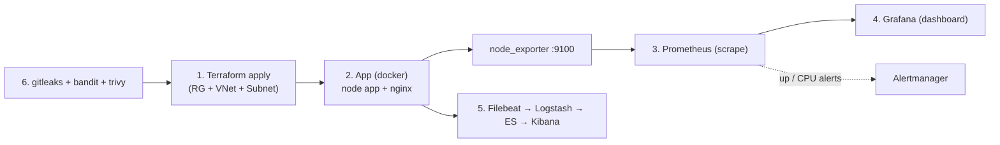

# Day 28: Week 4 Review & Challenge
📚 Topic 28: Cloud & Observability Mastery — Full Stack Review
✅ Prerequisite-checklist: (review Days 22-27 concepts if needed)

## Overview | Parichay

Is day ke andar kya hai:
- **[Topic]** Week 4 review - Terraform (Azure), Azure services, monitoring, logging, security, SRE
- **[Quiz]** 7 revision questions apni yaad check karne ke liye
- **[Lab]** Week 4 Capstone Challenge - pura Azure infrastructure stack (Terraform + monitoring + logging + security) ek sath

Week 4 - Terraform, Azure, monitoring, logging, security, SRE ka purra review. Aur complete karo **Week 4 Capstone Challenge** - pura infrastructure stack.

Socho tum poori factory doosre din ke liye ready kar rahe ho: **Terraform** se deewarein (infra), **monitoring** se pani ka pressure/temp meters, **logging** se har machine ka register, **security** se darwaze ke locks aur **SRE** se sab khud-check. Aaj sab ek saath jod kar ek **production jaisa mini-stack** banate hain.

### Week 4 ka big picture — review kyun zaroori hai

Week 4 ne 6 alag din me 6 bade tools dekhe — lekin industry me ye **ek hi kaam** karte hain: infrastructure banana (Terraform), cloud services pe chalana (Azure), dekhna ki chal raha hai ya nahi (Prometheus/Grafana), sunna kya hua (ELK), rokna bura hone se (DevSecOps), aur decide karna kitna reliable kaafi hai (SRE). Review ka rule: **topics ko alag-alag nahi, jude hue samjho** — kyunki capstone me bhi yahi chain lagegi: code se infra bana → uspe app chalao → metrics + logs lagao → scan karo → SLO pe alert rakho. Is day ka maqsad yahi checklist hai ki har link apni jagah fit hota hai.

Week 4 ka map (revision ke liye):

| Day | Link | Ek line me |
|---|---|---|
| 22 | Terraform | infra = code, state = truth |
| 23 | Azure services | infra chalta kahan hai |
| 24 | Prometheus/Grafana | metrics + dashboards + alerts |
| 25 | ELK | logs generate se search tak |
| 26 | DevSecOps | commit se deploy tak gates |
| 27 | SRE | SLO + error budget + incidents |

### Terraform + Azure — infra wala link

Terraform ka poora loop chhote me: **declarative HCL** likho → `init → validate → plan → apply` → **state** remote backend pe (locking ke saath), portal pe kabhi manually mat chhodo (drift aayega to plan dikha dega). Azure me hierarchy: **Tenant → Subscription → RG → Resource** — saare resources ek RG me, NSG se ports control, cost ke liye auto-shutdown. Recap trick: plan = dry-run contract, state = truth, destroy = paisa bachao. Ye dono din saath isliye hain kyunki production me infra bhi code se banta hai **aur** uska control bhi cloud ke core services se hota hai.

Terraform/Azure memory hooks:

- plan = contract, state = truth, remote backend + locking = team safety
- RG delete = sab ek saath — folder discipline rakho
- NSG = priority list, pehla match wins, default deny
- destroy = demo ka paisa bachao (lab ke baad hamesha)

### Observability wala link — metrics + logs

Do pillars ek dusre ko complete karte hain: **Prometheus** har 15s targets se **pull** karta hai (down target = `up==0`), **Grafana** usse RED/USE dashboards banata hai, **Alertmanager** severity-wise routes karta hai. Logs wala pipeline: **generate → ship (Filebeat) → parse (Logstash/grok) → store (Elasticsearch) → visualize (Kibana)**. Interview trick: alert fire hua (metrics ne bataya **kya**), Kibana me `trace_id` search kiya (logs ne bataya **kyun**) — dono ke bina debugging andhadhund hai. Do bade gotchas: high-cardinality labels (Prometheus) aur unlimited log retention (ELK).

Observability memory hooks:

- pull model: target down = `up 0` turant dikhta hai
- logs pipeline 5 steps: generate → ship → parse → store → visualize
- alert user impact pe (error rate), resource threshold pe nahi
- metrics ne bataya kya, logs bataye kyun — dono chahiye

### Security aur SRE wala link — quality ke do pahiye

DevSecOps = **shift-left**: `gitleaks` (secrets) → `bandit` (SAST) → `trivy fs` (SCA deps) → `trivy image` (container CVEs) → **CI gate** (`--exit-code 1` = deploy block). SRE = **reliability ka number game**: **SLI → SLO → error budget (100 - SLO)**, alerts **burn rate** pe (budget ki speed), incidents me commander + blame-free postmortem. Connection samjho: security failures aur reliability failures dono **user trust** karte hain — isliye dono gates pipeline me hi hain, baad me nahi. 99.9% = ~43 min/month — ye number kabhi mat bhoolna.

Quality memory hooks:

- scan order: secrets → SAST → SCA → image → gate (fast se slow)
- `--exit-code 1` hi asli guard hai, warna scan sirf suggestion
- error budget = 100 - SLO; 99.9% = ~43 min, 99.99% = ~4.3 min
- release freeze = budget khatam, sirf hotfix allow

### Capstone ko kaise attempt karo — strategy

Capstone ko as project lo, checklist nahi. Suggested order (dependency-wise): 1) **Terraform apply** (RG + VNet + Subnet — 5 min, almost free), 2) app + `node_exporter` upar, 3) Prometheus/Grafana scrape + dashboard import, 4) ELK upar + logs generate + Kibana me search verify, 5) security scans chalao (pehle intentionally risky file daal ke fail dikhao, phir fix), 6) ek alert fire karke severity + timeline likho, 7) **`terraform destroy`** (zaroori — demo paisa). Har step ka **verify** lo (plan output, `/targets` UP, `_cat/indices`, scan exit code) — bina proof ke step = complete nahi.

Har step ka proof (ye na mile to step incomplete hai):

| Step | Proof |
|---|---|
| Terraform | `plan`/portal pe RG + VNet dikhe |
| Monitoring | `localhost:9090/targets` me sab UP |
| Logging | Kibana Discover me `level: ERROR` rows |
| Security | teeno scans exit 0 (green) |
| SRE | alert fire hua + timeline notes likhe |

### Review technique — 7 sawal ke peeche kya hai

Quiz ke 7 sawal random nahi hain: wo **concept triage** hain — agar kisi ka jawab nahi aata, wahi topic dobara padho (day ka `## Quick Notes` block fastest revision hai). Technique: 1) **pehle bina dekhe** jawab likho, 2) gap wale topics pe sirf overview + notes padho (poora day dobara mat), 3) **teaching test** — kisi ko 60 sec me "pull vs push" samjhao, na aaye to concept abhi bhi dhaara-dhaar nahi. Notes block ko flashcards ki tarah use karo: ek line = ek card. Aur haan — Week 4 ke 6 headings apne words me ek-ek line me likh ke dekho, jo na aaye wo revision list me.

### Interview angle — Week 4 story sunao

Interviewer ko tool listing nahi, **system sense** chahiye. Ek connected reply: "*Hum infra ko Terraform se declarative rakhte hain with remote state + locking; har service ke metrics Prometheus pull karta hai jinse Grafana dashboards + burn-rate SLO alerts bante hain; logs Filebeat se ELK jaate hain taaki incident ka root cause trace ho; CI me gitleaks/bandit/trivy gates hain; aur releases error budget govern karti hain.*" — is 4 line me poora Week 4 cover ho gaya, aur yahi senior-wala signal hai. Common follow-ups: state kyun sensitive hai, pull ke fayde, SAST vs SCA, 99.9% ka math — in 4 pe 100% polish rakho.

## What You'll Learn | Aaj Ki Seekh

- [ ] Terraform: declarative IaC, `init → plan → apply → destroy`, state + azurerm
- [ ] Azure core services: VM, Blob, VNet/NSG, SQL, Monitor — CLI/SDK cost control
- [ ] Prometheus/Grafana: pull model, exporters, PromQL, dashboards, Alertmanager
- [ ] ELK: generate → ship (Filebeat) → parse (Logstash) → store/search (ES) → visualize (Kibana)
- [ ] DevSecOps: shift-left, gitleaks, Bandit (SAST), Trivy (SCA + image), CI gates
- [ ] SRE: SLI/SLO/error budget, burn rate, golden signals, toil, incidents
- [ ] Capstone: sab kuch ek saath jod kar production-real mini-stack

## Review Quiz | 7 Sawal

1. `terraform plan` vs `terraform apply` — fark? *(plan = dry-run preview, apply = asli changes)*
2. Terraform state kyun sensitive hai aur kahan rakhte ho? *(secrets ho sakte ho, remote backend + locking)*
3. Prometheus **pull** kyon aur iske fayde? *(target down ho to `up==0` dikhta hai)*
4. Log pipeline ke 5 steps? *(generate → ship → parse → store → visualize)*
5. gitleaks kya rokta hai aur kaise? *(commit pe secrets, regex/entropy)*
6. Error budget formula aur 99.9% ka monthly minutes? *(100−SLO; ~43.2 min)*
7. SAST vs SCA — kaun kya check karta hai? *(apna code vs 3rd-party deps)*

## Diagram | Capstone Architecture



```
bin infra: Terraform (Azure) | monitor: node_exporter→Prom→Grafana
logs: app.log→Filebeat→ELK | security: gitleaks+bandit+trivy | SLO: alert on CPU/up
```

## Real-Life Example | Industry Me

**Production me:** Ye capstone teeno maturity level ka mini mirror hai — infra Git se apply hota hai, har server se metrics pull hote hain, har service ke logs ek center me search hote hain, aur har image deploy se pehle scan hota hai. Is stack ke saath pura team "khuli aankh" chalti hai: deploy kaun sa CVEs include karega, kaunsa service slow hai, kya wo SLO ke budget me hai — sab kuch ek jagah. Yehi pattern bank, ecommerce aur SaaS companies me lakhs ₹/mo infra pe chalta hai.

## Demo | Capstone (Try It)

```bash
# STEP 1 — Terraform: sasta infra (RG + VNet + Subnet — almost free)
mkdir -p capstone && cd capstone
cat > main.tf << 'EOF'
terraform {
  required_providers { azurerm = { source = "hashicorp/azurerm", version = "~> 3.0" } }
}
provider "azurerm" { features {} }
variable "location" { default = "East US" }

resource "azurerm_resource_group" "main" {
  name     = "rg-capstone"
  location = var.location
}
resource "azurerm_virtual_network" "main" {
  name                = "vnet-capstone"
  resource_group_name = azurerm_resource_group.main.name
  location            = var.location
  address_space       = ["10.0.0.0/16"]
}
resource "azurerm_subnet" "web" {
  name                 = "snet-web"
  resource_group_name  = azurerm_resource_group.main.name
  virtual_network_name = azurerm_virtual_network.main.name
  address_prefixes     = ["10.0.1.0/24"]
}
EOF
terraform init && terraform apply -auto-approve

# STEP 2 — App + monitoring (localhost par docker)
docker run -d --name app --network host nginx:alpine                # app
curl -L -O https://github.com/prometheus/node_exporter/releases/download/v1.8.2/node_exporter-1.8.2.linux-amd64.tar.gz
tar xzf node_exporter-*.tar.gz && ./node_exporter-*/node_exporter &
# Day 24 ka prometheus.yml + alert-rules.yml copy karke:
docker run -d --name prom --network host -v "$PWD/prometheus.yml:/etc/prometheus/prometheus.yml" prom/prometheus
docker run -d --name grafana --network host -e GF_SECURITY_ADMIN_PASSWORD=admin grafana/grafana:10.1
# Grafana → datasource Prometheus (localhost:9090) → import dashboard 1860

# STEP 3 — Logging (Day 25 ka ELK compose) + app logs generate
mkdir -p logs && for i in $(seq 1 60); do
  echo "$(date +%Y-%m-%dT%H:%M:%S) $( [ $((i%4)) -eq 0 ] && echo ERROR || echo INFO ) request $i"
done > logs/app.log
# docker compose up ELK + filebeat (Day 25 file) → Kibana pe app-logs-*
# STEP 4 — Security scan (Day 26 tools)
gitleaks detect --source . --exit-code 1 || echo "REPO CLEAN"
bandit -r . -q  2>/dev/null || true
trivy fs . --severity HIGH,CRITICAL --exit-code 1

# STEP 5 — SRE: alert koi nikle to severity assign, timeline likho, cleanup:
terraform destroy -auto-approve
docker rm -f app prom grafana filebeat $(docker ps -aq) 2>/dev/null
```

## Practice Exercise | Abhi Karein

1. `capstone/` repo banao + Day 22 wale `main.tf` se infra apply karo
2. Monitoring: node_exporter + Prometheus + Grafana + dashboard 1860
3. PromQL se CPU/memory panels likho; apne SLO (99.9%) ke liye burn-rate alert add karo
4. Logging: app logs generate karke ELK (Filebeat → Logstash → ES → Kibana) me search karo
5. Security: gitleaks + bandit + trivy scan karke sab green karo
6. Ek incident simulate + postmortem likho (kya hua, timeline, fix)
7. Sab cleanup karo (destroy) — aur review quiz ke 7 sawal bina dekhe likho

## Quick Notes | Yaad Rakho

```
- Week 4 stack: Terraform(Azure) + Prometheus/Grafana + ELK + Trivy/gitleaks
- Terraform: plan > apply > state(remote) > destroy — Paise ka dhyan
- Observability: metrics(up/CPU) + logs(kya hua) = completeness
- Security shifts left: commit → CI → image — har level pe gate
- SLO = user ka sabse simple janch; alerts burn rate par
- Docker local substitute = zero cost practice (production keke simulate)
- Capstone kitna "production-real" ===>>> kitne CVEs 0 hain? alerts fire hue? logs search?
- Agla 2 din: DeployTrack capstone — CI/CD + monitoring + kamu karlenge (Day 29-30)
```

**Agla:** DeployTrack final capstone shuru — architecture, repo, Docker, monitoring (Days 29-30).