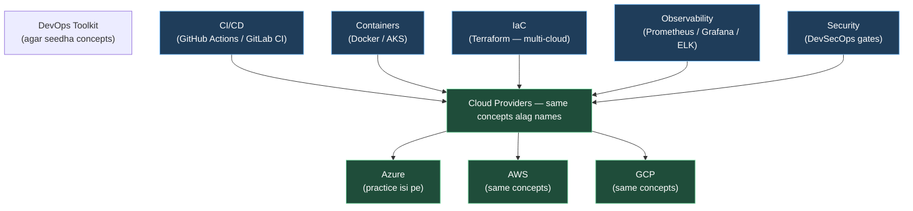

# Day 31 | Final Lecture: Azure Deep Dive — Cloud-Agnostic DevOps + Azure Finale
📚 Topic 31: Cloud-Agnostic Deep Dive — Azure, Multi-Cloud & Roadmap Preparation
✅ Prerequisite-checklist: (review All previous Days 1-30 concepts if needed)

> **Ye lecture kyun?** Is course ka asli goal 30 din me theek DevOps ban jao. Lekin ek baat zyada: **tumhare cloud pe practice honi chahiye, par DevOps concepts se limited nahi.** Har cheez jo humne seekhi (CI/CD, containers, K8s, IaC, observability, security) — wo **kisi bhi cloud** pe kaam karti hai: Azure, AWS, GCP. Azure sirf **wo OS/account hai jispe tum practice kar rahe ho.** Ye *bonus lecture* hai — poori 30-day journey ka cloud-level final! Kal ko roz practice chahiye, ye lecture wo bridge hai.

---

## What You'll Learn (Checklist)

- [ ] Cloud vs Cloud-DevOps vs Cloud-agnostic — ye difference clear
- [ ] Azure cloud catalog full tour (compute → storage → DB → security → AI)
- [ ] Azure DevOps product family kya hai aur kab use karna hai (GitHub Actions bhi thik hai)
- [ ] Multi-cloud comparison table (Azure vs AWS vs GCP) — ek view me
- [ ] Ek-ek point pe quick revision: poora 31-din syllabus ki gati ek nazar me
- [ ] Azure free-tier + cost cleanup ka demo
- [ ] Agla roadmap: certs, projects, jobs (takki tutorial agar "khatam nahi" ho)

---

## Diagram | Cloud-Agnostic DevOps on Azure



---

## 1. Ye course Azure-DevOps limited NAHI hai | Multi-Cloud Clarity

**Confusion kya thi:** Log sochte hain "Azure DevOps" = poora course sirf usi tool ki training. Nahi.

| Sawal | Jawab |
|-------|-------|
| Kya course sirf `Azure DevOps` (product) hai? | **Nahi.** Humne 90% kaam **GitHub Actions + az CLI + Terraform + Azure portal** se kiya — ye sab generic DevOps tools hain. |
| Kya concepts sirf Azure pe lagte hain? | **Nahi.** CI/CD, containers, IaC, monitoring — AWS (`CodePipeline`, `EKS`, `CloudFormation`), GCP (`Cloud Build`, `GKE`, `Deployment Manager`) pe same concepts hai. |
| To Azure kya hai is course me? | **Cloud provider (practice ground).** Jaise driving sikhne ke liye ek car chahiye (yahan Azure), lekin driving ka pura principle har car pe similar hai. |
| Aage xyz cloud job mile to? | Tumhara **tool-agnostic base** ready hai. Naya cloud = bas naye console ke naam yaad karo (VNet = AWS VPC, NSG = SG, AKS = EKS/GKE). |

**Rule yaad rakho:** *Concept ek hai, har cloud me alag naam — practice ke liye humne Azure liya.*

---

## 2. Azure Services Catalog | Ek-Ek Point Ki Quick Full Detail

Har category me **kya hai → kya kaam → DevOps me kahan aata hai** (quick but complete):

| Category | Azure Service | Kya Kaam Hai | Course Me Kahan |
|----------|---------------|--------------|-----------------|
| **Compute** | VM (IaaS) | Full OS VM | Day 7, 23 |
| | Container Instances (ACI) | Docker bina VM ke | Day 15 |
| | AKS | Managed K8s | Day 18-21 |
| | App Service (PaaS) | Auto-scale web apps | Day 23 (demo) |
| | Azure Functions (Serverless) | Event-pe code | Bonus note |
| **Storage** | Blob | Files/images backup | Day 7, 23 |
| | Disk | VM disks | Day 23 |
| | File | Shared FS (SMB) | - |
| **Networking** | VNet | Private network | Day 23 + `/topics/azure-vnet` |
| | NSG | Firewall | Day 23 |
| | Load Balancer / App Gateway | Traffic | Day 23 |
| | Azure DNS | Domain hosting | Day 5 + `/topics/dns-explained` |
| | Bastion | Secure SSH/RDP | Day 23 |
| **DATABASE** | Azure SQL | Managed DB | Capstone |
| | Cosmos DB | NoSQL global | - |
| **Identity/Security** | Entra ID (Directory) | Users + groups | Day 23 |
| | RBAC | Role-based access | Day 23 |
| | Key Vault | Secrets/keys | Day 20, 26 |
| | Defender / Sentinel | Security hub | Day 26 |
| **Monitor/Cost** | Monitor + Log Analytics + Alerts | Metrics/logs | Day 24-25 |
| | Cost Management + Budgets | Cost limits + alerts | Day 23 |
| **CI/CD (products)** | Azure DevOps (Boards/Repos/**Pipelines**/Artifacts) | MS ka own toolchain | Day 8-14 (concept equivalents) |
| | GitHub **Actions** | Jiska course me use kiya | Day 9 |

---

## 3. Azure DevOps (Product) vs GitHub Actions vs GitLab — Kab Kya Use Karo

Ek table me clear — taaki tumhe lage naa course limited hai:

| Cheez | GitHub Actions | Azure DevOps Pipelines | GitLab CI |
|-------|---------------|------------------------|-----------|
| Kaha hosts | GitHub | Azure | GitLab |
| YAML | `.github/workflows/*.yml` | `azure-pipelines.yml` | `.gitlab-ci.yml` |
| Best for | GitHub repo + simple | Azure resources + MS corp | GitLab-first teams |
| Organisation | free tier ok | ok | ok |
| Interview line | "Both are CI/CD; choice depends on where repo lives + team" |

**Kisi bhi ek ka command/gui practice karke dusra bhi samaajh jayega — concepts sab same.**

---

## 4. Quick Revision: Pura Course Ek Nazar (full 31 points)

**Week 1 — DevOps foundations, Linux, Git (Day 1-7):**
1. DevOps = culture (CALMS, 3 ways) → [deep dive](../topics/devops-culture.md)
2. Linux FS (`pwd/cd/ls/mkdir`) — sim me practice
3. Permissions (`chmod rwx`, users/groups) → [deep dive](../topics/linux-permissions.md)
4. Shell scripting (`if/for`, variables)
5. Networking (`ip/ping/curl`) + [DNS deep dive](../topics/dns-explained.md)
6. Git full magic (`commit/branch/merge`)
7. Capstone — Linux web server deploy

**Week 2 — CI/CD + scripting (Day 8-14):**
8. CI/CD concepts → [deep dive](../topics/cicd-explained.md)
9. GitHub Actions full → pipelines YAML
10. Jenkins (alternative CD brain)
11. Maven build
12. Artifacts (JFrog/Nexus)
13. Advanced scripting (`awk/sed/jq`)
14. Capstone — CI/CD pipeline

**Week 3 — Containers + K8s (Day 15-21):**
15. Docker fundamentals → [containers-vs-VMs](../topics/containers-vs-vms.md)
16. Docker Compose
17. Image optimization + Multi-stage
18. K8s fundamentals → [architecture](../topics/kubernetes-architecture.md)
19. Deployments/Services/Scaling
20. ConfigMaps/Secrets (Key Vault connect)
21. Capstone — microservices on AKS

**Week 4 — IaC + Cloud + Monitoring + Security (Day 22-28):**
22. Terraform base → [IaC deep dive](../topics/what-is-iac.md)
23. Azure identity + services + [VNet deep dive](../topics/azure-vnet.md)
24. Prometheus/Grafana → [observability](../topics/observability.md)
25. EFK/ELK logging
26. DevSecOps (Shift-left) → [devsecops](../topics/devsecops.md)
27. SRE + Error budgets → part of [observability](../topics/observability.md)
28. Capstone — full platform deploy

**Capstone (Day 29-30):**
29. DeployTrack feature wave full pipeline
30. Cloud dashboard + cleanup + resume ready

**Bonus (Day 31 = Ye lecture):**
31. Multi-cloud clarity + Azure catalog + roadmap

---

## 5. Demo | Azure Free-Tier + Cleanup (Commands)

Ye demo `az cli` se hai (Day 23 ke baad ho jana chahiye). Free tier me galti se **overcharge** se bachna = daily routine.

```bash
# 1. Login
az login

# 2. Resource group (sab resources yahan, ek TLG me pakde rakho)
az group create --name devclo-demo --location "Central India"

# 3. Useless VM avoid karne ka tarika — pehle check kya hai
az group list --output table
az resource list --resource-group devclo-demo --output table

# 4. Saaf cleanup (money bachao!) — poora group delete
az group delete --name devclo-demo --yes --no-wait

# 5. Budget alert (proactive cost guard)
az consumption budget create \
  --budget-name "devclo-monthly" \
  --amount 500 \
  --resource-group devclo-demo \
  --category cost \
  --start-date 2026-09-01 --end-date 2027-08-31 \
  --time-grain Monthly
```

**Free-tier rules (yaad rakho):** Student account me 12 mahine free credits; hamesha `az group delete` after practice; scheduled shutdown VM pe laga do. Cost = security.

---

## 6. Aage Kya | Tutorial "Khatam" Nahi — Roadmap Continue

Ek lecture khatam nahi = taaza project banate rehna. Ye roadmap tumhe career track pe rakhta hai:

| Jagah | Kya Karo |
|-------|----------|
| **Projects (portfolio)** | Kapne DeployTrack, phir 1 naya: "Terraform+AKS microservice app" + 1 "Serverless + Cosmos DB" |
| **Hands-on github** | Har naya project me CI/CD + DevSecOps gates + monitoring dashboards — screenshot ready |
| **Certs (jo bhi, azure leke)** | AZ-900 (concepts) → AZ-104 (admin) → AZ-400 (devOps engineer), ya AWS Solutions Assoc. |
| **Jobs/Interview** | GH Actions, Terraform, Docker/K8s, Prometheus pe score — **concept answers** (jo deep dives me hain) |
| **Practice routine** | Roz 20-30 min labs (yahi web app sandbox + real VM) — bass itna hi |

---

## 7. Real-Life Example | Ek Full Story

> **Tum ek food-delivery startup me DevOps engineer ho.** User traffic badh rahi hai, 10 apps service split. Porto:
> - **CI/CD (GitHub Actions)** — har commit pe build+test+scan → automatically deploy to AKS (Azure).
> - **Terraform** — VNet / AKS / DB / NSG sab code me; change review via PR.
> - **Prometheus/Grafana** — dashboards pe SLO 99.9% monitor; error budget khatam → pause risky releases.
> - **Key Vault** — DB secrets, API keys encrypted; dev kabhi nahi dekhta production secret.
> - **DevSecOps gate** — trivy scan CRITICAL → pipeline ruk gaya; fix → re-release.
> - Jab CFO poochhe "cost kya?" → **az cost** report + budget alert.
>
> Agar ek din **AWS me shift karna ho?** Concepts same — bas `azurerm` provider → `aws` provider, portal names badlo. That's the power of cloud-agnostic DevOps.

---

## Quick Notes | Yaad Rakho

- **Azure = practice cloud; concepts cloud-agnostic (AWS/GCP vahi).**
- `Azure DevOps ≠ DevOps` — it's a **product** (one of many); GitHub Actions/GitLab equally fine.
- Resource **group** = budget boundary — hamesha group pe hi kaam, kabhi scatter nahi.
- **Key Vault, Cost Budget, NSG deny-default** — teen must-rule azure safety.
- Toolkit yaad rakho: **az CLI, Key Vault, Cost Budget, NSG deny-default** — chaar azure safety rules.
- Ab syllabus pura — **35 lectures (30+capstone+bonus) ka practice series** khatam nahi, roz 30 min labs zariye: is web app ke sandbox me.

---
**Next kya?** `Deep Dives` pages se concept gahre karo ya apna **pehla production project portfolio** bana ke commit karo — tutorial 31 din me khatam, practice lifetime.