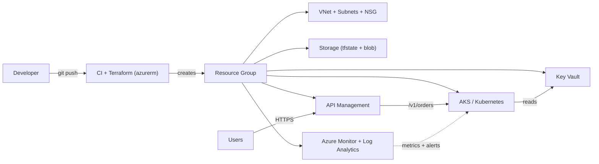

# Day 31 | Final Lecture: Azure Deep Dive — Cloud-Agnostic DevOps + Azure Finale
📚 Topic 31: Cloud-Agnostic Deep Dive — Azure, Multi-Cloud & Roadmap Preparation
✅ Prerequisite-checklist: (review All previous Days 1-30 concepts if needed)

> **Ye lecture kyun?** Is course ka asli goal 30 din me theek DevOps ban jao. Lekin ek baat zyada: **tumhare cloud pe practice honi chahiye, par DevOps concepts se limited nahi.** Har cheez jo humne seekhi (CI/CD, containers, K8s, IaC, observability, security) — wo **kisi bhi cloud** pe kaam karti hai: Azure, AWS, GCP. Azure sirf **wo OS/account hai jispe tum practice kar rahe ho.** Ye *bonus lecture* hai — poori 30-day journey ka cloud-level final! Kal ko roz practice chahiye, ye lecture wo bridge hai.

---

## Overview | Parichay

Aaj hum poori 30-day journey ke pieces ek **stack** me jodte hain: VM, VNet/NSG, Storage, Key Vault, AKS, API Management, Azure Monitor — saare Azure services jo course me chal chuki hain. Saath me **IAM/RBAC** (kaun kya kar sakta hai), **cost management** (paise bachao) aur **when to use what**. Clouds sirf console me alag lagte hain, **concepts same hote hain** — yehi multi-cloud mindset hai.
Analogy: Cloud ek **ghar** hai — wiring (networking), tanki (storage), guard (IAM), bill (cost). Ghar ka **plan same rehta hai**, koi bhi builder banaye (Azure/AWS/GCP). Azure pe seekha to doosre clouds pe sirf **furniture reposition** karni hai — skills transfer hoti hain.

### Full-stack recap — Azure ke building blocks

Course me har block alag din aaya — aaj unko ek **order me jodo**: **RG** (folder + bill grouping — bina iske kuch nahi banta) → **VNet/NSG** (private network + priority-based firewall on subnet) → **Storage** (blobs/files, by default private) → **Key Vault** (secrets ka locker, RBAC se) → **AKS** (managed K8s) → **APIM** (API ka single door — auth/rate-limit/versioning) → **Monitor + Log Analytics** (metrics, logs, alerts ek jagah). Dependency chain hi Terraform me bhi order dictate karti hai.

| Azure | Kaam | AWS twin |
|-------|------|----------|
| VNet/NSG | private net + firewall | VPC / Security Groups |
| Storage | blobs + files | S3 |
| Key Vault | secrets + keys | Secrets Manager + KMS |
| AKS | managed Kubernetes | EKS |
| APIM | API gateway | API Gateway |
| Monitor | metrics + logs | CloudWatch |

Recap graph kuch aisa yaad rakho: `Users → APIM → AKS pods → Key Vault/DB`, aur `Monitor` pehle se sabko dekh raha hai — ye seedha diagram interview me draw kar paana hi full-stack samajh hai.

### IAM/RBAC — least privilege ka darwaza

Har resource pe ek hi sawal: **kaun, kya, kis scope pe** kar sakta hai. RBAC = role (permission set) + principal (kisko) + scope (kahan). Golden rule: **least privilege** — developer ko dev RG me Contributor, prod me Reader bas; owner sirf 1-2 trusted log. Bonus: app identity ke liye **managed identity** use karo (VM/pod ka apna identity — koi password store karna hi nahi). Gotcha: "kaam karne do" ke chakkar me **Owner role mat baanto** — custom role banao, aur sensitive prod access pe approval (PIM) rakho.

### Cost management — bill pe control

Cloud me har cheez tick karti hai, bill bhi credit card jaisa. Teen levers: **tags** (`owner`/`env`/`project` — bina tags ke bill ka koi sense nahi), **budgets + alerts** (80% pe email/Slack), **right-sizing + shutdown** (raat/weekend pe dev VMs band, `Standard_B*` burstable use karo). Chhipi hui cost: data egress, NAT gateway, public IPs, AKS nodes (control plane free, nodes nahi). Rule: **resource group destroy = poora bill band** — lab env pe tag + scheduled cleanup rakho.

Cost ka teen aur chhota levers:
- **Scheduled shutdown** — dev VMs raat/weekend band (az vms via scheduler)
- **Right-size** — overprovisioned VMs ko smaller premium nahi, correct size do
- **Reserved instances** — 24x7 production pe 1-3 saal commit, 30-60% save

Ye FinOps-ka-pehla-step hai — Day 39 me aur detail.

### When to use what — compute ka ladder

Sabse common interview sawal. **VM** = poora control, poora management bojh (legacy lift-shift). **App Service** = managed web app, server ka chinta nahi (classic app). **AKS** = microservices + scale + rolling deploys + ecosystem. **Functions** = chhota event-driven code, per-execution bill (serverless). Frame: **complexity tabhi badhao jab zaroorat ho** — single website pe AKS = over-engineering; 2-cron-jobs pe cluster bhool jao. Decide on: scale, team skill, cost model, control requirement.

Quick decision table (interview ke liye):
- **Legacy / custom OS** → VM (App Service me jail ho jaaoge)
- **Standard web app, low ops load** → App Service (auto-scale + TLS built-in)
- **Microservices + rolling deploy + K8s ecosystem** → AKS
- **Event trigger pe chhota code** → Functions (per-execution bill)

### Multi-cloud mindset — concepts same, console alag

Har cloud pe wahi 6 primitives hain: compute, network, storage, database, identity, observability — sirf **naam change hote hain**. Azure Key Vault = AWS Secrets Manager = GCP Secret Manager; VNet = VPC; AKS = EKS = GKE. Isliye Azure pe seekha to AWS pe sirf CLI/console adapt karna hai, **architecture devolve nahi hoti**. Ek warning: cloud-specific services (APIM, Cosmos) se **lock-in** hota hai — `Terraform` aur K8s API jaise abstraction layers se risk kam karo. Interview line: "I think in primitives, not in products."

Ek lekin zaroor socho: cloud-specific services (APIM, Cosmos DB) pe dependency rakho to **migration bahut mehngi** ho jati hai. Isliye production architecture me prefer karo: Terraform (portable IaC) + K8s (portable run) + standard interfaces — switch tab kam dard karta hai. Tabhi "multi-cloud" ek marketing word nahi, tumhara safety net hai.

### Whole picture — Terraform + AKS + Monitor ek saath

Poore course ka single diagram: `git push → CI → terraform apply (RG, VNet, NSG, AKS, Key Vault) → manifests → pods Key Vault se secrets read → users → APIM → pods → Monitor alerts`. Har link ke peeche ek din hai — resources ka **data-flow** samajhna is integration ka dil hai. Isi liye demo dono dikhata hai: CLI se concept clear, Terraform se production-grade (**cattle, not pets** — cluster kabhi haath se na banaye). Aaj ka test: kya tum bina console ke poora stack bol sakte ho aur likh sakte ho.

### Roadmap — aage kya aayega

Is lecture ke baad wale 8 din sab **cloud-agnostic** hain: GitOps (ArgoCD/Flux), Service Mesh (Istio/Linkerd), security gates (Trivy/SAST), secrets (Vault/ESO), K8s advanced (operators/RBAC), policy as code (OPA/Kyverno), platform engineering (Backstage), aur FinOps. Ye is baat ka proof hai ki **concepts cloud se transfer hote hain** — appointment "Azure ka DevOps" nahi, "DevOps jo Azure pe chalta hai". Prep tip: har tool ka apne words me 1-liner ("kya, kyun, kab") likh kar rakho — revision aur interview dono kaam aayega.

## What You'll Learn | Aaj Ki Seekh

- [ ] Azure full-stack recap: VM, VNet/NSG, Storage, Key Vault, AKS, API Mgmt, Monitor
- [ ] IAM/RBAC — least-privilege aur roles kyun matter
- [ ] Cost management — tags, budgets, pricing calculator
- [ ] Multi-cloud mindset — concepts Azure/AWS/GCP me same
- [ ] When to use what — VM vs App Service vs AKS vs Functions
- [ ] Whole-picture: Terraform + AKS + monitoring ek saath
- [ ] Roadmap: GitOps, Service Mesh, FinOps ki taraf

## Diagram | Dekho Kaise Kaam Karta Hai



ASCII:
```
Dev/Git ─-> CI + Terraform ─-> Resource Group (VNet+NSG, Storage, Key Vault, AKS) · Users ─-> APIM ─-> AKS pods ─ Key Vault secrets. Monitor -> metrics + alerts.
```

## Demo | Copy-Paste Karke Chalao

```bash
az login; LOC=eastus; RG=rg-devclo
az group create -n $RG -l $LOC
az network vnet create -g $RG -n vnet-devclo --address-prefix 10.0.0.0/16 \
  --subnet-name snet-app --subnet-prefix 10.0.1.0/24
az network nsg create -g $RG -n nsg-web
az network nsg rule create -g $RG --nsg-name nsg-web -n AllowHTTP \
  --priority 100 --source-address-prefixes Internet --destination-port-ranges 80 \
  --access Allow --protocol Tcp --direction Inbound
az network vnet subnet update -g $RG --vnet-name vnet-devclo -n snet-app \
  --network-security-group nsg-web          # NSG = firewall, priority 100 se
az storage account create -n "stor$RANDOM$RANDOM" -g $RG -l $LOC \
  --sku Standard_LRS --allow-blob-public-access false   # naam globally unique, blob PRIVATE
az keyvault create -n "kv$RANDOM" -g $RG -l $LOC --enable-rbac-authorization
az keyvault secret set --vault-name "kv<apna-name>" --name db-url --value "postgres://..."   # <apna-name> = upar wale keyvault ka naam
az aks create -g $RG -n aks-devclo --node-count 2 --node-vm-size Standard_B2s \
  --network-plugin azure --enable-managed-identity --enable-monitoring --no-wait
az aks get-credentials -g $RG -n aks-devclo && kubectl get nodes
```

```hcl
# main.tf — poora stack IaaC se (RG + VNet + AKS), bina console
terraform {
  required_providers { azurerm = { source = "hashicorp/azurerm", version = "~> 4.0" } }
  backend "azurerm" {
    resource_group_name  = "rg-tfstate"
    storage_account_name = "tfstatebackend99"   # globally unique chahiye
    container_name       = "tfstate"
    key                  = "prod/terraform.tfstate"
  }
}
provider "azurerm" { features {} }

resource "azurerm_resource_group" "main" {
  name     = "rg-prod-devclo"
  location = "East US"
  tags     = { owner = "devops", env = "prod", cost = "app-x" }
}

resource "azurerm_virtual_network" "main" {
  name                = "vnet-prod"
  resource_group_name = azurerm_resource_group.main.name
  location            = azurerm_resource_group.main.location
  address_space       = ["10.0.0.0/16"]
}

resource "azurerm_kubernetes_cluster" "aks" {
  name                = "aks-prod"
  location            = azurerm_resource_group.main.location
  resource_group_name = azurerm_resource_group.main.name
  dns_prefix          = "dkprod"
  default_node_pool {
    name       = "system"
    node_count = 2
    vm_size    = "Standard_B2s"
  }
}
# terraform init -> plan -> apply. terraform.tfstate kabhi git me nahi!
```

## Real-Life Example | Industry Me

**ProdBazaar e-commerce — "whole picture" production me:**
```
Dev push ─> GitHub Actions: docker build + push (ACR), terraform apply (RG, VNet, NSG,
AKS, Key Vault, LA, APIM), phir rolling deploy. Terraform plan PR me review hota hai.
Users ─> APIM (JWT + rate-limit 60 rpm + WAF) ─> AKS pods (orders / catalog / payments)
Pods ─> Key Vault se DB strings (SecretProviderClass) — code me kabhi secret nahi
Blob Storage ─> product images + tfstate backup (private endpoint, no public access)
Monitor ─> k8s metrics + App Insights + Log Analytics; alerts (CPU>80%) ─> Slack
RBAC: dev (dev sub), ops (prod Writer), secrets only admins. Cost: tags + 80% budget alert
```

## Practice Exercise | Abhi Karein

1. `az login` + RG, VNet, NSG banao (Demo commands) — portal me topology dekho
2. Storage (public blob false) + container + file upload → public URL se access **fail** hona chahiye
3. Key Vault + secret banao; phir AKS me SecretProviderClass se mount karke env var read karo
4. AKS create → `kubectl get nodes` → nginx deploy → `kubectl port-forward` se browser
5. Demo `main.tf` se `terraform init → plan → apply → destroy` (2nd apply pe "No changes")

## Quick Notes | Yaad Rakho

```
- Multi-cloud: concepts transfer karte hain — sirf console alag hai
- Compute ladder: VM < App Service < AKS < Functions — load ke hisaab se choose
- VNet = private network; NSG = priority firewall; subnets = compartments
- Storage: blob private rakho; tfstate + backups hamesha private
- Key Vault = secrets ka locker; RBAC se access, code me kabhi nahi
- AKS = managed K8s; APIM = API ka single door (auth/rate/cache)
- Monitor = metrics + logs + alerts ek jagah; Log Analytics = queries
- RBAC: least privilege — dev/operator/admin roles alag, owner nahi sabko
- Cost: tags + budgets = control (FinOps detail Day 39)
- Terraform + AKS + GitOps = production combo (kal ka second half)
```

**Agla:** GitOps — ArgoCD & Flux se cluster Git se self-heal (pull model, no manual kubectl); Day 32. Phir Service Mesh Day 33.