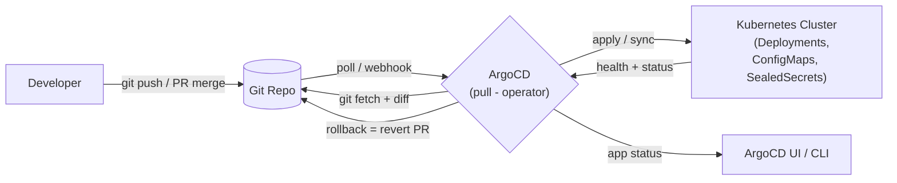

# Day 32: GitOps — ArgoCD & Flux (Declarative Delivery)
📚 Topic 32: GitOps Deep Dive — ArgoCD, Flux & Self-Healing Deployments
✅ Prerequisite-checklist: (review Day 31 Azure lecture if needed)

## Overview | Parichay

Ab k8s pe deploy hone laga, but abhi bhi `kubectl apply -f` manual hai → Git se truth sync nahi rahta. **GitOps** ise reverse karta hai: operator (ArgoCD/Flux) **pull** karta hai Git repo se aur cluster ko desired state pe le jata hai. Deploy = merge a PR. Rollback = revert. Audit = Git history.

## What You'll Learn | Aaj Ki Seekh

- [ ] GitOps principles: declarative + Git + automated sync + feedback
- [ ] ArgoCD install, App/Project, sync, health, rollback
- [ ] Flux: GitRepository + Kustomization
- [ ] Pull vs Push deployment (why GitOps is secure)
- [ ] Multi-env strategies: kustomize overlays, helm values, targeting

## Diagram | Dekho Kaise Kaam Karta Hai



ASCII:
```
Dev --push--> Git Repo --poll--> ArgoCD --sync--> K8s Cluster
                             ^__ health log
Manual kubectl apply = no more. Git is truth.
```

**Pull model advantage:** Cluster ko **Read-Only** credentials milte hain (Can't write any Git); attacker cluster pe compromise kare to bhi Git safe. Push model (CI pe kubectl) me jo token cluster tak pahuncha wo **write access bhi deta hai** — bad.

## Demo | Copy-Paste Karke Chalao

```bash
# 1. Install ArgoCD
kubectl create namespace argocd
kubectl apply -n argocd -f https://raw.githubusercontent.com/argoproj/argo-cd/stable/manifests/install.yaml

# 2. Access UI/CLI
kubectl port-forward svc/argocd-server -n argocd 8080:443
ARGOCD_PASS=$(kubectl -n argocd get secret argocd-initial-admin-secret -o jsonpath="{.data.password}" | base64 -d)
argocd login localhost:8080 --username admin --password "$ARGOCD_PASS" \
  --insecure --grpc-web
echo $ARGOCD_PASS

# 3. App from repo (declarative)
cat > app.yaml << 'EOF'
apiVersion: argoproj.io/v1alpha1
kind: Application
metadata:
  name: myapp-prod
spec:
  project: default
  source:
    repoURL: https://github.com/myorg/gitops-repo
    path: apps/myapp/overlays/prod
    targetRevision: main
    kustomize: {}
  destination:
    server: https://kubernetes.default.svc
    namespace: myapp
  syncPolicy:
    automated:
      prune: true
      selfHeal: true
    syncOptions:
      - CreateNamespace=true
EOF
kubectl apply -f app.yaml

# 4. Urlops: open UI, add apps, watch sync
# 5. Change image in repo → auto-sync (selfHeal) → cluster updates
```

**Sealed Secrets (GitOps me secrets):**
```bash
kubectl apply -f https://github.com/bitnami-labs/sealed-secrets/releases/...
kubeseal --format yaml < secret.yaml > sealed-secret.yaml   # commit encrypted one
```

## Real-Life Example | Industry Me

**DeployTrack (kal kiya tha)** ko GitOps karo — bina login kare auto-deploy:
1. CI builds image → pushes to GHCR/ACR
2. CI updates `tag:` in `apps/deploytrack/overlays/prod/kustomization.yaml` (kustomize edit set image / Kustomization image tags)
3. ArgoCD **sees change → auto-sync** → rolling update
4. Rollback: revert image tag commit → ArgoCD selfHeal wapas le aata hai
5. Audit: har cheez Git history me — compliance ke liye perfect

## Practice Exercise | Abhi Karein

1. ArgoCD install + UI login (port-forward)
2. Ek sample app repo (kustomize) ke 2 environments (dev/prod) banao
3. `app.yaml` + `project.yaml` likh ke apply karo
4. Image tag change karke push — auto sync verify
5. Bad manifest (image missing) — sync failure + selfheal se bachao
6. Rollback practice: revert commit + verify cluster
7. Flux bhi try karo — `<link to Flux docs>`

## Quick Notes | Yaad Rakho

```
- GitOps = declarative desired state in Git + operator syncs cluster
- Pull model (ArgoCD/Flux) — cluster never gets full Git write access
- ArgoCD: Project (rbac) + Application (source→dest) + SyncPolicy (auto+prune+selfHeal)
- Flux: GitRepository (CR) + Kustomization (CR) — different CRs, same idea
- Rollback = revert commit. Audit = git log. Everyone sees everything
- Sealed Secrets / SOPS+age → secrets GitOps-friendly
- Kustomize overlays (dev/prod) = environment targeting
```

**Agla:** Service Mesh — Istio/Linkerd se traffic + security + observability microservices ki.