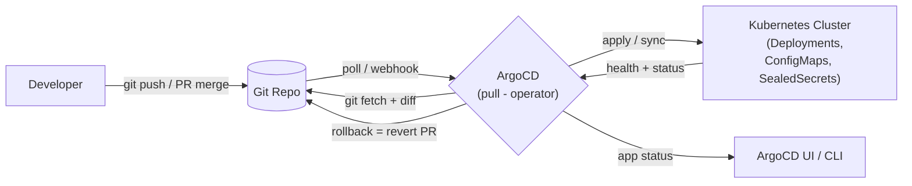

# Day 32: GitOps — ArgoCD & Flux (Declarative Delivery)
📚 Topic 32: GitOps Deep Dive — ArgoCD, Flux & Self-Healing Deployments
✅ Prerequisite-checklist: (review Day 31 Azure lecture if needed)

## Overview | Parichay

Ab k8s pe deploy hone laga, but abhi bhi `kubectl apply -f` manual hai → Git se truth sync nahi rahta. **GitOps** ise reverse karta hai: operator (ArgoCD/Flux) **pull** karta hai Git repo se aur cluster ko desired state pe le jata hai. Deploy = merge a PR. Rollback = revert. Audit = Git history.

### GitOps kya hai — Git hi source of truth

Traditional tarike me `kubectl apply` karke chala gaya — cluster me kya hai, kaunse version ka pod, koi bhi bata nahi sakta. GitOps me **desired state = Git repo**, aur ek operator (ArgoCD/Flux) cluster ko uske saath continuously **sync** karta hai. Fayde: **audit** (`git log` = kya, kaun, kab), **rollback = `git revert`**, **review = PR merge**, **disaster recovery** (repo se sab wapas). Do principles hamesha: sab **declarative** (YAML me, imperative commands nahi) + **automated sync** (insaan ka haath beech me nahi). Line yaad rakho: "If it's not in Git, it doesn't exist."

4 promises yaad rakho:
- **Repeatable** — koi bhi repo clone kar ke cluster bana do (local vs prod diff 1 config)
- **Peer-reviewable** — PR me koi bhi change dikhta hai, merge se pehle
- **Revertible** — bug aaya → `git revert` → wapas (no config archaeology)
- **Auditable forever** — `git log` = compliance/who-did-what ka answer

### Push vs Pull — kyun pull safer hai

Push model me CI ke paas cluster ka `kubectl` credential hota hai — CI compromise hua to cluster khatam. Pull model me **cluster ke andar ka operator** Git ko padhta hai; cluster ke paas sirf **read-only Git access** rehta hai, cluster never writes to Git. Effect: attacker cluster bhi le le to Git change nahi kar sakta — Git safe = recovery possible. Isliye ArgoCD/Flux **pull** karte hain — ye GitOps ka security core hai.

```
Push:   CI --kubectl--> Cluster    (CI token can modify cluster)
Pull:   Operator --read--> Git     (cluster never writes Git)
```

### ArgoCD ka anatomy — Project, Application, SyncPolicy

Teen CRs ka division yaad rakho: **Project** = scoping/RBAC (kaunsa app kis repo ya namespace me chal sakta hai), **Application** = kya kahan (source repo+path → destination cluster+namespace), **SyncPolicy** = kab sync (`automated` + `prune` + `selfHeal`). UI pe app ka diff + health dikhta hai; CLI se `argocd app diff/sync`. Gotcha: `prune: true` risky ho sakta hai agar path galat ho — pehle bina prune ke test karo, phir enable.

Ek cheat-sheet:
- **Project** = kya allowed (repo whitelist, destination namespaces, cluster resources)
- **Application** = source (repoURL+path+branch) → destination (server+namespace)
- **SyncPolicy** = `automated` + `prune` + `selfHeal` (teeno on = full GitOps)

### Flux — same idea, alag CRs

Flux **k8s-native components** se bana hai: **GitRepository** (source define karo) + **Kustomization** (kaunsa path, kitne interval pe apply) + Helm ke liye `HelmRepository`/`HelmRelease`. Argo ek bada app with UI hai, Flux modular toolkit-style controllers hai — dono me philosophy same: **poll Git → diff → apply → report status**. Kab kaunsa: app-by-app tracking + UI chahiye → ArgoCD; pure CR-centric, Git-managed setup chahiye → Flux.

### Self-heal, prune aur rollback — Git hi truth

Teen superpowers: **selfHeal** — kisi ne manually `kubectl edit` kar diya? operator wapas desired state pe le aata hai (drift detect + correct). **prune** — Git se manifest hata diya → cluster me resource bhi delete. **rollback** — `git revert` karo, operator khud cluster wapas le aayega. Yahi "cattle" mentality hai: cluster pe haath mat maro, **ya to Git ko reality match karo, ya Git badlo**. Interview sawal: "manual hotfix laga rakha hai, kya karoge?" → answer: emergency PR + revert drifts, kabhi direct `kubectl apply` nahi.

Drift ke 3 sources:
- **Manual `kubectl edit`** → selfHeal wapas le aata hai (with alert)
- **Operator ne apne aap badla** (HPA/sidecar) → Argo me diff visible, policy decide kare
- **Git me kisi ne badla** → auto-sync runs, rollout hota hai — yahi to desired hai

### Secrets GitOps me — Sealed Secrets aur SOPS

Problem: declarative sab Git me chahiye, par secret plaintext commit nahi kar sakte. Do tareeke: **Sealed Secrets** — public key se `kubeseal` encrypted YAML commit karo, sirf cluster ka controller decrypt karta hai. **SOPS + age** — file ka structure plain, sirf values encrypt rahti hain (diff review easy), sync pe decrypt. Common rule: **encryption key kabhi repo me nahi** (age private key CI/cluster secret me). Ye combo GitOps + security ko compatible banata hai — Day 35 iska deep dive hai.

### Multi-env — kustomize overlays se targeting

Ek base + overlays: `base/` me common manifests, `overlays/dev|prod/` me sirf differences (`replicas`, image tag, resources). `kustomize build overlays/prod` = final YAML. Helm ka version: ek chart + per-env `values-file.yaml`. Dono ka goal same — **1 source of truth, N flavors**, manifests copy-paste mat karo. ArgoCD me har env ka apna Application hota hai (`path: apps/myapp/overlays/prod`) — environment targeting isi se hota hai.

Environment strategy — teen cheezein:
- **dev**: latest branch, koi gate nahi, small replicas (cheap)
- **staging**: main branch + temp data, prod ke jaisa manifests
- **prod**: main + image pin (SHA), approval/health gate, autoscale on

Diff: overlays me keval env-specific cheezein (replicas, resources, image) — base me kabhi env logic nahi.

### Interview angle — GitOps ke 4 principles

Standard frame: **1) declarative desired state in Git, 2) automated apply by software agent, 3) continuous reconciliation (diff + fix), 4) feedback/alerts on drift**. Uske baad push-vs-pull, rollback story, aur secrets handling — ye teen follow-ups hamesha aate hain. Ek closing line perfect: **"Deploy = merge a PR, Rollback = revert a commit, Audit = git log"** — ye 3 words ka frame interview me bawal hai.

## What You'll Learn | Aaj Ki Seekh

- [ ] GitOps principles: declarative + Git + automated sync + feedback
- [ ] ArgoCD install, App/Project, sync, health, rollback
- [ ] Flux: GitRepository + Kustomization
- [ ] Pull vs Push deployment (why GitOps is secure)
- [ ] Multi-env strategies: kustomize overlays, helm values, targeting

## Diagram | Dekho Kaise Kaam Karta Hai



ASCII:
```
Dev --push--> Git Repo --poll--> ArgoCD --sync--> K8s Cluster
                             ^__ health log
Manual kubectl apply = no more. Git is truth.
```

**Pull model advantage:** Cluster ko **Read-Only** credentials milte hain (Can't write any Git); attacker cluster pe compromise kare to bhi Git safe. Push model (CI pe kubectl) me jo token cluster tak pahuncha wo **write access bhi deta hai** — bad.

## Demo | Copy-Paste Karke Chalao

```bash
# 1. Install ArgoCD
kubectl create namespace argocd
kubectl apply -n argocd -f https://raw.githubusercontent.com/argoproj/argo-cd/stable/manifests/install.yaml

# 2. Access UI/CLI
kubectl port-forward svc/argocd-server -n argocd 8080:443
ARGOCD_PASS=$(kubectl -n argocd get secret argocd-initial-admin-secret -o jsonpath="{.data.password}" | base64 -d)
argocd login localhost:8080 --username admin --password "$ARGOCD_PASS" \
  --insecure --grpc-web
echo $ARGOCD_PASS

# 3. App from repo (declarative)
cat > app.yaml << 'EOF'
apiVersion: argoproj.io/v1alpha1
kind: Application
metadata:
  name: myapp-prod
spec:
  project: default
  source:
    repoURL: https://github.com/myorg/gitops-repo
    path: apps/myapp/overlays/prod
    targetRevision: main
    kustomize: {}
  destination:
    server: https://kubernetes.default.svc
    namespace: myapp
  syncPolicy:
    automated:
      prune: true
      selfHeal: true
    syncOptions:
      - CreateNamespace=true
EOF
kubectl apply -f app.yaml

# 4. Urlops: open UI, add apps, watch sync
# 5. Change image in repo → auto-sync (selfHeal) → cluster updates
```

**Sealed Secrets (GitOps me secrets):**
```bash
kubectl apply -f https://github.com/bitnami-labs/sealed-secrets/releases/...
kubeseal --format yaml < secret.yaml > sealed-secret.yaml   # commit encrypted one
```

## Real-Life Example | Industry Me

**DeployTrack (kal kiya tha)** ko GitOps karo — bina login kare auto-deploy:
1. CI builds image → pushes to GHCR/ACR
2. CI updates `tag:` in `apps/deploytrack/overlays/prod/kustomization.yaml` (kustomize edit set image / Kustomization image tags)
3. ArgoCD **sees change → auto-sync** → rolling update
4. Rollback: revert image tag commit → ArgoCD selfHeal wapas le aata hai
5. Audit: har cheez Git history me — compliance ke liye perfect

## Practice Exercise | Abhi Karein

1. ArgoCD install + UI login (port-forward)
2. Ek sample app repo (kustomize) ke 2 environments (dev/prod) banao
3. `app.yaml` + `project.yaml` likh ke apply karo
4. Image tag change karke push — auto sync verify
5. Bad manifest (image missing) — sync failure + selfheal se bachao
6. Rollback practice: revert commit + verify cluster
7. Flux bhi try karo — `<link to Flux docs>`

## Quick Notes | Yaad Rakho

```
- GitOps = declarative desired state in Git + operator syncs cluster
- Pull model (ArgoCD/Flux) — cluster never gets full Git write access
- ArgoCD: Project (rbac) + Application (source→dest) + SyncPolicy (auto+prune+selfHeal)
- Flux: GitRepository (CR) + Kustomization (CR) — different CRs, same idea
- Rollback = revert commit. Audit = git log. Everyone sees everything
- Sealed Secrets / SOPS+age → secrets GitOps-friendly
- Kustomize overlays (dev/prod) = environment targeting
```

**Agla:** Service Mesh — Istio/Linkerd se traffic + security + observability microservices ki.