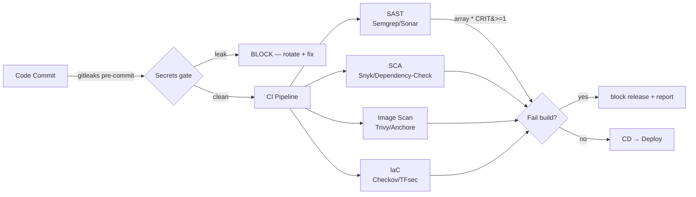

# Day 34: Security Scanning — Trivy, Snyk, SAST/DAST, Secrets in CI

> Security ab pipeline ka **gate**, checklist nahi. Har build me: secrets scan + SAST (code) + SCA (deps) + image scan + IaC scan — fail ho to release block.

## Overview | Parichay

Day 26 me basics ho chuke — ab **production-grade gates**. Security tools ko CI me end-to-end fit karna seekho: gitleaks (secrets), Semgrep/SonarQube (code), Snyk/OWASP-DC (deps), Trivy (images), Checkov (IaC), ZAP (runtime). Ideal state: merge-blocking pipeline jisme "security team = permission to quarantine, not hunt".

### Security ab gate hai — checklist nahi

Purana tarike: security review release se 1 din pehle = blocking + blame-game. Naya: **har build pe automatic gates** — koi tool fail hua to pipeline ruk jaye, aage deploy hi na ho. Fayda: issues **seconds me, CI pe** milte hain, production me nahi. Mental shift: security team "permission to **quarantine**" deti hai, khud hunt nahi karti — developer ko report milti hai, wo fixing cycle me hota hai. Yahi DevSecOps hai: security pipeline ka **and dono ghar ka hissa**, add-on nahi.

### Scanner ki categories — har ek ka alag sawal

| Gate | Sawal | Tool examples |
|------|-------|---------------|
| Secrets | Kya koi key/token code me hai | gitleaks, pre-commit hooks |
| SAST | Code me injection/weak logic? | Semgrep, SonarQube, Bandit |
| SCA | Dependency me known CVE? | Snyk, OWASP Dependency-Check, `trivy fs` |
| Image | Image packages me CVE? | Trivy, Grype |
| IaC | Infra config insecure/expensive? | Checkov, tfsec |
| DAST | Running app exploit-able? | OWASP ZAP, Nikto |

DAST ko chhod ke sab **static/source-level** hain; DAST **deployed instance** pe chalta hai (staging URL) isliye test stage me — unit tests ke saath nahi.

Ek hi commit pe kitne gates chalti hain — order aur tool sab:
- Push se pehle: **gitleaks pre-commit** (developer ke machine pe)
- PR merge pe: **SAST + SCA + IaC scan** (merge-blocking stage)
- Build ke baad: **image Trivy + SBOM/syft** (release-blocking)
- Staging deploy pe: **ZAP baseline** (runtime/DAST)

### Secrets gate — pehla aur sabse sasta

Sabse bura leak: git history me AWS key — history se delete karna mushkil, **rotation mandatory**. `gitleaks detect --exit-code 1` pre-commit + CI dono jagah chalao. Gotcha 1: secret **history me ek baar gaya** to find+delete se kaam nahi — rotate/revoke karo. Gotcha 2: false positives aate hain to `baseline` me note karo, scan **disable kabhi mat karo**. Ye gate sabse fast hai (pattern match) aur sabse zyada ROI deta hai — kyunki leaked-secret hi sabse common breach ka entry point hai.

Secrets gate ki teen jagah:
- **Pre-commit hook** — developer ke machine pe, commit se pehle fail
- **CI stage** — `gitleaks detect --exit-code 1` (ye bhi merge-blocking)
- **GitHub push protection** — `AKIA...` jaise known patterns server-pe block

### SAST/SCA — power aur limits

SAST = code ka flow padhta hai (SQL injection, weak crypto, hardcoded values) — problem: **false positives** (isliye `--severity ERROR` filter). SCA = lock files (`requirements.txt`, `package-lock.json`) ko CVE database se match karta hai — Log4Shell jaise mass vulnerabilities minutes me pakde gaye isi se. Limit yaad rakho: SCA sirf **known CVEs** batata hai (zero-day nahi); SAST runtime behavior prove nahi karta — isliye ek tool ka green badge = secure nahi, **layers** chahiye.

### Image scan — base image ka khel

`trivy image myapp:1.0.0` — par triage zaroori: **HIGH/CRITICAL** ke liye block karo, `--ignore-unfixed` (patch available nahi) wale hatao, aur zyada fixes ka rasta **base image upgrade** hai (Dockerfile me `ubuntu:22.04` vs `distroless` — CVE count me 100x fark aata hai). Pro tip: sirf final image nahi, **build-time files** bhi scan karo (`trivy fs .`) — secrets aur old config pehle hi pakdo. `--exit-code 1` hi CI ka roka hua darwaza hai.

Image scan ka triage flow:
- `HIGH/CRITICAL` + **fix available** → block (fix base image ya package pin)
- `HIGH/CRITICAL` + **unfixed** → `--ignore-unfixed` (documented risk, patch raste bana)
- LOW/MEDIUM → backlog, team decide per-quarter

Yahi "severity + fixability" filter hai jo golden risk-free release deta hai.

### IaC scan — infra pe bhi gate

Terraform me galatiyan: public storage, `0.0.0.0/0` SSH, wildcard IAM, missing encryption — sab apply se **pehle** `checkov -d .` / tfsec pakad sakte hain. Pro move: `terraform plan -o plan.json` pe bhi scan — kyunki **module output/dynamic values** static `.tf` me chhup sakte hain. Azure registry pe `az acr scan` = runtime registry-level check. Rule: IaC bhi merge-blocking gate — warna insecure infra drift ho jata hai, aur "ye to chal raha hai" wali lazy-minded pain bharta hai.

Temporary skip tabhi allowed hai jab:
- False positive ho (double-read karke confirm kiya)
- Fix plan documented + ticket linked
- Time-bound (30-90 din) — expiry ke baad re-check confirm karo

Kabhi `skip` bina reason + owner ke nahi — ye policy discipline hi to hai.

### Waiver, triage aur gotchas — noise se bache

Bina triage ke sabko block karo to team manual work me dobo jayegi — par **silently disable = anti-pattern**. Sahi workflow: report dashboard pe (sirf CI logs me nahi), **waiver = owner + reason + expiry (30-90 din)**, tracked. Noise kam karne ke tareeke: severity threshold (`HIGH,CRITICAL`), `--ignore-unfixed`, team-specific rules — coverage kam mat karo, workflow better karo. Interview line: "alert fatigue ka solution threshold+waiver-with-expiry+owned reports hai, gate off karna nahi."

### Interview angle — DevSecOps flow bolo

"CI me security kaise laoge?" ka frame: **commit pe secrets gate → code pe SAST → deps pe SCA → image pe Trivy + SBOM → infra pe Checkov → staging pe DAST → koi HIGH+CRITICAL → release block + report**. Sath me bolo: `--exit-code 1` se pipelines fail karta hai, waivers tracked hain, aur reports dashboards pe jaate hain. Ye full-flow answer hi batata hai ki tum tools ko alag se nahi, **pipeline ke parts ki tarah** sochte ho.

## What You'll Learn | Aaj Ki Seekh

- [ ] SAST/SCA/DAST categories + kab kya
- [ ] gitleaks secret gate (commit + CI)
- [ ] Semgrep rules — bug categories (injection, crypto, auth)
- [ ] Snyk/OWASP dependency check — lock files
- [ ] Trivy image gate + severity/cause triage
- [ ] IaC scan (Checkov) pe plan-file bhi
- [ ] Report & waiver workflow (never disable silently)

## Diagram | Dekho Kaise Kaam Karta Hai



ASCII:
```
gitleaks (commit) → CI: semgrep + trivy fs + trivy image + checkov
                    → gate: HIGH/CRITICAL count = 0 → allow release
                    → report + waivers tracked, alerts to Slack
```

## Demo | Copy-Paste Karke Chalao

```bash
# 1. Secrets gate — gitleaks (CI)
gitleaks detect --source . --verbose --exit-code 1

# 2. SAST — Semgrep (community rules auto)
semgrep scan --config auto --error --severity ERROR

# 3. SCA — Snyk (needs token) ya OWASP DC (free, no signup)
snyk test --all-projects --severity-threshold=high
owasp-dependency-check --scan . --format HTML --out reports/dc.html

# 4. Image scan — Trivy
trivy image --severity HIGH,CRITICAL --exit-code 1 --ignore-unfixed myapp:1.0.0

# 5. IaC scan — Checkov
checkov -d . --framework terraform --quiet --compact --soft-fail
# CLI variant:
az acr scan --repository myapp --image 1.0.0   # Azure Container Registry Defender

# 6. DAST — ZAP (deployed env, not unit tests)
docker run -t ghcr.io/zaproxy/zaproxy zap-baseline.py \
  -t https://staging.example.com -r report.html
```

**Pipeline policy idea (az pipeline `checkpoint` style):**
```yaml
- stage: Security
  jobs:
    - job: secrets  ; steps: [ gitleaks --exit-code 1 ]
    - job: sast     ; steps: [ semgrep --error ]
    - job: sca      ; steps: [ trivy fs . --severity HIGH,CRITICAL --exit-code 1 ]
    - job: images   ; steps: [ trivy image ... --exit-code 1 ; syft ... ]
    - job: iac      ; steps: [ checkov -d . ]
  displayName: Security gates (merge-blocking)
```

## Real-Life Example | Industry Me

**Log4Shell (Dec 2021) — CVE-2021-44228:**
1. Log4j ≤2.14 me RCE by JNDI lookup string
2. Bina SCA wale teams ne **days** me manually inventory banaya; SCA teams ne **minutes** me: `trivy fs . --match-name log4j` → report → affected repo list
3. Lesson: SCA = "pata hai kya vulnerable hai" — SBOM + CVE DB — rapidly attributable

**Hardcoded AWS key leak scenario:**
```
.gha YAML me AKIA... commit → gitleaks (push protection) blocks
→ developer: revoke key + configure secret (Key Vault/secret manager) → re-push (clean)
```
**Key rotation must be automatic** — leaked keys ka maalum ho hi gaye ho tab bhi.

## Practice Exercise | Abhi Karein

1. gitleaks: ek fake `.env` repo banake `--exit-code 1` BLOCK hone do
2. Semgrep: deliberately weak code (`raw_input` + concat SQL) — scan me find
3. Trivy: `ubuntu:22.04` vs `distroless` CVE count compare
4. Checkov: `azurerm_storage_account` with `allow_blob_public_access = true` — scan fail
5. ZAP baseline staging URL pe run — report page human-readable banao
6. SBOM: `syft` output SPDX → compare package list with scan results

## Quick Notes | Yaad Rakho

```
- 4 gates: secrets / SAST / SCA / image+IaC → any HIGH+ CRITICAL → block release
- --exit-code 1 = CI failure control (Trivy/Semgrep/Checkov)
- Secrets: gitleaks pre-commit + push protection — never disable
- Base-image CVEs: use distroless + --ignore-unfixed instead of massive allowlists
- Sign + SBOM (syft/cosign) → supply-chain evidence
- Waivers: team-owner approved, expiry 30-90 days, tracked — silent disable = anti-pattern
- Reports go to dashboards (Defender/CrowdStrike/SLIDES) — not just logs
```

**Agla:** Secrets Management — Vault, SOPS, External Secrets Operator (ESO).