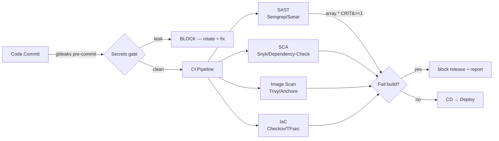

# Day 34: Security Scanning — Trivy, Snyk, SAST/DAST, Secrets in CI

> Security ab pipeline ka **gate**, checklist nahi. Har build me: secrets scan + SAST (code) + SCA (deps) + image scan + IaC scan — fail ho to release block.

## Overview | Parichay

Day 26 me basics ho chuke — ab **production-grade gates**. Security tools ko CI me end-to-end fit karna seekho: gitleaks (secrets), Semgrep/SonarQube (code), Snyk/OWASP-DC (deps), Trivy (images), Checkov (IaC), ZAP (runtime). Ideal state: merge-blocking pipeline jisme "security team = permission to quarantine, not hunt".

## What You'll Learn | Aaj Ki Seekh

- [ ] SAST/SCA/DAST categories + kab kya
- [ ] gitleaks secret gate (commit + CI)
- [ ] Semgrep rules — bug categories (injection, crypto, auth)
- [ ] Snyk/OWASP dependency check — lock files
- [ ] Trivy image gate + severity/cause triage
- [ ] IaC scan (Checkov) pe plan-file bhi
- [ ] Report & waiver workflow (never disable silently)

## Diagram | Dekho Kaise Kaam Karta Hai



ASCII:
```
gitleaks (commit) → CI: semgrep + trivy fs + trivy image + checkov
                    → gate: HIGH/CRITICAL count = 0 → allow release
                    → report + waivers tracked, alerts to Slack
```

## Demo | Copy-Paste Karke Chalao

```bash
# 1. Secrets gate — gitleaks (CI)
gitleaks detect --source . --verbose --exit-code 1

# 2. SAST — Semgrep (community rules auto)
semgrep scan --config auto --error --severity ERROR

# 3. SCA — Snyk (needs token) ya OWASP DC (free, no signup)
snyk test --all-projects --severity-threshold=high
owasp-dependency-check --scan . --format HTML --out reports/dc.html

# 4. Image scan — Trivy
trivy image --severity HIGH,CRITICAL --exit-code 1 --ignore-unfixed myapp:1.0.0

# 5. IaC scan — Checkov
checkov -d . --framework terraform --quiet --compact --soft-fail
# CLI variant:
az acr scan --repository myapp --image 1.0.0   # Azure Container Registry Defender

# 6. DAST — ZAP (deployed env, not unit tests)
docker run -t ghcr.io/zaproxy/zaproxy zap-baseline.py \
  -t https://staging.example.com -r report.html
```

**Pipeline policy idea (az pipeline `checkpoint` style):**
```yaml
- stage: Security
  jobs:
    - job: secrets  ; steps: [ gitleaks --exit-code 1 ]
    - job: sast     ; steps: [ semgrep --error ]
    - job: sca      ; steps: [ trivy fs . --severity HIGH,CRITICAL --exit-code 1 ]
    - job: images   ; steps: [ trivy image ... --exit-code 1 ; syft ... ]
    - job: iac      ; steps: [ checkov -d . ]
  displayName: Security gates (merge-blocking)
```

## Real-Life Example | Industry Me

**Log4Shell (Dec 2021) — CVE-2021-44228:**
1. Log4j ≤2.14 me RCE by JNDI lookup string
2. Bina SCA wale teams ne **days** me manually inventory banaya; SCA teams ne **minutes** me: `trivy fs . --match-name log4j` → report → affected repo list
3. Lesson: SCA = "pata hai kya vulnerable hai" — SBOM + CVE DB — rapidly attributable

**Hardcoded AWS key leak scenario:**
```
.gha YAML me AKIA... commit → gitleaks (push protection) blocks
→ developer: revoke key + configure secret (Key Vault/secret manager) → re-push (clean)
```
**Key rotation must be automatic** — leaked keys ka maalum ho hi gaye ho tab bhi.

## Practice Exercise | Abhi Karein

1. gitleaks: ek fake `.env` repo banake `--exit-code 1` BLOCK hone do
2. Semgrep: deliberately weak code (`raw_input` + concat SQL) — scan me find
3. Trivy: `ubuntu:22.04` vs `distroless` CVE count compare
4. Checkov: `azurerm_storage_account` with `allow_blob_public_access = true` — scan fail
5. ZAP baseline staging URL pe run — report page human-readable banao
6. SBOM: `syft` output SPDX → compare package list with scan results

## Quick Notes | Yaad Rakho

```
- 4 gates: secrets / SAST / SCA / image+IaC → any HIGH+ CRITICAL → block release
- --exit-code 1 = CI failure control (Trivy/Semgrep/Checkov)
- Secrets: gitleaks pre-commit + push protection — never disable
- Base-image CVEs: use distroless + --ignore-unfixed instead of massive allowlists
- Sign + SBOM (syft/cosign) → supply-chain evidence
- Waivers: team-owner approved, expiry 30-90 days, tracked — silent disable = anti-pattern
- Reports go to dashboards (Defender/CrowdStrike/SLIDES) — not just logs
```

**Agla:** Secrets Management — Vault, SOPS, External Secrets Operator (ESO).