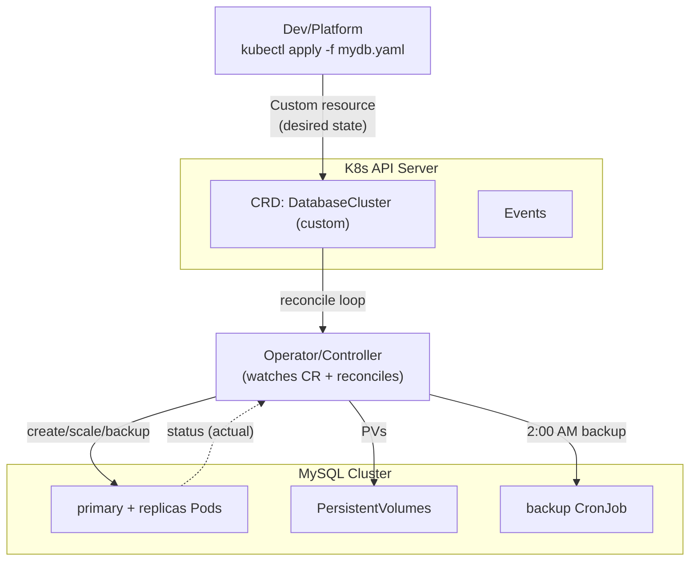

# Day 36: Kubernetes Advanced — Operators, CRDs, RBAC, Autoscaling, Multi-cluster

> Day 18-20 basics the. Ab: **production-grade K8s** — RBAC security, custom resources (CRD + controller/Operator), HPA/VPA/KEDA, multi-cluster, and cluster hardening.

## Overview | Parichay

K8s ka asli power "controller pattern" me hai — API dekh kar desired-to-actual sync karta hai. **CRD + Operator** = aapka apna controller for app-specific logic (database backup at 2am, app scaling, monitoring). RBAC = "kiski kya daya in cluster". Autoscaling = HPA (replicas) + VPA (resources) + KEDA (events like Queue length).

## What You'll Learn | Aaj Ki Seekh

- [ ] RBAC: ServiceAccount, Role/RoleBinding (namespaced) vs ClusterRole (cluster)
- [ ] CRD: custom API + versioning; **Operator** = CRD + controller
- [ ] HPA (CPU/memory + custom metrics), VPA, KEDA (event-driven)
- [ ] Security hardening: PSP→Pod Security Admission, NetworkPolicy, seccomp/apparmor
- [ ] Multi-cluster: federation, ArgoCD multi-dest, GitOps hub-spoke
- [ ] kubectl debugging toolkit (describe/events/logs/exec/top)

## Diagram | Dekho Kaise Kaam Karta Hai



ASCII:
```
kubectl apply mydb.yaml → API (CRD) → Operator reconcile → mysql pods + PVs + backups
Controller pattern: "watch desired → act → report status"
```

## Demo | Copy-Paste Karke Chalao

```bash
# 1. RBAC — minimal app serviceaccount
kubectl create namespace myapp
kubectl create serviceaccount deployer -n myapp
cat > rbac.yaml << 'EOF'
apiVersion: rbac.authorization.k8s.io/v1
kind: Role
metadata: { name: app-manager, namespace: myapp }
rules:
  - apiGroups: ["", "apps", "batch"]
    resources: ["pods", "deployments", "services", "configmaps", "jobs"]
    verbs: ["get", "list", "watch", "create", "update", "patch", "delete"]
---

