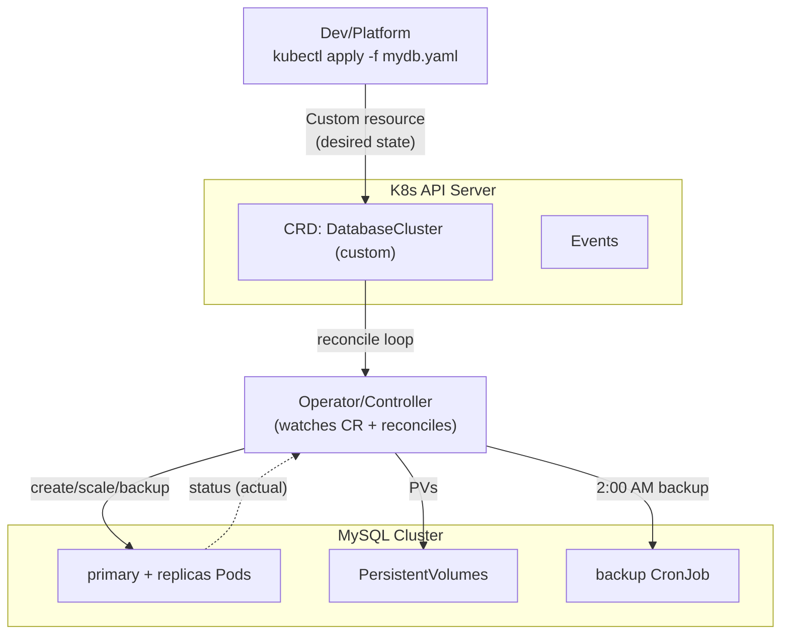

# Day 36: Kubernetes Advanced — Operators, CRDs, RBAC, Autoscaling, Multi-cluster

> Day 18-20 basics the. Ab: **production-grade K8s** — RBAC security, custom resources (CRD + controller/Operator), HPA/VPA/KEDA, multi-cluster, and cluster hardening.

## Overview | Parichay

K8s ka asli power "controller pattern" me hai — API dekh kar desired-to-actual sync karta hai. **CRD + Operator** = aapka apna controller for app-specific logic (database backup at 2am, app scaling, monitoring). RBAC = "kiski kya daya in cluster". Autoscaling = HPA (replicas) + VPA (resources) + KEDA (events like Queue length).

### Controller pattern — K8s ka dil

Har K8s feature isi ek pattern pe chalta hai: **watch desired state → compare actual → act → report status**. Deployment controller, ReplicaSet, node autoscaler — sab yahi reconcile loop. **Operator** = wahi pattern **aapke application** ke liye. Socho: aapne `DatabaseCluster` custom resource (CR) likha → operator ne dekha → primary + replica pods banaye, PVC attach, backup CronJob schedule kiya — sab **declaratively**, manual `kubectl` commands ke bina. Rule yaad rakho: controllers **idempotent** hone chahiye — loop 100 baar chale to bhi same safe result.

Isi pattern pe har cheez hai:
- **Deployment controller** — desired replicas maintain karta hai
- **Node auto-scaler** — nodes up/down on demand
- **cert-manager** — certificate CR dekh ke renew karta hai
- **Custom operator** — aapka business logic wali `Reconcile`

### CRD + Operator — apna custom API

**CRD** = API server pe naya resource type register karo (fir `kubectl get mydb` kaam karega), **custom resource** = uska YAML instance, **Operator** = CR ko dekhne wala controller binary. Real use cases: DB provisioning (Postgres operator), **cert-manager** (TLS certs auto), backup scheduler — jab "ek YAML se complex lifecycle chahiye". Banana seekhne ke liye **kubebuilder / operator-sdk** templates use karo (`Reconcile()` function + status + conditions). Caution: Operator = production code — iska bhi testing, observability, versioning chahiye.

### RBAC — kiski kya permission

4 building blocks: **ServiceAccount** (pod ka identity), **Role + RoleBinding** (namespace-scope), **ClusterRole + ClusterRoleBinding** (cluster-scope — nodes, PersistentVolumes jaise), aur rules = apiGroups + resources + verbs (`get/list/watch/create/update/delete`). Golden rules: **least privilege** + apps ke liye default SA kabhi mat use karo (har namespace ka apna SA banao). Gotcha: RoleBinding se ClusterRole ko **kisi ek namespace tak scope** kar sakte ho — yahi "namespace admin" ka pattern hai. Debug: `kubectl auth can-i delete pods -n prod --as=system:serviceaccount:myapp:deployer`.

RBAC ke 3 rules yaad rakho:
- **Har pod ka apna ServiceAccount** — default SA kabhi mat use karo
- **Least privilege** — dev ko `get/list/watch` do, create/delete na do
- **ClusterRole + namespace-scope** — user concept me cluster-wide kabhi nahi

### Autoscaling — HPA, VPA, KEDA teen alag kaam

**HPA**: replicas up/down based on CPU/memory ya **custom metrics** (Prometheus adapter se — QPS pe scale). **VPA**: pod ke requests/limits automatically adjust (Recommendation mode safe hai; CPU-based HPA ke saath directly conflict ho sakta hai). **KEDA**: **event-driven** scalers — queue length (Azure Service Bus, Kafka, RabbitMQ), cron schedule — 0 tak bhi scale down karta hai (idle = zero cost). Frame: "traffic badha" → HPA; "galat sizing likh rakha hai" → VPA; "queue backlog ho raha hai" → KEDA.

Autoscale placement — teeno ko saath bhi use kar sakte ho:
- **HPA** custom metric adapter se (Prometheus adapter) — QPS-pe scale
- **VPA** `UpdateMode: Off` pehle (recommendation dekh lo) phir `Auto`
- **KEDA** se 0-to-N — queue empty hai to pod hi nahi, cost 0

### Security hardening — PSP se PSA tak

Purana **PodSecurityPolicy** deprecated — ab **Pod Security Admission** labels se: `privileged` / `baseline` / `restricted` per namespace (pod ko restrict karo to `restricted` enforce). Saath me: **NetworkPolicy** (K8s default-open hai — deny-all + allowlist ye sabse bada win hai), **seccomp/AppArmor** profiles, aur **non-root** container image. Safe order: pehle **Audit mode** (logs check), fir namespace-by-namespace enforce. Ye sab Day 37 ke policy-as-code ke saath naturally jaata hai.

Hardening ladder (chhota to bada):
- Pod non-root + read-only rootfs
- **NetworkPolicy** deny-all + allowlist (sabse bada security win)
- Namespace labels me `pod-security.kubernetes.io/enforce: restricted`
- seccomp profile + AppArmor for untrusted workloads

### Multi-cluster — kab zaroorat hai

Triggers: multiple regions (latency/data residency), environment/tenant isolation, scale limits. Patterns: **independent clusters + GitOps hub** (ArgoCD multi-destination, spoke clusters pe read-only creds) aur abke trend me **Cluster API / vCluster** abstraction. Par interview/hiring me divider: 3 clusters se pehle poochho — **"kya single cluster me isolation (namespaces + NetworkPolicy) nahi chalega?"**. Zyada teams multi-cluster me avoidable complexity lekar jaati hain; GitOps + consistent manifests se hatana easiest hai.

Multi-cluster ke 3 patterns:
- **Hub-spoke GitOps** — central ArgoCD, spoke clusters pe read-only operator
- **Tenant isolation** — dev/stage/prod alag clusters, alag creds + policy
- **Disaster recovery** — active/standby clusters, same Git source of truth

### Debugging toolkit — kubectl se kya kholo

Order muscle-memory: `get` (kya hai) → `describe` (events — 80% cause yahin) → `logs --previous` (crash attempt) → `exec` (andar ka check) → `top` (resources) → `get events --sort-by=.lastTimestamp`. Painful cases: **CrashLoopBackOff** = `logs --previous` + liveness/readiness config; **Pending** = `describe` (scheduling — resources/PV/taints); **ImagePullBackOff** = tag/registry creds. Ye debug sense live interview rounds me aur production incidents me dono jagah kaam aati hai.

## What You'll Learn | Aaj Ki Seekh

- [ ] RBAC: ServiceAccount, Role/RoleBinding (namespaced) vs ClusterRole (cluster)
- [ ] CRD: custom API + versioning; **Operator** = CRD + controller
- [ ] HPA (CPU/memory + custom metrics), VPA, KEDA (event-driven)
- [ ] Security hardening: PSP→Pod Security Admission, NetworkPolicy, seccomp/apparmor
- [ ] Multi-cluster: federation, ArgoCD multi-dest, GitOps hub-spoke
- [ ] kubectl debugging toolkit (describe/events/logs/exec/top)

## Diagram | Dekho Kaise Kaam Karta Hai



ASCII:
```
kubectl apply mydb.yaml → API (CRD) → Operator reconcile → mysql pods + PVs + backups
Controller pattern: "watch desired → act → report status"
```

## Demo | Copy-Paste Karke Chalao

```bash
# 1. RBAC — minimal app serviceaccount
kubectl create namespace myapp
kubectl create serviceaccount deployer -n myapp
cat > rbac.yaml << 'EOF'
apiVersion: rbac.authorization.k8s.io/v1
kind: Role
metadata: { name: app-manager, namespace: myapp }
rules:
  - apiGroups: ["", "apps", "batch"]
    resources: ["pods", "deployments", "services", "configmaps", "jobs"]
    verbs: ["get", "list", "watch", "create", "update", "patch", "delete"]
---

