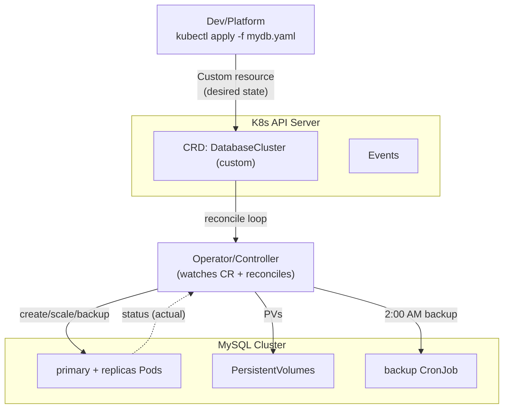

# Day 36: Kubernetes Advanced — Operators, CRDs, RBAC, Autoscaling, Multi-cluster

> Day 18-20 basics the. Ab: **production-grade K8s** — RBAC security, custom resources (CRD + controller/Operator), HPA/VPA/KEDA, multi-cluster, and cluster hardening.

## Overview | Parichay

K8s ka asli power "controller pattern" me hai — API dekh kar desired-to-actual sync karta hai. **CRD + Operator** = aapka apna controller for app-specific logic (database backup at 2am, app scaling, monitoring). RBAC = "kiski kya daya in cluster". Autoscaling = HPA (replicas) + VPA (resources) + KEDA (events like Queue length).

## What You'll Learn | Aaj Ki Seekh

- [ ] RBAC: ServiceAccount, Role/RoleBinding (namespaced) vs ClusterRole (cluster)
- [ ] CRD: custom API + versioning; **Operator** = CRD + controller
- [ ] HPA (CPU/memory + custom metrics), VPA, KEDA (event-driven)
- [ ] Security hardening: PSP→Pod Security Admission, NetworkPolicy, seccomp/apparmor
- [ ] Multi-cluster: federation, ArgoCD multi-dest, GitOps hub-spoke
- [ ] kubectl debugging toolkit (describe/events/logs/exec/top)

## Diagram | Dekho Kaise Kaam Karta Hai



ASCII:
```
kubectl apply mydb.yaml → API (CRD) → Operator reconcile → mysql pods + PVs + backups
Controller pattern: "watch desired → act → report status"
```

## Demo | Copy-Paste Karke Chalao

```bash
# 1. RBAC — minimal app serviceaccount
kubectl create namespace myapp
kubectl create serviceaccount deployer -n myapp
cat > rbac.yaml << 'EOF'
apiVersion: rbac.authorization.k8s.io/v1
kind: Role
metadata: { name: app-manager, namespace: myapp }
rules:
  - apiGroups: ["", "apps", "batch"]
    resources: ["pods", "deployments", "services", "configmaps", "jobs"]
    verbs: ["get", "list", "watch", "create", "update", "patch", "delete"]
---
apiVersion: rbac.authorization.k8s.io/v1
kind: RoleBinding
metadata: { name: app-manager-bind, namespace: myapp }
subjects:
  - kind: ServiceAccount
    name: deployer
    namespace: myapp
roleRef:
  kind: Role
  name: app-manager
  apiGroup: rbac.authorization.k8s.io
EOF
kubectl apply -f rbac.yaml
kubectl auth can-i create deployment -n myapp --as system:serviceaccount:myapp:deployer # yes
kubectl auth can-i list secrets --as system:serviceaccount:myapp:deployer               # no

# 2. CRD
cat > crd.yaml << 'EOF'
apiVersion: apiextensions.k8s.io/v1
kind: CustomResourceDefinition
metadata: { name: databases.sample.devops.io }
spec:
  group: sample.devops.io
  versions:
    - name: v1
      served: true
      storage: true
      schema:
        openAPIV3Schema:
          type: object
          properties:
            spec:
              type: object
              properties:
                engine: { type: string }
                replicas: { type: integer, minimum: 1 }
  scope: Namespaced
  names: { plural: databases, singular: database, kind: Database, shortNames: [db] }
EOF
kubectl apply -f crd.yaml
kubectl apply -f - << 'EOF'
apiVersion: sample.devops.io/v1
kind: Database
metadata: { name: mydb }
spec: { engine: postgres, replicas: 3 }
EOF
kubectl get db mydb -o yaml   # custom resource visible! (operator would act on it)

# 3. HPA
kubectl autoscale deployment myapp --cpu-percent=70 --min=2 --max=10
kubectl get hpa -w
# load: kubectl run -i --tty load-generator --rm --image=busybox \
#   -- sh -c "while true; do wget -q -O- http://myapp; done"

# 4. KEDA (event-driven: queue len scales)
kubectl apply -f https://github.com/kedacore/keda/releases/.../keda.yaml
cat > scaled.yaml << 'EOF'
apiVersion: keda.sh/v1alpha1
kind: ScaledObject
metadata: { name: my-scaledobject }
spec:
  scaleTargetRef: { name: myapp }
  triggers:
    - type: azure-queue
      metadata:
        queueLength: "10"
        connectionFromEnv: AZURE_STORAGE_CONN_STRING
EOF

# 5. Pod Security (replace PSP)
kubectl label ns myapp pod-security.kubernetes.io/enforce=restricted
```

## Real-Life Example | Industry Me

**Operator in the wild — everyone runs them:**
| Operator | Kya karta hai |
|----------|---------------|
| cert-manager | Manages certs (Let's Encrypt) + renew |
| Prometheus Operator | Manages Prometheis + ServiceMonitors |
| Crossplane | Manage cloud infra (Azure/AWS/GCP) from K8s API |
| PostgreSQL Operator (CNPG) | DB clusters, backups, failover |
| Argo CD / Flux | GitOps reconciliation |
| KubeVirt | VMs as Pods |

**Exactly how Petclinic/DemoD multiple clouds:** crossplane ProviderConfig → `Applications` as CRs → GitOps → same UI everywhere.

**Security hardening checklist (real clusters):**
```
✓ kube-bench scan isolate etcd, RBAC default Policy
✓ Pod Security: restricted for control plane, baseline for rest
✓ NetworkPolicy: default-deny namespaces
✓ seccomp/AppArmor on critical workloads
✓ OIDC for humans + workload identity for apps
✓ Enable audit logs → SIEM (Sentinel) + Threat detection (Microsoft Defender for Containers)
```

## Practice Exercise | Abhi Karein

1. RBAC: full demo above — can-i checks verify permissions
2. CRD banao (Database) + `kubectl get db` — operator samjho (sirf demonstrates API)
3. ApacheBench/hay load → HPA scale-up + scale-down observe
4. KEDA ScaledObject (azure-queue or prometheus trigger) → event-driven scale
5. NetworkPolicy: allow only frontend→backend; ping-frontend to backend — BLOCKED verify
6. Pod Security restricted label → `kubectl run privileged` rejected
7. Kube-bench run over your cluster (`--targets node,controlplane`)

## Quick Notes | Yaad Rakho

```
- RBAC = who can do what; least-privilege: ServiceAccount + Role/RoleBinding
- Namespace scoped = Role; cluster-wide = ClusterRole (auditor, node-admin)
- CRD = new API (your types); Operator = CRD + controller loop (reconcile)
- Popular operators: cert-manager, Prometheus, Crossplane, CNPG, Argo/Flux, KEDA
- HPA = replicas by CPU/mem/custom; VPA = adjust requests; KEDA = events (queue len)
- PSP removed → Pod Security Admission (labels on ns) + Kyverno/OPA for policy
- NetworkPolicy = default deny + explicit allow; seccomp/apparmor = runtime hardening
- Kube-bench = CIS benchmark check; audit logs → SIEM
- Multi-cluster: GitOps single pane (ArgoCD multi-application), cluster fleet mgmt
```

**Agla:** Policy as Code — OPA (Rego) + Kyverno, admission control.