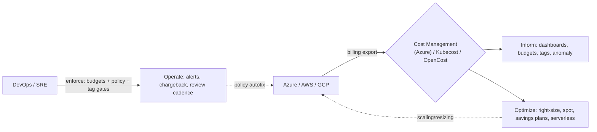

# Day 39: FinOps & Cloud Cost Optimization — Kubecost, Azure Cost Management

> Cloud spend ab DEVICE par defend manage hota hai. FinOps = "finance + operations" — **visibility → allocation → optimization → enforcement** — shared accountability for cloud cost. Kubecost = k8s-native cost, Azure Cost Mgmt = Azure spend.

## Overview | Parichay

Sab resources free nahi — Azure/AWS/GCP ka bill Bada hota hai. FinOps hai cloud economics ka **operating model**: 
1. **Ensure visibility** — everyone sees cost per team/app/env
2. **Optimize** — right-size, spot/scale, autoscale, savings plans/reserved instances
3. **Operate** — budgets + alerts + chargeback/showback + committees (FinOps Practitioners)
4. **Anomaly/Multi-cloud** — centralized FinOps center (Azure FinOps hubbing), controls & policies

Tools: **Azure Cost Management + Billing** (native), **Kubecost** (k8s per-pod cost), CloudHealth/Cloudability (enterprise), OpenCost (open standard), FinOps hub in Azure (export to ADL/log analytics).

### FinOps kya hai — cloud ka hisaab-kitaab

**FinOps** matlab "Finance + Operations" — cloud kharche ko ek chalane wale business process ki tarah treat karna, koi ek-time audit nahi. Puri duniya me cloud bill har saal badhta hai kyunki resource banane me 2 minute lagta hai lekin delete karne me kisi ko yaad hi nahi rehta. FinOps ka core idea hai ki **cost ek product metric hai**, sirf finance team ka kaam nahi — engineers, product, finance sab milke dekhte hain. Iska rhythm ek cycle hai: **Inform** (dikhao kisne kitna kharcha kiya) → **Optimize** (kam karo bina feature roke) → **Operate** (policy + budget se rok lo aage). Jaise DevOps me "deploy = code", FinOps me "every resource = money line item". Chhota sa analogy: cloud bill waise hi hai jaise electricity bill — AC chalu rakho to bill fat-ta hai, isliye AC ka thermostat (autoscale) set karna zaroori hai.

### Inform phase — visibility pehle, savings baad me

Bina **visibility** ke koi bhi saving guess-work hai. Pehle sawal: "ye $10k bill me se team-platform ka kitna, team-data ka kitna?" Iska jawab tabhi mile jab har resource pe **tags** lage hon — `env=prod`, `team=payments`, `owner=rahul`. Azure Cost Management me **cost analysis** ko tag ke hisaab se group karo, phir pata chalega ki staging cluster prod se zyada chal raha hai. Doosra tool: **anomaly detection** — bill achanak 140% uchhal gaya to alert. Teesra: **shared views** — har team ko apna dashboard, taaki wo khud dekhe. Golden rule: "you can't optimize what you can't see" — pehle dekho, phir kaato. Tags bina allocation impossible hai, isliye tag policy (missing tag = deny) governance ka first step hai.

### Optimize — right-sizing, spot, reserved ka farak

Saving ke teen bade levers hain. **Right-sizing**: zyadatar VMs/pods 80% idle chalte hain — requests `cpu=2` rakhe lein actual usage `200m` hai to double paisa barbaad. Kubecost/Cost Management ki "savings insights" se dekho aur size match karo (vertical) ya replicas kam karo (scale-in). **Spot/Preemptible**: batch, stateless, fault-tolerant kaam ke liye — up to ~90% discount, par cloud kabhi bhi chheen sakta hai (eviction), isliye kabhi critical path pe mat lagao. **Reserved/Savings Plans**: 1-3 saal ka commitment = steady discount (40-72%) — ye tab lo jab workload predictable ho, spiky workload pe PAYG hi sahi. Mix strategy: base load = reserved, spike = on-demand, batch = spot.

| Lever | Kab use karo | Save | Risk |
|---|---|---|---|
| Right-size | hamesha (hygiene) | 30-60% | kam se kam karo, SLO check |
| Spot | batch/stateless | up to ~90% | eviction (tolerate karo) |
| Reserved/Plan | steady 24x7 | 40-72% | commitment 1-3y |
| Serverless/PAAS | bursty, low QPS | huge | cold start, limits |

### Operate — budgets, alerts, chargeback/showback

Optimization ek baar ki cheez nahi — **operate** phase me roz chalti hai. **Budget** banao (monthly $100) aur **alerts** lagao 50/80/100% pe — forecast alert (month end tak 120% jayega) sabse pehle chahiye. **Showback** = teams ko sirf dikhao "tumhara share $2.4k hai", **chargeback** = actually unke cost-center se kaato — showback se shuru karo, chargeback tab lao jab mature ho. **Anomaly + policy autofix**: idle shutdown schedules (night/weekend dev env off), auto-delete old disks/snapshots. Cadence: weekly FinOps review (15 min), monthly leadership review. Ye sab **governance** hai — Azure Policy / tag policy enforce karti hai ki rules toda nahi ja sake.

### Kubecost / OpenCost — k8s ka asli kharcha

Cloud bill kehti hai "AKS $8k" — par kis pod ne kitna kharcha, ye bill kabhi nahi batata. Wahi **Kubecost** (ya open-source **OpenCost**) batata hai: per-**namespace**, per-**deployment**, per-**pod** cost. Ye requests vs actual usage dono dekhta hai — agar pod ka request `cpu=1` hai lein wo sirf `100m` use karta hai, to "savings insights" seedha kahega "right-size karo". Helm se install hota hai, Prometheus se data leta hai. Interview me angle: "Kubecost showed 80% idle on prod namespace → right-sizing + HPA → cluster 40% smaller → bill me X% bacha." Ye tool FinOps ko engineers ke haath me deta hai, finance spreadsheet se nikal kar.

### Common gotchas — bill kyun phatta hai

1. **Unattached disks/snapshots** — VM delete kiya par NIC/disk/PIP reh gaye, wo silently charge hote hain.
2. **No autoscale + overprovisioned** — peak ke liye size kiya, 24x7 peak pe chal raha hai.
3. **Cross-region/cross-egress** — data transfer bhi paisa hai; compute aur data same region me rakho.
4. **Staging = prod clone** — night/weekend pe staging band karo (schedule), sab dev ko alag cluster dene ki zaroorat nahi.
5. **Managed PaaS without limits** — serverless sabse sasta nahi; constant 24x7 heavy load pe VM/commit cheaper.
6. **No tag policy** — 6 mahine baad bill dekh kar "kaun kharcha kar raha hai?" — jawab nahi milta.

### Interview angle — FinOps sawal kaise aate hain

Interview me FinOps sawal typically teen tarah ke hote hain: (a) "bill 2x kaise kam karoge?" → jawab: visibility (tags/cost analysis) → find anomaly → right-size → spot/reserved mix → policy autofix, i.e., Inform → Optimize → Operate. (b) "unit economics kya hai?" → total bill nahi, **cost per order/request/user** dekho — growth me bill badhega par unit cost flat rehni chahiye. (c) "k8s me cost kaise attribute karoge?" → Kubecost/OpenCost + namespace tags + showback. Bonus: RTO wale DR tier ka cost trade-off bhi poocha jata hai (hot standby = zyada paisa). Ek line me: FinOps = "cloud ka paisa bhi ek SLO hai" — dikhao, control karo, automate karo.

## What You'll Learn | Aaj Ki Seekh

- [ ] FinOps lifecycle: Inform → Optimize → Operate
- [ ] Azure Cost Mgmt: budgets, alerts, cost analysis, tags, kpis
- [ ] Kubecost: pod-level allocation, savings insights, requests vs usage
- [ ] Right-sizing: vertical (size) + scale-in (replicas) + spot (Azure Spot)
- [ ] Reserved Instance / Savings Plans vs Pay-as-you-go
- [ ] Governance: tag policy, budget automation, Serverless/PAAS over VM when possible
- [ ] KPIs: Unit economics (cost per order), $ per deploy, NFR FinOps practices

## Diagram | Dekho Kaise Kaam Karta Hai



ASCII:
```
Inform → Optimize → Operate
  budget alert → right-size → chargeback to team (showback)
```

## Demo | Copy-Paste Karke Chalao

```bash
# 1. Azure Cost Management — budgets + alerts
az costmanagement budget create \
  -g rg \
  --name azure-budget-devops \
  --amount 100 \
  --time-grain Monthly \
  --contact-emails devops@example.com \
  --contact-groups devops \
  --category Cost \
  --notification-keys cost-forecasted \
  --stage
  --cost-properties-dimensions resource-group-name

# 2. Tags — allocation basis
az resource tag --tags "env=prod" "team=platform" -g rg

# 3. Kubecost (k8s)
helm repo add opencost https://opencost.github.io/opencost-helm-chart
helm install opencost opencost/opencost --namespace opencost --create-namespace
kubectl get svc -n opencost --watch   # dashboards at UI and query API

# 4. Query allocation-by-pod (opencost API)
curl http://localhost:8080/... # allocation of namespace x (see docs: /model/allocation ...)

# 5. Right-size a deployment after kubecost shows idle
kubectl set resources deployment myapp \
  --requests cpu=500m,memory=512Mi --limits cpu=1,memory=1Gi   # from observed usage

# 6. Spot VMs (save ~50-90% on burstable traffic)
az vm create -g rg -n spot-web --priority Spot --max-price -1   # eviction-able
# AKS: --enable-cluster-autoscaler --node-count 2 (spot node pools for batch/web)
```

## Real-Life Example | Industry Me

**Demo flow — "why is bill x2?":**
```
Azure bill export to Storage → FinOps hub → Cost Management dashboards
→ anomaly up 140% on 'infra-prod' → drill by tag: a single `Standard_D4s_v3` bursted 30 days
→ kubecost: that "myapp-prod" pod had requests=100m but using <100m avg (theory idle 80%)
→ fix: right-size to D2 + HPA; add budget $ on env tags; alert when >threshold
→ cost walk, FinOps review weekly
```
**Unit economics:** start tracking **cost per order** (e.g., $0.00042/order) instead of total bill — growth shouldn't panic if unit cost flat.

**NFR hygiene best-practice list:**
```
- Resource limits everywhere (CPU spikes = money)
- Autoscale everything (HPA/KEDA + Azure AKS autoscaler, VMSS autoscale)
- Spot for stateless/batch/flatestable
- Idle/TST/NIGHT down: shutdown policies week end
- Serverless where possible (Functions) over always-on VM
- Storage tiering (hot/cool/cold) + lifecycle
- Data transfer: region-lookup (east data fetch costs) — keep data & compute same region
- Single shared environment, not 1 cluster per dev
```

## Practice Exercise | Abhi Karein

1. Azure budget create (YOUR sub/budget) — monthly + forecast alert
2. Tag everything: env/team/owner → `az costmanagement query` group by tag
3. Kubecost install + allocation by namespace + "savings insights"
4. Find 1 idle workload → right-size + document writing forecast
5. Spot node pool create (AKS) + label-ish app on it
6. Build chargeback: write showback report (cost/team) — present like FinOps review

## Quick Notes | Yaad Rakho

```
- FinOps: Inform → Optimize → Operate. Cost = product metric, not afterthought
- Tags = allocation/enablement — tag policy enforced (serverless owner)
- Budget + alerts at 80/90/100% + anomaly detection native
- Kubecost/OpenCost = cost per pod/ns (requests/usage); right-size from it
- Right-sizing: match requests to observed usage; HPA/KEDA autoscale; VPA option
- Spot VMs/node pools: save up to ~90% (evictable, use for batch/stateless)
- Savings Plans/Reserved: commit 1-3y steady-state → discount; mix with spot
- PAAS/Serverless > VM: overprovisioned VM = bleeding
- Unit economics > total bill; showback/chargeback = ownership
- Data ingress/egress + same-region placement costs — engineer to avoid
```

**Agla:** Chaos Engineering — Chaos Mesh, Litmus, fault injection.