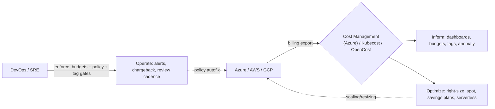

# Day 39: FinOps & Cloud Cost Optimization — Kubecost, Azure Cost Management

> Cloud spend ab DEVICE par defend manage hota hai. FinOps = "finance + operations" — **visibility → allocation → optimization → enforcement** — shared accountability for cloud cost. Kubecost = k8s-native cost, Azure Cost Mgmt = Azure spend.

## Overview | Parichay

Sab resources free nahi — Azure/AWS/GCP ka bill Bada hota hai. FinOps hai cloud economics ka **operating model**: 
1. **Ensure visibility** — everyone sees cost per team/app/env
2. **Optimize** — right-size, spot/scale, autoscale, savings plans/reserved instances
3. **Operate** — budgets + alerts + chargeback/showback + committees (FinOps Practitioners)
4. **Anomaly/Multi-cloud** — centralized FinOps center (Azure FinOps hubbing), controls & policies

Tools: **Azure Cost Management + Billing** (native), **Kubecost** (k8s per-pod cost), CloudHealth/Cloudability (enterprise), OpenCost (open standard), FinOps hub in Azure (export to ADL/log analytics).

## What You'll Learn | Aaj Ki Seekh

- [ ] FinOps lifecycle: Inform → Optimize → Operate
- [ ] Azure Cost Mgmt: budgets, alerts, cost analysis, tags, kpis
- [ ] Kubecost: pod-level allocation, savings insights, requests vs usage
- [ ] Right-sizing: vertical (size) + scale-in (replicas) + spot (Azure Spot)
- [ ] Reserved Instance / Savings Plans vs Pay-as-you-go
- [ ] Governance: tag policy, budget automation, Serverless/PAAS over VM when possible
- [ ] KPIs: Unit economics (cost per order), $ per deploy, NFR FinOps practices

## Diagram | Dekho Kaise Kaam Karta Hai



ASCII:
```
Inform → Optimize → Operate
  budget alert → right-size → chargeback to team (showback)
```

## Demo | Copy-Paste Karke Chalao

```bash
# 1. Azure Cost Management — budgets + alerts
az costmanagement budget create \
  -g rg \
  --name azure-budget-devops \
  --amount 100 \
  --time-grain Monthly \
  --contact-emails devops@example.com \
  --contact-groups devops \
  --category Cost \
  --notification-keys cost-forecasted \
  --stage
  --cost-properties-dimensions resource-group-name

# 2. Tags — allocation basis
az resource tag --tags "env=prod" "team=platform" -g rg

# 3. Kubecost (k8s)
helm repo add opencost https://opencost.github.io/opencost-helm-chart
helm install opencost opencost/opencost --namespace opencost --create-namespace
kubectl get svc -n opencost --watch   # dashboards at UI and query API

# 4. Query allocation-by-pod (opencost API)
curl http://localhost:8080/... # allocation of namespace x (see docs: /model/allocation ...)

# 5. Right-size a deployment after kubecost shows idle
kubectl set resources deployment myapp \
  --requests cpu=500m,memory=512Mi --limits cpu=1,memory=1Gi   # from observed usage

# 6. Spot VMs (save ~50-90% on burstable traffic)
az vm create -g rg -n spot-web --priority Spot --max-price -1   # eviction-able
# AKS: --enable-cluster-autoscaler --node-count 2 (spot node pools for batch/web)
```

## Real-Life Example | Industry Me

**Demo flow — "why is bill x2?":**
```
Azure bill export to Storage → FinOps hub → Cost Management dashboards
→ anomaly up 140% on 'infra-prod' → drill by tag: a single `Standard_D4s_v3` bursted 30 days
→ kubecost: that "myapp-prod" pod had requests=100m but using <100m avg (theory idle 80%)
→ fix: right-size to D2 + HPA; add budget $ on env tags; alert when >threshold
→ cost walk, FinOps review weekly
```
**Unit economics:** start tracking **cost per order** (e.g., $0.00042/order) instead of total bill — growth shouldn't panic if unit cost flat.

**NFR hygiene best-practice list:**
```
- Resource limits everywhere (CPU spikes = money)
- Autoscale everything (HPA/KEDA + Azure AKS autoscaler, VMSS autoscale)
- Spot for stateless/batch/flatestable
- Idle/TST/NIGHT down: shutdown policies week end
- Serverless where possible (Functions) over always-on VM
- Storage tiering (hot/cool/cold) + lifecycle
- Data transfer: region-lookup (east data fetch costs) — keep data & compute same region
- Single shared environment, not 1 cluster per dev
```

## Practice Exercise | Abhi Karein

1. Azure budget create (YOUR sub/budget) — monthly + forecast alert
2. Tag everything: env/team/owner → `az costmanagement query` group by tag
3. Kubecost install + allocation by namespace + "savings insights"
4. Find 1 idle workload → right-size + document writing forecast
5. Spot node pool create (AKS) + label-ish app on it
6. Build chargeback: write showback report (cost/team) — present like FinOps review

## Quick Notes | Yaad Rakho

```
- FinOps: Inform → Optimize → Operate. Cost = product metric, not afterthought
- Tags = allocation/enablement — tag policy enforced (serverless owner)
- Budget + alerts at 80/90/100% + anomaly detection native
- Kubecost/OpenCost = cost per pod/ns (requests/usage); right-size from it
- Right-sizing: match requests to observed usage; HPA/KEDA autoscale; VPA option
- Spot VMs/node pools: save up to ~90% (evictable, use for batch/stateless)
- Savings Plans/Reserved: commit 1-3y steady-state → discount; mix with spot
- PAAS/Serverless > VM: overprovisioned VM = bleeding
- Unit economics > total bill; showback/chargeback = ownership
- Data ingress/egress + same-region placement costs — engineer to avoid
```

**Agla:** Chaos Engineering — Chaos Mesh, Litmus, fault injection.