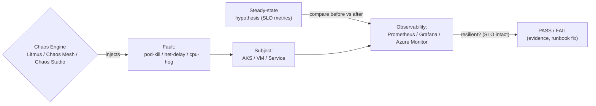

# Day 40: Chaos Engineering — Litmus, Chaos Mesh, Fault Injection, Gamedays

> Chaos engineering = **deliberately break things** in controlled way to build confidence in resilience. "If it survives chaos, it can survive production."

## Overview | Parichay

Ab system complex hai — murphy's law guaranteed failures. **Chaos engineering**:
1. Define **steady state** (SLO indicators — e.g., p99 < 200ms, errors < 1%)
2. Inject fault (kill a pod, pause node, network delay, CPU spike, RAM exhaustion, DNS flakiness)
3. Observe (steady state maintained? alerts? kyun)

Tools: **Litmus** (K8s native, ChaosEngine CRDs, experiment catalog, Azure AKS support), **Chaos Mesh** (K8s, pod/network/stress/dns clocks/IO), **Azure Chaos Studio** (VM, VMSS, AKS, and with target/campaign), Swarm/GameDay manual.

## What You'll Learn | Aaj Ki Seekh

- [ ] Steady-state hypothesis → fault → observe loop
- [ ] Chaos types: pod kill, network delay/drop, CPU/mem, disk IO, DNS
- [ ] Litmus: ChaosEngine + experiments (pod-delete, node-cpu-hog)
- [ ] Chaos Mesh: PodChaos, NetworkChaos, StressChaos CRs
- [ ] Azure Chaos Studio: targets + experiments on AKS/VM
- [ ] Safe chaos: blast radius, limited to staging first, SLA alignment
- [ ] GameDay: blameless post-mortem + resilience budget

## Diagram | Dekho Kaise Kaam Karta Hai



ASCII:
```
define steady state (SLO) → inject chaos (blaster radius !! maybe 1 pod) → measure → pass/fail
Litmus: ChaosEngine (target selector) → ChaosResult verdict
PS: run in staging, control blast radius, schedule (game days), never blindfire prod first
```

## Demo | Copy-Paste Karke Chalao

```bash
# 1. Litmus (chaos-platform)
kubectl apply -f https://litmuschaos.github.io/litmus/litmus-operator-v3.x.yaml
# (creates litmus namespace + chaos-exporter + whitebox RBAC)

# 2. Pod-delete experiment
cat > pod-delete.yaml << 'EOF'
apiVersion: litmuschaos.io/v1alpha1
kind: ChaosEngine
metadata:
  name: engine-nginx
  namespace: litmus
spec:
  engineState: active
  appinfo:
    appns: default
    applabel: app=nginx
    appkind: deployment
  chaosServiceAccount: litmus-admin
  experiments:
    - name: pod-delete
      spec:
        components:
          env:
            - name: FORCE
              value: true
            - name: CHAOS_INTERVAL
              value: 20
            - name: TOTAL_CHAOS_DURATION
              value: 60
    - name: pod-cpu-hog
EOF
kubectl apply -f pod-delete.yaml

# 3. Watch
kubectl get chaosexperiments,chaosengines,chaosresults -n litmus -w
kubectl describe chaosresult app-nginx-pod-delete -n litmus | grep -i verdict

# 4. Chaos Mesh network delay
helm repo add chaos-mesh https://charts.chaos-mesh.org
helm install chaos-mesh chaos-mesh/chaos-mesh -n chaos-mesh --create-namespace
cat > net-delay.yaml << 'EOF'
apiVersion: chaos-mesh.org/v1alpha1
kind: NetworkChaos
metadata: { name: web-latency }
spec:
  action: delay
  mode: one
  selector:
    namespaces: [default]
    labelSelectors: { app: nginx }
  delay:
    latency: "2000ms"
    correlation: "100"
    jitter: "100ms"
  duration: "2m"
EOF
kubectl apply -f net-delay.yaml

# 5. Stress CPU (CPU hog)
cat > cpu-stress.yaml << 'EOF'
apiVersion: chaos-mesh.org/v1alpha1
kind: StressChaos
metadata: { name: cpu-hog }
spec:
  mode: one
  selector: { labelSelectors: { app: nginx } }
  stressors:
    cpu:
      workers: 2
      load: 100
  duration: "90s"
EOF
kubectl apply -f cpu-stress.yaml

# 6. Azure Chaos Studio (native to service targets)
# portal: Azure Chaos Studio → create chaos target (AKS) → enable
# experiment: "AKS Chaos Mesh: Pod Stall/network" targeting nodes/namespaces
```

## Real-Life Example | Industry Me

**Real gameday plan (120 min):**
```
0-10  briefing + steady-state (dashboards + runbooks open)
10-30 chaos 1: kill DB primary node — observe failover <30s? alerts fire?
30-50 chaos 2: network partition service-b — timeout/retry behavior?
50-70 chaos 3: CPU hog on API replicas-1 → autoscaler reacts? SLO holds?
70-100 postmortem (blameless) — first root findings + runbook updates
100-120 action items owners; test before next gameday
```
**Production vs staging:** begin staging → build trust → increasingly prod but with: throttled scope, allowed time (21:00-23:00), rollback runbooks ready, on-call in room.

**Killer questions chaos answers:**
- What happens if this AZ is down? (multi-AZ? region failover?)
- Does our retry/backoff protect against DB blip? (or cascade?)
- Is autoscaler fast enough during load spike?

## Practice Exercise | Abhi Karein

1. Litmus: pod-delete on nginx (steady state = 2 replicas) — record verdict
2. Chaos Mesh: 2s network delay on nginx — invariant `time_total` curl heartbeat vs dashboards
3. StressChaos: CPU hog one pod — does HPA scale? (must enable HPA first)
4. Azure Chaos Studio: add AKS target + experiment with pod-stall (preview) 
5. Write a gameday runbook template (hypotheses, commands, rollback)
6. Blast-radius: use mode:one/limited, not all pods — test your design

## Quick Notes | Yaad Rakho

```
- Chaos = build confidence (targeted, controlled) not random breakage
- Steady state first: define SLO metrics before you break
- Litmus: ChaosEngine (target) + experiments (pod-delete, cpu-hog...) + ChaosResult verdict
- Chaos Mesh: PodChaos/NetworkChaos/StressChaos/DNSChaos/IOChaos handy CRs
- Azure Chaos Studio: native targets (AKS, VMSS), campaigns/scenarios
- Blast radius: one pod/ns, staging-first, schedule game days, runbooks ready
- Measure: pass=steady state majority stayed; fix from evidence
- Blameless post-mortems; resilience budget (dedicated sprints for these fixes)
- Integrate: API/service level bursts + k6/loadgen + chaos in one pipeline (add chaos test CI)
```

**Agla:** Disaster Recovery & Backup — Velero, Azure Site Recovery, RPO/RTO, multi-region.