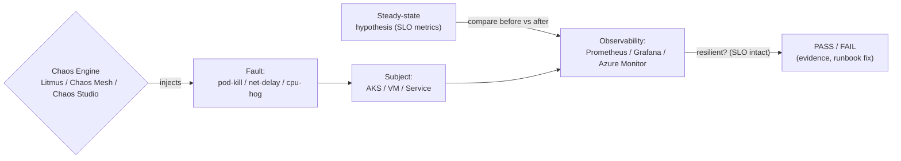

# Day 40: Chaos Engineering — Litmus, Chaos Mesh, Fault Injection, Gamedays

> Chaos engineering = **deliberately break things** in controlled way to build confidence in resilience. "If it survives chaos, it can survive production."

## Overview | Parichay

Ab system complex hai — murphy's law guaranteed failures. **Chaos engineering**:
1. Define **steady state** (SLO indicators — e.g., p99 < 200ms, errors < 1%)
2. Inject fault (kill a pod, pause node, network delay, CPU spike, RAM exhaustion, DNS flakiness)
3. Observe (steady state maintained? alerts? kyun)

Tools: **Litmus** (K8s native, ChaosEngine CRDs, experiment catalog, Azure AKS support), **Chaos Mesh** (K8s, pod/network/stress/dns clocks/IO), **Azure Chaos Studio** (VM, VMSS, AKS, and with target/campaign), Swarm/GameDay manual.

### Chaos engineering kya hai — jaan-boojh kar tootna

**Chaos engineering** = production jaisi system pe **planned, controlled** tarike se failure inject karke dekhna ki system apna kaam karta rehta hai ya nahi. Ye random destruction nahi hai — ye ek **scientific experiment** hai: pehle hypothesis likho ("3 pods me se 1 mare to p99 < 200ms rehni chahiye"), phir fault do, phir metrics pe compare karo. Kyun? Kyunki **Murphy's law** production me guaranteed hai — pod ek din marega hi, network ek din dega, disk bhar jayega. Question ye nahi "kya failure hoga" balki "kya humara system uske baad bhi chalega". Ye Netflix ke **Chaos Monkey** se famous hua — unka logic simple tha: "jo cheez tumhe aaj marne se darrati hai, wo kal asli outage me maregi; pehle marwao, resilience banao." Day 40 ka tone: chaos = confidence ka proof, dare ka nahi.

### Steady state hypothesis — chaos se pehle line khincho

Chaos ka **step 0** hai **steady state** define karna — kyunki bina baseline ke tumhe pata hi nahi chalega ki system "toot gaya" ya "hamesha aisa hi tha". Steady state typically kuch SLO metrics hoti hain: `p99 < 200ms`, `error rate < 1%`, `queue depth < 100`, `checkout success > 99.5%`. Dashboard kholo, in metrics ko note karo, phir experiment chalao, phir wahi dashboard compare karo. Agar fault ke baad bhi metrics steady rahe — hypothesis PASS, system resilient hai. Agar p99 2s ho gaya — FAIL, aur wo tumhare liye asli finding hai. Ye loop hai: **steady state → inject → observe → verdict → fix**. Bina hypothesis ke jo log karte hain wo "random breakage" hai — chaos nahi, vandalism.

### Fault types — kya-kya tod sakte ho

Chaos ke common fault types (k8s world me):

- **Pod kill** — ek pod mara do; HPA/self-heal theek karega?
- **Network delay/latency** — 2s delay daalo; timeouts/retries sahi fire karte hain ya cascade?
- **Network partition/drop** — packets gayab; service discovery kaise react karti hai?
- **CPU/RAM stress (hog)** — resource starve; autoscaler time pe aaya ya nahi? throttling?
- **Disk IO latency/fill** — log write block hua to app hang?
- **DNS flakiness** — service names resolve nahi hue; retry logic kaun bachata hai?
- **AZ/node failure** — pura node gaya; pods reschedule hue ya stuck?

Har fault ka apna sawal hota hai. **Chaos Mesh** me ye sab CRs hain: `PodChaos`, `NetworkChaos`, `StressChaos`, `DNSChaos`, `IOChaos`, `TimeChaos`. **Litmus** me ready-made experiments catalog me milte hain (pod-delete, pod-cpu-hog...). Rule: ek experiment = ek hypothesis — sab ek saath mat todo, warna root cause kabhi nahi milega.

### Litmus vs Chaos Mesh vs Azure Chaos Studio — kab kaunsa

Teen tools ka practical farak:

| Tool | Kahan | Kaise | Best for |
|---|---|---|---|
| **Litmus** | K8s (AKS/EKS/GCP) | `ChaosEngine` CRD + experiment catalog | K8s-native, community experiments |
| **Chaos Mesh** | K8s | `PodChaos`/`NetworkChaos`/... CRs | fine-grained network/stress faults |
| **Azure Chaos Studio** | Azure-native (VM, VMSS, AKS) | targets + experiments + campaigns | infra-level Azure services, managed |

**Litmus** ka flow: operator install → `ChaosEngine` banao (target selector + experiment) → `ChaosResult` me verdict aata hai. **Chaos Mesh** Helm se install, CR apply karo, done. **Azure Chaos Studio** me pehle service ko **target** banao (enable karo), phir experiment banao, phir schedule/campaign chalao. Small cluster pe Chaos Mesh/Litmus se shuru karo; pura Azure estate pe studio. Wrk eng job me often Litmus/Chaos Mesh kyunki eks/aks/aks dono me kaam karta hai — interview me dono naam suna rakho.

### Blast radius — pehla safety rule

**Blast radius** = tumhara experiment kitna affect karega. Golden rules:

1. **Staging first**, prod kabhi sudden nahi — trust banao pehle.
2. **Limited scope**: `mode: one` (ek pod), ek namespace — "all pods" kabhi mat likho pehle me.
3. **Time-box**: `TOTAL_CHAOS_DURATION` 60s, 2 min — unlimited mat chalao.
4. **Abort path ready**: rollback command likhi ho, `kubectl delete chaosengine...` maloom ho.
5. **On-call aware**: game day schedule karo (e.g., off-peak 21:00-23:00), war room me runbook khula.
6. **Blast radius badhao gradually**: 1 pod → 1 replica set → 1 AZ → region failover (sirf jaruri ho to).

Ek chhoti si misstep (jaise sabhi pods kill kar dena) chhoti team ke liye pura outage ban sakti hai — chaos ka matlab carelessness nahi, **disciplined destruction** hai.

### GameDay — team ke saath drill

**GameDay** = scheduled drill jahan team milkar chaos experiments chalati hai, dashboards dekhti hai, aur baad me **blameless post-mortem** karti hai. Typical 2-hour flow: 10 min briefing (steady state, hypotheses) → 60-70 min 2-3 experiments → 30-40 min post-mortem + action items. Ye fire drill jaisa hai — school me aag ki practice kabhi asli aag me kaam aati hai. Output: **resilience budget** (kitna SLO bacha), runbook updates, aur fix tickets ("autoscaler 4 min me aata hai, SLO 1 min maangti hai → tune karo"). Blameless matlab: galti system/me process me dhoondho, insaan me nahi — warna log agla experiment chupke se band kar denge. Cadence: mahine me ek chhota, quarter me ek bada game day.

### Common gotchas — yahan log phaste hain

- **Observability missing** — chaos se pehle Prometheus/Grafana/APM chalu ho, warna kuch dikh hi nahi payega.
- **Hypothesis nahi likha** — "bas dekhte hain" = entertainment, engineering nahi.
- **Prod first try** — sabse badi galti; pehle staging me confidence banao.
- **Cascade risk ignored** — retry storm, connection pool exhaustion — chaos often ye expose karta hai; uska plan bhi rakho.
- **No game day cadence** — ek baar chala ke chhod diya; resilience decay hoti hai (code change hote rehte hain).
- **Alerts off** — chaos ke waqt alerts fire hone chahiye; wo bhi test ho raha hai.

### Interview angle — chaos ke sawal

Interview me typical: "chhoti team hai, chaos kaise shuru karoon?" → steady state SLO define → staging me Litmus pod-delete + network delay → blast radius limit → gameday cadence → prod me gradual. "Steady state kya hota hai?" → SLO indicators jise fault ke baad bhi maintain hona chahiye. "Litmus vs Chaos Mesh?" → Litmus = catalog + ChaosEngine CRD, Chaos Mesh = fine-grained CRs (network/stress/DNS). "Blast radius kya hai?" → experiment ka scope (1 pod/ns) — sabse bada safety lever. "Chaos aur DR drill alag kaise?" → chaos = component resilience, DR = full-site failover (Day 41) — dono complement karte hain. Ek line: chaos = "confidence with evidence", not "random breakage".

## What You'll Learn | Aaj Ki Seekh

- [ ] Steady-state hypothesis → fault → observe loop
- [ ] Chaos types: pod kill, network delay/drop, CPU/mem, disk IO, DNS
- [ ] Litmus: ChaosEngine + experiments (pod-delete, node-cpu-hog)
- [ ] Chaos Mesh: PodChaos, NetworkChaos, StressChaos CRs
- [ ] Azure Chaos Studio: targets + experiments on AKS/VM
- [ ] Safe chaos: blast radius, limited to staging first, SLA alignment
- [ ] GameDay: blameless post-mortem + resilience budget

## Diagram | Dekho Kaise Kaam Karta Hai



ASCII:
```
define steady state (SLO) → inject chaos (blaster radius !! maybe 1 pod) → measure → pass/fail
Litmus: ChaosEngine (target selector) → ChaosResult verdict
PS: run in staging, control blast radius, schedule (game days), never blindfire prod first
```

## Demo | Copy-Paste Karke Chalao

```bash
# 1. Litmus (chaos-platform)
kubectl apply -f https://litmuschaos.github.io/litmus/litmus-operator-v3.x.yaml
# (creates litmus namespace + chaos-exporter + whitebox RBAC)

# 2. Pod-delete experiment
cat > pod-delete.yaml << 'EOF'
apiVersion: litmuschaos.io/v1alpha1
kind: ChaosEngine
metadata:
  name: engine-nginx
  namespace: litmus
spec:
  engineState: active
  appinfo:
    appns: default
    applabel: app=nginx
    appkind: deployment
  chaosServiceAccount: litmus-admin
  experiments:
    - name: pod-delete
      spec:
        components:
          env:
            - name: FORCE
              value: true
            - name: CHAOS_INTERVAL
              value: 20
            - name: TOTAL_CHAOS_DURATION
              value: 60
    - name: pod-cpu-hog
EOF
kubectl apply -f pod-delete.yaml

# 3. Watch
kubectl get chaosexperiments,chaosengines,chaosresults -n litmus -w
kubectl describe chaosresult app-nginx-pod-delete -n litmus | grep -i verdict

# 4. Chaos Mesh network delay
helm repo add chaos-mesh https://charts.chaos-mesh.org
helm install chaos-mesh chaos-mesh/chaos-mesh -n chaos-mesh --create-namespace
cat > net-delay.yaml << 'EOF'
apiVersion: chaos-mesh.org/v1alpha1
kind: NetworkChaos
metadata: { name: web-latency }
spec:
  action: delay
  mode: one
  selector:
    namespaces: [default]
    labelSelectors: { app: nginx }
  delay:
    latency: "2000ms"
    correlation: "100"
    jitter: "100ms"
  duration: "2m"
EOF
kubectl apply -f net-delay.yaml

# 5. Stress CPU (CPU hog)
cat > cpu-stress.yaml << 'EOF'
apiVersion: chaos-mesh.org/v1alpha1
kind: StressChaos
metadata: { name: cpu-hog }
spec:
  mode: one
  selector: { labelSelectors: { app: nginx } }
  stressors:
    cpu:
      workers: 2
      load: 100
  duration: "90s"
EOF
kubectl apply -f cpu-stress.yaml

# 6. Azure Chaos Studio (native to service targets)
# portal: Azure Chaos Studio → create chaos target (AKS) → enable
# experiment: "AKS Chaos Mesh: Pod Stall/network" targeting nodes/namespaces
```

## Real-Life Example | Industry Me

**Real gameday plan (120 min):**
```
0-10  briefing + steady-state (dashboards + runbooks open)
10-30 chaos 1: kill DB primary node — observe failover <30s? alerts fire?
30-50 chaos 2: network partition service-b — timeout/retry behavior?
50-70 chaos 3: CPU hog on API replicas-1 → autoscaler reacts? SLO holds?
70-100 postmortem (blameless) — first root findings + runbook updates
100-120 action items owners; test before next gameday
```
**Production vs staging:** begin staging → build trust → increasingly prod but with: throttled scope, allowed time (21:00-23:00), rollback runbooks ready, on-call in room.

**Killer questions chaos answers:**
- What happens if this AZ is down? (multi-AZ? region failover?)
- Does our retry/backoff protect against DB blip? (or cascade?)
- Is autoscaler fast enough during load spike?

## Practice Exercise | Abhi Karein

1. Litmus: pod-delete on nginx (steady state = 2 replicas) — record verdict
2. Chaos Mesh: 2s network delay on nginx — invariant `time_total` curl heartbeat vs dashboards
3. StressChaos: CPU hog one pod — does HPA scale? (must enable HPA first)
4. Azure Chaos Studio: add AKS target + experiment with pod-stall (preview) 
5. Write a gameday runbook template (hypotheses, commands, rollback)
6. Blast-radius: use mode:one/limited, not all pods — test your design

## Quick Notes | Yaad Rakho

```
- Chaos = build confidence (targeted, controlled) not random breakage
- Steady state first: define SLO metrics before you break
- Litmus: ChaosEngine (target) + experiments (pod-delete, cpu-hog...) + ChaosResult verdict
- Chaos Mesh: PodChaos/NetworkChaos/StressChaos/DNSChaos/IOChaos handy CRs
- Azure Chaos Studio: native targets (AKS, VMSS), campaigns/scenarios
- Blast radius: one pod/ns, staging-first, schedule game days, runbooks ready
- Measure: pass=steady state majority stayed; fix from evidence
- Blameless post-mortems; resilience budget (dedicated sprints for these fixes)
- Integrate: API/service level bursts + k6/loadgen + chaos in one pipeline (add chaos test CI)
```

**Agla:** Disaster Recovery & Backup — Velero, Azure Site Recovery, RPO/RTO, multi-region.