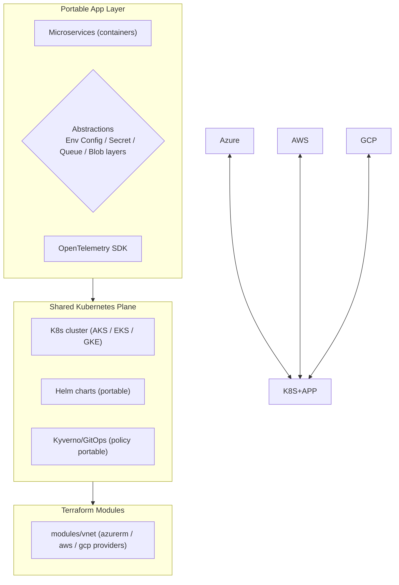

# Day 42: Multi-Cloud & Cloud-Agnostic Patterns — Portability, Terraform Abstracts, Feathr

> Aaj: ek "cloud-independent" design — so app recipe same AZURE/AWS/GCP. Terraform (providers), Docker/OCI, Helm, OpenTelemetry, Kubernetes, standardized IaC modules — portable stack. Trade-offs: complexity vs lock-in.

## Overview | Parichay

Day 31 said "concepts cloud-agnostic" — ab **execute** karo. Multi-cloud doesn't mean "use all equally" — it means **your workload can run on any, and you can move without rewrite**:
- Cloud **K8s + container images** = portable compute
- **Terraform / Pulumi / IaC modules** = portable infra definitions
- **OpenTelemetry + Prometheus + Grafana** = portable observability
- **Env vars / config providers abstraction** = runtime-agnostic app
- **Object storage / message queues** = portable via standard interfaces (S3, Kafka)

Portability levels: 
1. L0: containerized (Docker)
2. L1: k8s workload (deployment yaml portable)
3. L2: provider-abstracted (Terraform modules per cloud, thin config)
4. L3: service-agnostic (PaaS-agnostic APIs — blob, sqs→queue, pubsub)
5. L4: fully agnostic & portable (abstractions like provider-agnostic SDK — e.g., Go cloud abstractions, Dapr)

## What You'll Learn | Aaj Ki Seekh

- [ ] Multi-cloud strategy: primary+fallback, active-active regions, or unit-economics
- [ ] Terraform multi-provider (azurerm/aws/gcp) + common modules
- [ ] Kubernetes portability: manifests, Helm, GitOps agnostic to cloud
- [ ] App-level abstractions: env configs, storage client, secrets, observability exporters
- [ ] Standard APIs: S3-compatible (MinIO), Kafka Protocol Compatible (Azure Event Hubs Kafka), OpenID Connect auth
- [ ] Dapr / Go Cloud / Ballerina — cloud-abstraction runtimes
- [ ] Lock-in audit checklist: what commits you to a provider

## Diagram | Dekho Kaise Kaam Karta Hai



ASCII:
```
containers + k8s yaml + helm + terraform modules + otel exports
 → "run same chart in AKGlus, EKS, or GKE; terraform variable = provider"
App stays provider-agnostic; infra defined once per environment map.
```

## Demo | Copy-Paste Karke Chalao

```bash
# 1. Terraform multi-provider (same module, different cloud)
cat > main.tf << 'EOF'
terraform {
  required_providers {
    azurerm = { source = "hashicorp/azurerm", version = "~>3" }
    aws     = { source = "hashicorp/aws",     version = "~>5" }
  }
}
variable "cloud" { type = string }

module "web" {
  source = "github.com/myorg/tf-modules//web"   # portable module
  cloud  = var.cloud
}
EOF

# 2. Environment abstraction (container)
# APP_* env vars, provider-agnostic clients:
cat > app/config.py << 'EOF'
import os, boto3, azure.storage.blob

STORAGE_DRIVER = os.getenv("STORAGE_DRIVER", "s3")

if STORAGE_DRIVER == "s3":
    import boto3
    s3 = boto3.client("s3", endpoint_url=os.getenv("S3_ENDPOINT") or None)
    blob = s3.put_object   # any S3-compatible: AWS, MinIO, Azure ADLS Gen2 (with adapter)
else:
    from azure.storage.blob import BlobServiceClient
    blob = BlobServiceClient.from_connection_string(os.getenv("AZURE_STORAGE"))
EOF

# 3. Standard queue abstraction: Kafka protocol anywhere
# Event Hubs / Confluent / MSK all speak Kafka API → one client SDK

# 4. OTel = one exporter config per cloud:
cat > otel.yaml << 'EOF'
exporters:
  prometheus:
  otlp:
    endpoint: "${OTEL_EXPORTER_OTLP_ENDPOINT}"   # Tempo/Datadog/OTel collector anywhere
  loki: { endpoint: "${LOKI_URL}" }
EOF
```

## Real-Life Example | Industry Me

**Case — global trading platform (multi-cloud reality):**
```
Azure (primary) for compliance + AKS        AWS (fallback) + same K8s chart via GitOps
Terraform modules: /modules/vpc (provider per cloud), /modules/aks-eks toggle
Data: primary DB on Azure SQL, replica agnostic, geo-dr via standard replication
Queue: event-hubs AND SQS behind env var (Kafka-compat unified both)
Numbers: failover regional scale 20 min, tested monthly — business continuity
```
**When NOT to do multi-cloud:** single cloud simpler (team-size, certified skills, SLA contracting), multi-cloud adds complexity — pick happy path:
- Start single cloud + **portability discipline** (no provider-native features everywhere)
- Add 2nd for DR if ROI/compliance justifies

**Lock-in audit checklist:**
```
[ ] Object storage = S3-compatible API / azurerm_blob + fallback (MinIO)
[ ] Queue = Kafka-protocol compatible
[ ] DB = PostgreSQL (managed on any cloud) vs provider-proprietary
[ ] Secrets = OTel/config layer abstraction
[ ] IAM = OIDC federated (identity portable)
[ ] Certs/PKI = cert-manager (portable)
[ ] Observability = OTel + Prom + Grafana (portable), not proprietary agents
```

## Practice Exercise | Abhi Karein

1. Terraform module: same `module "web"` — run `plan` with azurerm AND aws providers (or gcp)
2. Container: build once → push to ACR + ECR + GHCR (manifest portability)
3. App config: env-var switch `STORAGE_DRIVER` — run local MinIO vs Azure blob
4. Kafka-compat: connect to Event Hubs using Kafka SDK — prove protocol
5. OTel: export to Prometheus+Dashboards or any collector — flip exporter config
6. Write lock-in audit for your project; mark which components are portable, which vendor-specific

## Quick Notes | Yaad Rakho

```
- Portability = container + k8s + helm + terraform modules + otel + env-config
- Same chart runs AKS/EKS/GKE; terraform module parameterized by provider
- Standard interfaces: S3-type blob, Kafka-protocol queue, OIDC identity, OTel traces
- Abstractions layer (Dapr/Go-Cloud/env driver) hides per-cloud clients
- Multi-cloud is engineering discipline, not "use all providers at once"
- Start single-cloud + portable discipline; add 2nd cloud for DR only if justified
- Watch provider-native features (aj spyglass breaks portability)
- Lock-in audit: identity, storage, queue, DB, observability, secret
```

**Agla:** Serverless & Event-Driven — Azure Functions, Durable Functions, KEDA, Event Grid.