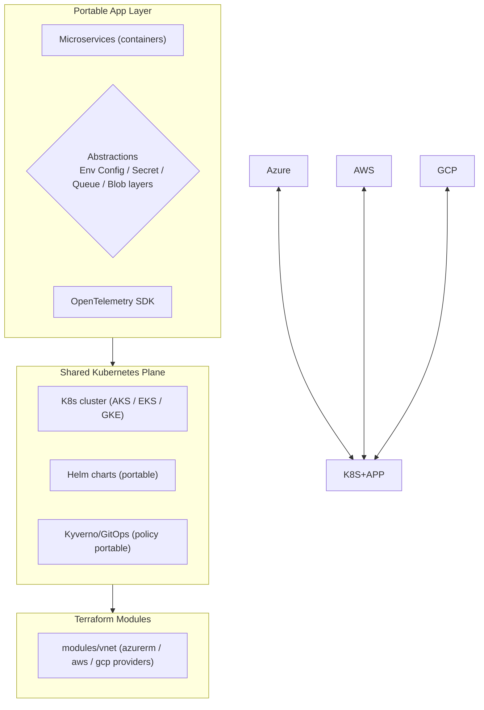

# Day 42: Multi-Cloud & Cloud-Agnostic Patterns — Portability, Terraform Abstracts, Feathr

> Aaj: ek "cloud-independent" design — so app recipe same AZURE/AWS/GCP. Terraform (providers), Docker/OCI, Helm, OpenTelemetry, Kubernetes, standardized IaC modules — portable stack. Trade-offs: complexity vs lock-in.

## Overview | Parichay

Day 31 said "concepts cloud-agnostic" — ab **execute** karo. Multi-cloud doesn't mean "use all equally" — it means **your workload can run on any, and you can move without rewrite**:
- Cloud **K8s + container images** = portable compute
- **Terraform / Pulumi / IaC modules** = portable infra definitions
- **OpenTelemetry + Prometheus + Grafana** = portable observability
- **Env vars / config providers abstraction** = runtime-agnostic app
- **Object storage / message queues** = portable via standard interfaces (S3, Kafka)

Portability levels: 
1. L0: containerized (Docker)
2. L1: k8s workload (deployment yaml portable)
3. L2: provider-abstracted (Terraform modules per cloud, thin config)
4. L3: service-agnostic (PaaS-agnostic APIs — blob, sqs→queue, pubsub)
  5. L4: fully agnostic & portable (abstractions like provider-agnostic SDK — e.g., Go cloud abstractions, Dapr)

### Multi-cloud kya hai — aur kya nahi

Pehle ye confusion door karo: **multi-cloud** ka matlab "teeno cloud ek saath evenly use karo" nahi hai. Matlab hai ki tumhara **workload kisi bhi cloud pe chal sake aur move kar sake bina rewrite** — chahe tum practically ek hi cloud pe ho. Do real drivers hain: (1) **lock-in risk** — provider band/gandha ho jaye to escape option chahiye; (2) **requirements** — compliance data residency maange (data India me rehna hai), ya DR ke liye doosra region/cloud chahiye. Strategy ke patterns: **primary + fallback** (Azure primary, AWS DR), **active-active** (dono live, traffic split), **best-of-breed** (har cloud se best service — par sabse complex), **unit-economics shift** (batch GPU GCP sasta hai to wahan). Lekin honesty: chhoti team ke liye multi-cloud = dox complexity. Rule of thumb: **single cloud + portability discipline** pehle, doosra cloud tabhi jab ROI/compliance justify kare. Portability ek insurance hai jo roz kaam nahi aati, par jab chahiye tab bahut mehngi hoti hai.

### Portability levels — L0 se L4 tak

Portability ek switch nahi, **ladder** hai. Har level pe tumhara lock-in kam aur effort zyada hota hai:

| Level | Kya hai | Example |
|---|---|---|
| **L0** | containerized | Docker image — cloud-agnostic binary |
| **L1** | k8s workload | Deployment/Service/Helm yaml — AKS/EKS/GEK same chart |
| **L2** | provider-abstracted IaC | Terraform module `var.cloud = azurerm/aws/gcp` |
| **L3** | service-agnostic APIs | S3-compatible blob, Kafka-protocol queue, Postgres |
| **L4** | full abstraction runtime | Dapr building blocks, Go Cloud SDK, provider-agnostic clients |

Practical advice: zyadatar teams **L0-L2 + thoda L3** pe reh ke bohot jaati hain. L4 tak jaana tabhi jab multi-cloud actual reality ho — warna abstraction layer khud ek maintenance burden ban jati hai. Yaad rakho: har level ka **cost** hai — abstraction banane, test karne, document karne wala. Socho "ye feature portable hai ya nahi" — us feature ki value vs escape option ka value compare karo.

### Portable building blocks — kya chunna hai

Core portable stack (yahi 50-din ka syllabus bhi hai):

- **Compute**: containers + **Kubernetes** — k8s API industry-standard hai; Helm chart AKS/EKS/GKE teeno pe same.
- **Infra**: **Terraform** modules per concern (vnet/vpc, aks/eks, kv) — module bahar, provider variable andar. Pulumi bhi same idea, language-wrapped.
- **Config**: env vars + config files — app ko na pata ho kaunsa cloud; `STORAGE_DRIVER=s3|azure` jaise switches.
- **Storage**: **S3-compatible API** (AWS S3, Azure blob adapter, MinIO local) — ek client SDK sab jagah.
- **Queue/Events**: **Kafka protocol** (Event Hubs Kafka endpoint, MSK, Confluent) — ek consumer code sab pe.
- **Identity**: **OIDC** (OpenID Connect) federated — identity portable rehti hai.
- **Observability**: **OpenTelemetry** — instrument ek baar, exporter (Prometheus/Tempo/vendor) baad me badlo.
- **Secrets/certs**: external-secrets + cert-manager — portable patterns, per-cloud Store implementation thin.

Ye sab Day 0-38 ke tools directly isi ka part hain — capstone me bhi yahi wiring hogi.

### Abstraction patterns — code me kaise chupate ho

Do classic patterns: (1) **driver/factory pattern** — code me interface rakho, per-cloud implementation class alag; runtime pe env var se select. Jaise storage client: `if driver=="s3": use boto3 else: use azure.blob` — caller ko farak hi nahi padta. (2) **infra modules with provider switch** — Terraform me ek module, `required_providers` me dono, variable se decide:

```hcl
variable "cloud" { type = string }   # "azurerm" | "aws"
module "network" {
  source = "./modules/network"
  cloud  = var.cloud
}
```

(3) **standard protocols over proprietary** — boto3 with custom `endpoint_url` = MinIO/AWS/any S3. (4) **facade SDK** — Dapr jaisa runtime sidecar: app kehti "publish event", Dapr decide karega Event Hub ya SNS. Warning: abstraction leak hota hai (jo Martin Fowler "leaky abstractions" kehta hai) — Azure blob me kuch S3 semantics nahi hote; test matrix banao. Har abstraction pe **escape hatch** rakho ki zarurat pade to native feature use ho sake without full rewrite.

### Lock-in audit — tumhara project kitna locked hai

**Lock-in audit** ek simple checklist hai jo quarter me ek baar chalani chahiye — her component pe sawal: "agar aaj ye provider chhodna pade, kitna code+data+pipeline badlega?"

```
[ ] Object storage  = S3-compatible API? ya proprietary SDK?
[ ] Queue/Events    = Kafka protocol? ya proprietary?
[ ] Database        = Postgres/MySQL (portable)? ya proprietary NoSQL?
[ ] Identity        = OIDC federated? ya provider-only AD/LDAP?
[ ] Secrets/certs   = external-secrets + cert-manager? ya provider vault SDK?
[ ] Observability   = OTel + Prom/Grafana? ya proprietary agent only?
[ ] CI/CD + IaC     = GitHub Actions + Terraform? ya provider-native only?
[ ] Serverless      = functions code portable? bindings proprietary kitne?
```

Har "proprietary" tick = ek risk + ek migration ticket. Lekin extreme bhi mat karo: kabhi-kabhi provider-native feature **use karo** jab wo 10x value de (e.g., Cosmos change feed, AWS Lambda@Edge) — bas uska **cost likh lo** docs me (deliberate lock-in > accidental lock-in).

### When NOT multi-cloud — aur interview angle

**Kab nahi karo**: 5-member team, ek region me pehla saal, no compliance driver — tab multi-cloud sirf noise hai. Ek cloud me depth > teeno me breadth. Interview me sawal aksar aate hain: "multi-cloud vs hybrid cloud difference?" → multi-cloud = do+ providers, hybrid = on-prem + cloud; "portability kaise achieve karoge?" → L0-L4 ladder (containers, k8s, TF modules, standard APIs, OTel); "kya har app ko portable banana chahiye?" → nahi, cost-benefit per service; "lock-in audit kaise karoge?" → checklist upar wali. Ek line me: portability = insurance jo deliberate rehti hai — "run anywhere" tab dikhao jab actually kahin shift karna ho, warna single-cloud depth hi best ROI hai.

## What You'll Learn | Aaj Ki Seekh

- [ ] Multi-cloud strategy: primary+fallback, active-active regions, or unit-economics
- [ ] Terraform multi-provider (azurerm/aws/gcp) + common modules
- [ ] Kubernetes portability: manifests, Helm, GitOps agnostic to cloud
- [ ] App-level abstractions: env configs, storage client, secrets, observability exporters
- [ ] Standard APIs: S3-compatible (MinIO), Kafka Protocol Compatible (Azure Event Hubs Kafka), OpenID Connect auth
- [ ] Dapr / Go Cloud / Ballerina — cloud-abstraction runtimes
- [ ] Lock-in audit checklist: what commits you to a provider

## Diagram | Dekho Kaise Kaam Karta Hai



ASCII:
```
containers + k8s yaml + helm + terraform modules + otel exports
 → "run same chart in AKGlus, EKS, or GKE; terraform variable = provider"
App stays provider-agnostic; infra defined once per environment map.
```

## Demo | Copy-Paste Karke Chalao

```bash
# 1. Terraform multi-provider (same module, different cloud)
cat > main.tf << 'EOF'
terraform {
  required_providers {
    azurerm = { source = "hashicorp/azurerm", version = "~>3" }
    aws     = { source = "hashicorp/aws",     version = "~>5" }
  }
}
variable "cloud" { type = string }

module "web" {
  source = "github.com/myorg/tf-modules//web"   # portable module
  cloud  = var.cloud
}
EOF

# 2. Environment abstraction (container)
# APP_* env vars, provider-agnostic clients:
cat > app/config.py << 'EOF'
import os, boto3, azure.storage.blob

STORAGE_DRIVER = os.getenv("STORAGE_DRIVER", "s3")

if STORAGE_DRIVER == "s3":
    import boto3
    s3 = boto3.client("s3", endpoint_url=os.getenv("S3_ENDPOINT") or None)
    blob = s3.put_object   # any S3-compatible: AWS, MinIO, Azure ADLS Gen2 (with adapter)
else:
    from azure.storage.blob import BlobServiceClient
    blob = BlobServiceClient.from_connection_string(os.getenv("AZURE_STORAGE"))
EOF

# 3. Standard queue abstraction: Kafka protocol anywhere
# Event Hubs / Confluent / MSK all speak Kafka API → one client SDK

# 4. OTel = one exporter config per cloud:
cat > otel.yaml << 'EOF'
exporters:
  prometheus:
  otlp:
    endpoint: "${OTEL_EXPORTER_OTLP_ENDPOINT}"   # Tempo/Datadog/OTel collector anywhere
  loki: { endpoint: "${LOKI_URL}" }
EOF
```

## Real-Life Example | Industry Me

**Case — global trading platform (multi-cloud reality):**
```
Azure (primary) for compliance + AKS        AWS (fallback) + same K8s chart via GitOps
Terraform modules: /modules/vpc (provider per cloud), /modules/aks-eks toggle
Data: primary DB on Azure SQL, replica agnostic, geo-dr via standard replication
Queue: event-hubs AND SQS behind env var (Kafka-compat unified both)
Numbers: failover regional scale 20 min, tested monthly — business continuity
```
**When NOT to do multi-cloud:** single cloud simpler (team-size, certified skills, SLA contracting), multi-cloud adds complexity — pick happy path:
- Start single cloud + **portability discipline** (no provider-native features everywhere)
- Add 2nd for DR if ROI/compliance justifies

**Lock-in audit checklist:**
```
[ ] Object storage = S3-compatible API / azurerm_blob + fallback (MinIO)
[ ] Queue = Kafka-protocol compatible
[ ] DB = PostgreSQL (managed on any cloud) vs provider-proprietary
[ ] Secrets = OTel/config layer abstraction
[ ] IAM = OIDC federated (identity portable)
[ ] Certs/PKI = cert-manager (portable)
[ ] Observability = OTel + Prom + Grafana (portable), not proprietary agents
```

## Practice Exercise | Abhi Karein

1. Terraform module: same `module "web"` — run `plan` with azurerm AND aws providers (or gcp)
2. Container: build once → push to ACR + ECR + GHCR (manifest portability)
3. App config: env-var switch `STORAGE_DRIVER` — run local MinIO vs Azure blob
4. Kafka-compat: connect to Event Hubs using Kafka SDK — prove protocol
5. OTel: export to Prometheus+Dashboards or any collector — flip exporter config
6. Write lock-in audit for your project; mark which components are portable, which vendor-specific

## Quick Notes | Yaad Rakho

```
- Portability = container + k8s + helm + terraform modules + otel + env-config
- Same chart runs AKS/EKS/GKE; terraform module parameterized by provider
- Standard interfaces: S3-type blob, Kafka-protocol queue, OIDC identity, OTel traces
- Abstractions layer (Dapr/Go-Cloud/env driver) hides per-cloud clients
- Multi-cloud is engineering discipline, not "use all providers at once"
- Start single-cloud + portable discipline; add 2nd cloud for DR only if justified
- Watch provider-native features (aj spyglass breaks portability)
- Lock-in audit: identity, storage, queue, DB, observability, secret
```

**Agla:** Serverless & Event-Driven — Azure Functions, Durable Functions, KEDA, Event Grid.