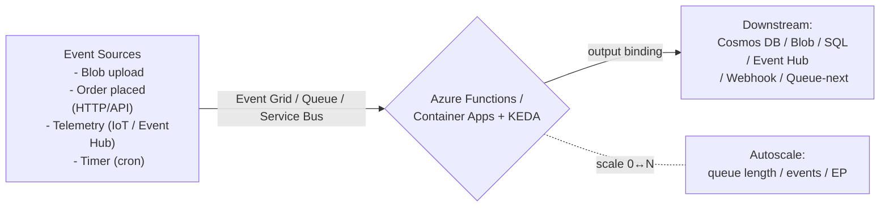

# Day 43: Serverless & Event-Driven — Azure Functions, Durable Functions, Event Grid, KEDA

> Serverless = cloud managed compute, pay-per-execution, auto-scale. Event-driven = system reacts to things (order placed, file uploaded, message in queue) bina polls/empty loops.

## Overview | Parichay

Day 23 me Functions ka basics dekha. Ab **real event-driven architecture**:

**Serverless options (Azure):**
- **Azure Functions** — HTTP, Queue, Timer, Blob, Event Grid, Cosmos triggers
- **Container Apps + KEDA** — containers scale to zero, event-driven
- **Logic Apps / Durable Functions** — workflows, stateful fan-out/fan-in

**Event-Driven pattern (pay only when there's work):**
```
Producer (FileUpload/Order/Telemetry) → Event Grid / Queue / Event Hub
                                     → Consumer (Function) auto-scales (0→N)
                                     → does work → scales back to 0
No idle VMs. No empty while-loops polling. Events drive everything.
```

## What You'll Learn | Aaj Ki Seekh

- [ ] Triggers vs bindings (input/output), function types
- [ ] Queue (Storage Queue / Service Bus) patterns — reliable decoupling
- [ ] Event Grid — pub/sub routing, event schemas, dead-letter
- [ ] Durable Functions — orchestrator, activity, fan-out/fan-in, checkpointing
- [ ] KEDA — event-driven autoscaling for containers (queue length, cron)
- [ ] Scale-to-zero economics + cold start management
- [ ] When serverless vs when not

## Diagram | Dekho Kaise Kaam Karta Hai



ASCII:
```
Event → Queue → Function (scales with queue depth) → writes result
Durable: orchestrator (state) → fan-out activities → fan-in → checkpoint/retry
KEDA: container scales by event metric (e.g., len(queue), http req/app, custom)
```

## Demo | Copy-Paste Karke Chalao

```bash
# 1. Function with Queue trigger (Storage Queue)
cat > queue-function/index.js << 'EOF'
module.exports = async function (context, myQueueItem) {
  context.log("Processing order:", myQueueItem);
  context.bindings.outputOrder = { id: myQueueItem.id, status: "processed", at: Date.now() };
};
EOF
# function.json:
cat > queue-function/function.json << 'EOF'
{
  "disabled": false,
  "bindings": [
    { "name": "myQueueItem", "type": "queueTrigger", "direction": "in",
      "queueName": "orders", "connection": "AzureWebJobsStorage" },
    { "name": "outputOrder", "type": "cosmosDB", "direction": "out",
      "databaseName": "ordersdb", "collectionName": "orders",
      "connectionStringSetting": "CosmosDB" }
  ],
  "scriptFile": "index.js"
}
EOF

# 2. Event Grid: blob upload → function
# (HTTP webhook) — event arrives on blob create:
az eventgrid event-subscription create -g rg \
  --topic-name my-blob-topic --name sub-func \
  --endpoint <function-app-url>?code=`FUNCTION_KEY`

# 3. Durable Functions (orchestrator)
cat > orchestrator.js << 'EOF'
module.exports = df.orchestrator(function* (context) {
  const items = yield context.df.callActivity("FetchOrders", context.df.instanceId);
  const results = yield context.df.Task.all(
    items.map(o => context.df.callActivity("ProcessOrder", o))
  );
  return { processed: results.length };
});
EOF

# 4. KEDA + Container Apps — scale-to-zero containers
cat > scaled-object.yaml << 'EOF'
apiVersion: keda.sh/v1alpha1
kind: ScaledObject
metadata: { name: order-consumer }
spec:
  scaleTargetRef: { name: order-consumer }
  pollingInterval: 30
  minReplicaCount: 0
  maxReplicaCount: 50
  cooldownPeriod: 120
  triggers:
    - type: azure-queue
      metadata:
        queueLength: "20"
        queueName: orders
        connectionFromEnv: AZURE_STORAGE_CONN
        scaleToZeroPattern: true
EOF

# 5. Cold start mitigation:
# - 'prewarmed' scale, better 'Consumption' → 'Premium (EP)' plan or Flexible consumption
# - Container Apps: 'scale to zero' with small-ish start; go 'AlwaysReady' if SLA-tight
```

## Real-Life Example | Industry Me

**E-commerce order pipeline:**
```
Web/API (order placed) → Service Bus queue
  → Function 'order-validate' (schema + business rules) → Cosmos
  → Function 'order-fulfill' (inventory acks) → payment (timeout/retry)
  → Function 'notification' (email/sms on event grid)
  Durable orchestrator chains steps; fan-out per line item; fan-in summary
  Dead-letter queue = failed with reason; alert.
```
**Behaviors:**
- Payload = event (small), heavy data via reference/URI
- Idempotency: consumer checks `processedOrders` by id
- At-least-once → dedupe in consumer

**When NOT serverless:**
- Constant 24/7 heavy workload (predicted) → dedicated/VM/container better cost
- Very low latency (cold start ~ms on Premium/AlwaysReady, still)
- Long-running>15min (durable solves), heavy GPU/ML training → dedicated
- You need full control/kernel/low-level → VM/containers

## Practice Exercise | Abhi Karein

1. Queue-trigger function: send 50 msgs → function logs processing (scale out on consumption)
2. Order pipeline w/ Durable: fan-out 5 activities, one orchestrator
3. Event Grid + blob upload → function enrichment → Cosmos
4. Container App + KEDA: orders consumer, at 0 replicas → push msgs → scale to 20 then 0
5. Idempotency + dead-letter setup; alarm on dead-letter depth
6. Compare cost: same workload running on serverless vs VM (calculate per hour)

## Quick Notes | Yaad Rakho

```
- Serverless = pay-per-execution + auto-scale to zero; Event-driven = react, don't poll
- Triggers=in, bindings=in/out (queue, blob, cosmos, http...)
- Queue (storage/service bus) = reliable decoupling + dead-letter
- Event Grid = pub/sub routing, event schema, retry w/ dead-letter
- Durable: orchestrator + activity; fan-out/fan-in; checkpoint; retry
- KEDA = event-driven container scaling (queue len, cron, http) even to zero
- Idempotency + dedupe mandatory (at-least-once delivery)
- Cold start: Premium/AlwaysReady for latency-tight; scale-to-zero for bursty/cost control
- Serverless wrong for: constant-heavy, ultra-low-latency, long heavy compute, kernel-level
- Ephemeral/disposable: recovery = re-run pipeline, not restore servers
```

**Agla:** MLOps — ML pipelines, model registry, serving, drift, CI/CD for ML.