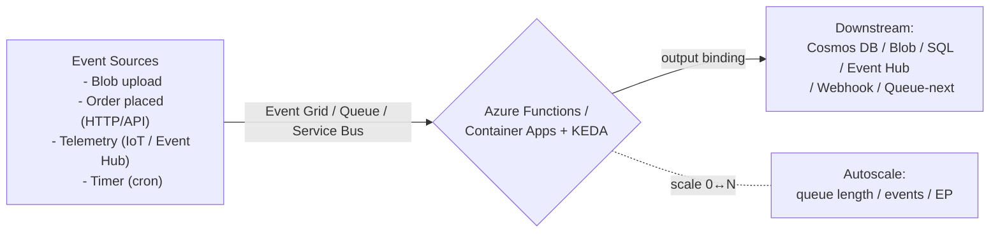

# Day 43: Serverless & Event-Driven — Azure Functions, Durable Functions, Event Grid, KEDA

> Serverless = cloud managed compute, pay-per-execution, auto-scale. Event-driven = system reacts to things (order placed, file uploaded, message in queue) bina polls/empty loops.

## Overview | Parichay

Day 23 me Functions ka basics dekha. Ab **real event-driven architecture**:

**Serverless options (Azure):**
- **Azure Functions** — HTTP, Queue, Timer, Blob, Event Grid, Cosmos triggers
- **Container Apps + KEDA** — containers scale to zero, event-driven
- **Logic Apps / Durable Functions** — workflows, stateful fan-out/fan-in

**Event-Driven pattern (pay only when there's work):**
```
Producer (FileUpload/Order/Telemetry) → Event Grid / Queue / Event Hub
                                     → Consumer (Function) auto-scales (0→N)
                                     → does work → scales back to 0
No idle VMs. No empty while-loops polling. Events drive everything.
```

### Serverless kya hai — pay per execution

**Serverless** ka matlab "server nahi hai" nahi — server cloud provider chalata hai, tum sirf **code chalne ka paisa** dete ho (per execution/per ms), aur scale **automatic** hota hai — 10 req/s ho ya 10,000. Tumhara kaam: function likhna + trigger dena. Scaling, patching, OS, capacity — provider ka. Iska economics twist ye hai ki **idle time free** hai: raat ko 0 requests to 0 bill (scale-to-zero), jabke VM ko 24x7 bharna padta hai. Azure me main options: **Azure Functions** (HTTP, queue, timer, blob, Event Grid, Cosmos triggers), **Container Apps + KEDA** (containers jo zero tak scale karein — apna Docker image chalao par serverless behavior), **Durable Functions** (stateful workflows), **Logic Apps** (low-code integration). Line yaad rakho: serverless = **event-driven economics**; jaise taxi vs apni gaadi — jab chahiye tab bulao, parking ka kharcha nahi.

### Event-driven architecture — poll mat karo, react karo

Classic (request/poll) style me consumer bar-bar poochta hai: "kuch aaya?" — ye **polling** hai: wasted CPU, latency (check ke beech ka gap), aur poor scaling. **Event-driven** me producer ek **event** publish karta hai ("order.placed", "file.uploaded") aur consumer khud trigger hota hai — push, not poll. Pattern:

```
Producer → (Event Grid / Queue / Event Hub) → Consumer(s)
             delivery = push; consumer scale 0<->N by backlog
```

Fayde: **decoupling** (producer ko pata bhi nahi kaun consume karega), **buffering** (traffic spike queue me baith jata hai, consumer aaram se khaata hai), **fan-out** (ek event, kayi consumers — billing, email, analytics), **resilience** (consumer down to events queue me safe). Ye Day 46 ke async patterns ka foundation hai. Trade-off: debugging thodi mushkil (distributed flow), aur **at-least-once delivery** — matlab kabhi duplicate event aa sakta hai, to consumer **idempotent** hona chahiye.

### Triggers vs bindings — Functions ka ABC

Azure Functions me do words baar aate hain: **trigger** (input jo function chalata hai — ek function me exactly ek) aur **binding** (declarative input/output connection — code me manually connect nahi karna). Example: `queueTrigger` message aaya → function chala; uska output seedha `cosmosDB` binding me likh diya — code me Cosmos client banaane ki zaroorat nahi. Triggers ke types: **HTTP** (webhook), **Queue/Service Bus** (background jobs, reliable), **Timer** (cron — report, cleanup), **Blob** (file upload aaya), **Event Grid** (event pub/sub), **Cosmos** (change feed). Pattern pe choose karo: "user ne file dali" → blob trigger; "har raat 2 baje" → timer; "partner webhook" → HTTP; "order pipeline with retry/DLQ" → Service Bus/Queue. Bindings se **plumbing kam**, logic zyada — par hard scenario me code se bhi manually handle kar sakte ho.

### Reliable messaging — queue, Event Grid, Event Hub

Teen messaging options, teen kaam:

| Service | Kya hai | Use case |
|---|---|---|
| **Storage Queue** | simple, cheap, lightweight | chhote async jobs, high volume, basic features |
| **Service Bus** | enterprise queue: sessions, DLQ, transactions, FIFO | order/payment pipelines, strict processing rules |
| **Event Grid** | event routing (pub/sub, filters, retry + DLQ) | reacting to platform events (blob created, resource change) |
| **Event Hub** | high-throughput event ingestion (streaming) | telemetry/IoT, logs — millions of events/sec |

**Dead-letter queue (DLQ)** har jagah zaroori: jo message baar-baar fail ho, wo DLQ me jaata hai — alert + debug, warna poison message pura queue block karta hai. **Guarantees** yaad rakho: queue generally **at-least-once** (duplicate possible, consumer dedupe kare); **exactly-once** mehnge hain (Service Bus transactions, dedupe IDs) — zyadatar systems at-least-once + **idempotency** pe chalte hain. Delivery ke saath **retry policy + exponential backoff** lagao taaki transient error pe storm na bane.

### Durable Functions — stateful workflows bina server ke

Ek problem: workflow me 10 steps hain (validate → payment → inventory → ship), aur beech me crash ho jaye? Har function ko **stateless** rehna padta hai — koi local variable save nahi hota. **Durable Functions** iska solution: tum ek **orchestrator** function likhte ho jo normal code ki tarah likta hai, par platform uska **state checkpoint** karta hai — crash hua to wahi step se resume (deterministic replay). Building blocks: **orchestrator** (flow control, `callActivity`), **activity** (asli kaam — side effects, stateless), **patterns** built-in: **chaining** (A→B→C), **fan-out/fan-in** (parallel activities + `Task.all` result), **monitoring** (long-running checks), **human interaction** (approval wait). Ek example: order ka orchestrator 5 line-items pe parallel `ProcessOrder` chalata hai, sabka result aane pe fan-in summary. Ye "serverless me bhi long-running, multi-step workflow" possible banata hai — bina VM maintain kiye.

### KEDA — containers ka event-driven autoscaling

**KEDA** (Kubernetes Event-driven Autoscaling) woh bridge hai jo containers ko serverless behavior deta hai: pod count **event metric** se chalta hai — queue length, cron schedule, HTTP rate, Prometheus query, custom metrics. `ScaledObject` define karo: `minReplicaCount: 0` (scale to zero!), `maxReplicaCount: 50`, trigger = queue `orders` with `queueLength: 20`. Queue khaali → replicas 0 (bill 0); 1000 messages → KEDA scale-out. Ye **Container Apps / AKS** dono me chalta hai — isliye "serverless containers" ka scene bana hai. KEDA ka fayda: apna Docker image, apni runtime, par economics serverless jaisi. Trigger types ka zoo hain (Azure queues, Kafka, RabbitMQ, cron/"awssqs", etc.). Note: scale-to-zero ke saath **cold start** aata hai — pehla request slow. Latency-tight path pe `minReplicaCount: 1` ya always-ready rakho.

### Cold start, idempotency, aur kab serverless NAHI

**Cold start**: function long time baad chala, to runtime init + code load — 100ms se seconds tak. Mitigations: **Premium plan** (pre-warmed instances), **always-ready** replicas, chhota package/native dependencies, Container Apps me minimum replicas set. **Idempotency** mandatory: at-least-once delivery means same event do baar aa sakta hai — consumer check kare "ye order already processed?" (unique event id store). **Kab serverless nahi**: (1) constant heavy 24x7 load (predictable) → reserved VM/container cheaper; (2) ultra-low latency SLO (cold start risk); (3) heavy GPU/long CPU training → dedicated; (4) kernel/low-level access chahiye → VM. Sawaal interview me: "scale-to-zero vs cold start trade-off?" → cost saving vs latency — per path decide karo (hot path warm, batch path zero). Ek line: serverless = "sahi tool bursty, event-driven, glue kaam ke liye — sab jagah nahi".

## What You'll Learn | Aaj Ki Seekh

- [ ] Triggers vs bindings (input/output), function types
- [ ] Queue (Storage Queue / Service Bus) patterns — reliable decoupling
- [ ] Event Grid — pub/sub routing, event schemas, dead-letter
- [ ] Durable Functions — orchestrator, activity, fan-out/fan-in, checkpointing
- [ ] KEDA — event-driven autoscaling for containers (queue length, cron)
- [ ] Scale-to-zero economics + cold start management
- [ ] When serverless vs when not

## Diagram | Dekho Kaise Kaam Karta Hai



ASCII:
```
Event → Queue → Function (scales with queue depth) → writes result
Durable: orchestrator (state) → fan-out activities → fan-in → checkpoint/retry
KEDA: container scales by event metric (e.g., len(queue), http req/app, custom)
```

## Demo | Copy-Paste Karke Chalao

```bash
# 1. Function with Queue trigger (Storage Queue)
cat > queue-function/index.js << 'EOF'
module.exports = async function (context, myQueueItem) {
  context.log("Processing order:", myQueueItem);
  context.bindings.outputOrder = { id: myQueueItem.id, status: "processed", at: Date.now() };
};
EOF
# function.json:
cat > queue-function/function.json << 'EOF'
{
  "disabled": false,
  "bindings": [
    { "name": "myQueueItem", "type": "queueTrigger", "direction": "in",
      "queueName": "orders", "connection": "AzureWebJobsStorage" },
    { "name": "outputOrder", "type": "cosmosDB", "direction": "out",
      "databaseName": "ordersdb", "collectionName": "orders",
      "connectionStringSetting": "CosmosDB" }
  ],
  "scriptFile": "index.js"
}
EOF

# 2. Event Grid: blob upload → function
# (HTTP webhook) — event arrives on blob create:
az eventgrid event-subscription create -g rg \
  --topic-name my-blob-topic --name sub-func \
  --endpoint <function-app-url>?code=`FUNCTION_KEY`

# 3. Durable Functions (orchestrator)
cat > orchestrator.js << 'EOF'
module.exports = df.orchestrator(function* (context) {
  const items = yield context.df.callActivity("FetchOrders", context.df.instanceId);
  const results = yield context.df.Task.all(
    items.map(o => context.df.callActivity("ProcessOrder", o))
  );
  return { processed: results.length };
});
EOF

# 4. KEDA + Container Apps — scale-to-zero containers
cat > scaled-object.yaml << 'EOF'
apiVersion: keda.sh/v1alpha1
kind: ScaledObject
metadata: { name: order-consumer }
spec:
  scaleTargetRef: { name: order-consumer }
  pollingInterval: 30
  minReplicaCount: 0
  maxReplicaCount: 50
  cooldownPeriod: 120
  triggers:
    - type: azure-queue
      metadata:
        queueLength: "20"
        queueName: orders
        connectionFromEnv: AZURE_STORAGE_CONN
        scaleToZeroPattern: true
EOF

# 5. Cold start mitigation:
# - 'prewarmed' scale, better 'Consumption' → 'Premium (EP)' plan or Flexible consumption
# - Container Apps: 'scale to zero' with small-ish start; go 'AlwaysReady' if SLA-tight
```

## Real-Life Example | Industry Me

**E-commerce order pipeline:**
```
Web/API (order placed) → Service Bus queue
  → Function 'order-validate' (schema + business rules) → Cosmos
  → Function 'order-fulfill' (inventory acks) → payment (timeout/retry)
  → Function 'notification' (email/sms on event grid)
  Durable orchestrator chains steps; fan-out per line item; fan-in summary
  Dead-letter queue = failed with reason; alert.
```
**Behaviors:**
- Payload = event (small), heavy data via reference/URI
- Idempotency: consumer checks `processedOrders` by id
- At-least-once → dedupe in consumer

**When NOT serverless:**
- Constant 24/7 heavy workload (predicted) → dedicated/VM/container better cost
- Very low latency (cold start ~ms on Premium/AlwaysReady, still)
- Long-running>15min (durable solves), heavy GPU/ML training → dedicated
- You need full control/kernel/low-level → VM/containers

## Practice Exercise | Abhi Karein

1. Queue-trigger function: send 50 msgs → function logs processing (scale out on consumption)
2. Order pipeline w/ Durable: fan-out 5 activities, one orchestrator
3. Event Grid + blob upload → function enrichment → Cosmos
4. Container App + KEDA: orders consumer, at 0 replicas → push msgs → scale to 20 then 0
5. Idempotency + dead-letter setup; alarm on dead-letter depth
6. Compare cost: same workload running on serverless vs VM (calculate per hour)

## Quick Notes | Yaad Rakho

```
- Serverless = pay-per-execution + auto-scale to zero; Event-driven = react, don't poll
- Triggers=in, bindings=in/out (queue, blob, cosmos, http...)
- Queue (storage/service bus) = reliable decoupling + dead-letter
- Event Grid = pub/sub routing, event schema, retry w/ dead-letter
- Durable: orchestrator + activity; fan-out/fan-in; checkpoint; retry
- KEDA = event-driven container scaling (queue len, cron, http) even to zero
- Idempotency + dedupe mandatory (at-least-once delivery)
- Cold start: Premium/AlwaysReady for latency-tight; scale-to-zero for bursty/cost control
- Serverless wrong for: constant-heavy, ultra-low-latency, long heavy compute, kernel-level
- Ephemeral/disposable: recovery = re-run pipeline, not restore servers
```

**Agla:** MLOps — ML pipelines, model registry, serving, drift, CI/CD for ML.