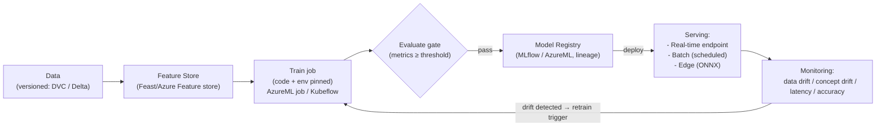

# Day 44: MLOps — ML Pipelines, Model Registry, Serving, Drift, CI/CD for ML

> MLOps = DevOps practices applied to ML: version data, train, evaluate, serve, monitor — automation + reproducibility. Model = just another artifact going through CI/CD (plus data + evaluation gates).

## Overview | Parichay

ML models ship like software but have **extra moving parts**: data, training code, model artifact, serving, drift monitor. MLOps pillars:
1. **Reproducibility** — pin data version + code + env + seed → same model
2. **Pipeline** — data-version → train → evaluate (gates) → register → deploy → monitor
3. **Model Registry** — versioned artifacts, lineage (which data+code made it)
4. **Serving** — real-time (endpoint) / batch (daily scoring) / edge
5. **Monitoring** — data drift, concept drift, accuracy decay, live metrics

Tools: Azure Machine Learning (workspace/pipelines/registry), MLflow (open registry+tracking), Kubeflow (k8s native pipelines), Feast/Feature Store, ONNX for portability, LLMOps now = GenAI ops.

## What You'll Learn | Aaj Ki Seekh

- [ ] ML pipeline stages + gates (data validation, model quality)
- [ ] MLflow / Azure ML tracking + registry pattern
- [ ] Data versioning (DVC / lakeFS / Delta), feature store (Feast)
- [ ] CI/CD for ML: retrain triggers, A/B model serving, canary
- [ ] Serving: REST endpoint, batch, edge; ONNX
- [ ] Drift: data drift (KS-test), concept drift, live accuracy monitoring
- [ ] Azure ML concrete: jobs, endpoints (real-time), model registry, deployment

## Diagram | Dekho Kaise Kaam Karta Hai


ASCII:
```
Data(version) → Train (pinned env) → Eval gate ★ → Registry(lineage) → Serve → Monitor(drift) → Retrain
CI/CD for ML = data change OR code change OR retrain trigger → pipeline (automated)
```

## Demo | Copy-Paste Karke Chalao

```bash
# 1. MLflow tracking (local)
conda create -n ml python=3.11 && conda activate ml
pip install mlflow scikit-learn pandas

cat > train.py << 'EOF'
import mlflow, mlflow.sklearn
from sklearn import datasets, linear_model, model_selection
mlflow.set_experiment("iris-clf")

with mlflow.start_run():
    X, y = datasets.load_iris(return_X_y=True)
    X_tr, X_te, y_tr, y_te = model_selection.train_test_split(X, y, test_size=0.2, random_state=42)
    model = linear_model.LogisticRegression(C=1.0)
    model.fit(X_tr, y_tr)
    acc = model.score(X_te, y_te)
    mlflow.log_param("C", 1.0); mlflow.log_metric("acc", acc)
    mlflow.sklearn.log_model(model, "model")
    print("accuracy:", acc, "  run:", mlflow.active_run().info.run_id)
EOF
python train.py && mlflow ui   # http://127.0.0.1:5000  (runs, params, metrics)

# 2. Azure ML SDK (workspace jobs + registry)
az ml workspace create -g rg -n ml-ws
pip install azure-ai-ml azure-identity
cat > job.yaml << 'EOF'
$schema: https://azuremlschemas.azureedge.net/latest/commandJob.schema.json
type: command
command: python train.py --data ${{inputs.data}}
inputs:
  data:
    type: uri_folder
    path: azureml://datastores/workspaceblobstore/paths/iris
environment:
  image: mcr.microsoft.com/azureml/openmpi4.1.0-ubuntu20.04:latest
compute: cpu-cluster
EOF
az ml job create --file job.yaml --workspace-name ml-ws -g rg

# 3. Model serving (real-time endpoint)
az ml model create --name iris-model --version 1 --path ./model --workspace-name ml-ws -g rg
az ml online-endpoint create -n my-endpoint --workspace-name ml-ws -g rg

# 4. Drift check (KS test concept)
python - << 'EOF'
from scipy import stats
# compare training distribution vs recent live distribution (feature 'sepal len')
ks, p = stats.ks_2samp(train_sepal_len, live_sepal_len)
if p < 0.05: print("drift! retrain or alert -> session")
EOF
```

## Real-Life Example | Industry Me

**Fraud-detection model — full MLOps:**
```
Weekly: new labeled data → data version (Delta) → training job (pinned libs, seed, data-version)
Eval gate: precision ≥0.9, recall ≥0.75, AUC ≥0.95 on holdout → register (MLflow, lineage link)
Deploy: canary 10% live traffic → monitor latency (p99<80ms) + accuracy proxy (dispute rate)
Drift: KS on features + live label proxy (% flagged) → below threshold → auto-retrain ticket
Rollback: registry has previous version — revert endpoint to v42 in minutes
```
**LLMOps (GenAI) extra:** prompt/version, eval sets (human+llm-judges), guardrails (input/output filters), cost/latency budgets, prompt injection/malicious detection, model registry for foundation models, fine-tune pipelines.

Serving pattern: 
```
- Real-time: AzureML online endpoint / AKS via K8s (Triton/ONNX) 
- Batch: databricks/azureml batch — score billions nightly, no spikes
- Edge: ONNX → .NET/IoT (scoring offline) — check ONNX Runtime exporter
```

## Practice Exercise | Abhi Karein

1. MLflow: track 2 runs (different C) — compare in UI, log params/metrics/artifact
2. Azure ML: workspace + command job (iris) — run twice with different data/param
3. Create model registry entry with lineage (which data-version+commit+run)
4. Deploy real-time endpoint — send sample, get score; check latency
5. Simulate drift: make live sample distribution artificially different → KS test fires → document
6. Write "retrain trigger" policy: data-frequency + drift threshold + eval gate

## Quick Notes | Yaad Rakho

```
- Reproduce: data version + code + env + seed all pinned — else "works on my machine"
- Pipeline: data → features → train → eval-gate ★ → registry → serve → monitor → retrain
- Registry = versioned models + lineage (data/code) — this is truth for ops/repro
- CI/CD for ML = data/retrain triggers; CD releases model to endpoint/registry
- Serving: online (endpoint) / batch (nightly) / edge (ONNX)
- Monitoring: data drift (KS), concept drift (accuracy proxy), latency/errors
- Drift = trigger retrain; keep previous model to rollback fast
- Governance: audit lineage, fairness, compliance (SHAP explanation/log)
- LLMOps: prompt versioning, guardrails, evals, cost/latency budgets
```

**Agla:** Data Pipelines & ETL in DevOps — DataOps, dbt, Data Factory, quality gates.