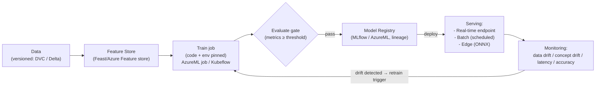

# Day 44: MLOps — ML Pipelines, Model Registry, Serving, Drift, CI/CD for ML

> MLOps = DevOps practices applied to ML: version data, train, evaluate, serve, monitor — automation + reproducibility. Model = just another artifact going through CI/CD (plus data + evaluation gates).

## Overview | Parichay

ML models ship like software but have **extra moving parts**: data, training code, model artifact, serving, drift monitor. MLOps pillars:
1. **Reproducibility** — pin data version + code + env + seed → same model
2. **Pipeline** — data-version → train → evaluate (gates) → register → deploy → monitor
3. **Model Registry** — versioned artifacts, lineage (which data+code made it)
4. **Serving** — real-time (endpoint) / batch (daily scoring) / edge
5. **Monitoring** — data drift, concept drift, accuracy decay, live metrics

Tools: Azure Machine Learning (workspace/pipelines/registry), MLflow (open registry+tracking), Kubeflow (k8s native pipelines), Feast/Feature Store, ONNX for portability, LLMOps now = GenAI ops.

### MLOps kya hai — ML ka DevOps

**MLOps** = DevOps ke practices ML pipeline pe lagana, kyunki ML model sirf code nahi — **data + code + environment + trained artifact** ka bundle hai. Classic software me bug fix = code badlo, test green = deploy. ML me extra problems: (1) model **data pe depend** karta hai — data badla to model stale; (2) training **non-deterministic** hai — same code alag run me alag model de sakta hai (random seeds, library versions); (3) production me model **chup-chaap degrade** hota hai (drift) — error log nahi aata; (4) rollback = pura model version wapas lana, code patch nahi. Isliye chahiye: **reproducibility** (data version + code + env + seed sab pin), **automated pipeline** (manual training = ticket), **registry** (kaunsa model kahan deploy — auditable), **monitoring** (drift detection). Analogy: DevOps ne "works on my machine" mara, MLOps "works on my machine with this dataset at 3pm" ko marta hai.

### Reproducibility — pehla pillar

Reproduce = kisi bhi purane run ko dobara chala kar **exact same (ya close) model** bana sake. Iske liye 4 cheezein pin honi chahiye: **data version** (DVC/lakeFS/Delta — dataset ka snapshot ya pointer), **code version** (git commit), **environment** (conda/pip lock, Docker image, MLflow run ke saath logged), **seed** (random_state set). Ye 4 milke ek **lineage** banate hain: "model v42 = data v17 + commit abc123 + image ml:1.2 + seed 42". Registry me ye lineage store hoti hai — compliance aur debugging dono ke liye. Practically: training job ek parameter le `--data-version`, output artifact tag ho. Bina iske team ka sawal: "pichhla model kahan se aaya?" — jawab nahi milta, aur regression debug karna impossible. Interview me: "reproducible training kaise karoge?" → data versioning + pinned env + seed + registry lineage — ye 4 shabd hi answer hain.

### ML pipeline stages — data se monitor tak

Pipeline = chain of versioned, automated stages:

1. **Data prep/validation** — schema check, null check, train/serve skew check (great-expectations style).
2. **Feature engineering** — **feature store** (Feast/Azure) me features defined once, train aur serve dono same features use karein (**training-serving skew** tab hota hai jab ye alag-alag code ho).
3. **Train job** — pinned environment me, params logged (MLflow/AzureML job).
4. **Evaluate gate** — accuracy/AUC/RMSE thresholds; **pass hi tab deploy** (auto retrain ho to).
5. **Register** — artifact + lineage + stage (staging/production) in **model registry**.
6. **Deploy** — real-time endpoint / batch job / edge export (ONNX).
7. **Monitor** — latency, errors, **data drift**, **concept drift**, accuracy proxy.
8. **Retrain trigger** — drift ya schedule → wapas stage 1.

Ye loop continuous hai — CI/CD for ML ka "C" data change/drift bhi trigger kar sakta hai, sirf code change nahi. Azure ML pipelines / Kubeflow / MLflow Projects — sab isi ko orchestrate karte hain.

### Model registry — models ka version control

**Model registry** = artifact store + metadata: har model ka version, stage (None/Staging/Production/Archived), metrics, params, data link, aur **alias/promote** workflow. MLflow registry simple hai (run se `log_model` → registry me version); Azure ML registry integrated hai endpoints ke saath. Fayde: (1) **rollback** — production model kharab, registry me v41 hai → endpoint point change, 2 minute; (2) **audit** — kaunsa model kab deploy, kiske approval se; (3) **comparison** — v42 vs v41 A/B. Iske bina deployment = koi `model.pkl` kisi server pe — kabhi pata nahi kaunsa chal raha hai. Pattern: train → registry (staging) → **canary/AB** → promote production. Registry hi source of truth hai — "model file share pe hai" MLOps nahi hai.

### Serving — real-time vs batch vs edge

Deploy ka form business question se aata hai: "kitni der me jawab chahiye?"

- **Real-time (online) endpoint** — REST/gRPC, ms-level: fraud check, recommendation. Azure ML online endpoint / AKS + Triton/ONNX. Capacity planning + latency SLO chahiye.
- **Batch scoring** — raat ko job chali, billions rows score kiye, morning report: credit scoring, churn list. Spikes nahi, cheap compute, no endpoint cost.
- **Streaming** — event aaya, model ne score kiya (Event Hub + consumer) — near-real-time.
- **Edge** — model device pe: **ONNX** export → ONNX Runtime (IoT, mobile) — offline, low latency, privacy.

Bolo "fraud $200 payment pe 50ms me block karna hai" → real-time; "monthly newsletter target list" → batch. Portability angle: **ONNX** ek interchange format hai — train PyTorch/TF me, ONNX export, kahin bhi chalao.

### Drift — chup-chaap girta hua model

**Data drift**: production input distribution training data se alag ho gaya (user behavior badla, season aaya). **Concept drift**: input-to-output relationship hi badal gaya (fraud patterns evolve — same input ka sahi label badal gaya). Dono silent killers hain — API 200 return karta rahega, accuracy chup-chaap 90 → 70. Detection: statistical tests (e.g., **KS-test** two samples pe, PSI), feature-distribution comparison training vs live, aur **accuracy proxy** (labels late milte hain to proxy: dispute rate, click-through). Response: alert → investigate → **retrain** (auto ya ticket) → eval gate → registry promote. Threshold tune karo: bahut sensitive = alert fatigue, bahut loose = late pata chalta. Drift monitor ko SLO me bhi daalo: "feature drift score > X for 24h = P2". Ye monitoring ka ek aur signal hai jo sirf ML me exist karta hai — DevOps engineer ko ye naya sikhna padta hai.

### LLMOps — GenAI ke liye MLOps+

LLM apps me same pillars + extras: **prompt versioning** (prompt = code, git me; system prompt badal = model behavior badal), **eval sets** (golden Q&A set + LLM-as-judge + human review — regression test for prompts), **guardrails** (input/output filters — prompt injection, PII, toxic), **cost/latency budgets** (tokens per request track — FinOps se juda), **fine-tune pipelines** (data version + training job + registry wahi), **canary** for model/prompt changes. Retrieval-augmented (RAG) me **vector index freshness** bhi data pipeline hai — index stale to model galat bolega. Ek line: LLMOps = MLOps ka wahi skeleton, par "model quality" ki jagah "response quality + safety + token cost" naye axes hain.

### Interview angle — MLOps sawal

Common: "model deploy kaise karoge?" → registry → canary/AB → endpoint/batch, monitoring ke saath; "drift kya hai?" → data vs concept drift + KS-test/PSI + retrain trigger; "reproducibility kaise?" → data version + env pin + seed + lineage; "CI/CD for ML me C kya trigger karta hai?" → code change + data change + drift/schedule; "rollback?" → registry previous version; "training-serving skew?" → feature store dono jagah. Aur: "MLOps vs normal DevOps difference?" → extra artifacts (data, model) + drift + non-determinism + eval gates. Ek line: MLOps = "model ko bhi artifact maano, pipeline se guzaro, monitor se zinda rakho".

## What You'll Learn | Aaj Ki Seekh

- [ ] ML pipeline stages + gates (data validation, model quality)
- [ ] MLflow / Azure ML tracking + registry pattern
- [ ] Data versioning (DVC / lakeFS / Delta), feature store (Feast)
- [ ] CI/CD for ML: retrain triggers, A/B model serving, canary
- [ ] Serving: REST endpoint, batch, edge; ONNX
- [ ] Drift: data drift (KS-test), concept drift, live accuracy monitoring
- [ ] Azure ML concrete: jobs, endpoints (real-time), model registry, deployment

## Diagram | Dekho Kaise Kaam Karta Hai


ASCII:
```
Data(version) → Train (pinned env) → Eval gate ★ → Registry(lineage) → Serve → Monitor(drift) → Retrain
CI/CD for ML = data change OR code change OR retrain trigger → pipeline (automated)
```

## Demo | Copy-Paste Karke Chalao

```bash
# 1. MLflow tracking (local)
conda create -n ml python=3.11 && conda activate ml
pip install mlflow scikit-learn pandas

cat > train.py << 'EOF'
import mlflow, mlflow.sklearn
from sklearn import datasets, linear_model, model_selection
mlflow.set_experiment("iris-clf")

with mlflow.start_run():
    X, y = datasets.load_iris(return_X_y=True)
    X_tr, X_te, y_tr, y_te = model_selection.train_test_split(X, y, test_size=0.2, random_state=42)
    model = linear_model.LogisticRegression(C=1.0)
    model.fit(X_tr, y_tr)
    acc = model.score(X_te, y_te)
    mlflow.log_param("C", 1.0); mlflow.log_metric("acc", acc)
    mlflow.sklearn.log_model(model, "model")
    print("accuracy:", acc, "  run:", mlflow.active_run().info.run_id)
EOF
python train.py && mlflow ui   # http://127.0.0.1:5000  (runs, params, metrics)

# 2. Azure ML SDK (workspace jobs + registry)
az ml workspace create -g rg -n ml-ws
pip install azure-ai-ml azure-identity
cat > job.yaml << 'EOF'
$schema: https://azuremlschemas.azureedge.net/latest/commandJob.schema.json
type: command
command: python train.py --data ${{inputs.data}}
inputs:
  data:
    type: uri_folder
    path: azureml://datastores/workspaceblobstore/paths/iris
environment:
  image: mcr.microsoft.com/azureml/openmpi4.1.0-ubuntu20.04:latest
compute: cpu-cluster
EOF
az ml job create --file job.yaml --workspace-name ml-ws -g rg

# 3. Model serving (real-time endpoint)
az ml model create --name iris-model --version 1 --path ./model --workspace-name ml-ws -g rg
az ml online-endpoint create -n my-endpoint --workspace-name ml-ws -g rg

# 4. Drift check (KS test concept)
python - << 'EOF'
from scipy import stats
# compare training distribution vs recent live distribution (feature 'sepal len')
ks, p = stats.ks_2samp(train_sepal_len, live_sepal_len)
if p < 0.05: print("drift! retrain or alert -> session")
EOF
```

## Real-Life Example | Industry Me

**Fraud-detection model — full MLOps:**
```
Weekly: new labeled data → data version (Delta) → training job (pinned libs, seed, data-version)
Eval gate: precision ≥0.9, recall ≥0.75, AUC ≥0.95 on holdout → register (MLflow, lineage link)
Deploy: canary 10% live traffic → monitor latency (p99<80ms) + accuracy proxy (dispute rate)
Drift: KS on features + live label proxy (% flagged) → below threshold → auto-retrain ticket
Rollback: registry has previous version — revert endpoint to v42 in minutes
```
**LLMOps (GenAI) extra:** prompt/version, eval sets (human+llm-judges), guardrails (input/output filters), cost/latency budgets, prompt injection/malicious detection, model registry for foundation models, fine-tune pipelines.

Serving pattern: 
```
- Real-time: AzureML online endpoint / AKS via K8s (Triton/ONNX) 
- Batch: databricks/azureml batch — score billions nightly, no spikes
- Edge: ONNX → .NET/IoT (scoring offline) — check ONNX Runtime exporter
```

## Practice Exercise | Abhi Karein

1. MLflow: track 2 runs (different C) — compare in UI, log params/metrics/artifact
2. Azure ML: workspace + command job (iris) — run twice with different data/param
3. Create model registry entry with lineage (which data-version+commit+run)
4. Deploy real-time endpoint — send sample, get score; check latency
5. Simulate drift: make live sample distribution artificially different → KS test fires → document
6. Write "retrain trigger" policy: data-frequency + drift threshold + eval gate

## Quick Notes | Yaad Rakho

```
- Reproduce: data version + code + env + seed all pinned — else "works on my machine"
- Pipeline: data → features → train → eval-gate ★ → registry → serve → monitor → retrain
- Registry = versioned models + lineage (data/code) — this is truth for ops/repro
- CI/CD for ML = data/retrain triggers; CD releases model to endpoint/registry
- Serving: online (endpoint) / batch (nightly) / edge (ONNX)
- Monitoring: data drift (KS), concept drift (accuracy proxy), latency/errors
- Drift = trigger retrain; keep previous model to rollback fast
- Governance: audit lineage, fairness, compliance (SHAP explanation/log)
- LLMOps: prompt versioning, guardrails, evals, cost/latency budgets
```

**Agla:** Data Pipelines & ETL in DevOps — DataOps, dbt, Data Factory, quality gates.