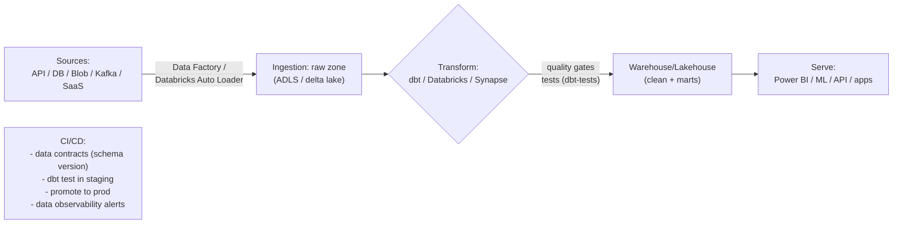

# Day 45: Data Pipelines & DataOps — ETL/ELT, Data Factory, dbt, Data Quality Gates

> Data pipelines = data ko raw → clean → transformed → usable for dashboards/ML, reliably and repeatedly. DataOps = DevOps discipline for data: versioned, CI/CD-able, monitored, quality-gated.

## Overview | Parichay

Data is just another product: it needs build (ETL), test (quality), deploy (schema), monitor (freshness/volume/anomaly), version (git + schema migrations), and CI/CD. Concepts:
- **ETL** (Extract-Transform-Load) — transform before landing; classic
- **ELT** (Extract-Load-Transform) — load raw to warehouse, transform in-warehouse (dbt) — scalable/cloud
- **Data sources** → Ingestion (Azure Data Factory / Databricks Auto Loader / WAF) → Warehouse/Lakehouse (Synapse/Databricks/ADLS) → Modeling (dbt) → Serve (Power BI/ML)
- Quality gates: null-rate, referential integrity, freshness, volume, schema drift

Azure Data Factory: pipelines with activities (Copy, Data Flow, Run Synapse/dbt), triggers (schedule/event), linked services == connectors. dbt = SQL transformations versioned+tested (like Terraform for data models).

### DataOps kya hai — data ko bhi product banao

**DataOps** = DevOps ki wahi discipline data pipelines pe: version control (git), CI/CD (PR → test → promote), automated testing, monitoring, aur collaboration. Kyun zaroori? Kyunki data teams ki classic problem hai: "dashboard galat dikha raha hai" / "report aaj bhi nahi aaya" / "upstream ne column delete kar diya aur sab toot gaya" — ye sab wahi diseases hain jo app dev me CI/CD + tests ne theem ki. Data ka farak ye hai ki **breakage silent** hota hai — API 500 de to turant alert, par pipeline ne 2 ghante purana data bhej diya to koi error nahi, bas galat decision. Isliye DataOps ka core: **har pipeline ka SLA** (freshness, volume), **har transform ka test**, **har schema change ka version/contract**. Analogy: app code = recipe jo tum roz banate ho; data pipeline = factory conveyor jo 24x7 chalta hai — usme bhi inspection line (quality gates) chahiye.

### ETL vs ELT — aur lakehouse ka rise

**ETL** (Extract-Transform-Load): data pehle uthao, raaste me **transform** karo, phir warehouse me daalo — classic, on-prem era ka pattern (compute mehnga tha). **ELT** (Extract-Load-Transform): pehle **raw** data warehouse/lake me daalo, phir warehouse ke apne power se **transform** karo — cloud era pattern (storage sasta, warehouse compute on-demand, aur raw data rehta hai re-tries/reprocessing ke liye). Aaj zyadatar modern stacks **ELT** hain: Data Factory se copy → ADLS/Delta raw zone → **dbt** se transform. **Lakehouse** ye idea aage badhata hai: lake (cheap raw, any schema) + warehouse (tables, SQL, ACID) ek jagah — Delta Lake/Iceberg format. Decision: compliance pehle hi mask karna ho to PII pehle transform (ETL-ish); otherwise ELT simpler + auditable kyunki raw copy bacha rehta hai. Interview me ye comparison 100% aata hai — 2 line ka farak yaad rakho.

### Ingestion patterns — data andar kaise aata hai

Ingestion ke teen patterns: (1) **Schedule-based (batch)** — har ghante/har raat copy — simple, default. (2) **Event/tumbling triggers** — naya file aaya, event aaya to pipeline chalu (Event Grid/blob events) — near-real-time. (3) **CDC (Change Data Capture)** — source DB ke inserts/updates stream hote hain (Debezium, Data Factory CDC) — log-based, low source impact, continuously fresh. Har source ka connector: APIs (Stripe, SaaS), SQL DBs, files (blob/FTP), streams (Kafka/Event Hub). **Data Factory** me ye sab **linked service** (connection) + **dataset** (shape) + **pipeline** (activity chain) + **trigger** (kab) ke roop me model hote hain; **integration runtime** compute chalata hai (Azure-managed vs self-hosted — jab source on-prem ho). Gotcha: ingestion me **idempotency + watermark** (kis timestamp tak le liya) rakho — re-run pe duplicate/f loss na ho.

### dbt — data transformations ka Terraform

**dbt** = SQL transforms ko **versioned, tested, documented** packages banata hai (jaise Terraform ne infra ko code banaya). Structure: **models** = SQL files (files in, tables/views out); layers: **staging** (`stg_*` — clean, rename, type cast, 1:1) → **intermediate** → **marts** (`fct_*`, `dim_*` — business marts). `{{ ref('stg_orders') }}` dependency graph dbt khud build karta hai — DAG, incremental builds. **Tests** dbt ka dil: built-in `not_null`, `unique`, `accepted_values`, `relationships` + generic/custom tests (e.g., `dbt_expectations`). `dbt run && dbt test` = build + test, CI me seedha gate. **Docs + lineage graph** (`dbt docs generate`) — "ye column kahan se aata hai" ka instant jawab. Incremental models large data pe efficient re-run dete hain. Ye sab git me rehta hai — PR pe staging run, merge pe prod — bilkul app CI/CD jaisa. Data engineers ke liye dbt ne "analytics engineering" role bana diya — SQL + engineering discipline.

### Quality gates aur data contracts

Pipeline ke end (ya beech me) **quality gates**: (1) **schema tests** (dbt test — not_null/unique/range), (2) **freshness** (source `loaded_at` kitna purana? warn/error thresholds), (3) **volume** (row count aaj 50% kam aaya = anomaly), (4) **referential integrity** (orphan foreign keys), (5) **schema drift** (column hat gaya/typa badal gaya). Gate fail → pipeline fail → alert + ticket, **blind dashboard refresh nahi**. **Data contracts** = producer aur consumer ke beech likha hua agreement: schema + types + SLAs (freshness) + owner — versioned like API, break hone pe producer ko pata chalta hai. Tools ladder: dbt tests (base) → Elementary/Monte Carlo-style **data observability** (freshness/volume/schema across sources) → incident routing. Ye sab "trust" banate hain — jab tak trust nahi, har report ke saath Excel cross-check chalta rahega.

### CI/CD for data — app jaisa promotion

Pipeline me code (dbt models, ADF definitions) git me hota hai, to promotion flow same: **PR → CI me `dbt build` staging warehouse pe (tests must pass) → merge → deploy to prod** (dbt Cloud job / ADF Git integration publish). Data Factory ka **ARM/deployment pipelines** ya Terraform/Bicep se infra; dbt code CI se. Extra twist: **migrations** (schema change prod me — expand-contract pattern use karo jaise app DB migrations) aur **backfill** (purana data dobara bharna — idempotent re-run). Prod data pe directly experimentation kabhi nahi — staging/synthetic data. Review: data model PR me tests + docs diff dekho, code jaisa hi. Ye step chhodne pe purana wali duniya: "notebook someone laptop pe" — DataOps nahi, chaos hai.

### Monitoring — freshness, volume, SLA

Data pipelines ka monitoring app se thoda alag: latency/error ke saath **content-based signals** chahiye: **freshness** (kitna time ho gaya data aaye — SLA miss = business blind), **volume** (rows/day drop/increase), **schema drift** (column added/removed), **distribution anomaly** (revenue 0 dikha raha — query bug?), **failed/delayed runs** (scheduler level). Alert = severity se: warn (freshness 2h) → error (6h + owner). Har pipeline ka **documented SLA** ("daily by 06:00 IST, freshness < 26h") — stakeholders ko pata hona chahiye. Dashboards: pipeline run history, SLA compliance %, test failure trends. Ye **data observability** layer hai — Day 47 ke app performance SLO ke barabar important, bas metric alag. Gotcha: alert sirf "job failed" pe nahi, "job success but 0 rows" pe bhi chahiye — silent success sabse khatarnak.

### Interview angle — data pipeline sawal

Common: "ETL vs ELT?" → transform placement + lakehouse rationale; "dbt kya karta hai?" → SQL models + tests + docs + DAG, Terraform-for-data analogy; "pipeline kaise test karoge?" → dbt tests in CI + freshness + data contract; "bad data rokne ka tarika?" → quality gates + contracts + observability, fail loud; "orchestration tool?" → Data Factory/Airflow/Dagster — activities, triggers, retries; "idempotent re-run?" → overwrite/partition/watermark design; "schema change handle?" → contract + expand-contract migration. Ek line: DataOps = "data pipeline bhi production service hai — SLA, tests, on-call chahiye, spreadsheet nahi".

## What You'll Learn | Aaj Ki Seekh

- [ ] ETL vs ELT + modern lakehouse
- [ ] Data Factory: linked services, datasets, pipelines, triggers, integration runtime
- [ ] Ingestion patterns: schedule, event/tumbling, CDC
- [ ] dbt core: models, tests (singular/generic), docs, run
- [ ] Data quality gates + schema onboarding (data contracts)
- [ ] CI/CD for dbt (test in staging, promote to prod) — like your app pipeline
- [ ] Monitoring: freshness, volume, anomaly — data SLAs/Alerting

## Diagram | Dekho Kaise Kaam Karta Hai


ASCII:
```
raw → landing lake → transform(dbt models, SQL, tested) → marts → BI/ML
DataOps: git versioned models + schema tests + scheduled & monitored via Data Factory
```

## Demo | Copy-Paste Karke Chalao

```bash
# 1. Azure Data Factory: minimal CLI
az datafactory create -g rg -n adf-devops
az datafactory factory get-git-hub-access-token  # connect repo (CI/CD recommendation)

# 2. dbt project (models + tests, git-versioned)
pip install dbt-core dbt-snowflake   # or dbt-azure/dbt-synapse/dbt-databricks
dbt init my_project && cd my_project

cat > models/staging/stg_orders.sql << 'EOF'
SELECT
    id,
    customer_id,
    amount,
    status,
    created_at
FROM {{ source('shop', 'orders') }}
WHERE created_at >= '2024-01-01'
EOF

cat > models/marts/order_daily.sql << 'EOF'
SELECT date_trunc('day', created_at) as day,
       count(distinct id) as orders,
       sum(amount) as revenue
FROM {{ ref('stg_orders') }}
GROUP BY 1
EOF

cat > models/schema.yml << 'EOF'
version: 2
models:
  - name: stg_orders
    columns:
      - name: id
        tests: [not_null, unique]
      - name: amount
        tests:
          - not_null
          - dbt_expectations.expect_column_values_to_be_between:
              min_value: 0
sources:
  - name: shop
    tables:
      - name: orders
        freshness:
          warn_after: { count: 2, period: hour }
          error_after: { count: 6, period: hour }
        loaded_at_field: created_at
EOF

dbt deps && dbt run && dbt test && dbt docs generate
# CI: run `dbt build --select stg_*+` in staging on PR → gate on tests

# 3. Data Factory pipeline (ELT trigger → dbt)
# pipeline: Copy (API/SQL→landing) → dbt run --select stg_+ marts → monitor SLA
```

## Real-Life Example | Industry Me

**Data platform for a SaaS B2B:**
```
Daily 06:00: Data Factory (scheduled/tumbling) ingests: Stripe API, HubSpot, warehouse DB → ADLS raw
dbt: stg_* (clean, rename, type) → marts (dim/fact) → semantic layer → Power BI live
Quality gates at pipeline end: dbt test (not_null/unique/range) + freshness monitoring (+data observability alerts)
On fail: slack alert + ticket, no blind refresh — SLA documented per pipeline
CI/CD: dbt branches per PR → run staging → promote model+contract to prod schema (like your app)
```
**Data contracts** = schema + expectations (tests) defined with producers — prevents silent breakage; version them like API.

Freshness/volume monitoring — look for "data observability": e.g., dbt-expectations, Elementary, Monte Carlo; alert on "no data arrived" (SLA miss) as much as validation failure.

Practice: transform the "Delivery Monitoring" idea — daily log of k8s events into warehouse via Data Factory, dbt models, Power BI report.

## Practice Exercise | Abhi Karein

1. ADF: linked service to Azure SQL → copy to ADLS (or local demo: `docker run mcr.microsoft.com/mssql...` + sqlcmd)
2. dbt: init + models (stg/marts) + tests (not_null/unique/freshness) → `dbt run && dbt test`
3. Add a failing model → watch CI gate fail → fix test/query
4. Schedule via Data Factory trigger (tumbling every day) + alert on failure
5. Version dbt in git; produce `dbt docs serve` — data lineage graph
6. Write a data contract for your project's orders table

## Quick Notes | Yaad Rakho

```
- ETL (transform-before-load, classic) vs ELT (load-then-transform, cloud/warehouse)
- Data Factory = orchestration/connectors; dbt = SQL modeling versioned+tested
- Raw landing → stg (clean) → marts (semantic) → serve (BI/ML)
- Quality gates: not_null/unique/range/freshness + volume anomaly → gate in CI/CD
- Data contracts (schema+tests) keep producers/consumers happy; version them
- CI/CD for data = staging + dbt test + promote (branch→merge→prod run)
- Data observability: freshness, volume, schema drift, SLA alerts — act on misses
- Re-run pipelines are cheap; design idempotent (dbt handles incremental)
- Monitor = SLA per pipeline; failure = alert + runbook
```

**Agla:** API Gateways & Microservices Patterns — resilience, auth, rate limiting, API versioning.