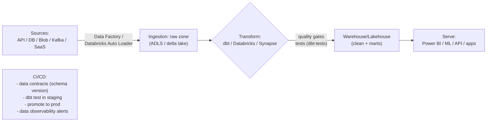

# Day 45: Data Pipelines & DataOps — ETL/ELT, Data Factory, dbt, Data Quality Gates

> Data pipelines = data ko raw → clean → transformed → usable for dashboards/ML, reliably and repeatedly. DataOps = DevOps discipline for data: versioned, CI/CD-able, monitored, quality-gated.

## Overview | Parichay

Data is just another product: it needs build (ETL), test (quality), deploy (schema), monitor (freshness/volume/anomaly), version (git + schema migrations), and CI/CD. Concepts:
- **ETL** (Extract-Transform-Load) — transform before landing; classic
- **ELT** (Extract-Load-Transform) — load raw to warehouse, transform in-warehouse (dbt) — scalable/cloud
- **Data sources** → Ingestion (Azure Data Factory / Databricks Auto Loader / WAF) → Warehouse/Lakehouse (Synapse/Databricks/ADLS) → Modeling (dbt) → Serve (Power BI/ML)
- Quality gates: null-rate, referential integrity, freshness, volume, schema drift

Azure Data Factory: pipelines with activities (Copy, Data Flow, Run Synapse/dbt), triggers (schedule/event), linked services == connectors. dbt = SQL transformations versioned+tested (like Terraform for data models).

## What You'll Learn | Aaj Ki Seekh

- [ ] ETL vs ELT + modern lakehouse
- [ ] Data Factory: linked services, datasets, pipelines, triggers, integration runtime
- [ ] Ingestion patterns: schedule, event/tumbling, CDC
- [ ] dbt core: models, tests (singular/generic), docs, run
- [ ] Data quality gates + schema onboarding (data contracts)
- [ ] CI/CD for dbt (test in staging, promote to prod) — like your app pipeline
- [ ] Monitoring: freshness, volume, anomaly — data SLAs/Alerting

## Diagram | Dekho Kaise Kaam Karta Hai


ASCII:
```
raw → landing lake → transform(dbt models, SQL, tested) → marts → BI/ML
DataOps: git versioned models + schema tests + scheduled & monitored via Data Factory
```

## Demo | Copy-Paste Karke Chalao

```bash
# 1. Azure Data Factory: minimal CLI
az datafactory create -g rg -n adf-devops
az datafactory factory get-git-hub-access-token  # connect repo (CI/CD recommendation)

# 2. dbt project (models + tests, git-versioned)
pip install dbt-core dbt-snowflake   # or dbt-azure/dbt-synapse/dbt-databricks
dbt init my_project && cd my_project

cat > models/staging/stg_orders.sql << 'EOF'
SELECT
    id,
    customer_id,
    amount,
    status,
    created_at
FROM {{ source('shop', 'orders') }}
WHERE created_at >= '2024-01-01'
EOF

cat > models/marts/order_daily.sql << 'EOF'
SELECT date_trunc('day', created_at) as day,
       count(distinct id) as orders,
       sum(amount) as revenue
FROM {{ ref('stg_orders') }}
GROUP BY 1
EOF

cat > models/schema.yml << 'EOF'
version: 2
models:
  - name: stg_orders
    columns:
      - name: id
        tests: [not_null, unique]
      - name: amount
        tests:
          - not_null
          - dbt_expectations.expect_column_values_to_be_between:
              min_value: 0
sources:
  - name: shop
    tables:
      - name: orders
        freshness:
          warn_after: { count: 2, period: hour }
          error_after: { count: 6, period: hour }
        loaded_at_field: created_at
EOF

dbt deps && dbt run && dbt test && dbt docs generate
# CI: run `dbt build --select stg_*+` in staging on PR → gate on tests

# 3. Data Factory pipeline (ELT trigger → dbt)
# pipeline: Copy (API/SQL→landing) → dbt run --select stg_+ marts → monitor SLA
```

## Real-Life Example | Industry Me

**Data platform for a SaaS B2B:**
```
Daily 06:00: Data Factory (scheduled/tumbling) ingests: Stripe API, HubSpot, warehouse DB → ADLS raw
dbt: stg_* (clean, rename, type) → marts (dim/fact) → semantic layer → Power BI live
Quality gates at pipeline end: dbt test (not_null/unique/range) + freshness monitoring (+data observability alerts)
On fail: slack alert + ticket, no blind refresh — SLA documented per pipeline
CI/CD: dbt branches per PR → run staging → promote model+contract to prod schema (like your app)
```
**Data contracts** = schema + expectations (tests) defined with producers — prevents silent breakage; version them like API.

Freshness/volume monitoring — look for "data observability": e.g., dbt-expectations, Elementary, Monte Carlo; alert on "no data arrived" (SLA miss) as much as validation failure.

Practice: transform the "Delivery Monitoring" idea — daily log of k8s events into warehouse via Data Factory, dbt models, Power BI report.

## Practice Exercise | Abhi Karein

1. ADF: linked service to Azure SQL → copy to ADLS (or local demo: `docker run mcr.microsoft.com/mssql...` + sqlcmd)
2. dbt: init + models (stg/marts) + tests (not_null/unique/freshness) → `dbt run && dbt test`
3. Add a failing model → watch CI gate fail → fix test/query
4. Schedule via Data Factory trigger (tumbling every day) + alert on failure
5. Version dbt in git; produce `dbt docs serve` — data lineage graph
6. Write a data contract for your project's orders table

## Quick Notes | Yaad Rakho

```
- ETL (transform-before-load, classic) vs ELT (load-then-transform, cloud/warehouse)
- Data Factory = orchestration/connectors; dbt = SQL modeling versioned+tested
- Raw landing → stg (clean) → marts (semantic) → serve (BI/ML)
- Quality gates: not_null/unique/range/freshness + volume anomaly → gate in CI/CD
- Data contracts (schema+tests) keep producers/consumers happy; version them
- CI/CD for data = staging + dbt test + promote (branch→merge→prod run)
- Data observability: freshness, volume, schema drift, SLA alerts — act on misses
- Re-run pipelines are cheap; design idempotent (dbt handles incremental)
- Monitor = SLA per pipeline; failure = alert + runbook
```

**Agla:** API Gateways & Microservices Patterns — resilience, auth, rate limiting, API versioning.