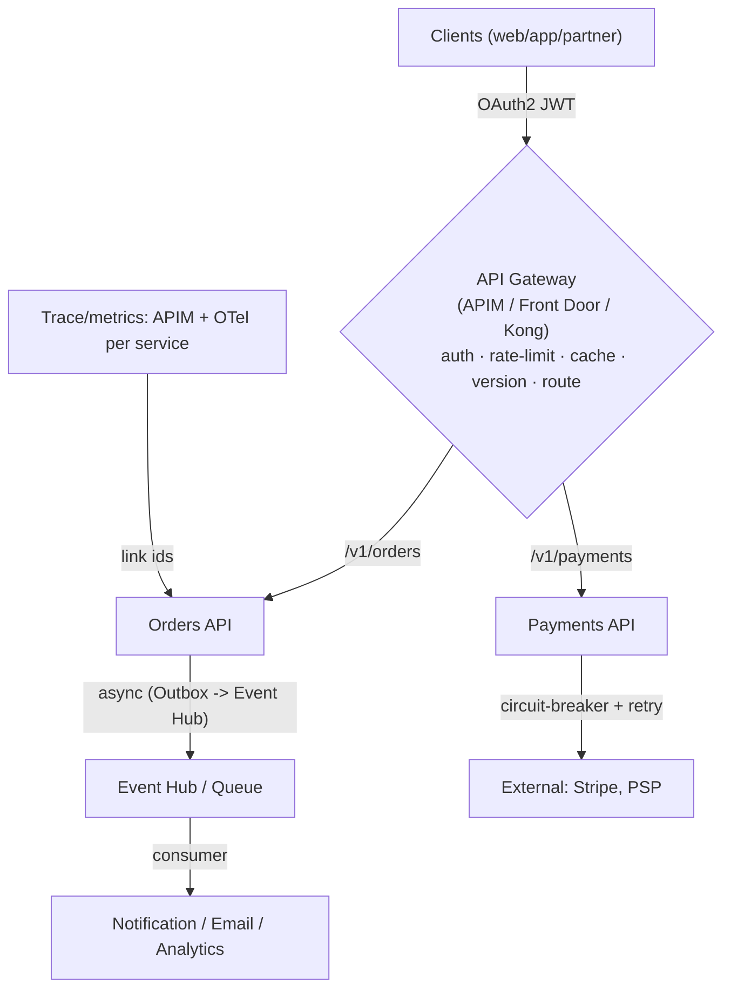

# Day 46: API Gateways & Microservices Patterns — Resilience, Auth, Rate Limit, Versioning

> APIs = product. Gateway = one door for all APIs (auth, routing, rate-limit, caching, observability). Microservices patterns = how services talk without breaking (retries, circuit breaker, idempotency, events).

## Overview | Parichay

Microservices strategy ke liye: patterns ek toolkit — **not every service needs every pattern**, choose deliberately.
- **API Gateway**: single entry (Azure API Management / Azure Front Door / Kong / APIM). Auth (OAuth2/JWT), rate limiting, versioning, request transformation, caching, mTLS, analytics.
- **Communication**: sync (REST/gRPC) vs async (Queue/Event Hub). Prefer async for long jobs; sync for simple requests.
- **Resilience**: retries w/ backoff+Jitter, timeouts, circuit breakers (Polly/Resilience4j), bulkheads, idempotency (retries safe), event-driven so producer/consumer decouple.
- **Deploy/discover registry**: Eureka/Consul, or k8s Service; GitOps rollout; blue/green/canary.
- **Versioning**: URI (`/v1/`), header/content-type, compatibility matrix; deprecation policy.

### API Gateway — sab APIs ka ek darwaza

**API Gateway** = client aur beech me ek entry point jo cross-cutting concerns khud sambhalta hai, taaki har service me same code na likhna pade. Kaam: **auth** (OAuth2/JWT validate — service ko sirf trusted request dikhe), **rate limiting** (ek client 60 rpm se zyada nahi — abuse/blast control), **routing** (`/orders` → orders service, `/payments` → payments), **versioning** (`/v1` vs `/v2` same backend switch), **transformation** (header add, body shape), **caching** (GET catalog cache — backend pe load kam), **TLS termination + mTLS**, **analytics** (latency/error per API), **CORS**. Tools: **Azure API Management (APIM)** (enterprise, policies XML), **Kong** (open-source), **Azure Front Door** (global L7 + WAF, layer-7 edge), NGINX/Traefik (simpler reverse proxy). Scale-wise: north-south (client → service) traffic gateway pe; east-west (service → service) ka kaam **service mesh** (Day 33) ka hai — dono ka line clear rakho.

### Kab gateway, kab direct, kab service mesh

Sawaal: "har service pe sidha auth code likh doon ya gateway lagaoon?" Decision tree: agar **sab APIs ko ek jagah se govern** karna hai (auth, rate limit, analytics ek baar) → **gateway**. Agar ek legacy monolith ko gradually expose karna hai → gateway facade. Agar **internal service-to-service** concerns hain (mTLS, retry, telemetry between pods) → **mesh**, gateway nahi. Agar sirf reverse proxy chahiye (path routing, TLS) → NGINX/Traefik kaafi. Gotchas: gateway **single point of failure** — usko bhi HA/SLA chahiye; gateway pe **business logic mat daalo** (thoda auth/rate OK, pura workflow nahi — warna gateway = new monolith); **latency** gateway se +1 hop — critically fast path pe dhyan. Best practice: gateway = policy + routing plane, services = domain logic. Interview me line: "gateway for north-south edge concerns, mesh for east-west, services for business logic."

### Resilience patterns — timeout, retry, circuit breaker, bulkhead

Distributed system me failure normal hai — **resilience patterns** blast radius ko control karte hain (ye chaos engineering ka answer bhi hain):

- **Timeout** — har call pe max wait: bina iske ek slow dependency puri chain block karti hai (lineage me sabse pehle lagao).
- **Retry + exponential backoff + jitter** — transient errors (network blip) recover karo; par **bina jitter ke** sab clients ek saath retry karte hain (thundering herd); **limited retries** warna retry storm.
- **Circuit breaker** — downstream X% fail ho raha hai to turant fail-fast (circuit OPEN), thodi der baad probe (HALF-OPEN) — failing service ko breathe karne dete ho, apne threads bachate ho. Polly (.NET)/Resilience4j (Java) me built-in.
- **Bulkhead** — alag resource pools: ek client (heavy) doosre ko starve na kare — jaise ship ke compartments.
- **Fallback** — circuit open ho to cached/default response do (optional/quality degradations ke saath).

Ye sab ek **pipeline** ki tarah lagte hain: timeout → retry → breaker → bulkhead. Aur remember: retry tabhi safe hai jab operation **idempotent** ho.

### Idempotency — retries ka asli answer

Problem: client ne `POST /payments` bheja, response network me kho gaya — client ko nahi pata hua ya nahi. Retry kare to **double charge** risk. Solution: **Idempotency-Key** header — client har logical operation ka unique key bheje; server key → result store kare; same key dobara aaye to **naya process nahi, stored result wapas**. Pattern: `key = (key: userId+orderId+amount)` → DB unique constraint / cache lookup → duplicate pe 200 with same response. Ye har write API pe lagta hai jahan retry hai (payment, order create, webhook handlers). Consumer side bhi wahi: queue me event `eventId` se dedupe. Ek line: "retries without idempotency = distributed double-spend"; isliye resilience bank incomplete hai idempotency ke bina.

### Async patterns — queue, outbox, saga

Sync REST theek hai simple request-reply ke liye; **async** tab jab: kaam lamba hai (email, report), producer ko consumer ka fate na pata ho, burst absorb karne ho, ya multi-service workflow ho.

- **Queue + consumer** — basic decoupling: order service likh ke queue me daal de, notification service consume kare. Producer down → queue buffer.
- **Transactional outbox** — real problem: DB me order save + queue me event dono atomic nahi (ek fail = half state). Solution: same transaction me **outbox table** me row likho; alag **dispatcher** outbox se event publish kare (at-least-once) — no lost events.
- **Event bus** (Event Grid/Service Bus topics) — fan-out: ek event, N subscribers.
- **Saga** — multi-step distributed transaction (order → payment → inventory) jahan **rollback ki jagah compensating action** ho (payment refund, inventory release). Choreography (events) vs orchestration (central coordinator) — dono flavors.

In sab me **consumer idempotent** hona universal rule hai (at-least-once delivery). Ye patterns Day 43 ke serverless se directly juday hain — wahan KEDA/Functions, yahan general design.

### Versioning aur deprecation lifecycle

API change karna hi hai (features) — sawal "todenge kaise bina tod ke". Options: **URI version** (`/v1`, `/v2` — visible, simple, zyadatar kaam karta hai), **header version** (`Accept: application/vnd.api+2` — cleaner URL, thoda complex), **query param** (simple but cache-unfriendly). Policy likho: (1) **backward-compatible changes** = same version me (naya optional field OK; existing field behavior mat badlo); (2) breaking change (field remove/rename) = **naya version**; (3) **old version N months** rakho (e.g., 12) with **deprecation header** + docs + sunset date; (4) consumers ko migration guide; (5) usage metrics se confirm ki koi old version use nahi kar raha → tab remove. Deprecation bina process ke = ya to tod doge kisi ka integration, ya "v1 forever" legacy bana rahega — dono kharab. Interview me: "breaking change to karna hai" → version bump + deprecation window + compatibility matrix.

### Observability aur mesh/gateway line

Har API pe chahiye: **latency percentiles + error rate + saturation** (Day 47 RED), **APIM analytics** (per-API, per-caller), aur **distributed tracing** — ek `trace-id` gateway me generate → har downstream header me propagate → queue ke message me bhi carry → consumer log me. Bina propagation ke multi-service request debug karna blindfold hai. Gateway ke metrics (429 rate = kitne requests rate-limit hue, 5xx by backend) alerting ke liye golden. Mesh (Istio) east-west metrics + mTLS deta hai; gateway edge pe karta hai — dono ke dashboards alag honge. Patterns = **menu, not mandatory**: har service pe sab lagane ki zaroorat nahi — failure/scale real ho tab lagao. Interview summary: gateway features + resilience bank + idempotency + outbox/saga + versioning — ye 5 blocks is day ke sawal hain.

## What You'll Learn | Aaj Ki Seekh

- [ ] Gateway features (APIM): auth, rate limit, caching, cors, versioning, analytics
- [ ] Gateway forwarding vs backend direct — when gateway, when service mesh
- [ ] Resilience patterns: Timeout + Retry + Circuit Breaker + Bulkhead (Polly)
- [ ] Idempotency keys — safe retries
- [ ] Async patterns: outbox, event bus, saga
- [ ] API versioning + deprecation lifecycle
- [ ] Observability across APIs (traces/APIM metrics)

## Diagram | Dekho Kaise Kaam Karta Hai



ASCII:
```
Client → Gateway (auth/rate/version) → service (sync REST/gRPC)
    resilience in service: timeout/retry/circuit-broken (Polly)
    async via queue/outbox — services decoupled, idempotent handlers
```

## Demo | Copy-Paste Karke Chalao

```bash
# 1. APIM: import OpenAPI + policies (rate limit + JWT)
# polish example - policy snippet:
cat > policy.xml << 'EOF'
<inbound>
  <base />
  <validate-jwt header-name="Authorization" failed-validation-httpcode="401" require-expiration-time="true">
    <openid-config url="https://login.microsoftonline.com/<tenant>/.well-known/openid-configuration" />
  </validate-jwt>
  <rate-limit calls="60" renewal-period="60" />
  <set-header name="X-Api-Request-Id" exists-action="override">
    <value>@(context.RequestId.ToString())</value>
  </set-header>
</inbound>
EOF

# 2. Resilience in .NET (Polly):
dotnet add package Polly
cat > res.cs << 'EOF'
var pipeline = new ResiliencePipelineBuilder()
    .AddRetry(new RetryStrategyOptions {
        MaxRetryAttempts = 3,
        BackoffType = BackoffType.Exponential,
        Delay = TimeSpan.FromMilliseconds(200),
        OnRetry = _ => { /* log attempt */ return default; }
    })
    .AddCircuitBreaker(new CircuitBreakerStrategyOptions {
        FailureRatio = 0.5,
        MinimumThroughput = 20,
        SamplingDuration = TimeSpan.FromSeconds(30),
        BreakDuration = TimeSpan.FromSeconds(15)
    })
    .AddTimeout(TimeSpan.FromSeconds(5))
    .Build();

await pipeline.ExecuteAsync(async ct =>
    await httpClient.PostAsync("/payments", payload, ct));
EOF

# 3. Idempotency (server-side): accept Idempotency-Key header
# POST /payments  Idempotency-Key: 7be... → cache result by key; same key = same result

# 4. Outbox pattern (transactional outbox for async): write order + outbox row transaction
#   dispatcher reads outbox → publish to queue → mark sent (retry-safe)

# 5. Versioning: /v1, /v2 headers — APIM rewrite to backend version
```

## Real-Life Example | Industry Me

**Payments service — what production looks like:**
```
Gateway: APIM validates JWT, rate-limits per client (60 rpm), caches GET catalog
Orders: POST /orders with Idempotency-Key (global order-id) → DB insert + outbox row (same txn)
Outbox dispatcher → queue → email/notify (async, can't hold HTTP for email)
Payments: retry 3x exp-backoff+jitter; circuit opens after 50% fail 30s sampling → 15s cooldown
Versioning: /v2 launch → v1 kept 12 months with deprecation header + roadmap doc
Observability: APIM metrics (latency/error per API), traces (trace-id across orders+payments+queue)
```
Hmm — each pattern has a reason, none added randomly:
```
Retry      → transient network/lock errors recoverable
Circuit br → avoid hammering failing downstream (contains blast radius)
Bulkhead   → one client's slowness doesn't starve others (separate pools)
Idempotency → safe retries without double-charge
Outbox     → DB + queue atomic (no lost events / no halves)
Saga       → multi-step (order→payment→inventory) with compensating action on fail
```

## Practice Exercise | Abhi Karein

1. APIM: import any OpenAPI, apply JWT + rate-limit policy, call 61st request → 429
2. Build retry/circuit-breaker demo (Polly) calling a flaky endpoint (fail every 3rd)
3. Add Timeout — slow endpoint → fail fast; log attempt counts
4. Implement idempotency key on POST endpoint (store by key, return cached)
5. Outbox: insert order+outbox in single SQL txn; poll outbox → queue; process
6. Version: create /v1 and /v2, document deprecation policy in README

## Quick Notes | Yaad Rakho

```
- Gateway = single door: auth (JWT/OAuth2), rate-limit, caching, version, analytics
- Resilience bank: timeout → retry(backoff+jitter) → circuit breaker → bulkhead
- Idempotency-key: retry-safe POST (store key→result), verify APIs duplicated-safe
- Async via queue/outbox: decouple + survive bursts; saga for multi-step with compensation
- Event-driven: consumer idempotent, producer doesn't wait
- Versioning: URI/header; keep old N months; deprecation notice; compatibility lock-step
- Observability: APIM metrics + propagation (trace-id) across HTTP→queue→consumer
- Mesh vs gateway: north-south = gateway (APIM); east-west = service mesh (Day 33)
- Patterns = menu, not mandatory: apply where failure/scale actually warrants
```

**Agla:** Performance Engineering — caching, CDN, autoscaling, profiling, load testing.