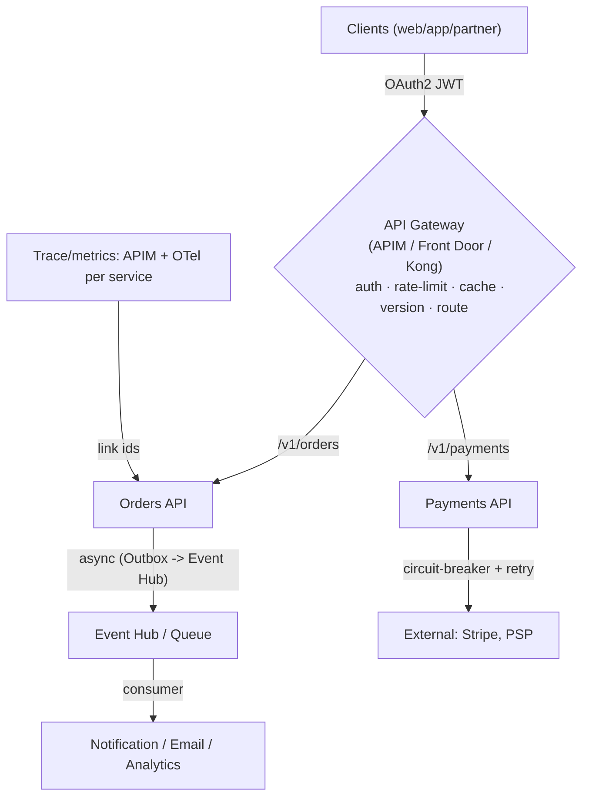

# Day 46: API Gateways & Microservices Patterns — Resilience, Auth, Rate Limit, Versioning

> APIs = product. Gateway = one door for all APIs (auth, routing, rate-limit, caching, observability). Microservices patterns = how services talk without breaking (retries, circuit breaker, idempotency, events).

## Overview | Parichay

Microservices strategy ke liye: patterns ek toolkit — **not every service needs every pattern**, choose deliberately.
- **API Gateway**: single entry (Azure API Management / Azure Front Door / Kong / APIM). Auth (OAuth2/JWT), rate limiting, versioning, request transformation, caching, mTLS, analytics.
- **Communication**: sync (REST/gRPC) vs async (Queue/Event Hub). Prefer async for long jobs; sync for simple requests.
- **Resilience**: retries w/ backoff+Jitter, timeouts, circuit breakers (Polly/Resilience4j), bulkheads, idempotency (retries safe), event-driven so producer/consumer decouple.
- **Deploy/discover registry**: Eureka/Consul, or k8s Service; GitOps rollout; blue/green/canary.
- **Versioning**: URI (`/v1/`), header/content-type, compatibility matrix; deprecation policy.

## What You'll Learn | Aaj Ki Seekh

- [ ] Gateway features (APIM): auth, rate limit, caching, cors, versioning, analytics
- [ ] Gateway forwarding vs backend direct — when gateway, when service mesh
- [ ] Resilience patterns: Timeout + Retry + Circuit Breaker + Bulkhead (Polly)
- [ ] Idempotency keys — safe retries
- [ ] Async patterns: outbox, event bus, saga
- [ ] API versioning + deprecation lifecycle
- [ ] Observability across APIs (traces/APIM metrics)

## Diagram | Dekho Kaise Kaam Karta Hai



ASCII:
```
Client → Gateway (auth/rate/version) → service (sync REST/gRPC)
    resilience in service: timeout/retry/circuit-broken (Polly)
    async via queue/outbox — services decoupled, idempotent handlers
```

## Demo | Copy-Paste Karke Chalao

```bash
# 1. APIM: import OpenAPI + policies (rate limit + JWT)
# polish example - policy snippet:
cat > policy.xml << 'EOF'
<inbound>
  <base />
  <validate-jwt header-name="Authorization" failed-validation-httpcode="401" require-expiration-time="true">
    <openid-config url="https://login.microsoftonline.com/<tenant>/.well-known/openid-configuration" />
  </validate-jwt>
  <rate-limit calls="60" renewal-period="60" />
  <set-header name="X-Api-Request-Id" exists-action="override">
    <value>@(context.RequestId.ToString())</value>
  </set-header>
</inbound>
EOF

# 2. Resilience in .NET (Polly):
dotnet add package Polly
cat > res.cs << 'EOF'
var pipeline = new ResiliencePipelineBuilder()
    .AddRetry(new RetryStrategyOptions {
        MaxRetryAttempts = 3,
        BackoffType = BackoffType.Exponential,
        Delay = TimeSpan.FromMilliseconds(200),
        OnRetry = _ => { /* log attempt */ return default; }
    })
    .AddCircuitBreaker(new CircuitBreakerStrategyOptions {
        FailureRatio = 0.5,
        MinimumThroughput = 20,
        SamplingDuration = TimeSpan.FromSeconds(30),
        BreakDuration = TimeSpan.FromSeconds(15)
    })
    .AddTimeout(TimeSpan.FromSeconds(5))
    .Build();

await pipeline.ExecuteAsync(async ct =>
    await httpClient.PostAsync("/payments", payload, ct));
EOF

# 3. Idempotency (server-side): accept Idempotency-Key header
# POST /payments  Idempotency-Key: 7be... → cache result by key; same key = same result

# 4. Outbox pattern (transactional outbox for async): write order + outbox row transaction
#   dispatcher reads outbox → publish to queue → mark sent (retry-safe)

# 5. Versioning: /v1, /v2 headers — APIM rewrite to backend version
```

## Real-Life Example | Industry Me

**Payments service — what production looks like:**
```
Gateway: APIM validates JWT, rate-limits per client (60 rpm), caches GET catalog
Orders: POST /orders with Idempotency-Key (global order-id) → DB insert + outbox row (same txn)
Outbox dispatcher → queue → email/notify (async, can't hold HTTP for email)
Payments: retry 3x exp-backoff+jitter; circuit opens after 50% fail 30s sampling → 15s cooldown
Versioning: /v2 launch → v1 kept 12 months with deprecation header + roadmap doc
Observability: APIM metrics (latency/error per API), traces (trace-id across orders+payments+queue)
```
Hmm — each pattern has a reason, none added randomly:
```
Retry      → transient network/lock errors recoverable
Circuit br → avoid hammering failing downstream (contains blast radius)
Bulkhead   → one client's slowness doesn't starve others (separate pools)
Idempotency → safe retries without double-charge
Outbox     → DB + queue atomic (no lost events / no halves)
Saga       → multi-step (order→payment→inventory) with compensating action on fail
```

## Practice Exercise | Abhi Karein

1. APIM: import any OpenAPI, apply JWT + rate-limit policy, call 61st request → 429
2. Build retry/circuit-breaker demo (Polly) calling a flaky endpoint (fail every 3rd)
3. Add Timeout — slow endpoint → fail fast; log attempt counts
4. Implement idempotency key on POST endpoint (store by key, return cached)
5. Outbox: insert order+outbox in single SQL txn; poll outbox → queue; process
6. Version: create /v1 and /v2, document deprecation policy in README

## Quick Notes | Yaad Rakho

```
- Gateway = single door: auth (JWT/OAuth2), rate-limit, caching, version, analytics
- Resilience bank: timeout → retry(backoff+jitter) → circuit breaker → bulkhead
- Idempotency-key: retry-safe POST (store key→result), verify APIs duplicated-safe
- Async via queue/outbox: decouple + survive bursts; saga for multi-step with compensation
- Event-driven: consumer idempotent, producer doesn't wait
- Versioning: URI/header; keep old N months; deprecation notice; compatibility lock-step
- Observability: APIM metrics + propagation (trace-id) across HTTP→queue→consumer
- Mesh vs gateway: north-south = gateway (APIM); east-west = service mesh (Day 33)
- Patterns = menu, not mandatory: apply where failure/scale actually warrants
```

**Agla:** Performance Engineering — caching, CDN, autoscaling, profiling, load testing.