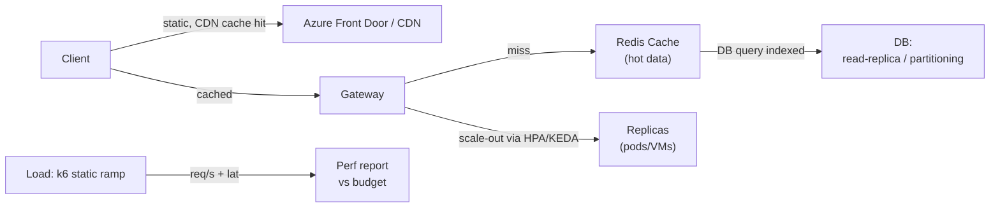

# Day 47: Performance Engineering — Caching, CDN, Autoscaling, Load Testing, Profiling

> Performance = product quality metric (latency, throughput, cost). Engineering: measure → find bottleneck → optimize (cache/CDN/scale) → verify (load test) → monitor.

## Overview | Parichay

"Fast app" idea nahi — science hai. Workflow:
1. **Measure**: metrics (latency percentiles: p50/p95/p99), throughput, saturation
2. **Locate**: profiler (CPU/memory), tracing, APM hot spots
3. **Optimize (order of impact for web apps):**
   - **Frontend**: CDN + static assets, HTTP caching, compression, lazy load, minify
   - **Server**: DB index, query tuning, caching layer (Redis), async, connection/thread pool
   - **Scale**: vertical (bigger VM) → horizontal (more replicas) with autoscaling/HPA/KEDA
   - **Architecture**: read-replicas, partitioning, materialized views
4. **Verify**: load tests (k6, Vegeta, JMeter, locust) — steady-state + spike + soak
5. **Monitor**: SLO metrics + alerts; regression guard in CI (perf budget)

## What You'll Learn | Aaj Ki Seekh

- [ ] Latency percentiles vs averages — why p99, not mean
- [ ] Caching: browser (Cache-Control), edge CDN, app cache (Redis), DB cache
- [ ] CDN: Azure CDN / Front Door — static + API edge caching
- [ ] Autoscaling: HPA (K8s), VMSS, App Service scale rules, AKS cluster-autoscaler + KEDA
- [ ] Load testing: k6 script, thresholds, ramp, soak; baseline before/after
- [ ] Profiling/APM: cProfile/py-spy, PerfView, Application Insights — find hot spots
- [ ] Performance budgets + regression gates in CI

## Diagram | Dekho Kaise Kaam Karta Hai



ASCII:
```
Client → CDN (cached static) → gateway → app (cache: Redis) → DB
  scale: HPA by CPU + KEDA by queue;      verify: k6 threshold p95<200ms→CI gate
  profile: find bottleneck (DB query? JSON parse? GC?) → fix that
```

## Demo | Copy-Paste Karke Chalao

```bash
# 1. Load test with k6
k6 version || { # debian/ubuntu
  sudo gpg -k && sudo dpkg -i $(curl -sL https://dl.k6.io/key.gpg | ... ) # see k6.io docs
}
cat > load.js << 'EOF'
import http from 'k6/http';
import { check, sleep } from 'k6';
export const options = {
  stages: [
    { duration: '1m', target: 20 },    // ramp up
    { duration: '3m', target: 50 },    // steady
    { duration: '1m', target: 100 },   // spike
    { duration: '1m', target: 0 },
  ],
  thresholds: {
    http_req_duration: ['p(95)<200', 'p(99)<500'],
    http_req_failed: ['rate<0.01'],
  },
};
export default function () {
  const res = http.get('https://myapp.example.com/api/products?page=1');
  check(res, { 'status 200': r => r.status === 200 });
  sleep(0.5);
}
EOF
k6 run load.js

# 2. Cache headers (app) — browser cache static
# static: Cache-Control: public, max-age=31536000, immutable
# api:     ETag + 304 (or short cache 60s for hot endpoint)

# 3. Redis app cache (FastAPI/Python example)
pip install redis
cat > cache.py << 'EOF'
import redis, json
r = redis.Redis(host="redis", port=6379, decode_responses=True)
def get_products():
    cached = r.get("products:v1")
    if cached: return json.loads(cached)
    data = db_query()                      # slow SQL
    r.setex("products:v1", 300, json.dumps(data))   # TTL 5m
    return data
EOF

# 4. Azure CDN / Front Door (enable + route origin)
az afd profile create -g rg --profile-name fd-devops --sku Standard_AzureFrontDoor
az afd origin create -g rg --profile-name fd-devops --origin-group-name og1 \
  --origin-name app-origin --host-name myapp.azurewebsites.net --http-port 80 --https-port 443

# 5. HPA in k8s (scale = perf + cost)
kubectl autoscale deployment myapp --cpu-percent=60 --min=2 --max=10
# KEDA queue-length scaling (Day 43) for async jobs

# 6. Profiling a python API hot spot:
pip install py-spy
py-spy record -o profile.svg --duration 10 -p $(pgrep -f uvicorn)   # flame graph!
```

## Real-Life Example | Industry Me

**Slow catalog page → story of debugging:**
```
Report: "site slow" → measure: p95 800ms → trace: 70% total = one DB query (N+1)
Fix: index + JOIN → p95 180ms. Then CDN for images (now 40% of bytes) → p95 40ms.
Budget: p95<200ms over 12 weeks. Load test ensures deploys don't regress (CI gate).
Monitor dashboards + alert p99 threshold → catch before users complain.
```
**Common bottlenecks checklist (check in order):**
```
□ N+1 queries / no index     (DB hit per row!)
□ Unbounded JSON / chatty API  → paginate, fields
□ No cache for hot reads       → Redis/CDN/HTTP
□ Blocking I/O in event loop   → async/queue
□ Huge response / no compression → gzip/brotli
□ Single instance + no autoscaling → HPA/spike scale
□ Behind-proxy issues (keep-alive/TLS handshake) → termination at gateway
```
**Perf budgets:** define at CI: `p95<250ms`, `bytes<1MB page`, `error<1%`; break build if exceeded → continuous guard.

Soak test: run steady load 1h — catch memory leaks/GC drift; Spike test: sudden 10x — autoscaler response time check.

## Practice Exercise | Abhi Karein

1. k6: your app with 3 stages + thresholds p95<200 — fail/succeed the gate
2. Measure baseline (curl -w, or APM) → add Redis cache → re-measure (document % gain)
3. Enable CDN/Front Door on static site; verify cache hit (response header)
4. Set HPA; run spike load → replicas up → after load → scale down (address response)
5. py-spy (or `psrecord`) your API by load — find top function; fix 1 bottleneck
6. Add perf budget threshold to your CI (or documented post-deploy check)

## Quick Notes | Yaad Rakho

```
- Percentiles, not averages: p50 typical, p95 majority, p99 worst — actions target p99
- Cache order: Browser(HTTP) → CDN(edge) → App(Redis) → DB(reads/index/read-replica)
- CDN = static + occasionally API cache; ensure cache key + invalidation strategy
- Scale: first optimize, then scale; vertical→horizontal→KEDA event-driven scale
- Autoscaling metrics: CPU, memory, queue, custom (KEDA) — tune min/max wisely (cost!)
- Load test types: ramp, spike, soak; thresholds in CI = perf budget (no silent regression)
- Profile before you guess: flamegraph (py-spy), index missing? N+1? — fix real bottleneck
- Compression, pagination, field-subsets — simplest wins often 10-50x
- Monitor p99 + throughput + saturation → alert on SLO, not on "feels slow"
```

**Agla:** DevSecOps Advanced — SBOM, signing, SLSA, supply-chain security (Day 34 ka upgrade).