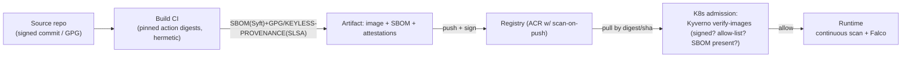

# Day 48: DevSecOps Advanced — SBOM, Image Signing, SLSA, Supply-Chain Security

> Attack surface ab "your code" not, "your whole chain": base images, deps, CI runners, registries, 3rd parties. Story: SolarWinds(2020), Log4Shell, 3CX — so chain hardening = SBOM + signing + provenance + policy.

## Overview | Parichay

Day 34 gate kiya tha basic. Ab **supply chain as first-class**: 
- **SBOM** = inventory (packages+versions) — answer "what's in this?" in minutes
- **Signing** = proof "this artifact came from our CI" (cosign + keyless OIDC)
- **Provenance** = SLSA attestations (build metadata, source repo/commit)
- **Trust** = admission policy in cluster: only signed+scanned images from allow-listed registry
- **Vulnerability management** = continuous (not just build-time) + trip to registry

Whole chain: Source → Dependencies → Build Machine → Container Registry → Cluster → Runtime data.

### Supply chain kya hai — attack surface ka naya map

Pehla shift: sirf apna code secure karna kaafi nahi. Aaj ka **software supply chain** = tumhare repo ke **bahar** aane wali har cheez jo production me jaati hai: base images, npm/pip/go dependencies, GitHub Actions/CI steps, build runners, registries, k8s manifests, SaaS integrations. Attackers ne dikhaya (SolarWinds 2020, Log4Shell, 3CX 2023) ki **dependency ya build hi compromise** kar lo to tumhara "clean" source code bhi signed malicious artifact produce karega — aur users ko lagta hai "official build hai". Isliye security ka scope badla: app scanner (Day 34) → **whole chain** (source → deps → build → registry → deploy → runtime). Control ke 4 pillars: **inventory** (SBOM — kya-kya andar hai), **integrity** (signing/provenance — asli kisne banaya), **policy** (admission — allowlisted/verified hi chale), **continuous** (runtime scan — nikalne ke baad bhi monitor). Ek line: "trust but verify" nahi — **don't trust, verify everything**.

### SBOM — software ka bill of materials

**SBOM** (Software Bill of Materials) = us artifact ke andar ke sab **packages + versions + licenses** ka structured inventory, jaise restaurant me ingredients list. Formats: **SPDX** (Linux Foundation, license-focused) aur **CycloneDX** (OWASP, vuln/security-focused) — dono industry standard. Generate: `syft myapp:1.0 -o spdx-json` ya `trivy image ... --format cyclonedx` — CI me har build pe. Kaam: (1) **incident response** — "Log4j affected hai?" → SBOM grep, minute me jawab (bina ghanton dependency tree dhoondhe); (2) **license compliance** (GPL vs MIT review); (3) **vuln matching** — CVE database se join (VEX = exploitability status bataata hai — affected hai ya nahi); (4) share with customers/regulators (increasingly mandatory). Gotcha: SBOM build-time snapshot hai — **continuous** re-link chahiye (new CVE aaya to purana SBOM se match, alert karo). SBOM ko artifact ke saath store/attach karo (attestation) — warna list bhi nahi milegi jab chahiye.

### Signing aur cosign — proof of origin

Problem: registry me `myapp:1.0` hai — kisne banaya, koi aur to replace nahi kar gaya? **Cosign** (Sigstore project) se image **sign** karo, verify sab kar sakte hain. Do modes: **key-based** (private key se sign, public se verify — par private key manage karna = secret), aur **keyless/OIDC** (CI ko OIDC identity milti hai — e.g., GitHub Actions workflow → cert; verify karta hai "ye signature usi CI workflow ne banaya") — **no long-lived key to steal**, isi liye modern default. Flow: CI me `cosign sign` push ke saath → cluster/admission pe `cosign verify` (identity + issuer match) → galat ya unsigned = reject. Related: **digest pinning** — deployment me tag (`:latest`) nahi, **digest** (`@sha256:...`) use karo — tag badal ke attack rok jata hai. Signatures, SBOM, provenance teeno **attestations** ke roop me artifact ke saath attach hote hain (`cosign attest`).

### SLSA — build provenance ka level ladder

**SLSA** (Supply-chain Levels for Software Artifacts) = ek framework jo batata hai build kitni trustworthy thi — attestation ke levels: **L0** (koi guarantee nahi), **L1** (inventory/SBOM exists, hosted build service), **L2** (build **provenance** signed — kaunsa source/commit se, kis process me bana), **L3** (hardened, tamper-resistant build — non-editable, isolated), **L4** (hermetic, reproducible builds — same source → same artifact). Practical goal zyadatar teams ka **L2-L3**: release pe provenance generate + sign (e.g., GitHub `attest-build-provenance`), deploy pe verify. Provenance ka matlab: artifact ke saath likha hai "source repo X, commit Y, builder (GitHub-hosted runner), params Z" — verification ye batati hai ki artifact usi claim se juda hai. Ye 3CX-style "build machine compromise" ka jawab hai: signing se nahi, **provenance verify** se ki "trusted builder" se bana. Interview me: "SLSA L3 vs L2?" → L3 = tamper-resistant build path, L2 = signed provenance only.

### Build machine = trust anchor

Ek critical lesson (3CX/SolarWinds dono se): agar **build environment hi khota** hai, to signed, scanned, perfect-looking artifact bhi poison hoga. Controls: (1) **pinned actions** — GitHub Actions ko SHA se pin karo (`actions/checkout@<sha>`, `@v4` mutable tag hai — attacker tag move kar sakta), dependabot se update; (2) **OIDC, no long-lived secrets** — cloud credentials temporary tokens se; (3) **managed runners** (GitHub-hosted) prefer vs self-hosted (self-hosted = tumhara own attack surface, clean rakhna padta); (4) **least-privilege `permissions:`** — workflow ko sirf chahiye wala (`packages: write`, `id-token: write`); (5) **hermetic deps** — lockfiles committed, no floating versions; (6) **protected branches + required reviews** — direct push main pe nahi. Ye checklist Day 50 ke CI me directly lagti hai (pinned SHA lines). Ek line: "garbage in garbage out — build machine ko tumhara root of trust samjho".

### Admission control — cluster ka gatekeeper

Signing tab kaam aati hai jab **verify deployment pe** ho. **Kyverno** (ya Sigstore policy-controller, OPA Gatekeeper) **admission webhook** ke through har pod check karta hai: (a) image **signed** hai (keyless identity match), (b) **allow-listed registry** se aa raha hai (`ghcr.io/myorg/*` — Docker Hub random image nahi), (c) **SBOM/provenance present**, (d) tags `:latest` nahi, digest pin. Fail = **pod REJECTED** — cluster me kabhi land hi nahi karta. Policy `validationFailureAction: Enforce` (reject) vs `Audit` (warn — pehle Audit chalao, phir Enforce). Ye defense ka last line hai before runtime — supply chain ka final gate. Saath me registry pe **scan-on-push** (ACR + Defender) rakho (bad image registry me aane se hi mile), par usko admission se deny karo. Rollout plan: audit mode → warn tickets → enforce staging → enforce prod.

### Continuous runtime — deploy ke baad bhi khatam nahi

Nayi CVE daily aati hai — kal scanned image aaj vulnerable ho sakti hai. **Continuous** layer: (1) **registry re-scan** (scheduled), (2) **in-cluster scan** — **Trivy-operator** periodic pods/images scan karta hai, vulnerability reports CRDs me; (3) **drift detection** — running image digest deployed manifest se alag to alert (koi manual hot-fix to nahi?); (4) **Falco** runtime behavior (unexpected process, shell in container, sensitive file access) — compromise detect even if image clean tha. Plus dependency updates (Dependabot/Renovate) — patch cadence. Ye **defense in depth** ka pattern: build (scan+sign) → registry (scan) → admission (verify) → runtime (monitor) — har link pe ek control. Interview me pooch lete hain "scan once enough nahi hai kya?" → no — CVEs after build, drift/compromise after deploy — continuous chahiye.

### Interview angle — supply chain sawal

Common: "SBOM kya hai, kab banta hai?" → SPDX/CycloneDX inventory, build-time, incident+license ke liye; "keyless signing kaise kaam karti hai?" → OIDC identity → cosign short-lived cert → verify issuer/identity, no stored key; "SLSA levels?" → L0-L4 ladder, L2 provenance, L3 hardened, L4 hermetic; "unsigned image cluster me aaya to?" → Kyverno verify-images rejects; "how prevent SolarWinds-type?" → pin actions SHA + OIDC + provenance verify + admission + continuous scan; "latest tag kyun nahi?" → mutable, use digest. Ek line: supply chain security = "har link ka proof — inventory (SBOM) + origin (sign+provenance) + gate (admission) + watch (runtime)".

## What You'll Learn | Aaj Ki Seekh

- [ ] SBOM: SPDX/CycloneDX; generate (syft/trivy), store/sign, consume/distribute
- [ ] cosign: sign, verify, keyless (OIDC) — no secret keys
- [ ] SLSA levels L0-L4; what evidence each provides
- [ ] GitHub Actions / Azure DevOps supply-chain best practices (pinned actions, digest)
- [ ] Registry policy: allow-list + keyless verify + scan-on-push (ACR/Defender)
- [ ] Admission policy: Kyverno verify-images / Sigstore policy-controller
- [ ] Runtime: continuous scanning + drift detection (Trivy-operator, Falco)

## Diagram | Dekho Kaise Kaam Karta Hai


ASCII:
```
source → CI(hermetic, pinned) → image+SBOM+signature+provenance → registry(scan)
        → admission(verifies signature+policy) → run (continuous scan/monitor)
```

## Demo | Copy-Paste Karke Chalao

```bash
# 1. SBOM
syft myapp:1.0 -o spdx-json > sbom.spdx.json
trivy image myapp:1.0 --format cyclonedx > sbom.cdx.json

# 2. Keyless signing (cosign — no keys to steal)
cosign sign ghcr.io/myorg/myapp:1.0
# verify (anyone can verify, no private key stored):
cosign verify ghcr.io/myorg/myapp:1.0 \
  --certificate-identity "https://github.com/myorg/.github/.github/workflows/ci.yml@refs/heads/main" \
  --certificate-oidc-issuer "https://token.actions.githubusercontent.com"

# 3. SLSA provenance via github actions
# (release/slsa-generator + attest build-provenance on ubuntu-24 — the official action)

# 4. Push with digest / SBOM attestation stored in registry
# attach SBOM as attestation:
cosign attest --predicate sbom.spdx.json --type spdx ghcr.io/myorg/myapp:1.0

# 5. Kyverno: verify images at admission
cat > verify-signed.yaml << 'EOF'
apiVersion: kyverno.io/v1
kind: ClusterPolicy
metadata: { name: verify-image }
spec:
  validationFailureAction: Enforce
  webhookTimeoutSeconds: 30
  rules:
    - name: only-signed-images
      match:
        resources:
          kinds: [Pod]
      verifyImages:
        - imageReferences: ["ghcr.io/myorg/*"]
          attestors:
            - count: 1
              entries:
                - keyless:
                    subject: "https://github.com/myorg/*/.github/workflows/ci.yml"
EOF
kubectl apply -f verify-signed.yaml     # unsigned image → pod REJECTED

# 6. Scan-on-push (ACR)
# Defender/Azure: enable Microsoft Defender for Container Registries → scans push
```

## Real-Life Example | Industry Me

**Real breach story (pattern to avoid):** 3CX (2023): supply-chain — attacker poisoned build env; released signed binaries (build compromised). Lessons:
- **Build machine = trust anchor.** GitHub-hosted runners (managed) + pinned actions by SHA + OIDC, no long-lived secrets in self-hosted runners
- **Signing must include provenance** (which runner? which committ?) — that's the "trust"
- **Hermetic/deterministic builds** — same commit → same artifact (SLSA L4 aspiration)

**Practical policy ladder:**
```
L1: scan + SBOM every build (trivy, syft) — inform only
L2: gates: HIGH/CRITICAL = 0, sign images, registry scan-on-push
L3: admission: verify signature + allow-list registry + require SBOM (kyverno)
L4: SLSA3/4 provenance + verified from immutable tags; dependency pinning fully
```
**Checklist — lock in repo:**
```
[ ] All actions/containers pinned to SHA (dependabot for updates)
[ ] No static secrets — OIDC only (Azure/GitHub), RBAC scoped
[ ] Base image: distroless, nonroot, UBI-minimal
[ ] Private registry as only source (not internet)
[ ] cosign keyless signing in CI for every image
[ ] Admission policy (verify-images + allow registry)
[ ] SBOMs published/stored w/ artifacts; regenerable
[ ] Runtime scan (Trivy-operator) + Falco drift monitor
```

## Practice Exercise | Abhi Karein

1. Generate SBOM for a sample image (syft + trivy) — differ formats, view packages
2. cosign keyless: sign + verify an image from your GH/CR (needs repo) 
3. Kyverno verify-images policy — try apply unsigned image → rejected (record)
4. Add pinned-by-SHA step in one GitHub Actions workflow; enable OIDC verify
5. Write SLSA checklist for your project; choose target level
6. Registry: enable scan-on-push (ACR/Defender or GHCR trivy action)

## Quick Notes | Yaad Rakho

```
- SBOM (SPDX/CycloneDX) = inventory; generate (syft/trivy), keep with artifact
- Signing (cosign): keyless/oidc = no keys to leak; verify before deploy
- SLSA levels=L evidents: L0 none → L4 hermetic+provenance; aim L3 (signed provenance)
- Trust = verify source+identity: verify-images policy on admission
- Build env = trust anchor: pinned action SHA, OIDC, hermetic, no long-lived secrets
- Registry: allow-list + scan-on-push (ACR/Defender), pull-by-digest over latest
- Admission: Kyverno/sigstore — only signed+allowlisted → cluster pull policy
- Runtime: continuous scanning (Trivy-operator) + anomaly syscall (Falco)
- Full chain: source → deps → build → registry → admission → runtime — policy each link
```

**Agla:** Cloud & Network Security Architecture — zero trust, IAM, default-deny NSG, secrets, SIEM.