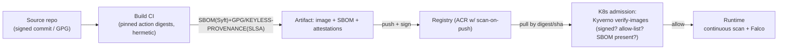

# Day 48: DevSecOps Advanced — SBOM, Image Signing, SLSA, Supply-Chain Security

> Attack surface ab "your code" not, "your whole chain": base images, deps, CI runners, registries, 3rd parties. Story: SolarWinds(2020), Log4Shell, 3CX — so chain hardening = SBOM + signing + provenance + policy.

## Overview | Parichay

Day 34 gate kiya tha basic. Ab **supply chain as first-class**: 
- **SBOM** = inventory (packages+versions) — answer "what's in this?" in minutes
- **Signing** = proof "this artifact came from our CI" (cosign + keyless OIDC)
- **Provenance** = SLSA attestations (build metadata, source repo/commit)
- **Trust** = admission policy in cluster: only signed+scanned images from allow-listed registry
- **Vulnerability management** = continuous (not just build-time) + trip to registry

Whole chain: Source → Dependencies → Build Machine → Container Registry → Cluster → Runtime data.

## What You'll Learn | Aaj Ki Seekh

- [ ] SBOM: SPDX/CycloneDX; generate (syft/trivy), store/sign, consume/distribute
- [ ] cosign: sign, verify, keyless (OIDC) — no secret keys
- [ ] SLSA levels L0-L4; what evidence each provides
- [ ] GitHub Actions / Azure DevOps supply-chain best practices (pinned actions, digest)
- [ ] Registry policy: allow-list + keyless verify + scan-on-push (ACR/Defender)
- [ ] Admission policy: Kyverno verify-images / Sigstore policy-controller
- [ ] Runtime: continuous scanning + drift detection (Trivy-operator, Falco)

## Diagram | Dekho Kaise Kaam Karta Hai


ASCII:
```
source → CI(hermetic, pinned) → image+SBOM+signature+provenance → registry(scan)
        → admission(verifies signature+policy) → run (continuous scan/monitor)
```

## Demo | Copy-Paste Karke Chalao

```bash
# 1. SBOM
syft myapp:1.0 -o spdx-json > sbom.spdx.json
trivy image myapp:1.0 --format cyclonedx > sbom.cdx.json

# 2. Keyless signing (cosign — no keys to steal)
cosign sign ghcr.io/myorg/myapp:1.0
# verify (anyone can verify, no private key stored):
cosign verify ghcr.io/myorg/myapp:1.0 \
  --certificate-identity "https://github.com/myorg/.github/.github/workflows/ci.yml@refs/heads/main" \
  --certificate-oidc-issuer "https://token.actions.githubusercontent.com"

# 3. SLSA provenance via github actions
# (release/slsa-generator + attest build-provenance on ubuntu-24 — the official action)

# 4. Push with digest / SBOM attestation stored in registry
# attach SBOM as attestation:
cosign attest --predicate sbom.spdx.json --type spdx ghcr.io/myorg/myapp:1.0

# 5. Kyverno: verify images at admission
cat > verify-signed.yaml << 'EOF'
apiVersion: kyverno.io/v1
kind: ClusterPolicy
metadata: { name: verify-image }
spec:
  validationFailureAction: Enforce
  webhookTimeoutSeconds: 30
  rules:
    - name: only-signed-images
      match:
        resources:
          kinds: [Pod]
      verifyImages:
        - imageReferences: ["ghcr.io/myorg/*"]
          attestors:
            - count: 1
              entries:
                - keyless:
                    subject: "https://github.com/myorg/*/.github/workflows/ci.yml"
EOF
kubectl apply -f verify-signed.yaml     # unsigned image → pod REJECTED

# 6. Scan-on-push (ACR)
# Defender/Azure: enable Microsoft Defender for Container Registries → scans push
```

## Real-Life Example | Industry Me

**Real breach story (pattern to avoid):** 3CX (2023): supply-chain — attacker poisoned build env; released signed binaries (build compromised). Lessons:
- **Build machine = trust anchor.** GitHub-hosted runners (managed) + pinned actions by SHA + OIDC, no long-lived secrets in self-hosted runners
- **Signing must include provenance** (which runner? which committ?) — that's the "trust"
- **Hermetic/deterministic builds** — same commit → same artifact (SLSA L4 aspiration)

**Practical policy ladder:**
```
L1: scan + SBOM every build (trivy, syft) — inform only
L2: gates: HIGH/CRITICAL = 0, sign images, registry scan-on-push
L3: admission: verify signature + allow-list registry + require SBOM (kyverno)
L4: SLSA3/4 provenance + verified from immutable tags; dependency pinning fully
```
**Checklist — lock in repo:**
```
[ ] All actions/containers pinned to SHA (dependabot for updates)
[ ] No static secrets — OIDC only (Azure/GitHub), RBAC scoped
[ ] Base image: distroless, nonroot, UBI-minimal
[ ] Private registry as only source (not internet)
[ ] cosign keyless signing in CI for every image
[ ] Admission policy (verify-images + allow registry)
[ ] SBOMs published/stored w/ artifacts; regenerable
[ ] Runtime scan (Trivy-operator) + Falco drift monitor
```

## Practice Exercise | Abhi Karein

1. Generate SBOM for a sample image (syft + trivy) — differ formats, view packages
2. cosign keyless: sign + verify an image from your GH/CR (needs repo) 
3. Kyverno verify-images policy — try apply unsigned image → rejected (record)
4. Add pinned-by-SHA step in one GitHub Actions workflow; enable OIDC verify
5. Write SLSA checklist for your project; choose target level
6. Registry: enable scan-on-push (ACR/Defender or GHCR trivy action)

## Quick Notes | Yaad Rakho

```
- SBOM (SPDX/CycloneDX) = inventory; generate (syft/trivy), keep with artifact
- Signing (cosign): keyless/oidc = no keys to leak; verify before deploy
- SLSA levels=L evidents: L0 none → L4 hermetic+provenance; aim L3 (signed provenance)
- Trust = verify source+identity: verify-images policy on admission
- Build env = trust anchor: pinned action SHA, OIDC, hermetic, no long-lived secrets
- Registry: allow-list + scan-on-push (ACR/Defender), pull-by-digest over latest
- Admission: Kyverno/sigstore — only signed+allowlisted → cluster pull policy
- Runtime: continuous scanning (Trivy-operator) + anomaly syscall (Falco)
- Full chain: source → deps → build → registry → admission → runtime — policy each link
```

**Agla:** Cloud & Network Security Architecture — zero trust, IAM, default-deny NSG, secrets, SIEM.