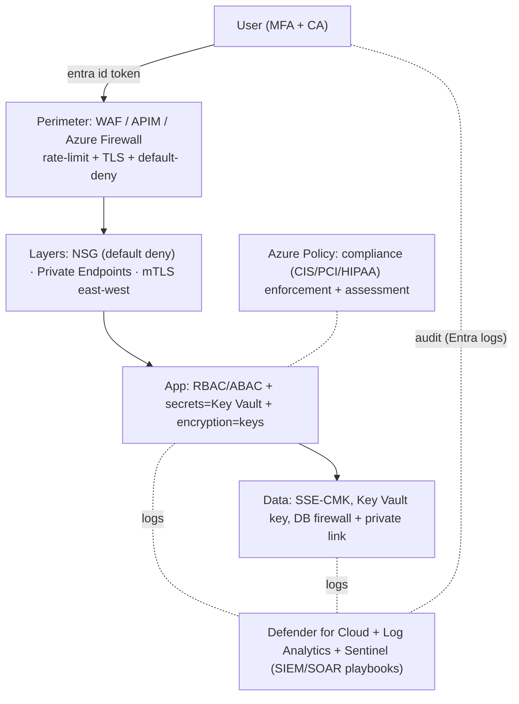

# Day 49: Cloud & Network Security Architecture — Zero Trust, IAM, SIEM, Defense in Depth

> Security isn't one checkbox — architecture: identity is the new perimeter (Zero Trust), network default-deny, secrets everywhere, audit everything, detect and respond. Azure-centric (but patterns = every cloud).

## Overview | Parichay

**Model: defense in depth** — layers: 
```
 Identity(IAM) → Network(DMZ/NSG/firewalls) → Application(WAF/RBAC) → Data(encryption/keys) → People(policies)
```
**Zero Trust** = "never trust, always verify" — verify identity+device for EVERY request (not VNet = trust):
- Identity: Azure AD (Microsoft Entra ID) as control plane; MFA everywhere; conditional access
- Segment: micro-perimeter (each app its own trust); least privilege
- Data: encrypt at rest + transit always
- Monitor: log, detect (Defender/SIEM), respond (playbooks)

Features: Azure Key Vault (keys/certs/secrets), Azure Policy (compliance at scale), Defender for Cloud (recommendations/vulnerability/misconfig), Log Analytics → Sentinel (SIEM/SOAR), NACL+NSG default-deny, Private Endpoints, mTLS.

### Defense in depth — ek layer kabhi kaafi nahi

**Defense in depth** = security ki ek single wall nahi, **kai layers** — attacker ko har layer pe rokna padta hai. Kyunki koi na koi layer zaroor fail hogi (config galti, zero-day, insider), layers kaafi hain to attack wahi ruk jata hai. Cloud me typical layers: **Identity** (MFA, RBAC — kaun chhoo sakta hai), **Network** (NSG/firewall/private endpoint — kahan se chhoo sakta hai), **Application** (WAF, API auth, input validation — kya chhoo sakta hai), **Data** (encryption at rest/in-transit, keys, classification — chho kar bhi padh na sake), **Monitoring** (logs, SIEM, response — pata chale kya ho raha), **People/Process** (policies, training, approvals). Har layer ka apna control set hai (aaj ke day me sab cover honge). Simple analogy: ghar = gate + lock + camera + locker + insurance — ek lock toda to camera bhi hai, camera gaya to locker hai. Ek control hata ke pura system "secure" nahi hota — isi liye "ek checkbox" wali security nahi chalti.

### Zero Trust — trust hi mat karo, verify karo

**Zero Trust** ka principle: network/location pe **koi implicit trust nahi** — "andar hu to safe" wali soch band. Har request pe **verify explicitly** (identity + device + context), **least privilege** (utna hi access jitna kaam), **assume breach** (breach ho chuka maan ke design karo — detect/contain ready). Concretely: (1) **Identity = new perimeter** — **Microsoft Entra ID (Azure AD)** central identity; har user/service/workload ko identity; **MFA** + **Conditional Access** (risky sign-in = block/step-up, jaise "impossible travel" geo), **PIM** se JIT admin (permanent Contributor nahi — 2 ghante ke liye elevate); (2) **Micro-segmentation** — har app/namespace ka apna trust zone (NetworkPolicy, NSG, private endpoints) — ek pod compromise to pura VNet nahi khula; (3) **Verify device/posture** — compliant device required (CA policy); (4) **Encrypt + log everything**. Ye approach clouds ka default hai kyunki cloud me "network ke andar" ka bound hi fuzzy hai (everyone rides internet anyway).

### IAM — identity ka control plane

IAM = entitlements ka system: **who can do what, on which resource, under what conditions**. Azure model: **Entra ID** (identities) → **RBAC role assignments** (Reader/Contributor/Owner ya custom role, scope = subscription/RG/resource) → **ABAC** (attributes se conditions — e.g., tag match) → **PIM** (JIT/approval/elevation for privileged roles). Service identity: **managed identities** (VM/App Service/AKS se token, bina secret) + **workload identity** (k8s pod → OIDC federated, Day 35) — secretless. Hardening rules: **least privilege** (custom roles banao — har jagah Owner nahi), **no shared accounts**, **separate break-glass admin** (MFA exempt emergency account, monitored), **access reviews** quarterly (stale access hatao), **service principals scoped + secrets rotated** (ya secretless OIDC). Gotcha: over-privileged managed identity = attacker ka cloud-lift kit — "VM read role" ki jagah full Contributor = galat. Interview me: "production access kaise doge?" → PIM JIT + MFA + approval + audit logs — ye 4 word.

### Network architecture — default-deny, private by default

Network security ka skeleton: (1) **Hub-spoke** — shared services (firewall, bastion, DNS) hub me; spokes me apps; spoke-to-spoke hub ke through (inspection possible). (2) **NSG/NACL default-deny** — allow rules explicit (LB → app :443), end me `DenyAll` priority 4096 pe. Azure NSG stateful, NACL stateless — NSG per NIC/subnet. (3) **No public RDP/SSH** — **Bastion** ya jump box; management ports internet pe kabhi nahi (posture me #1 finding yahi hoti hai). (4) **Private endpoints** — storage/SQL/Key Vault ko VNet ke andar private IP; public access `Deny` — data plane hi public path se gayab. (5) **Egress control** — internet jaana bhi filter (Firewall/NSG) — data exfiltration rokna; FQDN rules. (6) **mTLS east-west** — mesh (Istio) service-to-service identity+encryption. (7) **WAF** public ingress pe (Application Gateway/Front Door) — OWASP top 10. Zero-trust ka network face yahi hai: no flat network, explicit flows, encrypted internal bhi.

### Data protection — encryption, keys, secrets

Data pe teen question: encrypt (rest + transit), access (least privilege), audit (log). **At rest**: storage/DB default SSE (platform key) — stronger ke liye **CMK (customer-managed key)** Key Vault me; **envelope encryption** ka concept (DEK data encrypt, KEK key encrypt). **In transit**: TLS everywhere — internal bhi (mesh mTLS); old TLS 1.0/1.1 disable. **Key Vault**: keys/certs/secrets ka home — RBAC se access, **soft delete + purge protection** (ransomware vault-ke-liye), **rotation** schedule + versioning (old key versions data decrypt rakhte hain), logging on. **Secrets kabhi code/repo/me mat** — app config = Key Vault reference / external-secrets / workload identity. **Classification**: PII/PCI data identify → extra controls (masking, column-level, DLP). Backup + DR me bhi key consideration (Day 41): CMK lost = data lost — escrow/backup policy. Gotcha: storage public = 2023 ka common breach; policy se `Deny public blob access`.

### Monitoring & response — detect, don't just prevent

Prevent perfect nahi ho sakta — **detect + respond** mandatory. Stack: (1) **Defender for Cloud** — secure score + recommendations (misconfig daily), vulnerability mgmt, runtime alerts; (2) **Log Analytics workspace** — central logs: Azure Activity (control plane — "kisne key delete kiya"), resource logs, NSG flow logs, Entra sign-ins; (3) **Microsoft Sentinel** (SIEM/SOAR) — rules se correlate ("multiple failed MFA + success + unusual key usage" = attack story), **playbooks** (Logic Apps) auto-response: block IP, disable user, notify. Response lifecycle (incident me): **detect → contain → eradicate → recover → postmortem** — har stage runbook. Alert quality matters: noise = ignored alerts = breach miss. Log retention bhi compliance (audit trails). Ye observability ka security twin hai — RED dashboards engineer ke liye, Sentinel SOC/incident ke liye.

### Secrets, WAF, compliance — quick layer recap

**Secrets management**: pattern fixed — generate in Key Vault, apps se runtime pe fetch (managed/workload identity), rotate (90d ya leaked pe turant), never in git (pre-commit secret scan — Day 34). **WAF**: OWASP ruleset + rate limiting + bot control at edge (Front Door/App Gateway); custom rules (geo/URL). **Azure Policy = compliance at scale**: deny non-compliant resources **provisioning pe** (public storage Deny, missing tag Deny, unencrypted disk Deny) + **guest config** for OS; initiatives map to **CIS/PCI/HIPAA/SOC2** — evidence auto-generate hota hai (audit bhi). **Defender regulatory compliance** dashboard same standards ka pass/fail dikhata hai. Ek baat note: compliance certificate != security (baseline hai floor, Zero Trust ceiling upar) — par audit me control mapping dikhana padta hai. Supply-chain (Day 48) isi framework me judta hai: identity for CI, signing, admission — sab same layers.

### Interview angle — security architecture sawal

Frequent: "Zero Trust explain karo" → verify explicitly + least privilege + assume breach, 3 pillars with examples; "default-deny NSG kaise?" → allow rules first + deny-all priority 4096; "secret handling?" → Key Vault + identity, no repo; "public storage kaise block?" → Azure Policy Deny + private endpoint; "breach response?" → detect (SIEM) → contain (CA block, NSG quarantine) → eradicate → recover → postmortem, runbook-based; "MFA + admin access?" → Conditional Access + PIM JIT; "defense in depth kya?" → layers list. Common trap question: "VNet ke andar hu, safe?" → Zero Trust ka nahi — verify explicitly. Ek line: architecture = "identity verify, network deny-by-default, data encrypt, everything log, assume breach → detect/respond" — layers jo ek-dusre ko cover karein.

## What You'll Learn | Aaj Ki Seekh

- [ ] Zero Trust pillars — verify explicitly, least privilege, assume breach
- [ ] IAM: Entra ID, Conditional Access, MFA, RBAC/ABAC/PIM (JIT)
- [ ] Network security architecture: hub-spoke, default-deny NSG/NACL, private endpoints, firewall zones
- [ ] App security: WAF (Azure Application Gateway/Front Door), API auth, mTLS
- [ ] Data/keys: encryption (SSE/CSE/CMK), Key Vault, key rotation
- [ ] Monitoring & response: Defender for Cloud, Log Analytics, Sentinel (SIEM/SOAR), playbooks
- [ ] Compliance: Azure Policy + Defender regulatory (CIS/PCI/HIPAA/SOC2)

## Diagram | Dekho Kaise Kaam Karta Hai



ASCII:
```
Identity(Entra/MFA/CA) → Perimeter(WAF/firewall) → Network(default deny/private) 
 → App(RBAC+secrets+encryption) → Data(CMK) → Observability(Sentinel SIEM/SOAR)
Azure Policy + Defender hold us to standard; assume breach → detect→respond
```

## Demo | Copy-Paste Karke Chalao

```bash
# 1. Entra ID app registration + RBAC
az ad app create --display-name myapp --sign-in-audience AzureADMyOrg
# conditional access: enforce MFA for all users (portal: Entra → Conditional Access)

# 2. Privileged Identity Mgmt (JIT admin) — only when needed (PIM)
az role assignment create --assignee <user> --role Contributor --scope /subscriptions/x \
  --start-time <now> --end-time <+2h>     # JIT window

# 3. NSG default-deny / explicit allow (defense):
cat > nsg.yml << 'EOF'
rules:
  - name: Allow-Web-LB-to-Tier1
    priority: 100
    sourcePortRange: "*"
    destinationPortRanges: [8080, 443]
    sourceAddressPrefixes: [10.0.1.0/24]
    protocol: Tcp
    access: Allow
  - name: DenyAll-EverythingElse
    priority: 4096
    access: Deny
EOF

# 4. Storage encryption + CMK
az storage account create -g rg -n stdevops --encryption-key-type account \
  --identity-type SystemAssigned
az storage account encryption-scope create -g rg --account-name stdevops \
  -n cmk-scope --key-name keyCMK --key-vault-uri <kv-uri>

# 5. Defender + Logs → Sentinel
az security contact create --name default --email security@example.com \
  --minimal-severity High --alert-notifications on
# Sentinel: create workspace → connect data connectors (Entra/AzureActivity/Defender) → playbook

# 6. Azure Policy (compliance at scale):
az policy definition create -n "DenyStoragePublicAccess" \
  --rules '{ "if": { "field": "Microsoft.Storage/storageAccounts/networkAcls.defaultAction", "equals": "Allow" }, "then": { "effect": "Deny" } }' \
  --mode All

# 7. mTLS on app (k8s) = istio PeerAuthentication (Day 33) kurmutual
```

## Real-Life Example | Industry Me

**Breach scenario & response (playbook style):**
```
Detection: Defender/Sentinel alert "Unusual sign-in — impossible travel" + lateral movement
Response: Conditional Access block + reset creds + revoke tokens
Contain: quarantine affected VMs (NSG), rotate keys in Key Vault
Eradicate: patch, revert state from clean backup, revoke access
Recover/validate: monitor re-entry, update runbooks, add prevention policy
```
**Postmortem root-cause patterns (commonly):**
- Exposed management ports (RDP/SSH open to internet) → default-deny + Bastion
- Storage/DB public → private endpoints; firewall only-IP allow
- Hardcoded secrets / over-privileged service principals → Key Vault + RBAC least priv + PIM
- No MFA on admin → Entra conditional + MFA enforced
- No alerting/monitoring on key services → Defender + Log Analytics basics

**Zero Trust list (Azure)**: Entra ID (identity), Conditional Access, PIM (JIT), Key Vault, NSG default-deny + Private Endpoints, Blob/DB private, WAF on public ING, Sentinel (SIEM), Defender for Cloud posture, Azure Policy compliance. Plus supply-chain security (Day 48) + chaos (Day 40).

## Practice Exercise | Abhi Karein

1. Enable MFA via Conditional Access policy (or simulate in docs) — review
2. Entra app + RBAC: least-privilege service principal; PIM JIT elevate demo
3. NSG default-deny: block everything except LB→app; attempt telnet → denied
4. Private endpoint on storage/SQL; remove public network — verify no public path
5. Defend: enable Defender for Cloud recommendations — fix top 5 (open ports etc.)
6. Azure Policy: deny public storage → try create public → denied
7. Sentinel: build simple analytic rule + playbook (email/O365) on missed-PIM alert

## Quick Notes | Yaad Rakho

```
- Zero Trust: verify explicitly (MFA+CA), least privilege, assume breach
- Identity = perimeter: Entra ID + Conditional Access + PIM(JIT) — MFA mandatory
- Network: NSG default-deny rule everywhere, Bastion (no public RDP/SSH), private endpoints for PaaS
- WAF/APIM on public ingress; mTLS east-west (mesh)
- Data: encryption at rest (SSE/CMK) + transit (TLS always); Key Vault holds keys/secrets, rotation
- Defender for Cloud: posture+vulnerability recommendations continuously
- Log Analytics → Sentinel (SIEM/SOAR): collect Entra/Azure/Defender logs, alert, playbooks
- Azure Policy: compliance (CIS/PCI/HIPAA/SOC2) enforcement — Deny effect by default
- Runbooks tested (chaos gameday); assume breach → detect→contain→eradicate→recover
- Secrets: never hardcode; Key Vault/workload identity (Day 35)
```

**Agla:** Grand Capstone — Full Production-Grade DevOps Platform (everything combined). FINAL Day-50.