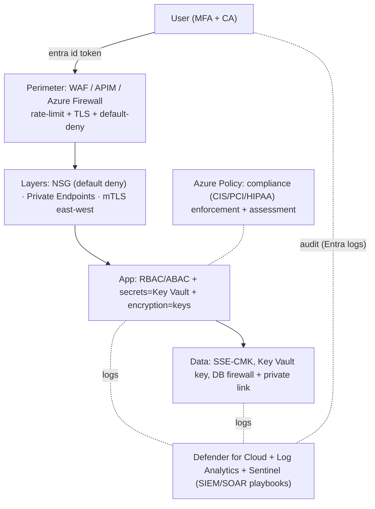

# Day 49: Cloud & Network Security Architecture — Zero Trust, IAM, SIEM, Defense in Depth

> Security isn't one checkbox — architecture: identity is the new perimeter (Zero Trust), network default-deny, secrets everywhere, audit everything, detect and respond. Azure-centric (but patterns = every cloud).

## Overview | Parichay

**Model: defense in depth** — layers: 
```
 Identity(IAM) → Network(DMZ/NSG/firewalls) → Application(WAF/RBAC) → Data(encryption/keys) → People(policies)
```
**Zero Trust** = "never trust, always verify" — verify identity+device for EVERY request (not VNet = trust):
- Identity: Azure AD (Microsoft Entra ID) as control plane; MFA everywhere; conditional access
- Segment: micro-perimeter (each app its own trust); least privilege
- Data: encrypt at rest + transit always
- Monitor: log, detect (Defender/SIEM), respond (playbooks)

Features: Azure Key Vault (keys/certs/secrets), Azure Policy (compliance at scale), Defender for Cloud (recommendations/vulnerability/misconfig), Log Analytics → Sentinel (SIEM/SOAR), NACL+NSG default-deny, Private Endpoints, mTLS.

## What You'll Learn | Aaj Ki Seekh

- [ ] Zero Trust pillars — verify explicitly, least privilege, assume breach
- [ ] IAM: Entra ID, Conditional Access, MFA, RBAC/ABAC/PIM (JIT)
- [ ] Network security architecture: hub-spoke, default-deny NSG/NACL, private endpoints, firewall zones
- [ ] App security: WAF (Azure Application Gateway/Front Door), API auth, mTLS
- [ ] Data/keys: encryption (SSE/CSE/CMK), Key Vault, key rotation
- [ ] Monitoring & response: Defender for Cloud, Log Analytics, Sentinel (SIEM/SOAR), playbooks
- [ ] Compliance: Azure Policy + Defender regulatory (CIS/PCI/HIPAA/SOC2)

## Diagram | Dekho Kaise Kaam Karta Hai



ASCII:
```
Identity(Entra/MFA/CA) → Perimeter(WAF/firewall) → Network(default deny/private) 
 → App(RBAC+secrets+encryption) → Data(CMK) → Observability(Sentinel SIEM/SOAR)
Azure Policy + Defender hold us to standard; assume breach → detect→respond
```

## Demo | Copy-Paste Karke Chalao

```bash
# 1. Entra ID app registration + RBAC
az ad app create --display-name myapp --sign-in-audience AzureADMyOrg
# conditional access: enforce MFA for all users (portal: Entra → Conditional Access)

# 2. Privileged Identity Mgmt (JIT admin) — only when needed (PIM)
az role assignment create --assignee <user> --role Contributor --scope /subscriptions/x \
  --start-time <now> --end-time <+2h>     # JIT window

# 3. NSG default-deny / explicit allow (defense):
cat > nsg.yml << 'EOF'
rules:
  - name: Allow-Web-LB-to-Tier1
    priority: 100
    sourcePortRange: "*"
    destinationPortRanges: [8080, 443]
    sourceAddressPrefixes: [10.0.1.0/24]
    protocol: Tcp
    access: Allow
  - name: DenyAll-EverythingElse
    priority: 4096
    access: Deny
EOF

# 4. Storage encryption + CMK
az storage account create -g rg -n stdevops --encryption-key-type account \
  --identity-type SystemAssigned
az storage account encryption-scope create -g rg --account-name stdevops \
  -n cmk-scope --key-name keyCMK --key-vault-uri <kv-uri>

# 5. Defender + Logs → Sentinel
az security contact create --name default --email security@example.com \
  --minimal-severity High --alert-notifications on
# Sentinel: create workspace → connect data connectors (Entra/AzureActivity/Defender) → playbook

# 6. Azure Policy (compliance at scale):
az policy definition create -n "DenyStoragePublicAccess" \
  --rules '{ "if": { "field": "Microsoft.Storage/storageAccounts/networkAcls.defaultAction", "equals": "Allow" }, "then": { "effect": "Deny" } }' \
  --mode All

# 7. mTLS on app (k8s) = istio PeerAuthentication (Day 33) kurmutual
```

## Real-Life Example | Industry Me

**Breach scenario & response (playbook style):**
```
Detection: Defender/Sentinel alert "Unusual sign-in — impossible travel" + lateral movement
Response: Conditional Access block + reset creds + revoke tokens
Contain: quarantine affected VMs (NSG), rotate keys in Key Vault
Eradicate: patch, revert state from clean backup, revoke access
Recover/validate: monitor re-entry, update runbooks, add prevention policy
```
**Postmortem root-cause patterns (commonly):**
- Exposed management ports (RDP/SSH open to internet) → default-deny + Bastion
- Storage/DB public → private endpoints; firewall only-IP allow
- Hardcoded secrets / over-privileged service principals → Key Vault + RBAC least priv + PIM
- No MFA on admin → Entra conditional + MFA enforced
- No alerting/monitoring on key services → Defender + Log Analytics basics

**Zero Trust list (Azure)**: Entra ID (identity), Conditional Access, PIM (JIT), Key Vault, NSG default-deny + Private Endpoints, Blob/DB private, WAF on public ING, Sentinel (SIEM), Defender for Cloud posture, Azure Policy compliance. Plus supply-chain security (Day 48) + chaos (Day 40).

## Practice Exercise | Abhi Karein

1. Enable MFA via Conditional Access policy (or simulate in docs) — review
2. Entra app + RBAC: least-privilege service principal; PIM JIT elevate demo
3. NSG default-deny: block everything except LB→app; attempt telnet → denied
4. Private endpoint on storage/SQL; remove public network — verify no public path
5. Defend: enable Defender for Cloud recommendations — fix top 5 (open ports etc.)
6. Azure Policy: deny public storage → try create public → denied
7. Sentinel: build simple analytic rule + playbook (email/O365) on missed-PIM alert

## Quick Notes | Yaad Rakho

```
- Zero Trust: verify explicitly (MFA+CA), least privilege, assume breach
- Identity = perimeter: Entra ID + Conditional Access + PIM(JIT) — MFA mandatory
- Network: NSG default-deny rule everywhere, Bastion (no public RDP/SSH), private endpoints for PaaS
- WAF/APIM on public ingress; mTLS east-west (mesh)
- Data: encryption at rest (SSE/CMK) + transit (TLS always); Key Vault holds keys/secrets, rotation
- Defender for Cloud: posture+vulnerability recommendations continuously
- Log Analytics → Sentinel (SIEM/SOAR): collect Entra/Azure/Defender logs, alert, playbooks
- Azure Policy: compliance (CIS/PCI/HIPAA/SOC2) enforcement — Deny effect by default
- Runbooks tested (chaos gameday); assume breach → detect→contain→eradicate→recover
- Secrets: never hardcode; Key Vault/workload identity (Day 35)
```

**Agla:** Grand Capstone — Full Production-Grade DevOps Platform (everything combined). FINAL Day-50.