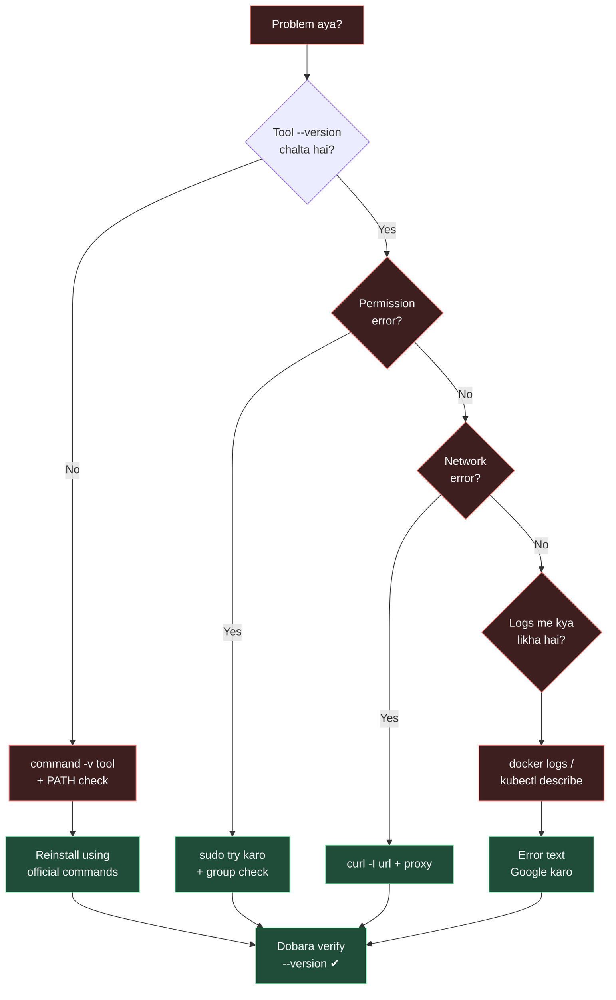

# Help & Debug — Jab Kuch Kaam Nahi Kar Raha

> Ye ek **cheat-sheet** hai. Day 0 setup kiya, koi lab atak gaya, ya koi tool error de raha hai — pehle ye page kholo.

## Quick Diagnostic | Sabse Pehle Ye Karo

```bash
bash ~/setup-check.sh          # Day 0 ka check script (agar banaya ho)
```

### Mermaid: Debug Flow



## CMD Cheat-Sheet | Tools Check Karna

| Tool | Verify | Install Fix |
|------|--------|-------------|
| Git | `git --version` | `sudo apt install -y git` |
| VS Code | `code --version` | `sudo snap install code --classic` |
| Python | `python3 --version` | `sudo apt install -y python3 python3-pip` |
| Node | `node --version` | NodeSource setup script (Day 0) |
| Docker | `docker --version; docker ps` | `sudo sh get-docker.sh` |
| kubectl | `kubectl version --client` | `curl -LO .../kubectl` |
| minikube | `minikube status` | `curl -Lo minikube ...` |
| Terraform | `terraform version` | HashiCorp apt repo (Day 0) |
| Azure CLI | `az --version` | `curl -sL https://aka.ms/InstallAzureCLIDeb \| sudo bash` |

## Common Errors Ek Sheet Me

```bash
# 1. command nahi mila
command -v terraform        # kuch nahi → install karo
echo $PATH                  # binary jis dir me hai wo PATH me hona chahiye

# 2. docker permission
ls -l /var/run/docker.sock
sudo usermod -aG docker $USER   # phir LOGOUT/LOGIN

# 3. az login fail
az login --use-device-code      # device code route

# 4. minikube start fail
docker ps                       # daemon chalu?
minikube delete && minikube start --driver=docker

# 5. port already in use
ss -tlnp | grep :8080           # konsa process?
kill <PID>
```

## Pending Problem? | Last-Resort Checklist

- [ ] `--version` achha output de raha hai?
- [ ] Baaki tool ke saath try kiya (badala wala version)? 
- [ ] Logs/pura error text copy karke search kiya?
- [ ] Ek fresh terminal (logout/login) try kiya?
- [ ] Docker Desktop/daemon chalu hai?
- [ ] Repo ka exact folder/section dobara padha (Day 0 ya related day)?

## Jab Sab Fail Ho

1. **Copy karo** — poora error text, screenshot ya output.
2. **Search karo** — `<tool> error <text>` Google pe.
3. **Community** — Stack Overflow, r/devops (Reddit), official docs "Troubleshooting" section.
4. **Roz ek hi problem** — kal ke kal dobara dekho; naya dimaag = naya solution. 😄

**Ye help page kabhi bhi kholo:** sidebar me 💡 Help & Debug, ya chatbot me "help" likho.