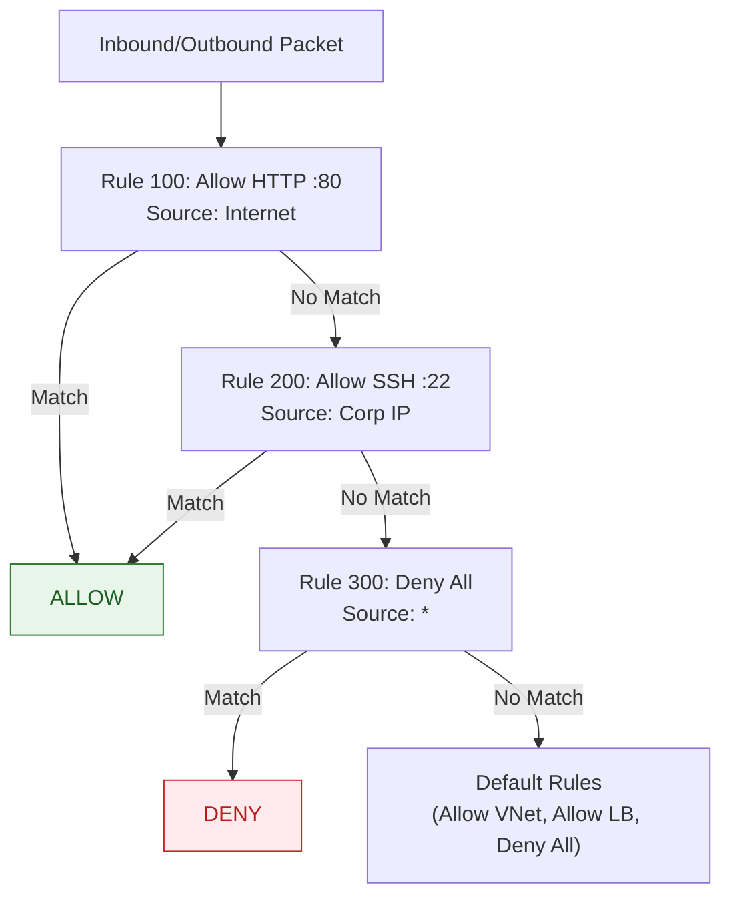

# Deep Dive: Azure Networking — VNet, Subnet, NSG, Load Balancer, DNS, Bastion, Private Endpoints

> **Standalone deep dive:** Azure me infrastructure banane se pehle networking ka solid base chahiye. Ye **cloud networking ka backbone** hai.

---

## 1. Azure Virtual Network (VNet) — Foundation

**VNet = Apna private network in Azure** — logically isolated, apka control.

```mermaid
flowchart TD
    subgraph VNET["VNet 10.0.0.0/16"]
        subgraph SNET1["Subnet-Web 10.0.1.0/24"]
            VM1["VM Web-1\n10.0.1.4"]
            VM2["VM Web-2\n10.0.1.5"]
        end
        subgraph SNET2["Subnet-App 10.0.2.0/24"]
            VM3["VM App-1\n10.0.2.4"]
        end
        subgraph SNET3["Subnet-Data 10.0.3.0/24"]
            SQL["Azure SQL\n10.0.3.5"]
            REDIS["Redis Cache\n10.0.3.6"]
        end
        subgraph SNET4["Subnet-AzureBastion 10.0.100.0/26"]
            BASTION["Azure Bastion"]
        end
        subgraph SNET5["Subnet-PrivateEndpoint 10.0.200.0/24"]
            PE["Private Endpoint\n(storage/sql/keyvault)"]
        end
    end
    
    INTERNET["Internet Users"] -->|HTTPS :443| LB["Azure Load Balancer\n/ Application Gateway"]
    LB --> VM1
    LB --> VM2
    VM1 -->|SQL :1433| SQL
    VM2 -->|Redis :6379| REDIS
    VM3 -->|Internal| SQL
    BASTION -.->|SSH/RDP :22/3389\n(No Public IP)| VM1
    BASTION -.-> VM2
    BASTION -.-> VM3
    PE -.->|Private Link\n(No Internet)| STORAGE["Storage Account"]
    PE -.->|Private Link| KEYVAULT["Key Vault"]
    
    classDef pub fill:#ffebee,stroke:#c62828,color:#b71c1c
    classDef priv fill:#e8f5e9,stroke:#2e7d32,color:#1b5e20
    classDef svc fill:#e3f2fd,stroke:#1565c0,color:#0d47a1
    class INTERNET,LB pub
    class VM1,VM2,VM3,SQL,REDIS,BASTION,PE priv
    class STORAGE,KEYVAULT svc
```

### VNet Fundamentals:
| Property | Detail |
|----------|--------|
| **Address Space** | CIDR block (e.g., `10.0.0.0/16`, `172.16.0.0/12`) — **non-overlapping** with on-prem/other VNets |
| **Region** | VNet is **region-scoped** — resources in same region only |
| **Subnets** | Partition VNet address space — each subnet = smaller CIDR |
| **DNS** | Azure-provided (168.63.129.16) or custom DNS servers |
| **Peering** | Connect VNets (same/different region, same/different subscription) — **no gateway, low latency** |
| **Service Endpoints** | Extend VNet identity to Azure services (Storage, SQL) — traffic stays on backbone |
| **Private Endpoints** | Private IP in VNet for PaaS services — **no public access at all** |

---

## 2. Subnets — Segmentation Strategy

### Subnet Design Patterns:
| Pattern | CIDR Example | Use Case |
|---------|--------------|----------|
| **Tier-based** | `10.0.1.0/24` (web), `10.0.2.0/24` (app), `10.0.3.0/24` (data) | Classic 3-tier |
| **Environment** | `10.1.0.0/16` (prod), `10.2.0.0/16` (staging) | Per-env VNet |
| **Workload** | `10.0.10.0/24` (k8s), `10.0.20.0/24` (vm), `10.0.30.0/24` (serverless) | By compute type |
| **Gateway** | `10.0.255.0/27` (VPN/ER gateway), `10.0.255.32/27` (Bastion) | Dedicated gateway subnets |

### Special Subnets (Reserved Names):
| Subnet Name | Purpose | Size |
|-------------|---------|------|
| `GatewaySubnet` | VPN Gateway / ExpressRoute Gateway | Min `/27` (recommended `/26`) |
| `AzureBastionSubnet` | Azure Bastion | Exactly `/26` |
| `AzureFirewallSubnet` | Azure Firewall | Min `/26` |
| `AzureFirewallManagementSubnet` | Firewall management | `/26` |

**Best Practice:** Plan CIDR with **growth room** — don't pack subnets tightly.

---

## 3. Network Security Group (NSG) — Firewall Rules

**NSG = Stateless L3/L4 firewall** — rules evaluated by priority (lower = higher priority).



### NSG Rule Structure:
| Field | Values |
|-------|--------|
| **Name** | Unique per NSG |
| **Priority** | 100-4096 (lower = higher priority) |
| **Direction** | Inbound / Outbound |
| **Access** | Allow / Deny |
| **Protocol** | TCP, UDP, ICMP, ESP, AH, * |
| **Source/Dest** | IP CIDR, Service Tag, Application Security Group (ASG), * |
| **Source/Dest Port** | Single, range (80-80), * |
| **Description** | Documentation |

### Service Tags (Microsoft-managed IP prefixes):
| Tag | Includes |
|-----|----------|
| `VirtualNetwork` | VNet address space + peered VNets |
| `AzureLoadBalancer` | Azure LB health probes (168.63.129.16) |
| `Internet` | All public IPs |
| `AzureCloud` | All Azure public IPs (region-specific available) |
| `Storage` / `Sql` / `KeyVault` / `EventHub` | Service-specific IPs |

### Application Security Groups (ASG) — Logical Grouping:
```bash
# Create ASGs
az network asg create -g rg -n asg-web -l eastus
az network asg create -g rg -n asg-app -l eastus

# Attach to NICs
az network nic ip-config update -g rg --nic-name nic-web1 --ip-config-name ipconfig1 --application-security-groups asg-web

# NSG Rule using ASG
az network nsg rule create -g rg --nsg-name nsg-web \
  -n AllowWebToApp --priority 100 \
  --source-asgs asg-web --destination-asgs asg-app \
  --destination-port-ranges 8080 --access Allow --protocol Tcp
```
**Benefit:** Scale rules without IP management — add VM to ASG, rule auto-applies.

---

## 4. Load Balancing — L4 vs L7

| Feature | **Azure Load Balancer (L4)** | **Application Gateway (L7)** |
|---------|------------------------------|------------------------------|
| **Layer** | Transport (TCP/UDP) | Application (HTTP/HTTPS) |
| **Routing** | 5-tuple hash (IP+port) | URL path, host header, cookies |
| **SSL Termination** | No (pass-through) | **Yes** (offload, cert management) |
| **WAF** | No | **Yes** (OWASP CRS, custom rules) |
| **Session Affinity** | Client IP / IP+Protocol | Cookie-based (ARR affinity) |
| **Health Probes** | TCP/HTTP/HTTPS | HTTP/HTTPS (path, status codes) |
| **Zone Redundancy** | Standard SKU = zone-redundant | V2 SKU = zone-redundant |
| **Use Case** | TCP apps, SQL, non-HTTP, high throughput | Web apps, API, microservices, SSL offload |

### Load Balancer Types:
| Type | Public IP | Use Case |
|------|-----------|----------|
| **Public Standard** | Yes (static) | Internet-facing apps |
| **Internal Standard** | No (private IP) | Internal tier communication |
| **Basic** | Yes/No | Legacy, no zone redundancy, **avoid for prod** |

### Health Probes (Critical for HA):
```bash
# LB Health Probe
az network lb probe create -g rg --lb-name lb-web \
  -n hp-http --protocol Http --port 80 --path /health \
  --interval 15 --threshold 2
```
**Probe down → backend removed from rotation** → traffic shifts to healthy instances.

---

## 5. Azure DNS — Hosting & Resolution

### Public DNS Zone:
```bash
# Create zone
az network dns zone create -g rg -n example.com

# Records
az network dns record-set a add-record -g rg -z example.com -n www -a 20.190.139.19
az network dns record-set cname set-record -g rg -z example.com -n api -c app.example.com
az network dns record-set txt add-record -g rg -z example.com -n @ -v "v=spf1 include:_spf.google.com ~all"
```

### Private DNS Zones (VNet Resolution):
```bash
# Private zone
az network private-dns zone create -g rg -n privatelink.database.windows.net

# Link to VNet
az network private-dns link vnet create -g rg -n link-to-vnet \
  -z privatelink.database.windows.net -v vnet-name -e true

# Auto-registration (VM hostname → DNS)
az network private-dns link vnet create ... -r true
```

**Private DNS = VM hostname resolution without public DNS.**

---

## 6. Azure Bastion — Secure RDP/SSH Without Public IP

```mermaid
flowchart LR
    USER["User (Browser)"] -->|HTTPS :443| BASTION["Azure Bastion\n(PaaS, Managed)"]
    BASTION -->|SSH :22 / RDP :3389\n(Private IP only)| VM1["VM (No Public IP)"]
    BASTION --> VM2
    BASTION --> VM3
    
    classDef secure fill:#e8f5e9,stroke:#2e7d32,color:#1b5e20
    class BASTION,VM1,VM2,VM3 secure
```

**Key Features:**
- **No public IP on VMs** — Bastion has public IP, VMs stay private
- **Browser-based** — HTML5 client, no client software
- **NSG not needed on VMs** for RDP/SSH — Bastion subnet has own NSG
- **Audit logging** — Who connected, when, duration
- **SKUs:** Basic (2 instances) / Standard (up to 50, scaling, file transfer, IP connect)

```bash
# Create Bastion
az network bastion create -g rg -n bastion-prod \
  --public-ip-address pip-bastion \
  --vnet-name vnet-prod \
  --location eastus \
  --sku Standard
```

---

## 7. Private Endpoints & Private Links — Zero Public Access

**Private Endpoint = NIC with private IP in your VNet** for a PaaS service.

```mermaid
flowchart LR
    VM["VM in VNet\n10.0.1.4"] -->|Private IP\n10.0.200.5| PE["Private Endpoint\n(subnet: 10.0.200.0/24)"]
    PE -->|Private Link\n(MS Backbone)| SERVICE["Azure Service\n(Storage/SQL/KeyVault)"]
    PE -.->|DNS Resolution\nprivatelink.xxx| PRIVDNS["Private DNS Zone\nprivatelink.xxx.database.windows.net"]
    
    classDef secure fill:#e8f5e9,stroke:#2e7d32,color:#1b5e20
    class VM,PE,SERVICE,PRIVDNS secure
```

### Private Endpoint vs Service Endpoint:
| Feature | Service Endpoint | Private Endpoint |
|---------|------------------|------------------|
| **Traffic Path** | VNet → Service public IP (MS backbone) | VNet → Private IP in VNet |
| **Public Access** | Still accessible publicly (unless firewall) | **Completely private** — no public IP |
| **DNS** | Public DNS resolves to public IP | Private DNS resolves to private IP |
| **Services** | Limited (Storage, SQL, Cosmos, etc.) | **All PaaS** (Storage, SQL, KeyVault, Cosmos, Web Apps, etc.) |
| **Cost** | Free | ~$0.01/hr + data transfer |

### When to Use Private Endpoint:
- **Compliance** — no public access allowed (PCI, HIPAA)
- **Data exfiltration prevention** — cannot reach service from internet
- **Hybrid connectivity** — on-prem → ExpressRoute/VPN → VNet → Private Endpoint

---

## 8. VNet Peering — Connect VNets

```bash
# Peer VNet A to VNet B
az network vnet peering create -g rg-a -n peer-a-to-b \
  --vnet-name vnet-a --remote-vnet vnet-b \
  --allow-vnet-access --allow-forwarded-traffic --allow-gateway-transit

# Peer VNet B to VNet A (bidirectional)
az network vnet peering create -g rg-b -n peer-b-to-a \
  --vnet-name vnet-b --remote-vnet vnet-a \
  --allow-vnet-access --allow-forwarded-traffic --use-remote-gateways
```

| Peering Setting | Purpose |
|-----------------|---------|
| `allow-vnet-access` | Resources in each VNet can communicate |
| `allow-forwarded-traffic` | Traffic from on-prem/other peered VNet can flow through |
| `allow-gateway-transit` | **Hub VNet** shares VPN/ER gateway with spoke |
| `use-remote-gateways` | **Spoke VNet** uses hub's gateway |

**Hub-Spoke Topology (Classic Enterprise):**
```
On-Prem
    │
ExpressRoute / VPN
    │
┌─────────────────────────────────┐
│        HUB VNet                 │
│  GatewaySubnet (VPN/ER)         │
│  Azure Firewall / NVA           │
│  Shared Services (DNS, AD)      │
└─────────────────────────────────┘
    │           │           │
    ▼           ▼           ▼
┌───────┐  ┌───────┐  ┌───────┐
│Spoke 1│  │Spoke 2│  │Spoke 3│  (Workload VNets)
│App    │  │Data   │  │DMZ    │
└───────┘  └───────┘  └───────┘
```

---

## 9. Network Virtual Appliances (NVA) — Third-Party Firewalls

| NVA | Use Case |
|-----|----------|
| **Azure Firewall** (Native) | L3-L7, threat intelligence, SNAT/DNAT, forced tunneling |
| **Palo Alto VM-Series** | Advanced threat prevention, SSL decrypt, App-ID |
| **FortiGate** | UTM, SD-WAN integration |
| **Check Point** | CloudGuard, advanced threat prevention |
| **Cisco ASA/FTD** | Familiar Cisco ecosystem |

**Deployment Pattern (Hub-Spoke with NVA):**
```bash
# Route table for spoke VNet
az network route-table create -g rg -n rt-spoke1
az network route-table route create -g rg --route-table-name rt-spoke1 \
  -n to-hub-firewall --address-prefix 0.0.0.0/0 --next-hop-type VirtualAppliance \
  --next-hop-ip-address 10.0.100.4  # NVA private IP in hub

# Associate with spoke subnets
az network vnet subnet update -g rg --vnet-name spoke1 -n subnet-app \
  --route-table rt-spoke1
```

---

## 10. Hybrid Connectivity — On-Prem to Azure

| Option | Bandwidth | Latency | SLA | Use Case |
|--------|-----------|---------|-----|----------|
| **VPN Gateway** | Up to 10 Gbps | ~100ms | 99.9% | Dev/test, backup, low bandwidth |
| **ExpressRoute** | 50 Mbps - 100 Gbps | <10ms | 99.95% | Production, compliance, high throughput |
| **Virtual WAN** | Hub-based, any-to-any | Low | 99.9% | Multi-region, branch connectivity |
| **Azure Virtual Desktop / AVD** | User traffic | Variable | — | Remote work |

**ExpressRoute Peering Types:**
| Peering | Purpose |
|---------|---------|
| **Private** | VNet resources (VMs, Private Endpoints) |
| **Microsoft** | Public PaaS (Storage, SQL, Office 365) via MS backbone |

---

## 11. DDoS Protection & Network Security

| Tier | Features |
|------|----------|
| **Basic** (Free) | Always on, mitigates common attacks |
| **Standard** (~$3000/mo) | Adaptive tuning, attack analytics, cost protection, rapid response |

**Azure Firewall Premium Features:**
- **TLS Inspection** — Decrypt, inspect, re-encrypt HTTPS
- **IDPS** — Signature-based + ML-based threat detection
- **URL Filtering** — Category-based web filtering
- **Threat Intelligence** — Microsoft + 3rd party feeds

---

## 12. Network Monitoring & Diagnostics

| Tool | Purpose |
|------|---------|
| **Network Watcher** | Topology, IP flow verify, next hop, packet capture, connection troubleshoot |
| **Connection Monitor** | Continuous connectivity + latency monitoring (hybrid, VNet-to-VNet) |
| **Flow Logs (NSG)** | IP flow logging to Storage/Log Analytics (security audit, traffic analysis) |
| **Traffic Analytics** | Log Analytics workbook for NSG flow logs (geo map, top talkers, malicious IPs) |
| **Azure Monitor Network Insights** | Unified view of health, metrics, alerts |

```bash
# Enable NSG Flow Logs
az network watcher flow-log create -g rg -n nsg-flowlog \
  --nsg nsg-web --storage-account storagelogs \
  --enabled true --format JSON --version 2

# Connection Monitor
az network watcher connection-monitor create -g rg -n cm-web-to-db \
  --source-resource vm-web --destination 10.0.3.5 --destination-port 1433
```

---

## 13. Real-World: Production Network Architecture

### Enterprise Reference Architecture:
```
┌─────────────────────────────────────────────────────────────┐
│                      AZURE REGION                            │
│  ┌─────────────────┐  ┌──────────────────────────────────┐  │
│  │    HUB VNet     │  │          SPOKE VNets              │  │
│  │ 10.0.0.0/16     │  │  Prod (10.1.0.0/16)               │  │
│  │                 │  │  Staging (10.2.0.0/16)            │  │
│  │ GatewaySubnet   │◀─┤  Dev (10.3.0.0/16)                │  │
│  │ (ExpressRoute)  │  │                                   │  │
│  │ Azure Firewall  │  │ Each Spoke:                       │  │
│  │ Azure Bastion   │  │  - Web subnet (L7 LB)             │  │
│  │ Azure AD DS     │  │  - App subnet (Internal LB)       │  │
│  │ Private DNS     │  │  - Data subnet (Private Endpoints)│  │
│  │ Central Logs    │  │  - AKS subnet (CNI)               │  │
│  └─────────────────┘  └──────────────────────────────────┘  │
└─────────────────────────────────────────────────────────────┘
                              │
                    ExpressRoute / VPN
                              │
                         ┌─────────┐
                         │ ON-PREM │
                         └─────────┘
```

---

## 14. Interview Questions — Azure Networking

| Question | Strong Answer |
|----------|---------------|
| "VNet peering vs VPN vs ExpressRoute?" | Peering = VNet-to-VNet (same region/cross-region, low latency, no gateway); VPN = encrypted over internet (up to 10Gbps); ExpressRoute = dedicated private circuit (up to 100Gbps, <10ms, SLA). |
| "NSG vs ASG?" | NSG = rule collection (priority-based); ASG = logical grouping of VMs (scale rules without IP management). NSG rules reference ASGs. |
| "Service Endpoint vs Private Endpoint?" | Service Endpoint = VNet identity to service public IP (still public); Private Endpoint = private IP in VNet, **no public access**, Private DNS resolution. |
| "Load Balancer vs Application Gateway?" | LB = L4 (TCP/UDP), high throughput, no SSL offload; App Gateway = L7 (HTTP/HTTPS), SSL offload, WAF, path-based routing. |
| "Hub-Spoke topology kyun?" | Centralized connectivity (ExpressRoute/VPN in hub), shared services (Firewall, DNS, AD), cost optimization, governance. Spoke VNets peer to hub. |
| "Private Endpoint ke liye Private DNS kyun?" | PaaS service public DNS resolves to public IP. Private DNS zone (`privatelink.xxx`) resolves to private endpoint IP in VNet. |
| "Azure Bastion kyun use karte hain?" | RDP/SSH without public IP on VMs. Browser-based, managed, audit logging, no NSG rules for 22/3389 on VMs. |
| "NSG rules priority kaise kaam karti hai?" | Lower number = higher priority (100 before 200). First match wins. Default rules at 65000+ (AllowVNet, AllowLB, DenyAll). |
| "Availability Zone me LB kaise deploy?" | Standard SKU = zone-redundant automatically. Frontend IP = zone-redundant. Backend pools across zones. |
| "Forced tunneling kya hai?" | All internet-bound traffic from VNet forced through on-prem firewall (via ExpressRoute/VPN) via route table (0.0.0.0/0 → VPN/ER gateway). |

---

## 15. Hands-On Lab

```bash
# 1. Create VNet with subnets
az network vnet create -g rg -n vnet-prod -l eastus \
  --address-prefix 10.0.0.0/16 \
  --subnet-name subnet-web --subnet-prefix 10.0.1.0/24

az network vnet subnet create -g rg --vnet-name vnet-prod \
  -n subnet-app --address-prefix 10.0.2.0/24

az network vnet subnet create -g rg --vnet-name vnet-prod \
  -n subnet-data --address-prefix 10.0.3.0/24

# 2. Create NSG with rules
az network nsg create -g rg -n nsg-web
az network nsg rule create -g rg --nsg-name nsg-web -n AllowHTTP \
  --priority 100 --source-address-prefixes Internet --destination-port-ranges 80 \
  --access Allow --protocol Tcp --direction Inbound
az network nsg rule create -g rg --nsg-name nsg-web -n AllowSSH \
  --priority 200 --source-address-prefixes 203.0.113.0/24 --destination-port-ranges 22 \
  --access Allow --protocol Tcp --direction Inbound

# 3. Associate NSG to subnet
az network vnet subnet update -g rg --vnet-name vnet-prod -n subnet-web \
  --network-security-group nsg-web

# 4. Create Public LB
az network public-ip create -g rg -n pip-lb-web --sku Standard --allocation-method Static
az network lb create -g rg -n lb-web --sku Standard \
  --public-ip-address pip-lb-web --frontend-ip-name fe-web --backend-pool-name bp-web

az network lb probe create -g rg --lb-name lb-web -n hp-http \
  --protocol Http --port 80 --path /health --interval 15 --threshold 2

az network lb rule create -g rg --lb-name lb-web -n rule-http \
  --frontend-ip-name fe-web --backend-pool-name bp-web \
  --probe-name hp-http --protocol Tcp --frontend-port 80 --backend-port 80

# 5. Create Private Endpoint for Storage
az network private-endpoint create -g rg -n pe-storage \
  --vnet-name vnet-prod --subnet subnet-data \
  --private-connection-resource-id /subscriptions/.../resourceGroups/rg/providers/Microsoft.Storage/storageAccounts/mystorage \
  --group-ids blob --connection-name pec-storage

# 6. Create Private DNS Zone & Link
az network private-dns zone create -g rg -n privatelink.blob.core.windows.net
az network private-dns link vnet create -g rg -n link-to-vnet \
  -z privatelink.blob.core.windows.net -v vnet-prod -e true

# 7. Test connectivity
# From VM in subnet-web: curl http://app.internal (via Internal LB)
# From VM in subnet-data: nslookup mystorage.privatelink.blob.core.windows.net
```

---

## 16. Summary | Yaad Rakho

1. **VNet = Private network** (CIDR, region-scoped); subnets for segmentation
2. **NSG = Stateless firewall** (priority-based); ASG for scalable rule management
3. **Service Tags** = Microsoft-managed IP prefixes (VirtualNetwork, Internet, Storage, etc.)
4. **Load Balancer (L4)** vs **Application Gateway (L7 + WAF + SSL offload)** — choose by protocol
5. **Health Probes** = Critical for HA; configure interval/threshold properly
6. **Private Endpoint** = Private IP in VNet for PaaS; **zero public access**; Private DNS required
7. **Service Endpoint** = VNet identity to service public IP (free, but public still accessible)
8. **Bastion** = Browser-based RDP/SSH without VM public IP; managed, audited
9. **Hub-Spoke** = Centralized connectivity (ER/VPN), shared services, governance
10. **Peering** = Low-latency VNet-to-VNet; gateway transit for hub-spoke
11. **Private DNS** = Hostname resolution in VNet; auto-registration for VMs
12. **Network Watcher** = Troubleshooting (IP flow verify, packet capture, connection monitor)

---
**Related:** [Day 23](../day-23-azure-services-and-identity.md) · [DNS Deep Dive](../topics/dns-explained.md) · [K8s Networking](../topics/kubernetes-architecture.md) · [Observability](../topics/observability.md)