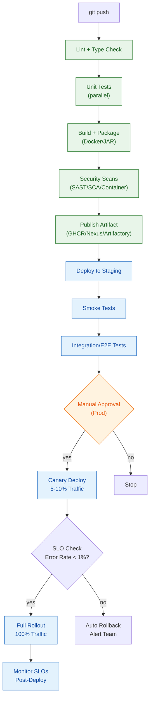

# Deep Dive: CI/CD vs Continuous Delivery vs Continuous Deployment — Poori Kahani

> **Kaha ka hai:** Day 8-9-10-14 ka gahra version. Interview me 90% yehi poocha jata hai. Concept clear ho to pipeline design aasani se aata hai.

---

## 1. Core Definitions — Ek Line Mein

| Term | Definition | Key Differentiator |
|------|------------|-------------------|
| **CI (Continuous Integration)** | Har code change (push/PR) pe **automated build + test** — "Does it compile? Do tests pass?" | **Fast feedback** to developer (minutes) |
| **Continuous Delivery (CD)** | CI ke baad **artifact ready + deployable**; production deploy **manual approval** se | **Human gate** before prod |
| **Continuous Deployment** | CD + **automatic production deploy** — koi manual step nahi; har passing build live | **Zero human intervention** after merge |

**Visual:**
```text
Code Push
    ↓
[CI] Build → Unit Test → Lint → Security Scan → Artifact
    ↓
[CD - Delivery] Deploy to Staging → E2E Tests → Manual Approval
    ↓
[CD - Deployment] Auto-deploy to Production → Canary/Blue-Green → Monitor
```

---

## 2. CI (Continuous Integration) — Detail

**Goal:** *"Integration hell" khatam karo* — developers integrate daily, broken code catch ho jaye turant.

**CI Pipeline Stages (Typical):**
```yaml
# GitHub Actions example
stages:
  - lint:        # Code style, static analysis (eslint, pylint, checkstyle)
  - unit-test:   # Fast, isolated tests (JUnit, pytest, Jest) — <5 min
  - build:       # Compile, package (mvn package, docker build)
  - scan:        # SAST (semgrep), SCA (npm audit/snyk), container scan (trivy)
  - package:     # Publish artifact (JAR, Docker image, helm chart) to registry
```

**CI Best Practices:**
| Practice | Why |
|----------|-----|
| **Trunk-based development** | Long-lived branches = merge hell; short-lived branches (<1 day) |
| **Fast feedback** | Pipeline < 10 min (unit), < 30 min (full); parallelize jobs |
| **Fail fast** | Lint → unit test → build → scan (cheap checks first) |
| **Deterministic builds** | Same input → same output (lockfiles, pinned versions) |
| **Artifact immutability** | Build once, promote same artifact (no rebuild per env) |
| **Flaky test quarantine** | Flaky tests separate queue; fix or delete, don't ignore |

**CI Metrics:**
- **Pipeline duration** (target: <10 min for PR feedback)
- **Queue time** (waiting for runner)
- **Failure rate** (flaky vs real)
- **PR merge frequency** (daily = good)

---

## 3. Continuous Delivery — Delivery ≠ Deployment

**Delivery = "Ready to deploy anytime"** — artifact built, tested, staged, approved.

**CD Pipeline (Delivery):**
```text
CI Artifact
    ↓
[Deploy to Dev/Staging] → Smoke Tests → Integration Tests → Contract Tests
    ↓
[Manual Approval Gate] ← Human clicks "Promote to Prod"
    ↓
[Deploy to Production] → Canary/Blue-Green → Health Checks → Full Traffic
```

**Approval Gates (Types):**
| Gate Type | When Used | Automation Level |
|-----------|-----------|------------------|
| **Manual approval** | Production, regulated envs | Human clicks button |
| **Automated policy** | Security scan pass, test coverage >80% | OPA/Gatekeeper, GitHub Environments |
| **Scheduled** | Maintenance windows | Cron-based |
| **Progressive** | Canary % → auto-promote on metrics | Flagger/Argo Rollouts |

**Key Principle:** **Same artifact** promote hota hai — Dev → Staging → Prod. **No rebuild.**

---

## 4. Continuous Deployment — Full Auto

**Deployment = "Every green build goes to prod automatically."**

**Requirements for Safe Continuous Deployment:**
1. **High test coverage** (>80% unit, integration, contract)
2. **Comprehensive monitoring** (SLOs, alerting, dashboards)
3. **Fast rollback** (<5 min — feature flag, blue-green, DB migration safety)
4. **Progressive delivery** (canary, feature flags, automated rollback on metrics)
5. **Culture of ownership** — dev team owns prod incidents

**Progressive Delivery Patterns:**
| Pattern | How It Works | Risk |
|---------|--------------|------|
| **Canary** | 5% → 25% → 50% → 100% traffic shift | Low; auto-rollback on error rate |
| **Blue-Green** | Two identical envs; switch traffic instantly | Medium; DB migration complexity |
| **Feature Flags** | Code deployed, feature toggled on/off | Lowest; instant kill switch |
| **Ring Deployment** | Internal → Beta → Ring 1 → Ring 2 → All | Low; gradual user exposure |

**Tools:** Flagger, Argo Rollouts, LaunchDarkly, Unleash, Flux

---

## 5. Pipeline Architecture — Production Grade



---

## 6. Environment Strategy — Dev → Staging → Prod

| Environment | Purpose | Data | Deploy Trigger | Approval |
|-------------|---------|------|----------------|----------|
| **Dev** | Developer integration testing | Synthetic/anonymized | Every commit (auto) | None |
| **Staging** | Full integration, E2E, perf | Production-like (subset) | Every green build (auto) | None |
| **Pre-Prod** | Final validation, UAT | Production clone | Manual/Scheduled | Manual |
| **Production** | Real users | Real data | Manual approval | **Mandatory** |

**Key Rule:** Staging ≈ Production (same infra, config via env vars). Pre-prod optional for regulated industries.

---

## 7. Database Migrations — CI/CD Ka Sabse Tricky Part

**Problem:** Schema changes + data migration + zero-downtime.

**Patterns:**
| Pattern | Description | When |
|---------|-------------|------|
| **Expand/Contract** | Add column → deploy code using both → remove old | Always (safe default) |
| **Backward-compatible** | Never drop column/rename in same deploy | Always |
| **Migration scripts** | Versioned (Flyway/Liquibase), run pre-deploy | Every schema change |
| **Blue-green DB** | Two DB instances, switch | High-risk, zero-downtime required |

**Golden Rules:**
1. **Additive only** in forward migration (new columns nullable, defaults)
2. **Separate deploy** from migration (migrate → verify → deploy code)
3. **Rollback plan** for every migration (down script tested)
4. **Test on staging** with production-data-volume subset

---

## 8. Security Gates in Pipeline (DevSecOps Integration)

```yaml
# Gate examples in GitHub Actions
gates:
  - name: "SAST Gate"
    tool: "semgrep / CodeQL"
    fail_on: "HIGH/CRITICAL findings"
  - name: "SCA Gate"
    tool: "Snyk / npm audit / OWASP Dependency Check"
    fail_on: "CVSS >= 7"
  - name: "Container Scan"
    tool: "Trivy / Grype"
    fail_on: "CRITICAL vulns in base image"
  - name: "License Check"
    tool: "FOSSA / ClearlyDefined"
    fail_on: "GPL/AGPL in proprietary code"
  - name: "Policy Gate"
    tool: "OPA / Kyverno"
    rules: "No privileged containers, resource limits required"
```

---

## 9. Real-World: Netflix / Google / Amazon Style

**Netflix (Continuous Deployment pioneers):**
- **Spinnaker** (open-sourced) for multi-cloud deployments
- **Canary analysis** automated via Kayenta (ML-based metric comparison)
- **Chaos engineering** (Chaos Monkey) in pipeline — if canary survives chaos → promote

**Google (Borg/Internal):**
- **Borg** scheduler + **Canary** via traffic splitting
- **SLO-based** auto-rollback (error budget burn rate)
- **Rapid rollback** < 30 seconds via binary rollback

**Amazon (Apollo/CodeDeploy):**
- **One-click deploy** to fleets
- **Pre/Post deploy hooks** for validation
- **Rollback** automatic on CloudWatch alarm

---

## 10. Common Pitfalls & Fixes

| Pitfall | Symptom | Fix |
|---------|---------|-----|
| **Long-lived feature branches** | Merge conflicts, stale code | Trunk-based dev, feature flags |
| **Rebuilding per environment** | "Works in staging, breaks in prod" | Build once, promote artifact |
| **No automated rollback** | Manual rollback = 30+ min downtime | Feature flags + health check auto-rollback |
| **Flaky tests ignored** | Pipeline unreliable, devs ignore failures | Quarantine, fix or delete |
| **Secrets in pipeline logs** | Credentials leaked | Masked secrets, external vault, never echo |
| **No deployment tracking** | "Kya deploy hua?" confusion | Deployment markers in Grafana, Slack notifications |
| **Single pipeline for all** | Slow, irrelevant checks | Monorepo: path-based triggers; polyrepo: shared templates |

---

## 11. Interview Cheatsheet — CI/CD

| Question | Expected Answer |
|----------|-----------------|
| "CI vs CD vs Continuous Deployment?" | CI=build+test; CD=artifact ready+manual approval; Deployment=auto prod |
| "Pipeline stages kya hain?" | Lint → Unit Test → Build → Scan → Artifact → Staging → Tests → Approval → Canary → Prod |
| "Artifact immutability kyun?" | Same binary all envs; reproducibility; no "works on my machine" |
| "Blue-green vs Canary?" | Blue-green=instant switch, 2x infra; Canary=gradual, less infra, metric-driven |
| "Database migration zero-downtime?" | Expand/contract, backward-compatible, separate migration step, tested rollback |
| "Flaky tests handle kaise?" | Quarantine, auto-retry (max 2), fix within sprint, delete if low value |
| "Secrets in CI/CD?" | Never in code/logs; GitHub Secrets / Vault / Azure Key Vault; masked output |
| "Rollback strategy?" | Feature flag kill switch (instant) → blue-green switch (fast) → artifact redeploy (slow) |
| "Monorepo pipeline optimization?" | Path-based triggers, affected projects only (Nx/TurboRepo), shared cache |

---

## 12. Hands-On Lab (Try in Your Repo)

```bash
# 1. Create a simple GitHub Actions workflow
cat > .github/workflows/ci.yml << 'EOF'
name: CI
on: [push, pull_request]
jobs:
  test:
    runs-on: ubuntu-latest
    steps:
      - uses: actions/checkout@v4
      - name: Setup Node
        uses: actions/setup-node@v4
        with: { node-version: '20', cache: 'npm' }
      - run: npm ci
      - run: npm run lint
      - run: npm test -- --coverage
      - name: Upload coverage
        uses: codecov/codecov-action@v3
EOF

# 2. Add a CD workflow (staging auto, prod manual)
cat > .github/workflows/cd.yml << 'EOF'
name: CD
on:
  workflow_run:
    workflows: ["CI"]
    types: [completed]
    branches: [main]
jobs:
  deploy-staging:
    if: ${{ github.event.workflow_run.conclusion == 'success' }}
    runs-on: ubuntu-latest
    steps:
      - uses: actions/checkout@v4
      - name: Deploy to Staging
        run: echo "Deploy to staging..." # kubectl apply / helm upgrade
      - name: Smoke Tests
        run: curl -f https://staging.example.com/health
  
  deploy-prod:
    needs: deploy-staging
    runs-on: ubuntu-latest
    environment: production  # Manual approval gate
    steps:
      - name: Deploy to Production
        run: echo "Deploy to prod..." # Canary via Flagger/Argo
EOF

# 3. Test locally with act (GitHub Actions local runner)
# act -j test
```

---

## 13. Summary | Yaad Rakho

1. **CI = Fast feedback** (lint, test, build on every push) — <10 min target
2. **Continuous Delivery = Artifact ready + manual prod approval**
3. **Continuous Deployment = Auto prod** (needs high maturity: tests, monitoring, rollback)
4. **Artifact immutability** — build once, promote same artifact everywhere
5. **Progressive delivery** (canary, feature flags) = safe continuous deployment
6. **Database migrations** = expand/contract, backward-compatible, tested rollback
7. **Security gates** in pipeline (SAST, SCA, container scan, policy)
8. **Metrics:** Lead time, deploy freq, MTTR, change fail rate (DORA)
9. **Culture:** Dev owns pipeline, blameless postmortems, shared on-call

---
**Related:** [Day 8](../day-08-cicd-concepts-and-pipelines.md) · [Day 9](../day-09-github-actions.md) · [Day 10](../day-10-jenkins-pipeline.md) · [DevOps Culture](../topics/devops-culture.md) · [DevSecOps](../topics/devsecops.md)