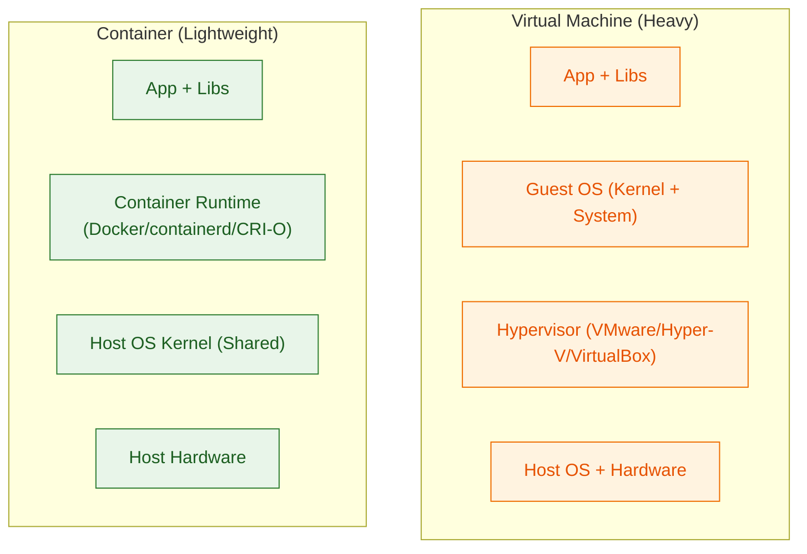
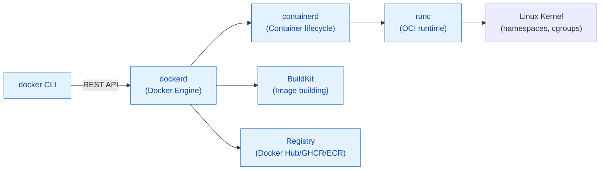

# Deep Dive: Containers vs VMs — Dibba vs Poora Computer

> **Kaha ka hai:** Day 15 (Docker) ka gahra version. Ye fundamental concept hai — agar ye clear hai to Docker, K8s, serverless sab asaan.

---

## 1. Core Difference — Ek Diagram Mein



| Aspect | Virtual Machine | Container |
|--------|----------------|-----------|
| **Isolation** | Hardware-level (full OS) | OS-level (kernel namespaces + cgroups) |
| **Boot Time** | Seconds to minutes | Milliseconds |
| **Disk Size** | GBs (full OS) | MBs (app + deps only) |
| **Memory Overhead** | 400MB+ per VM | 5-50MB per container |
| **Density** | 10-50 VMs/host | 100-1000 containers/host |
| **Portability** | Hypervisor-specific | Runtime-standard (OCI) |
| **Security** | Strong (hypervisor boundary) | Good (kernel namespaces); rootless = better |
| **Use Case** | Legacy apps, Windows GUI, kernel modules | Microservices, CI/CD, cloud-native |

---

## 2. What's Inside — Layer by Layer

### Virtual Machine:
```
Hardware
  ↓
Host OS (Linux/Windows)
  ↓
Hypervisor (Type 1: ESXi/Hyper-V / Type 2: VirtualBox/VMware Workstation)
  ↓
Guest OS (Linux/Windows — full kernel, init, systemd, packages)
  ↓
Application + Dependencies
```

### Container:
```
Hardware
  ↓
Host OS Kernel (Linux — namespaces, cgroups, seccomp, capabilities)
  ↓
Container Runtime (containerd / CRI-O / Docker Engine)
  ↓
Container Image Layers (read-only)
  ↓
Writable Layer (container-specific changes)
  ↓
Application + Only Its Dependencies
```

**Key Insight:** Container **shares host kernel** — isliye Linux container Linux host pe chalta hai. Windows/Mac pe Docker Desktop ek lightweight Linux VM chalta hai (WSL2/Hyperkit) uske andar containers.

---

## 3. Container Internals — Linux Kernel Magic

Containers Linux kernel ke 3 primitives use karte hain:

### Namespaces (Isolation — "What you can see")
| Namespace | Isolates | CLI Flag |
|-----------|----------|----------|
| **PID** | Process IDs (container me PID 1 = init) | `--pid` |
| **NET** | Network interfaces, routing, firewall | `--net` |
| **MNT** | Mount points, filesystem | `--mount` |
| **UTS** | Hostname, domain name | `--uts` |
| **IPC** | Inter-process communication | `--ipc` |
| **USER** | User/group IDs (root in container ≠ root on host) | `--user` |
| **CGROUP** | Resource limits (v2 unified hierarchy) | `--cgroupns` |

### Cgroups (Control Groups — "What you can use")
- **CPU:** shares, quota/period, cpuset
- **Memory:** limit, swap limit, OOM control
- **I/O:** blkio weight, throttle
- **PIDs:** max processes (fork bomb prevention)

### Capabilities (Fine-grained root privileges)
- **Drop ALL, add only needed:** `--cap-drop=ALL --cap-add=NET_BIND_SERVICE`
- **Rootless containers:** User namespace mapping (UID 0 in container = UID 100000 on host)

### Seccomp / AppArmor / SELinux (Syscall filtering)
- **Seccomp profile:** Default Docker profile blocks ~44 dangerous syscalls
- **Custom profiles:** For high-security workloads

---

## 4. Docker Architecture — Components



**Components:**
| Component | Role |
|-----------|------|
| **docker CLI** | User interface (talks to daemon via REST) |
| **dockerd** | Daemon — API, image management, networking, volumes |
| **containerd** | Container lifecycle (pull, create, start, stop, snapshots) — CNCF graduated |
| **runc** | OCI runtime spec implementation — actually creates container process |
| **BuildKit** | Modern builder (parallel, cache export, secrets) |
| **Registry** | Image storage (Docker Hub, GHCR, ECR, ACR, Harbor) |

---

## 5. Image vs Container — Immutable vs Mutable

**Image = Read-only template** (layered filesystem)
- Layers = Dockerfile instructions (cached, shared)
- `docker build` → creates image with SHA256 digest
- **Immutable** — same digest = same content always

**Container = Running instance of image** (read-write layer on top)
- `docker run` → creates container with thin R/W layer
- Changes in container = only in that container's R/W layer
- `docker commit` → saves R/W layer as new image layer (avoid in prod)

**Layer Caching (Critical for Speed):**
```dockerfile
# GOOD ORDER — dependencies change rarely
COPY package*.json ./
RUN npm ci --only=production      # Cached unless package.json changes

COPY . .                          # Changes frequently
RUN npm run build

# BAD ORDER — invalidates cache every build
COPY . .                          # Changes every time
RUN npm ci --only=production      # Re-runs every build!
```

---

## 6. Dockerfile Best Practices — Production Ready

```dockerfile
# 1. Use specific base image tag (not latest)
FROM node:20-alpine AS builder

# 2. Create non-root user
RUN addgroup -S appgroup && adduser -S appuser -G appgroup

# 3. Set working directory
WORKDIR /app

# 4. Copy dependency files FIRST (cache optimization)
COPY package*.json ./
RUN npm ci --only=production && npm cache clean --force

# 5. Copy source code
COPY --chown=appuser:appgroup . .

# 6. Build step (if needed)
RUN npm run build

# 7. Multi-stage: Runtime stage (smaller, no dev deps)
FROM node:20-alpine AS runtime

# 8. Security: non-root, read-only rootfs
RUN addgroup -S appgroup && adduser -S appuser -G appgroup
USER appuser
WORKDIR /app

# 9. Copy only production artifacts
COPY --from=builder --chown=appuser:appgroup /app/node_modules ./node_modules
COPY --from=builder --chown=appuser:appgroup /app/dist ./dist
COPY --from=builder --chown=appuser:appgroup /app/package*.json ./

# 10. Runtime config
EXPOSE 3000
ENV NODE_ENV=production
CMD ["node", "dist/index.js"]

# 11. Health check (for orchestrator)
HEALTHCHECK --interval=30s --timeout=3s --start-period=10s --retries=3 \
  CMD wget --no-verbose --tries=1 --spider http://localhost:3000/health || exit 1
```

**Security Checklist:**
- [ ] Non-root USER
- [ ] Read-only root filesystem (`--read-only` + `tmpfs` for /tmp)
- [ ] Drop all capabilities, add only needed
- [ ] No secrets in image (use build args / runtime env / vault)
- [ ] Minimal base (alpine/distroless/scratch)
- [ ] Scan with Trivy/Grype in CI

---

## 7. Container Networking — Deep Dive

| Network Mode | Use Case | Isolation |
|--------------|----------|-----------|
| **bridge** (default) | Single host, containers talk via Docker DNS | Per-container IP, NAT to host |
| **host** | Max performance, no port mapping | No network isolation |
| **none** | No networking | Complete isolation |
| **macvlan** | Container gets MAC, looks like physical | Direct LAN access |
| **overlay** (Swarm/K8s) | Multi-host, VXLAN | Cluster-wide |

**Docker DNS:** Containers resolve each other by **container name** (not IP). Automatic service discovery.

**Port Mapping:** `-p 8080:80` = host:8080 → container:80. `-P` = publish all EXPOSEd ports randomly.

---

## 8. Storage — Volumes vs Bind Mounts vs tmpfs

| Type | Persistence | Use Case | Performance |
|------|-------------|----------|-------------|
| **Named Volume** | Yes (Docker managed) | DB data, logs, shared data | Native (best) |
| **Bind Mount** | Yes (host path) | Config files, source code (dev) | Host FS dependent |
| **tmpfs** | No (memory only) | Secrets, cache, temporary files | Fastest (RAM) |

**Volume Drivers:** Local (default), NFS, AWS EBS, Azure Disk, GCE PD, Ceph, Portworx.

---

## 9. Security Deep Dive — Hardening Checklist

| Layer | Action | Command/Config |
|-------|--------|----------------|
| **Image** | Minimal base, non-root, no secrets | `FROM distroless`, `USER 1000`, Trivy scan |
| **Runtime** | Drop caps, read-only, no-new-privs | `--cap-drop=ALL --read-only --security-opt=no-new-privileges` |
| **Network** | Network policies, no host network | `--network=custom`, Kubernetes NetworkPolicy |
| **Kernel** | Seccomp, AppArmor, SELinux | `--security-opt=seccomp=profile.json` |
| **Supply Chain** | Signed images, SBOM, provenance | `cosign sign`, `syft`, SLSA provenance |
| **Runtime Security** | Falco, Tetragon, Tracee | Falco rules for execve, network, file access |

**Rootless Mode (Best Practice):**
```bash
# Install rootless Docker
curl -fsSL https://get.docker.com/rootless | sh

# Run as non-root user (no sudo)
docker run --rm alpine whoami  # Returns uid 1000, not root
```

---

## 10. Windows/Mac — Docker Desktop Architecture

```
Windows/macOS
    ↓
WSL 2 (Linux VM - lightweight, ~100MB RAM base)
    ↓
containerd + runc (inside WSL2)
    ↓
Linux containers (native speed)
```

**Key Points:**
- **WSL2 integration** = near-native Linux container performance
- **File system:** `/mnt/c/...` slow; use Linux paths (`~/project`) for speed
- **Kubernetes:** Built-in single-node cluster (kind alternative)
- **Resource limits:** Configure in Docker Desktop settings (CPU, RAM, disk)

---

## 11. Real-World: Production Container Checklist

```yaml
# Kubernetes Pod equivalent security context
securityContext:
  runAsNonRoot: true
  runAsUser: 1000
  runAsGroup: 1000
  fsGroup: 1000
  readOnlyRootFilesystem: true
  allowPrivilegeEscalation: false
  capabilities:
    drop: ["ALL"]
  seccompProfile:
    type: RuntimeDefault

# Resource limits (always set!)
resources:
  requests:
    memory: "256Mi"
    cpu: "250m"
  limits:
    memory: "512Mi"
    cpu: "500m"

# Health checks
livenessProbe:
  httpGet: { path: /health, port: 8080 }
  initialDelaySeconds: 10
  periodSeconds: 30
readinessProbe:
  httpGet: { path: /ready, port: 8080 }
  initialDelaySeconds: 5
  periodSeconds: 10
```

---

## 12. Interview Questions — Containers vs VMs

| Question | Strong Answer |
|----------|---------------|
| "Container vs VM difference?" | VM=full OS+hypervisor (hardware isolation); Container=shared kernel, namespaces+cgroups (OS isolation). VM: GBs, minutes; Container: MBs, milliseconds. |
| "Container me PID 1 kya hota hai?" | Container ka init process (application). `docker run --init` use karo (tini) for proper signal handling. |
| "Namespaces vs cgroups?" | Namespaces = **visibility isolation** (what you see); cgroups = **resource limits** (what you use). |
| "Docker image layers kaise kaam karte hain?" | Har instruction = layer; read-only; copy-on-write; cached by instruction hash. Order matters for cache. |
| "Multi-stage build kyun?" | Build tools (JDK, gcc) final image me na jayein. Build stage → runtime stage copy only artifacts. |
| "Container security best practices?" | Non-root, read-only fs, drop caps, minimal base (distroless), scan (Trivy), sign (cosign), runtime security (Falco). |
| "Volume vs Bind mount?" | Volume=Docker managed, portable; Bind=host path, dev/config. Volume better for prod data. |
| "Docker pe Windows/Mac kaise chalta hai?" | WSL2 (Linux VM) → containerd → runc → Linux containers. Near-native performance. |
| "Image size kam kaise karein?" | Multi-stage, alpine/distroless, .dockerignore, combine RUN, remove package managers, remove docs. |
| "Container escape kya hai?" | Container se host kernel access. Mitigation: rootless, seccomp, no privileged, user namespaces, kernel hardening. |

---

## 13. Hands-On Lab (Practice Commands)

```bash
# 1. Run container with security hardening
docker run -d \
  --name secure-app \
  --user 1000:1000 \
  --read-only \
  --tmpfs /tmp --tmpfs /var/run \
  --cap-drop=ALL \
  --security-opt=no-new-privileges \
  --security-opt=seccomp=default \
  --memory=512m --cpus=0.5 \
  nginx:alpine

# 2. Inspect namespaces
docker run -d --name test alpine sleep 3600
docker exec test ls -la /proc/self/ns/
# pid, net, mnt, uts, ipc, user, cgroup

# 3. Check cgroups
docker exec test cat /proc/self/cgroup

# 4. Multi-stage build test
docker build -t myapp:multi -f Dockerfile.multistage .
docker images myapp:multi  # Compare size vs single-stage

# 5. Scan image
trivy image myapp:multi

# 5. Rootless test
docker run --rm alpine id  # Should show uid=1000 (not 0) in rootless mode
```

---

## 14. Summary | Yaad Rakho

1. **VM = Hardware isolation** (hypervisor + guest OS); **Container = OS isolation** (kernel namespaces + cgroups)
2. **Container = Lightweight** (MBs, ms boot, high density); **VM = Heavyweight** (GBs, min boot, strong isolation)
3. **Docker = Engine (daemon + containerd + runc + BuildKit)** — not a VM
4. **Image = Immutable layers** (cacheable); **Container = Image + R/W layer**
5. **Multi-stage builds** = smaller, secure production images
6. **Security:** Non-root, read-only, drop caps, minimal base, scan, sign, runtime security
7. **Networking:** Bridge (default), host, overlay, macvlan; DNS by container name
8. **Storage:** Volumes (managed), Bind mounts (host), tmpfs (memory)
9. **Rootless mode** = best practice for production
10. **Docker Desktop (Win/Mac)** = WSL2 Linux VM underneath

---
**Related:** [Day 15](../day-15-docker-fundamentals.md) · [Day 16](../day-16-docker-compose-multicontainer.md) · [Day 17](../day-17-container-images-optimization.md) · [Day 18](../day-18-kubernetes-fundamentals.md)