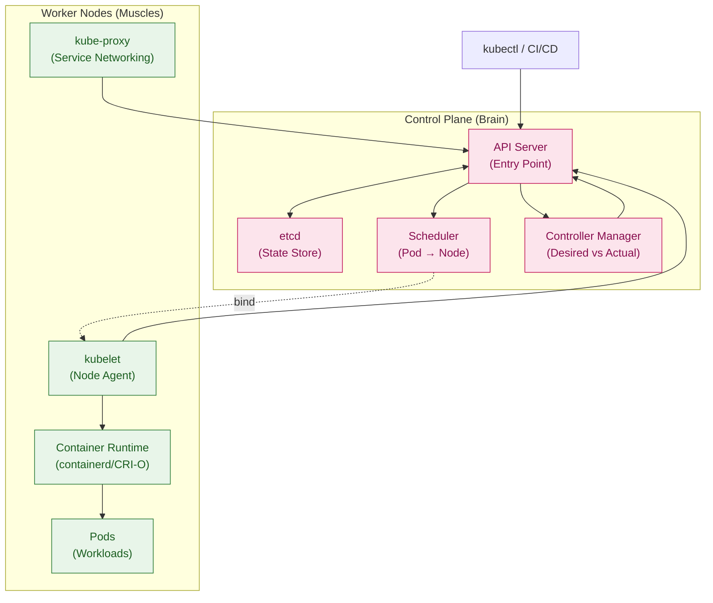
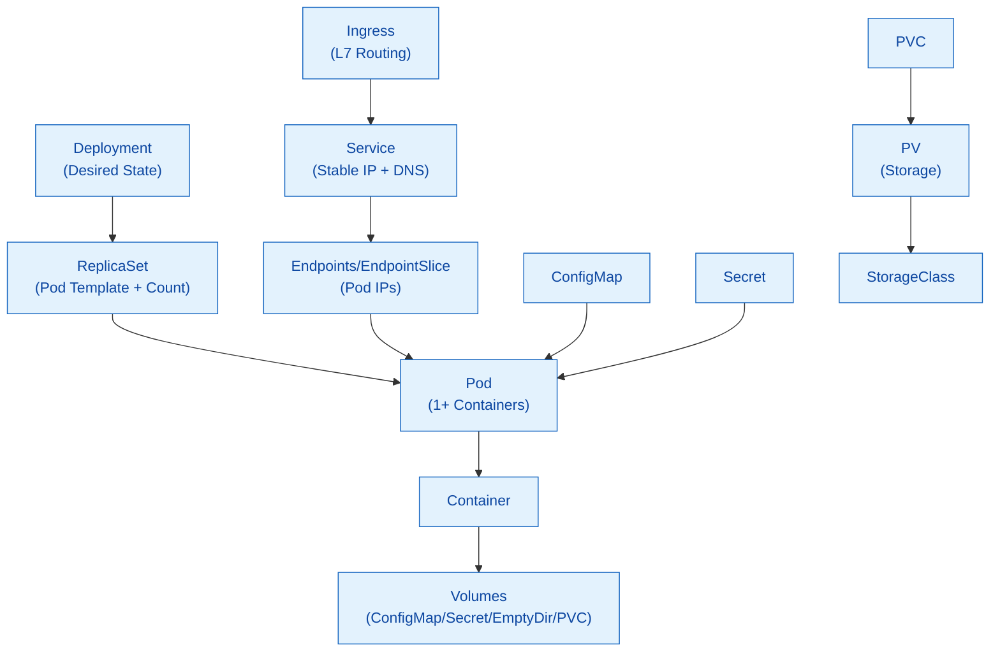
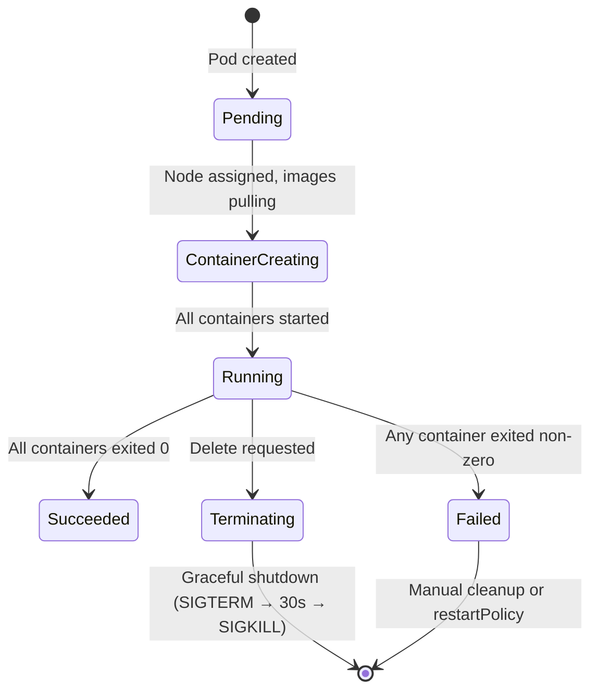

# Deep Dive: Kubernetes Architecture — Control Plane & Scheduling

> **Kaha ka hai:** Day 18-21 ka gahra version. K8s me koi bhi interview QA is architecture ke bina nahi chalta.

---

## 1. Big Picture — Two Halves



**Control Plane** = Cluster ka brain — decisions, state, scheduling.  
**Worker Nodes** = Actual work hota yahan — containers chalte hain.

**Key Insight:** `kubectl` **sirf API Server se baat karta hai** — nodes se direct kabhi nahi. Ye architecture Kubernetes ko scalable, resilient, aur declarative banata hai.

---

## 2. Control Plane Components — Deep Dive

### 2.1 API Server — Front Door
- **Role:** Single entry point for all operations (REST/gRPC)
- **Authentication:** Certs, tokens, OIDC, webhook
- **Authorization:** RBAC (Role/ClusterRole + Binding)
- **Admission Controllers:** Mutating (modify request) + Validating (reject/allow) — e.g., `NamespaceLifecycle`, `LimitRanger`, `ResourceQuota`, `PodSecurityPolicy` (deprecated→PSA), `ValidatingAdmissionWebhook`
- **Scalability:** Horizontal (multiple replicas behind LB), stateless
- **HA:** Odd number (3/5) for etcd quorum

### 2.2 etcd — The Source of Truth
- **What:** Distributed key-value store (Raft consensus)
- **Stores:** All cluster state — pods, services, configs, secrets, nodes, CRDs
- **Critical:** etcd down = cluster blind (read-only). **Backup daily!**
- **Performance:** SSD required, low latency network, dedicated disk
- **Encryption:** Encryption at rest (KMS/AES) for secrets
- **Sizing:** 1000 nodes ≈ 2-4 GB; 5000 nodes ≈ 8-16 GB

### 2.3 Scheduler — Pod-to-Node Matchmaker
**Scheduling Flow:**
```text
1. Pod created (unscheduled) → API Server
2. Scheduler watches unscheduled pods
3. Filter (Predicates): Node eligible?
   - Resource fit (CPU/Mem requests)
   - Node selectors / affinity / taints/tolerations
   - Volume topology, port conflicts
4. Score (Priorities): Rank eligible nodes
   - LeastRequested (spread load)
   - BalancedResourceAllocation
   - ImageLocality (prefer nodes with image)
   - TaintToleration (prefer tolerated)
   - InterPodAffinity (co-locate/anti-affinity)
5. Bind: Best node → API Server (binding)
6. Kubelet on node picks up → starts pod
```

**Custom Schedulers:** Multiple schedulers possible (`schedulerName: my-scheduler`). Default = `default-scheduler`.

**Scheduler Extenders / Plugins (v1.18+):** Scheduler framework allows custom plugins for filter/score/bind.

### 2.4 Controller Manager — The Reconcilers
**Runs multiple controllers (each a reconcile loop):**

| Controller | Watches | Action |
|------------|---------|--------|
| **Node Controller** | Node health (heartbeats) | Mark NotReady/Unreachable → evict pods after timeout |
| **Replication Controller** | ReplicaSet count | Scale up/down to match `replicas` |
| **Deployment Controller** | Deployment → ReplicaSet | Rolling update, rollback, pause |
| **Service Controller** | Service + Endpoints | Create/Update Endpoints (pod IPs) |
| **EndpointSlice Controller** | EndpointSlices | Scalable endpoint management |
| **Namespace Controller** | Namespace deletion | Clean up all resources in namespace |
| **PV/PVC Controller** | PersistentVolumes | Bind, provision, reclaim |
| **ServiceAccount Controller** | ServiceAccounts | Create tokens, mount secrets |
| **Token Controller** | ServiceAccount tokens | Rotate, clean expired |

**Cloud Controller Manager (CCM):** Separates cloud-specific logic (load balancers, routes, nodes) — runs only on managed K8s (AKS/EKS/GKE).

---

## 3. Worker Node Components

### 3.1 Kubelet — Node Agent
- **Role:** Pod lifecycle manager on node
- **Registers node** with API Server (heartbeat every 10s)
- **Pod lifecycle:** Pull image → Create container (via CRI) → Mount volumes → Configure networking → Run health checks → Report status
- **Static Pods:** Manifests in `/etc/kubernetes/manifests` — managed directly by kubelet (no API Server). Used for control plane components.
- **CRI (Container Runtime Interface):** Pluggable — containerd, CRI-O, Docker (deprecated via dockershim)

### 3.2 Container Runtime
- **containerd** (CNCF graduated) — Industry standard, used by Docker, K8s, AWS, GCP, Azure
- **CRI-O** — Lightweight, K8s-only, matches K8s release cycle
- **Docker Engine (via cri-dockerd)** — Legacy, not recommended for new clusters

### 3.3 kube-proxy — Service Networking
- **Role:** Implements Service abstraction (ClusterIP, NodePort, LoadBalancer)
- **Modes:**
  - **iptables** (default, legacy) — Rules per service, O(n) lookup
  - **IPVS** (IP Virtual Server) — Kernel hash table, O(1), better performance at scale
  - **eBPF** (Cilium, experimental) — XDP/TC, highest performance
- **EndpointSlices** (v1.17+) — Scalable replacement for Endpoints (100s of endpoints per slice)

---

## 4. Core Objects Hierarchy



### Key Objects:

| Object | Purpose | Managed By |
|--------|---------|------------|
| **Pod** | Smallest unit, 1+ containers, shared network/volumes | User / Controller |
| **ReplicaSet** | Maintains pod count (self-healing) | Deployment |
| **Deployment** | Declarative updates, rollout/rollback, history | User |
| **DaemonSet** | One pod per node (logging, monitoring) | User |
| **StatefulSet** | Stateful apps (DB, Kafka) — stable IDs, ordered deploy | User |
| **Job/CronJob** | Batch/Scheduled work | User |
| **Service** | Stable VIP + DNS, load balances pods | User |
| **Ingress** | L7 routing (host/path), TLS termination | User + Ingress Controller |
| **ConfigMap/Secret** | Config decoupled from image | User |
| **PVC/PV/StorageClass** | Dynamic storage provisioning | User + Provisioner |

---

## 5. Pod Lifecycle — Birth to Death



**Restart Policies:**
| Policy | Behavior |
|--------|----------|
| **Always** (default) | Restart on any exit (crash, OOM, completed) |
| **OnFailure** | Restart only on non-zero exit |
| **Never** | No restart (Jobs) |

**Graceful Shutdown (Critical):**
1. `kubectl delete pod` → API Server marks `deletionTimestamp`
2. Kubelet sends **SIGTERM** to PID 1
3. App has **`terminationGracePeriodSeconds`** (default 30s) to:
   - Stop accepting new requests (drain)
   - Finish in-flight requests
   - Close DB connections, flush buffers
3. If still running after grace period → **SIGKILL** (force kill)
4. Endpoint removed from Service → traffic stops

**PreStop Hook (for apps needing more time):**
```yaml
lifecycle:
  preStop:
    exec:
      command: ["/bin/sh", "-c", "sleep 10 && nginx -s quit"]
```

---

## 6. Service Networking — How Traffic Reaches Pods

### Service Types:
| Type | IP | Access | Use Case |
|------|-----|--------|----------|
| **ClusterIP** (default) | Internal VIP | Cluster-internal only | Microservices communication |
| **NodePort** | NodeIP:Port (30000-32767) | External via Node IP | Dev/Test, simple exposure |
| **LoadBalancer** | Cloud LB IP | External via Cloud LB | Production (AWS ALB, Azure LB, GCP LB) |
| **ExternalName** | CNAME to external | DNS only | Legacy/external service |
| **Headless** (`clusterIP: None`) | No VIP | Direct pod IPs | StatefulSets, custom LB |

### kube-proxy Data Path (iptables mode):
```text
Client Pod → Service VIP (ClusterIP)
    ↓
iptables DNAT (random pod IP from Endpoints)
    ↓
Pod IP (direct routing via CNI)
    ↓
Response: Reverse NAT → Client
```

**Session Affinity:** `sessionAffinity: ClientIP` → same client → same pod (3h timeout).

---

## 7. Scheduling Deep Dive — Advanced

### Affinity & Anti-Affinity:
```yaml
affinity:
  nodeAffinity:           # Node selection
    requiredDuringSchedulingIgnoredDuringExecution:
      nodeSelectorTerms:
      - matchExpressions:
        - key: topology.kubernetes.io/zone
          operator: In
          values: ["us-east-1a", "us-east-1b"]
  podAffinity:            # Co-locate with other pods
    preferredDuringSchedulingIgnoredDuringExecution:
    - weight: 100
      podAffinityTerm:
        labelSelector:
          matchExpressions:
          - key: app
            operator: In
            values: ["redis"]
        topologyKey: kubernetes.io/hostname
  podAntiAffinity:        # Spread across nodes
    requiredDuringSchedulingIgnoredDuringExecution:
    - labelSelector:
        matchExpressions:
        - key: app
          operator: In
          values: ["my-app"]
      topologyKey: kubernetes.io/hostname
```

### Taints & Tolerations (Node → Pod):
```yaml
# Node: kubectl taint node node1 dedicated=gpu:NoSchedule
# Pod tolerates:
tolerations:
- key: "dedicated"
  operator: "Equal"
  value: "gpu"
  effect: "NoSchedule"
```

### Topology Spread Constraints (Even distribution):
```yaml
topologySpreadConstraints:
- maxSkew: 1
  topologyKey: topology.kubernetes.io/zone
  whenUnsatisfiable: DoNotSchedule
  labelSelector:
    matchLabels:
      app: my-app
```

---

## 8. Resource Management — Requests vs Limits

```yaml
resources:
  requests:    # Scheduler uses this (guaranteed)
    memory: "256Mi"
    cpu: "250m"
  limits:      # Hard ceiling (enforced by cgroups)
    memory: "512Mi"
    cpu: "500m"
```

**QoS Classes (Quality of Service):**
| Class | Criteria | Eviction Priority |
|-------|----------|-------------------|
| **Guaranteed** | requests == limits (both CPU & Mem) | Last |
| **Burstable** | requests < limits (any) | Medium |
| **BestEffort** | No requests/limits | First |

**OOM Kill Priority:** BestEffort → Burstable → Guaranteed

**LimitRange (Namespace defaults):**
```yaml
apiVersion: v1
kind: LimitRange
metadata:
  name: default-limits
spec:
  limits:
  - default: { cpu: "500m", memory: "512Mi" }
    defaultRequest: { cpu: "250m", memory: "256Mi" }
    type: Container
```

---

## 9. Real-World: Production Cluster Architecture

**HA Control Plane (3-5 nodes):**
```
Load Balancer (L4 TCP 6443)
    ↓
┌─────────┬─────────┬─────────┐
│ Master1 │ Master2 │ Master3 │  ← API Server, Scheduler, Controller Manager
│ etcd    │ etcd    │ etcd    │  ← etcd cluster (3 nodes, quorum=2)
└─────────┴─────────┴─────────┘
    ↓
Worker Node Pool (Auto-scaling)
┌────────┬────────┬────────┐
│ Node 1 │ Node 2 │ Node N │
└────────┴────────┴────────┘
```

**Managed K8s (AKS/EKS/GKE) — You Don't Manage Control Plane:**
- **AKS:** Free managed control plane, you pay for nodes; Azure CNI / kubenet; AAD integration
- **EKS:** $0.10/hr control plane; VPC CNI; IAM roles for service accounts (IRSA)
- **GKE:** Autopilot (fully managed) or Standard; best networking (VPC-native)

---

## 10. Troubleshooting Flow — Common Issues

| Symptom | Check Order |
|---------|-------------|
| **Pod stuck Pending** | `kubectl describe pod` → Events: Resource quota? Node selector? Taints? PVC unbound? |
| **Pod CrashLoopBackOff** | `kubectl logs --previous` → OOM? Config error? Missing dependency? |
| **Service not working** | `kubectl get endpoints/endpointslices` → pods match selector? Ports match? |
| **DNS not resolving** | `kubectl exec -it pod -- nslookup kubernetes.default` → CoreDNS pods running? |
| **Node NotReady** | `kubectl describe node` → Kubelet running? Disk pressure? Memory pressure? PID pressure? |
| **High CPU/Memory** | `kubectl top nodes/pods` → Requests/Limits set? HPA configured? |
| **PV stuck Pending** | `kubectl describe pvc` → StorageClass exists? Provisioner running? Zone match? |

**Debug Commands:**
```bash
# Pod debug
kubectl debug -it pod-name --image=busybox --target=container-name

# Node debug (ssh equivalent)
kubectl debug node/node-name -it --image=ubuntu

# Network debug
kubectl run netshoot --rm -it --image=nicolaka/netshoot -- bash

# API Server logs (managed K8s: check cloud console)
kubectl logs -n kube-system kube-apiserver-master1
```

---

## 11. Interview Questions — K8s Architecture

| Question | Strong Answer |
|----------|---------------|
| "K8s control plane components?" | API Server, etcd, Scheduler, Controller Manager, Cloud Controller Manager |
| "etcd ka role?" | Distributed KV store, cluster state, Raft consensus, backup critical |
| "Scheduler kaise kaam karta hai?" | Filter (predicates) → Score (priorities) → Bind; extensible via plugins |
| "Controller Manager kya karta hai?" | Reconcile loops: Node, Replication, Deployment, Service, PV, SA, etc. |
| "kubelet vs kube-proxy?" | Kubelet=pod lifecycle on node; kube-proxy=service networking (VIP→pod) |
| "Pod Pending rehta hai — kyun?" | Resource quota, node selector/affinity, taints, PVC unbound, scheduler down |
| "Service types?" | ClusterIP (internal), NodePort (nodeIP:port), LoadBalancer (cloud LB), ExternalName, Headless |
| "kube-proxy modes?" | iptables (default), IPVS (performance), eBPF (Cilium) |
| "Deployment vs StatefulSet?" | Deployment=stateless, rolling update; StatefulSet=stateful, stable IDs, ordered, persistent storage |
| "Resource requests vs limits?" | Requests=scheduler guarantee; Limits=cgroups hard cap; QoS: Guaranteed/Burstable/BestEffort |
| "Pod lifecycle?" | Pending → ContainerCreating → Running → Succeeded/Failed; graceful shutdown SIGTERM→SIGKILL |
| "How to debug DNS?" | `nslookup kubernetes.default` from pod; CoreDNS logs; check Endpoints |
| "Taints vs Tolerations?" | Taint=node repels pods; Toleration=pod allows scheduling on tainted node |
| "Affinity types?" | nodeAffinity (node selection), podAffinity (co-locate), podAntiAffinity (spread) |
| "QoS classes?" | Guaranteed (req=lim), Burstable (req<lim), BestEffort (none) — eviction order |
| "Graceful shutdown?" | SIGTERM → grace period (30s default) → SIGKILL; preStop hook for extra time |

---

## 12. Hands-On Lab (Cluster Exploration)

```bash
# 1. View control plane components
kubectl get pods -n kube-system

# 2. Check etcd (managed: not directly accessible)
# AKS: Azure portal → etcd metrics

# 3. Scheduler decisions
kubectl get events --sort-by=.metadata.creationTimestamp | grep scheduler

# 4. Kubelet on node
kubectl describe node <node-name> | grep -A5 "Kubelet"

# 5. kube-proxy mode
kubectl get configmap kube-proxy -n kube-system -o yaml

# 6. Pod lifecycle
kubectl run test-pod --image=nginx --restart=Never
kubectl get pod test-pod -w

# 7. Service endpoints
kubectl get endpoints
kubectl get endpointslices

# 8. Resource usage
kubectl top nodes
kubectl top pods -A

# 9. Scheduler dry-run
kubectl run test --image=nginx --dry-run=server -o yaml | kubectl apply -f -

# 10. Taints/tolerations
kubectl taint nodes node1 key=value:NoSchedule
kubectl run test --image=nginx --overrides='{"spec":{"tolerations":[{"key":"key","operator":"Equal","value":"value","effect":"NoSchedule"}]}}'
```

---

## 13. Summary | Yaad Rakho

1. **Control Plane** = API Server, etcd, Scheduler, Controller Manager (brain)
2. **Worker Nodes** = kubelet, container runtime, kube-proxy (muscles)
3. **API Server** = Single entry point; all communication via REST/gRPC
4. **etcd** = Source of truth; Raft consensus; backup daily
5. **Scheduler** = Filter → Score → Bind; extensible framework
6. **Controller Manager** = Reconcile loops (Node, ReplicaSet, Deployment, Service, etc.)
7. **kubelet** = Pod lifecycle on node; CRI for runtime; static pods for control plane
8. **kube-proxy** = Service VIP → Pod IP (iptables/IPVS/eBPF)
9. **Objects:** Pod → ReplicaSet → Deployment; Service → Endpoints; ConfigMap/Secret
10. **Pod Lifecycle:** Pending → Running → Succeeded/Failed; graceful shutdown (SIGTERM)
11. **Scheduling:** Affinity/anti-affinity, taints/tolerations, topology spread
12. **Resources:** Requests (scheduler), Limits (cgroups); QoS: Guaranteed/Burstable/BestEffort
13. **HA:** 3-5 control plane nodes, etcd quorum, LB in front

---
**Related:** [Day 18](../day-18-kubernetes-fundamentals.md) · [Day 19](../day-19-kubernetes-deployments-services.md) · [Day 20](../day-20-kubernetes-configmaps-secrets-volumes.md) · [Containers vs VMs](../topics/containers-vs-vms.md)