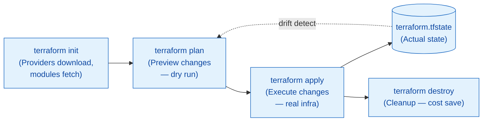

# Deep Dive: IaC & Terraform — Infrastructure as Code (Production Grade)

> **Standalone deep dive:** "Click-click" se **version-controlled, reviewable, reproducible** infrastructure ka safar.

---

## 1. Why IaC — Problem Statement

**Before IaC (ClickOps):**
- Console me VM banaya, security group configure kiya, load balancer lagaya
- Kisi ne manual change kiya → **drift** (state ≠ reality)
- Naya environment chahiye → **days** lagte hain, documentation outdated
- Disaster recovery → "Pata nahi kaise bana tha"
- Team collaboration → "Maine ye kiya tha, tu wo kar"

**After IaC:**
```hcl
# main.tf — Infrastructure = Code
resource "azurerm_resource_group" "rg" {
  name     = "prod-rg"
  location = "East US"
}

resource "azurerm_virtual_network" "vnet" {
  name                = "prod-vnet"
  address_space       = ["10.0.0.0/16"]
  resource_group_name = azurerm_resource_group.rg.name
  location            = azurerm_resource_group.rg.location
}
```
- `terraform apply` → **same result every time**
- Git history = **audit trail**
- PR review = **infra code review**
- New env = **minutes** (copy module, change vars)

---

## 2. Imperative vs Declarative — Core Philosophy

| Approach | Example | Problems |
|----------|---------|----------|
| **Imperative** (How) | `az vm create ...` → `az network nsg rule create ...` → `az lb create ...` | Order matters, idempotent nahi, drift detection nahi, rollback manual |
| **Declarative** (What) | `resource "azurerm_virtual_machine" "web" { ... }` | Terraform decides order, idempotent, state tracks drift, plan shows changes |

**Terraform = Declarative.** Tum batate ho **"kya chahiye"**, Terraform decide karta hai **"kaise banega"**.

---

## 3. Terraform Core Workflow — Interview Standard



### Commands Deep Dive:

| Command | Purpose | Flags |
|---------|---------|-------|
| `terraform init` | Initialize working directory | `-backend-config=`, `-upgrade`, `-migrate-state` |
| `terraform fmt` | Format code (canonical style) | `-recursive`, `-check`, `-diff` |
| `terraform validate` | Syntax + internal consistency | `-json` |
| `terraform plan` | **Preview** — what will change | `-out=tfplan`, `-var-file=`, `-target=resource` |
| `terraform apply` | Execute plan | `tfplan` file, `-auto-approve`, `-target=` |
| `terraform destroy` | Delete all managed resources | `-auto-approve`, `-target=` |
| `terraform state` | State management | `list`, `show`, `mv`, `rm`, `replace-provider` |
| `terraform import` | Existing resource → state | `resource.address resource_id` |
| `terraform output` | Show outputs | `-json`, `-raw` |
| `terraform console` | Interactive expression eval | — |
| `terraform graph` | Dependency graph (DOT) | `| dot -Tpng > graph.png` |

---

## 4. State File — The Heart of Terraform

**`terraform.tfstate`** = JSON mapping: **Terraform config ↔ Real resources**

```json
{
  "version": 4,
  "terraform_version": "1.6.0",
  "serial": 42,
  "lineage": "abc-123",
  "outputs": {},
  "resources": [
    {
      "mode": "managed",
      "type": "azurerm_resource_group",
      "name": "rg",
      "provider": "provider[\"registry.terraform.io/hashicorp/azurerm\"]",
      "instances": [{
        "schema_version": 1,
        "attributes": {
          "id": "/subscriptions/.../resourceGroups/prod-rg",
          "name": "prod-rg",
          "location": "eastus"
        }
      }]
    }
  ]
}
```

### State Best Practices:

| Practice | Why |
|----------|-----|
| **Remote Backend** (Azure Storage, S3, GCS) | Team shared, locking, versioning, not on local laptop |
| **State Locking** (DynamoDB, Azure Blob lease) | Prevent concurrent applies corruption |
| **Encryption at Rest** | Secrets in state (passwords, keys) protected |
| **Separate State per Env** | `prod/terraform.tfstate`, `staging/terraform.tfstate` — isolation |
| **Never Edit Manually** | Corrupts mapping; use `terraform state mv/rm/import` |
| **Sensitive Data** | Mark outputs `sensitive = true`; state me encrypt hota hai |

### Remote Backend Config (Azure):
```hcl
terraform {
  backend "azurerm" {
    resource_group_name  = "tfstate-rg"
    storage_account_name = "tfstatestorage123"
    container_name       = "tfstate"
    key                  = "prod.terraform.tfstate"
  }
}
```

**Run once:** `terraform init -migrate-state` (local → remote migration)

---

## 5. Providers — Cloud Abstraction Layer

| Provider | Cloud | Resources Example |
|----------|-------|-------------------|
| **azurerm** | Azure | `azurerm_virtual_machine`, `azurerm_kubernetes_cluster`, `azurerm_storage_account` |
| **aws** | AWS | `aws_instance`, `aws_eks_cluster`, `aws_s3_bucket` |
| **google** | GCP | `google_compute_instance`, `google_container_cluster`, `google_storage_bucket` |
| **kubernetes** | K8s (any) | `kubernetes_deployment`, `kubernetes_service`, `kubernetes_secret` |
| **helm** | Helm charts | `helm_release` |
| **docker** | Docker | `docker_image`, `docker_container` |
| **random** | Utilities | `random_password`, `random_uuid` |
| **time** | Time | `time_rotating`, `time_sleep` |
| **local** | Local files | `local_file`, `local_sensitive_file` |

**Multi-cloud = Same Terraform, different provider blocks:**
```hcl
provider "azurerm" { features {} }
provider "aws" { region = "us-east-1" }

resource "azurerm_resource_group" "rg" { ... }
resource "aws_vpc" "vpc" { ... }
```

---

## 6. HCL Syntax — Language Essentials

### Variables (`variables.tf`):
```hcl
variable "location" {
  type        = string
  default     = "East US"
  description = "Azure region for resources"
  validation {
    condition     = contains(["East US", "West US", "Central US"], var.location)
    error_message = "Location must be East US, West US, or Central US."
  }
}

variable "vm_sizes" {
  type = map(string)
  default = {
    small  = "Standard_B2s"
    medium = "Standard_D4s_v3"
    large  = "Standard_D8s_v3"
  }
}
```

### Outputs (`outputs.tf`):
```hcl
output "vnet_id" {
  value       = azurerm_virtual_network.vnet.id
  description = "Virtual Network ID for peering"
  sensitive   = false
}

output "admin_password" {
  value       = random_password.admin.result
  description = "Admin password (sensitive)"
  sensitive   = true
}
```

### Locals (Computed values):
```hcl
locals {
  tags = {
    Environment = "prod"
    Owner       = "platform-team"
    ManagedBy   = "terraform"
  }
  vm_name = "vm-${var.environment}-${random_id.suffix.hex}"
}
```

### Data Sources (Read existing):
```hcl
data "azurerm_client_config" "current" {}

data "azurerm_subnet" "existing" {
  name                 = "existing-subnet"
  virtual_network_name = "existing-vnet"
  resource_group_name  = "network-rg"
}
```

---

## 7. Modules — Reusable Building Blocks (DRY)

**Module Structure:**
```
modules/
└── vnet/
    ├── main.tf
    ├── variables.tf
    ├── outputs.tf
    └── versions.tf
```

**Module Call:**
```hcl
module "vnet" {
  source = "./modules/vnet"
  # or: source = "git::https://github.com/org/tf-modules.git//vnet?ref=v1.2.0"
  
  name                = "prod-vnet"
  address_space       = ["10.0.0.0/16"]
  subnet_configs = [
    { name = "web",     cidr = "10.0.1.0/24" },
    { name = "app",     cidr = "10.0.2.0/24" },
    { name = "data",    cidr = "10.0.3.0/24" }
  ]
  tags = local.tags
}
```

**Module Best Practices:**
- **Version modules** (Git tags: `v1.0.0`, `v1.1.0`)
- **Semantic versioning** — breaking changes = major version
- **Module registry** (private: Terraform Cloud/Enterprise, public: registry.terraform.io)
- **Compose modules** — `module "network" { ... }` calls `module "vnet" { ... }`

---

## 8. State Management — Advanced

### Import Existing Resources:
```bash
# Import Azure VM into state
terraform import azurerm_virtual_machine.web /subscriptions/.../resourceGroups/rg/providers/Microsoft.Compute/virtualMachines/web-vm

# Verify
terraform state show azurerm_virtual_machine.web
```

### Move/Rename Resources (Refactoring):
```bash
# Move resource to module
terraform state mv azurerm_virtual_network.vnet module.vnet.azurerm_virtual_network.vnet

# Rename
terraform state mv azurerm_virtual_network.old azurerm_virtual_network.new
```

### Replace Provider:
```bash
terraform state replace-provider "registry.terraform.io/-/azurerm" "registry.terraform.io/hashicorp/azurerm"
```

### Drift Detection & Remediation:
```bash
# Detect drift
terraform plan -detailed-exitcode
# Exit code: 0=no changes, 1=error, 2=changes pending

# Auto-remediate (CI/CD)
terraform apply -auto-approve
```

---

## 9. Testing & Validation

| Tool | Purpose |
|------|---------|
| `terraform fmt -check -recursive` | CI: formatting check |
| `terraform validate` | CI: syntax + internal consistency |
| `terraform plan -out=tfplan` | CI: preview changes |
| **Terratest** (Go) | Unit/integration tests for modules |
| **Kitchen-Terraform** | Test Kitchen driver |
| **Checkov** / **tfsec** | Static security analysis |
| **OPA/Terraform** | Policy as Code (e.g., "no public IP") |

**Checkov Example:**
```bash
checkov -d . --framework terraform --compact
# FAIL: CKV_AZURE_1: Ensure storage account has secure transfer
```

---

## 10. Terraform in CI/CD — Production Pipeline

```yaml
# .github/workflows/terraform.yml
name: Terraform
on:
  push:
    branches: [main]
  pull_request:
    branches: [main]

env:
  ARM_CLIENT_ID: ${{ secrets.AZURE_CLIENT_ID }}
  ARM_CLIENT_SECRET: ${{ secrets.AZURE_CLIENT_SECRET }}
  ARM_SUBSCRIPTION_ID: ${{ secrets.AZURE_SUBSCRIPTION_ID }}
  ARM_TENANT_ID: ${{ secrets.AZURE_TENANT_ID }}

jobs:
  validate:
    runs-on: ubuntu-latest
    steps:
      - uses: actions/checkout@v4
      - uses: hashicorp/setup-terraform@v3
      - run: terraform fmt -check -recursive
      - run: terraform init -backend=false
      - run: terraform validate

  plan:
    needs: validate
    runs-on: ubuntu-latest
    steps:
      - uses: actions/checkout@v4
      - uses: hashicorp/setup-terraform@v3
      - run: terraform init
      - run: terraform plan -out=tfplan
      - uses: actions/upload-artifact@v4
        with: { name: tfplan, path: tfplan }

  apply:
    needs: plan
    if: github.ref == 'refs/heads/main' && github.event_name == 'push'
    runs-on: ubuntu-latest
    environment: production
    steps:
      - uses: actions/checkout@v4
      - uses: hashicorp/setup-terraform@v3
      - uses: actions/download-artifact@v4
        with: { name: tfplan, path: . }
      - run: terraform apply -auto-approve tfplan
```

---

## 11. Terraform vs ARM/Bicep vs Pulumi

| Feature | Terraform | ARM/Bicep | Pulumi |
|---------|-----------|-----------|--------|
| **Language** | HCL (declarative) | JSON/Bicep | TypeScript, Python, Go, C# |
| **Multi-cloud** | ✅ Native | ❌ Azure only | ✅ Native |
| **State Management** | Remote backend + locking | Azure manages | Pulumi Service / self-hosted |
| **Testing** | Terratest, Kitchen | ARM-TTK | Native language tests |
| **Provider Ecosystem** | 1000+ | Azure only | Growing |
| **Learning Curve** | Medium | Low (Bicep) | Low (if know language) |
| **Drift Detection** | `terraform plan` | What-if deployment | `pulumi preview` |

**When to use what:**
- **Terraform:** Multi-cloud, large ecosystem, team standard
- **Bicep:** Azure-only, simpler syntax, native integration
- **Pulumi:** Programmers who want real languages, dynamic logic

---

## 12. Real-World: Production Terraform Patterns

### Environment Structure:
```
environments/
├── prod/
│   ├── main.tf
│   ├── variables.tf
│   ├── backend.tf
│   └── terraform.tfvars
├── staging/
└── dev/
```

### Shared Modules (Git submodule or registry):
```hcl
module "vnet" {
  source  = "github.com/org/tf-modules//vnet?ref=v2.1.0"
  # ...
}
```

### Workspaces (Alternative to env folders):
```bash
terraform workspace new prod
terraform workspace new staging
terraform workspace select prod
# State: terraform.tfstate.d/prod/terraform.tfstate
```

### Dependency Lock File:
```bash
terraform providers lock -platform=linux_amd64 -platform=darwin_arm64
# Creates .terraform.lock.hcl — commit this!
```

---

## 13. Common Pitfalls & Fixes

| Pitfall | Symptom | Fix |
|---------|---------|-----|
| **State corruption** | `Error: state file corrupted` | Remote backend + locking; backup before major changes |
| **Drift undetected** | Console changes not caught | CI runs `terraform plan` daily; alert on exit code 2 |
| **Secrets in state** | Passwords visible in `terraform show` | `sensitive = true` on outputs; encrypt backend |
| **Concurrent apply** | `Error acquiring state lock` | Backend locking (DynamoDB/Azure Blob lease) |
| **Provider version upgrade breaks** | New resource attributes required | Pin provider versions; test in staging first |
| **Module version drift** | Different envs use different versions | Use module registry with version pins; Dependabot |
| **Circular dependency** | `Error: Cycle` | Use `depends_on` sparingly; refactor module outputs |
| **Large state = slow** | Plan takes 10+ min | Split into smaller state files (per env/module) |

---

## 14. Interview Questions — Terraform/IaC

| Question | Strong Answer |
|----------|---------------|
| "Terraform state kya hai, kahan store karte ho?" | JSON mapping config↔real resources; **remote backend** (S3+DynamoDB, Azure Blob) with **locking**; never local in team. |
| "`terraform plan` vs `apply`?" | `plan` = dry run (preview, exit code 2 if changes); `apply` = executes changes (use plan file for safety). |
| "Remote backend kyun?" | Team shared state, **locking** (prevent concurrent apply), versioning, encryption, not on laptop. |
| "Drift kya hai, kaise detect karte ho?" | Console/manual changes ≠ Terraform config. `terraform plan` daily in CI detects (exit code 2). |
| "Module vs Resource?" | Resource = single cloud object; Module = reusable group of resources (like function). |
| "`depends_on` kab use karte ho?" | Implicit dependency na bane (e.g., resource A must exist before B but no reference). Use sparingly. |
| "Secrets in Terraform kaise handle karte ho?" | Input variables `sensitive=true`, outputs `sensitive=true`, **never hardcode**; use Vault/Azure Key Vault + `data` sources. |
| "Multiple environments kaise manage karte ho?" | Separate state files per env (folders or workspaces); shared modules; env-specific `tfvars`. |
| "Terraform vs Bicep?" | Terraform = multi-cloud, HCL, large ecosystem; Bicep = Azure-only, native, simpler for Azure-only teams. |
| "Import existing resource kaise?" | `terraform import ADDRESS ID` — then write config matching imported state. |

---

## 15. Hands-On Lab

```bash
# 1. Initialize new project
mkdir tf-lab && cd tf-lab
cat > main.tf << 'EOF'
terraform {
  required_version = ">= 1.5"
  required_providers {
    azurerm = { source = "hashicorp/azurerm", version = "~> 3.0" }
    random  = { source = "hashicorp/random", version = "~> 3.0" }
  }
}

provider "azurerm" { features {} }

resource "random_pet" "name" { length = 2 }

resource "azurerm_resource_group" "rg" {
  name     = "rg-${random_pet.name.id}"
  location = "East US"
}

output "rg_name" { value = azurerm_resource_group.rg.name }
EOF

# 2. Format, validate, init
terraform fmt
terraform validate
terraform init

# 3. Plan (dry run)
terraform plan

# 4. Apply
terraform apply -auto-approve

# 5. Show state
terraform show
terraform state list

# 6. Modify (add tag)
# Edit main.tf: add tags = { Env = "test" } to rg
terraform plan
terraform apply

# 6. Destroy (cleanup)
terraform destroy -auto-approve
```

---

## 16. Summary | Yaad Rakho

1. **IaC = Declarative** — "what" not "how"; Terraform decides order
2. **Workflow:** `init` → `plan` → `apply` → `destroy` (always plan first!)
3. **State = Source of truth** — **Remote backend + locking** mandatory for teams
4. **Providers** = Cloud abstraction; same Terraform, different providers = multi-cloud
5. **Modules** = DRY; version them; compose complex infra
6. **Sensitive data** — mark outputs sensitive; encrypt backend; never hardcode
6. **CI/CD:** `fmt` → `validate` → `plan` (artifact) → manual approval → `apply`
7. **Drift detection** = Daily `plan` in CI (exit code 2 = changes)
8. **Testing:** Terratest, Checkov, tfsec, OPA policy as code
9. **State management:** `import`, `state mv/rm`, `replace-provider` for refactoring
10. **Pitfalls:** State corruption, secrets in state, concurrent apply, version upgrades

---
**Related:** [Day 22](../day-22-terraform-on-azure.md) · [Day 23](../day-23-azure-services-and-identity.md) · [Azure Networking](../topics/azure-vnet.md) · [K8s with Terraform](../topics/kubernetes-architecture.md)